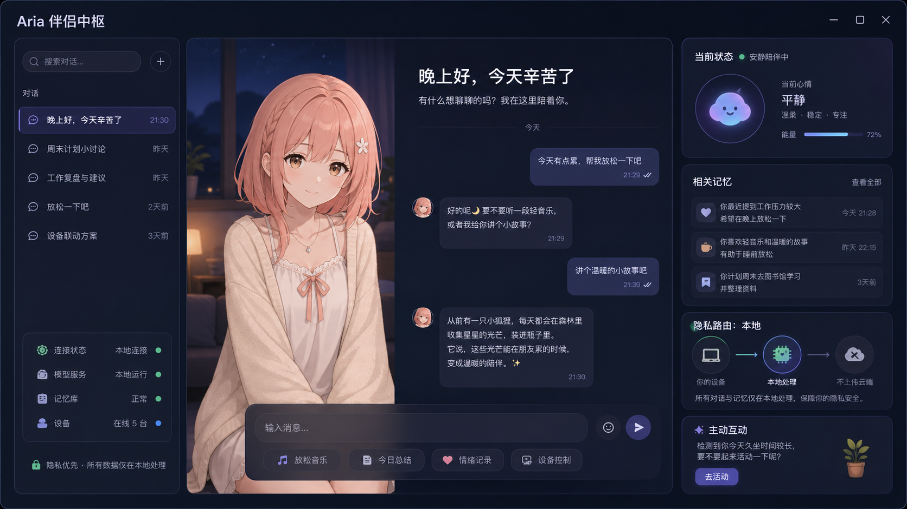
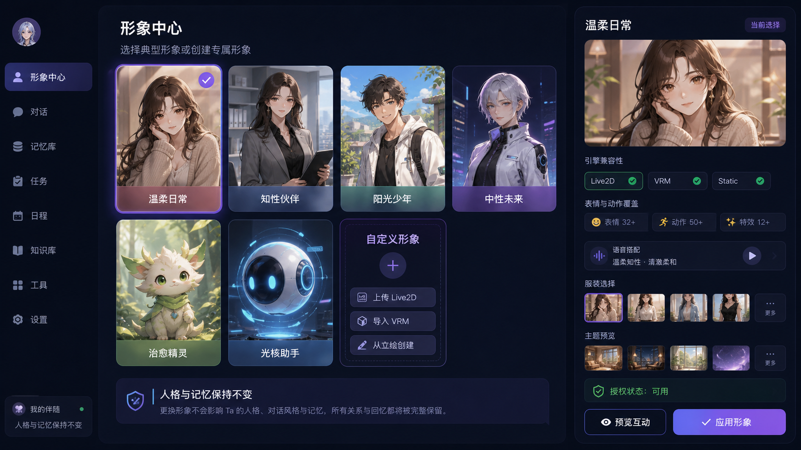
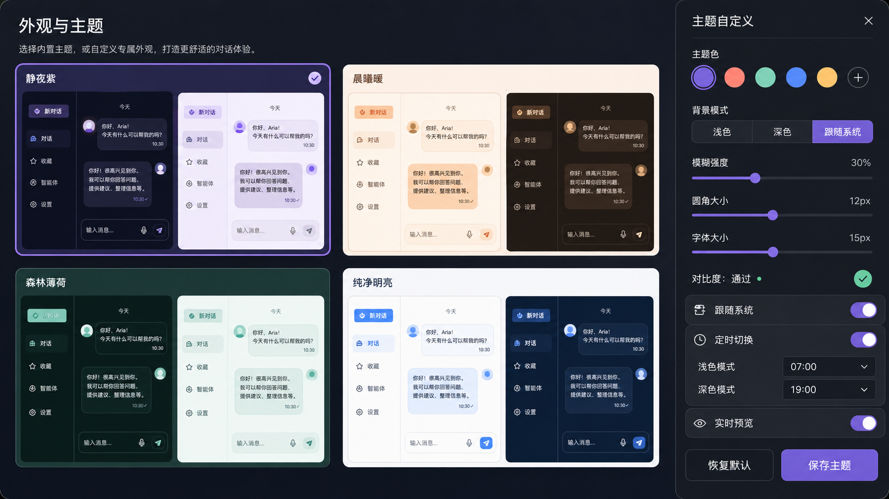

# Aria · 伴侣中枢

> 部署在你自己设备上的 AI 伴侣。她会记得你们的对话、感知你的状态、在你需要的时候主动开口——所有记忆与隐私分级都由你掌控。

---

## 她是什么样子

Aria 不只是聊天窗口，而是一个完整的陪伴终端：你可以为她设定人格、选择形象、和她文字或语音交流，她会在本地长期记住你们的点滴，也能通过工具感知天气、地图等现实世界信息。



---

## 核心能力

### 长期记忆与历史回溯
Aria 拥有真正的长期记忆系统。她会记住你提到的重要事情、偏好和约定，并在后续对话中自然调用。记忆支持多主体（你、她、共同约定）、冲突纠错、删除台账与来源追溯，也可按时间线回查过往事件。

### 人格与形象
你可以为她设定完整的人格（Persona），从说话风格到行为边界；也可以选择内置形象、上传自定义立绘或导入自有授权的 Live2D 模型包。人格与形象解耦，换形象不会丢失记忆和关系。Live2D Web 运行时按官方许可在本机安装，不随仓库分发 Cubism Core。



### 语音对话
支持双向语音通道：语音输入经 ASR 转文字、大模型流式回复、再经 TTS 合成输出。支持 VAD 自动断句、人声打断（barge-in）、按键说话（PTT）和口型同步。本地私有内容可强制走本地模型，敏感语音不上云。

### 地图与天气工具
通过自然语言查询天气、附近地点、路线规划。高德地图真实数据源，支持结构化结果卡片、跨轮次缓存和后台自检台账。

### 多终端主动感知
电脑与浏览器扩展可注册为 Aria 的感知终端。你可以在 Web 对话中说“帮我看看电脑上的网页”，她会让对应设备执行受控命令并带回结果。Home Assistant、MQTT 遥测和主动消息策略也已接入；手机 PWA 与首个 ESP32 存在传感器仍在后续计划中。

### 管理后台
内置 Admin 面板，可视化配置模型路由、语音参数、人格草稿、记忆检索、时间线和系统观测。配置保存即生效，无需重启。


### 隐私分级
四层隐私控制（L0~L3），从公开信息到原始高敏传感数据逐级收紧。L2 敏感内容强制本地模型处理，L3 数据不进入通用持久化或云端。

---

## 界面一览

| 主题与外观 | 角色设定 |
|:---:|:---:|
|  |  |

当前内置“纯净明亮”和“静夜紫”，支持跟随系统、账户同步与聊天端即时切换；形象中心支持内置形象、自定义立绘、Live2D 导入、Persona 默认绑定和安全降级。定时主题、参数化换装、VRM 与 AI 形象工厂仍在规划中。

---

## 快速开始

### 环境要求
- Python 3.11
- Node.js 20
- PostgreSQL + pgvector

### 安装与启动

```bash
# 1. 安装依赖
make install
pnpm --dir web install

# 2. 配置环境变量
cp .env.example .env
# 编辑 .env，填入 PostgreSQL 密码与 ARIA_ADMIN_TOKEN

# 3. 启动后端
make run

# 4. 启动前端（开发模式）
pnpm --dir web --filter @aria/chat dev     # 聊天界面
pnpm --dir web --filter @aria/admin dev    # 管理后台
```

后端默认地址 `http://127.0.0.1:8000`，聊天前端 `http://localhost:5175/chat/`，管理后台 `http://localhost:5174/admin/`。

### Docker 一键启动

```bash
cp .env.example .env
# 编辑 .env
docker compose up --build -d
curl http://localhost:8000/healthz
```

---

## 技术栈

- **后端**：FastAPI / Starlette / Pydantic / SQLAlchemy / Alembic
- **前端**：Vue 3 / Vite / Element Plus
- **语音**：MiMo ASR / TTS、edge-tts 兜底、faster-whisper 本地 ASR
- **记忆**：pgvector 混合检索
- **部署**：Docker Compose、Tauri Desktop、Chrome Extension

---

## 文档

项目设计、架构决策与阶段验收记录统一存放于 `docs/` 目录：

- [文档索引与架构总览](docs/00-文档索引与架构总览.md)
- [当前任务与进度](docs/TASKS.md)
- [隐私边界与陪伴伦理](docs/12-安全边界同意与陪伴伦理.md)

---

## 许可证

MIT
