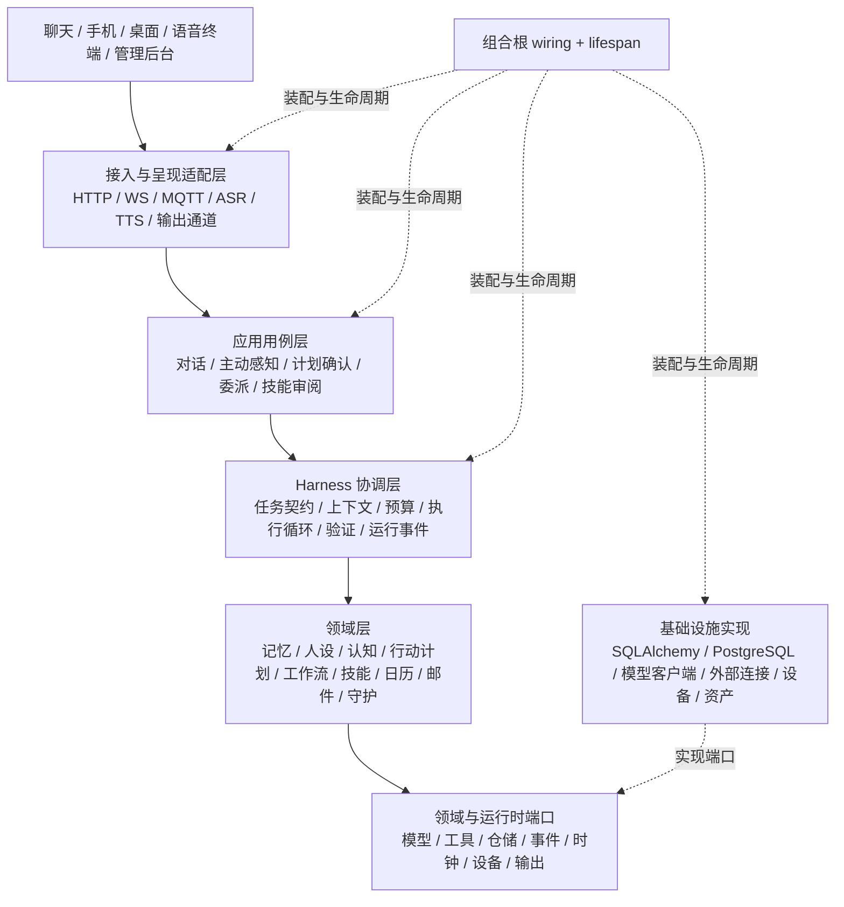

# 00 产品与架构

> 文档类型：Active 真源（按功能合并）｜最后更新：2026-10-02
> 本文档由下列原编号文档于 2026-09-15 合并而成，原文完整保留、标题降一级；历史版本见 git 记录与 `docs/history/历史阶段归档.md`。

## 文档地图（全套 8 份 + TASKS + 历史归档）

| 编号 | 文档 | 覆盖（原编号） |
|---|---|---|
| 00 | 产品与架构 | 需求分析与 ADR（01/13）、功能设计（02）、开发规划（03）、管家路线图与验收（39/40） |
| 01 | 平台运行时 | 数据模型与 API（11）、运行状态机（09）、输入输出契约（14）、任务资产运维（10）、模型路由与配置中心（16） |
| 02 | 形象与人设 | 形象与角色（07/08/Live2D）、主题与视觉（06）、结构化回复与 Persona（20） |
| 03 | 记忆与时间线 | 多主体记忆（30）、时间线与历史回溯（31） |
| 04 | 语音 | 语音化设计（33） |
| 05 | 工具与感知 | 工具与主动感知（34/35）、屏幕与浏览感知（38/42） |
| 06 | 集成与认知 | Home Assistant（36）、认知调度（37）、MCP（43/41） |
| 07 | 安全与管理后台 | 安全边界与家庭守护（12/44）、管理后台与可观测性（05） |

- 当前进度只看 `docs/TASKS.md`；冻结的阶段记录在 `docs/history/历史阶段归档.md`（原 04、15、17～19、21～25、26～29、32）。
- 真源优先级：运行代码 / Schema / migration → 本套 Active 文档 → Accepted ADR → 历史归档。
- 新功能优先补既有文档；阶段完成后记录并入历史归档，不再新开文件。
- [整体架构优化与 Harness 闭环设计（2026-10-01，Proposed）](#harness-architecture-v1)：目标分层、任务契约、预算与证据、可靠后处理、学习评测和分批迁移。


---

## 需求分析与架构决策（原编号 01（含 13 需求追踪与 ADR））

> 项目代号：**Aria**（伴侣中枢 / Companion Hub）
> 文档版本：v1.4（2026-08-17）
> 关联文档：[00-产品与架构.md](./00-产品与架构.md) | [00-产品与架构.md](./00-产品与架构.md)

---

### 1. 项目背景与愿景

#### 1.1 一句话定位

建设一个**部署在自有设备上的 AI 伴侣中枢**：向上通过能力与隐私适配层接入受支持的大模型，向内具备分层记忆与主动思考能力，向下通过统一协议接入经过注册和校验的输入源（文字 / 语音 / 传感器）与输出端（聊天 / 语音 / Live2D / 3D / 投影），像一个持续存在的伙伴那样感知、记得、主动回应使用者。

#### 1.2 与现有产品的差异

| 维度 | 通用聊天 App / AI 伴侣 App | 本项目 |
|---|---|---|
| 记忆 | 有限的上下文窗口 / 平台托管的记忆 | 自建 Working Context + Long-term Memory + Timeline + Source 分层体系，用户可控可审计 |
| 主动性 | 仅被动应答 | 感知驱动 + 主动引擎，能主动开口 |
| 输入 | 文字 / 语音 | 任意传感器（人体存在、温压、后续任意 IoT） |
| 形象 | 固定 App 界面 | 多端渲染：看板娘 / 3D / 投影，同一灵魂 |
| 数据归属 | 平台所有 | 全部本地，敏感数据不出家庭网络 |

#### 1.3 愿景描述（成功画面）

- 用户在家中的任一终端（电脑桌面宠物、手机、后续投影设备）都能与"她"对话，且对话无缝接续；
- 她记得几周前的约定、用户的作息与喜好，并在合适的时机自然提起；
- 她知道用户回家了、休息了、心情如何（来自传感器与交互信号），并据此调整自己的行为；
- 深夜她会安静，长时间没互动她会适度想念，但绝不骚扰；
- 所有 intimate / 居家数据留在本地，用户可以随时查看、删除任何一段记忆。

---

### 2. 假设与约束

以下为本规划的基线假设，若实际情况变化，里程碑工期需相应调整。

| # | 假设项 | 内容 |
|---|---|---|
| A1 | 开发资源 | 单人开发，业余时间投入，每周约 10~15 小时；所有排期按有效工程小时估算，并预留 40% 联调/返工缓冲 |
| A2 | 技术背景 | 熟悉后端开发（已确定技术栈为 Python），具备基本的硬件动手能力（ESP32 刷固件、接线） |
| A3 | 部署环境 | 家中有一台可 7×24 开机的设备（小主机 / NAS / 旧笔记本，≥4 核 8G；本地语音路线需 GPU 或后续加装） |
| A4 | 网络环境 | 中国大陆，模型 API 优先选择国内可直连服务（GLM / DeepSeek / Qwen 等），保留本地 Ollama 路径用于脱敏场景 |
| A5 | 预算 | 软件月成本 ≤ 100 元；传感器硬件一次性投入 ≤ 500 元；（可选）全本地 GPU 路线 1500~3000 元 |
| A6 | 用户规模 | v1 面向单用户（开发者本人）；架构上预留多用户扩展点，但不作为近期目标 |
| A7 | 形象素材 | Live2D 模型使用可商/可个人使用的现成模型或自制；VRM 同理 |

---

### 3. 用户画像与核心使用场景

#### 3.1 用户画像

**「独居极客」**：技术能力强，长期使用电脑，对 AI 伴侣的核心诉求是**陪伴的真实感**（记得我、懂我、会主动理我）与**数据的完全掌控**；反感强制联网、订阅制和数据上传。

#### 3.2 场景走查：她的一天

| 时段 | 触发源 | 系统行为 |
|---|---|---|
| 08:00 | 定时器 + 传感器（人已离床、在浴室活动） | 结合天气/日程主动说早安，语气随昨日心情变化 |
| 10:00 | 用户在电脑前开始工作（存在传感器 + 键鼠活动） | 进入"安静陪伴"模式，偶尔（低频）发一条轻松话题 |
| 14:00 | 用户打字倾诉工作烦恼 | 正式对话：检索相关记忆（上周也加班），共情回应，并沉淀一条情景记忆 |
| 19:30 | 人体存在传感器：离家 9 小时后检测到回家 | 主动迎接："回来啦，今天加班到这么晚…" |
| 22:00 | 卧室温压设备进入使用状态 | 识别为亲密语境：切换人格语气；**原始数据不出本地**，仅记录事件级标签（可配置为完全不记） |
| 23:30 | 传感器：已无活动 + 灯光关闭 | 判定用户入睡，进入免打扰，转后台执行当日记忆沉淀 |
| 02:00 | 定时任务 | 反思任务：总结当日、合并重复记忆、更新亲密度与心情状态 |

#### 3.3 用户故事（User Stories）

**输入与对话**
- US-01 我想通过文字和她聊天，体验像微信一样自然，她能引用一周前说过的内容。
- US-02 我想直接对她说话，她语音回答；我打断她时她能立刻停下并倾听。
- US-03 我不喊唤醒词也能用手动按键/快捷键开始说话（唤醒词可开关）。

**感知**
- US-04 我回家/离床/入睡时，她通过传感器知道，并做出相应反应，不需要我汇报。
- US-05 我接入一个新的传感器（如温压设备）时，只需按协议发 MQTT 数据，30 分钟内完成接入。
- US-06 亲密场景她能自然识别并配合，但细节是否留痕由我决定（完全不留 / 仅留事件级 / 完整记录）。

**记忆**
- US-07 她第二天、第二周仍然记得我说过的重要的事，并在合适时机自然提起。
- US-08 我能查看她关于我的全部记忆，删除任意一条（"忘掉这件事"），删除后不再出现。
- US-09 我能手动告诉她"记住这个"。

**主动性与人格**
- US-10 长时间没互动，她会主动找我，但一天不超过 N 次，深夜不打扰。
- US-11 她有明显、稳定的人格；心情和亲密度随长期互动缓慢变化。
- US-12 她不会每条消息都长篇大论，语气口语化，像真人发消息。

**输出与形象**
- US-13 电脑桌面有她的看板娘形象，说话时口型和表情同步，能摸头互动。
- US-14 电脑和手机上是同一个她，对话跨端接续。
- US-15 后期可更换为 3D 形象 / 投影端，人格与记忆不变。

**系统与开发者**
- US-16 我能在管理页切换 LLM（云端 ↔ 本地）、TTS 音色、人格设定，无需改代码。
- US-17 我能看到每次对话消耗的 token 与费用估算。
- US-18 系统崩溃重启后，记忆与状态完整恢复。

---

### 4. 功能需求清单（Functional Requirements）

优先级采用 MoSCoW：**M**ust（必须）/ **S**hould（应该）/ **C**ould（可以）/ **W**on't（本期不做）。

#### 4.1 输入系统（FR-I）

| 编号 | 需求 | 优先级 |
|---|---|---|
| FR-I1 | 文字输入：Web/客户端聊天框，支持多会话 | M |
| FR-I2 | 语音输入：本地 ASR（流式），支持唤醒词与按键两种触发 | M |
| FR-I3 | 语音打断：用户开口时立即停止 TTS 播放与生成 | M |
| FR-I4 | MQTT 传感器接入：符合设备协议、通过注册和服务端通道/隐私校验的设备上报遥测 | M |
| FR-I5 | 设备注册与能力描述：设备元数据（类型、通道、数据 schema、敏感级别）可配置 | M |
| FR-I6 | 人体存在感知：毫米波雷达在席/离开事件流 | M |
| FR-I7 | 温压传感设备接入（亲密语境设备） | S |
| FR-I8 | 视觉输入（摄像头画面理解） | C（后期） |
| FR-I9 | 群聊/多成员识别（声纹区分不同说话人） | W |
| FR-I10 | 回合协调：每轮输入具有 turn/generation/cancel 标识；新输入或语音打断使旧 generation 失效，迟到结果不得产生副作用 | M |

#### 4.2 感知引擎（FR-P）

| 编号 | 需求 | 优先级 |
|---|---|---|
| FR-P1 | 原始信号 → 语义事件：规则引擎将传感器数据流翻译为 `user_arrived_home`、`user_asleep` 等语义标签 | M |
| FR-P2 | 环境上下文聚合：持续维护"当前时间/在席状态/最近事件/安静程度"上下文对象，供认知核心使用 | M |
| FR-P3 | 亲密语境识别：温压数据模式 → 亲密会话开始/结束事件（仅事件级，不含原始数值） | S |
| FR-P4 | 感知规则可配置（阈值、时间段、生效设备），无需改代码 | S |

#### 4.3 认知核心（FR-C）

| 编号 | 需求 | 优先级 |
|---|---|---|
| FR-C1 | LLM 可插拔：OpenAI 兼容接口抽象，支持按场景路由不同模型（对话主模型/后台小模型/本地脱敏模型） | M |
| FR-C2 | 人格配置化：性格、说话风格、称呼、背景故事外置为配置文件，可热更新 | M |
| FR-C3 | 结构化输出：LLM 输出 `{是否回应, 台词, 情绪, 动作, 记忆候选, 决策原因码}` JSON；不存储模型“内心独白” | M |
| FR-C4 | 流式输出：LLM 首句即切分送 TTS，不等全文 | M |
| FR-C5 | 工具调用：查记忆、查设备状态、控制输出通道等作为工具暴露给 LLM | S |
| FR-C6 | 多模型分级：小模型做事件分类/记忆提取/独白，强模型做正式回应 | S |

#### 4.4 记忆系统（FR-M）

| 编号 | 需求 | 优先级 |
|---|---|---|
| FR-M1 | 分层记忆与历史：工作上下文 / 长期记忆 / Timeline 历史索引 / Source 原始证据职责分离；普通细节允许忘记但可按需回查 | M |
| FR-M2 | 记忆检索：长期 Memory 采用结构化槽位 + 向量/词法/重要性混合检索；历史问题可按时间、实体、事件类型和语义检索 Timeline | M |
| FR-M3 | 自动沉淀与晋升：每轮对话后台异步提取候选；重要稳定信息进入 Memory，普通细节保留在 Timeline/Source，反复出现的模式可受控晋升 | M |
| FR-M4 | 定时反思：每日总结、每周关系回顾，产出高层记忆与状态更新 | S |
| FR-M5 | 遗忘机制：重要性衰减 + 手动删除（硬删除，含向量），删除立即生效 | M |
| FR-M6 | 记忆与历史管理界面：长期记忆可检索/浏览/编辑/删除/手动添加；Timeline 可按时间、来源和事件类型查询并下钻 Source | M |
| FR-M7 | 记忆与历史溯源：每条 Memory/Timeline 都可回链到来源消息、事件、设备或工具记录 | S |
| FR-M8 | 证据等级：记忆区分用户陈述、系统观测、模型推断与用户确认；弱推断不能经反思自动升级为事实 | M |
| FR-M9 | 多主体长期记忆：至少区分 user / assistant / shared；同一稳定事实槽位出现不同值时进入冲突流程，不得静默覆盖 | M |
| FR-M10 | 历史回溯：当长期记忆没有答案且用户明显询问过去时，可受控查询 Timeline/Source；无证据时必须明确“不知道/没找到”，不得臆造 | M |

#### 4.5 主动引擎（FR-A）

| 编号 | 需求 | 优先级 |
|---|---|---|
| FR-A1 | 内部状态模型：心情（价/唤醒二维）、亲密度(0-100)、能量值，随交互与时间演化 | M |
| FR-A2 | 主动触发器：定时（早安晚安）、事件（回家）、沉默超时、传感器异常 | M |
| FR-A3 | 分寸控制：每日主动次数上限、冷却时间、免打扰时段、被忽略后降频 | M |
| FR-A4 | 主动决策走认知核心：是否开口、说什么由 LLM 结合状态决定（非固定模板） | M |
| FR-A5 | 主动行为日志：记录每次主动的触发原因与用户反应，供调参与学习 | S |

#### 4.6 输出系统（FR-O）

| 编号 | 需求 | 优先级 |
|---|---|---|
| FR-O1 | 文字输出：流式推送到聊天客户端 | M |
| FR-O2 | 语音输出：TTS 流式合成与播放，音色可切换 | M |
| FR-O3 | 2D 形象：Live2D 看板娘（Web 渲染），情绪→表情、动作库、音频驱动口型、触摸互动 | M |
| FR-O4 | 3D 形象：VRM 渲染端，同一输出协议 | C（M4B） |
| FR-O5 | 多终端：Web / 桌面壳（Tauri）/ 手机 PWA 同时在线，会话漫游接续 | S |
| FR-O6 | 投影/硬件终端：作为标准渲染端接入（协议同 FR-O5） | C（后期） |
| FR-O7 | 输出优先级与仲裁：主动消息 vs 对话回复 vs 系统通知的排队与抢占 | S |
| FR-O8 | 主题系统：聊天端、管理后台和形象舞台共享 Design Token，支持内置主题、浅深色、跟随系统与实时预览 | M |
| FR-O9 | 主题个性化：自定义色板/字号/圆角/动效，支持定时切换、多端同步、导入导出和安全回滚 | S |
| FR-O10 | 角色系统：提供多种典型成年/非人/抽象形象；人格、记忆与形象实例解耦，切换形象不重置关系 | M |
| FR-O11 | 关系视觉反馈：关系变化通过互动距离、动作和纪念配件渐进表达，可关闭且不得采用操纵性解锁 | S |
| FR-O12 | 自定义形象：支持模板参数化、静态立绘、Live2D/VRM/形象包本地导入、隔离预览、能力映射和安全校验 | S |
| FR-O13 | 静态图动态化：从单张用户图片生成可眨眼、呼吸、口型和小幅转头的轻量动态形象，并提供 GPU 2.5D 与 Live2D 精修升级路径 | S |
| FR-O14 | 多端输出所有权：文字可同步多端，语音/麦克风采用租约确保同一时刻只有一个所有者；断线后可安全接管 | M |

#### 4.7 系统与管理（FR-S）

| 编号 | 需求 | 优先级 |
|---|---|---|
| FR-S1 | 配置中心：模型 Key、音色、人格、感知规则、分寸参数全部配置化 | M |
| FR-S2 | 可观测性：结构化日志、全链路耗时打点（ASR/LLM/TTS 各段）、token 用量与费用统计 | M |
| FR-S3 | 数据备份与恢复：数据库定时备份 + 记忆库 JSON 导出/导入 | S |
| FR-S4 | 服务自愈：崩溃自动重启、断网降级（切本地模型或排队重试） | S |
| FR-S5 | 固件管理：ESP32 传感器固件烧录指引与配置模板 | C |
| FR-S6 | 事件可靠性：输入事件先持久化再分发；消费者幂等；重放不得重复发送、重复沉淀或重复更新状态 | M |
| FR-S7 | 数据删除闭环：删除覆盖原文、向量、摘要、缓存和衍生记忆，并明确备份中的延迟删除策略 | M |
| FR-S8 | 配置生命周期管理：不同配置域按风险选择“保存即生效”或“草稿/校验/发布/回滚”；所有高风险配置都必须校验、审计并保留 last-known-good | M |
| FR-S9 | 统计分析：提供成本、延迟、记忆质量、主动互动漏斗、服务健康和隐私指标，所有指标有稳定口径 | S |
| FR-S10 | 链路追踪：通过 trace/correlation/causation ID 下钻一次交互的步骤、耗时、重试、降级、记忆与隐私决策 | M |
| FR-S11 | 告警中心：支持分级、去重、冷却、确认和恢复通知；L3 外泄、删除复活属于 P0 | S |
| FR-S12 | 本地身份闭环：首次安装、管理员凭据、短期会话、新设备配对、撤销、重新验证和恢复密钥 | M |
| FR-S13 | 长任务系统：反思、备份、导入、动态化等任务支持进度、取消、重试、checkpoint、资源配额和断点恢复 | M |
| FR-S14 | 资产存储：原图、形象、主题和派生资源使用内容寻址存储、引用追踪、配额、完整性校验与安全垃圾回收 | M |
| FR-S15 | 升级运维：升级前验证快照、兼容性检查、可重复迁移、失败回滚、资产/协议版本兼容和恢复演练 | S |
| FR-S16 | 工具安全：模型只能提出工具候选，服务端按风险等级、参数 Schema、确认策略、配额与幂等规则执行 | M |
| FR-S17 | 访客与隐私暂停：公共场景隐藏私人内容、停止未知声源沉淀，并可一键暂停麦克风、主动播报和新记忆 | M |
| FR-S18 | 安全陪伴策略：禁止操纵性关系设计，医疗/法律/财务/危机场景切换高风险辅助模式 | M |

---

### 5. 非功能需求（NFR）

| 编号 | 类别 | 指标 |
|---|---|---|
| NFR-1 | 隐私分级 | 数据分 4 级：L0 环境（在席/时间）/ L1 普通对话 / L2 亲密语境事件 / L3 设备原始遥测。L3 永不出本地且默认不存明文；L2 默认仅事件级标签，云端 LLM 调用自动脱敏或路由本地模型 |
| NFR-2 | 延迟 | 文字首包 ≤ 1.5s（云端 LLM）；语音端到端（说完→听到首个字）≤ 1.8s；传感器事件→主动开口 ≤ 3s |
| NFR-3 | 可用性 | 中枢 7×24 运行，重启后状态无损恢复；依赖服务（Mosquitto/PG）容器化自愈 |
| NFR-4 | 可扩展性 | 新增输入源/输出端只需实现带 manifest、能力声明和契约测试的 adapter，不修改认知/记忆/主动核心；统一多模态 ContentPart，协议至少兼容 N/N-1；详见 14 文档 |
| NFR-5 | 成本 | 月运营成本 ≤ 100 元（重度使用下 LLM 费用可预算告警） |
| NFR-6 | 可维护性 | 单人可维护：模块边界清晰、配置驱动、文档随代码、关键路径有测试 |
| NFR-7 | 安全 | MQTT/WS/API 均鉴权（家庭内网 + token）；存储卷可选加密；管理页不含明文敏感数据展示 |
| NFR-8 | 一致性 | 同一 `event_id` 重复投递 3 次，业务副作用只发生 1 次；服务在任意处理阶段崩溃后可安全续跑 |
| NFR-9 | 可验证性 | 核心决策记录原因码、使用的记忆 ID、策略/Prompt 版本；不将模型自由文本推理作为审计依据 |
| NFR-10 | 可观测性隐私 | 日志和 Trace 默认不含消息正文、Prompt、L3、密钥或自由文本推理；调试模式有自动过期时间 |
| NFR-11 | 视觉无障碍 | 内置/自定义主题必须通过 WCAG AA 对比度；支持键盘 Focus、字体缩放和减少动态效果，不以颜色作为唯一状态表达 |
| NFR-12 | 角色一致性 | Live2D/VRM 保持固定视觉 DNA、情绪词表与动作语义；低性能模式可降级但不能改变角色身份 |
| NFR-13 | 取消一致性 | 打断后旧 generation 不得继续显示、播音、写记忆、更新关系或执行工具；迟到结果全部隔离 |
| NFR-14 | 资源保护 | 实时语音优先于批处理；磁盘达保护阈值仍允许聊天、浏览和删除；OOM 不得拖垮整个 Hub |
| NFR-15 | 升级兼容 | 客户端/服务端至少兼容 N 与 N-1 协议；破坏性迁移采用 expand-migrate-contract；升级失败可恢复 |
| NFR-16 | 同意与透明 | 录音、传感器、真人形象、云端路由和工具执行必须可见、可撤销、可审计；拒绝不产生关系或功能惩罚 |

---

### 6. 明确不做的事（Out of Scope, v1）

1. **多用户 SaaS 化**：不做注册、租户、计费。
2. **云端视频数字人**（照片驱动口型视频生成）：算力与延迟不匹配，v1 用 2D/3D 实时渲染替代。
3. **移动原生 App 上架**：手机端先做 PWA，够用且免审核。
4. **内容审核合规体系**：个人使用场景，不接入审核服务。
5. **全双工连续聆听常开识别（不等唤醒词的任意时刻插话）**：v1 做按键 + 唤醒词，全双工列人 M5+ 实验。
6. **自制硬件量产**：传感器全部用现成模组 + 开源固件。

#### 6.1 分阶段范围闸门

为避免“功能全部完成但核心体验不可用”，各阶段必须通过质量闸门后才能扩展范围：

| 阶段 | 范围 | 放行条件 |
|---|---|---|
| v0.1 可信文字核心 | 文字对话、消息持久化、记忆 CRUD/检索、隐私与删除 | 连续 14 天使用；记忆正反例测试通过；无 P0/P1 数据问题 |
| v0.2 语音 | VAD/ASR/TTS、打断、口型事件（先用调试 UI） | P90 延迟和打断指标达标，连续 50 轮无管线积压 |
| v0.3 单传感器主动性 | 仅接一个存在传感器；规则式主动问候 | 7 天零免打扰违规，重复/误触发率在阈值内 |
| v1 伴侣体验 | Live2D、自动沉淀/反思、管理后台、更多设备 | 前三阶段均稳定，不以未验证模块阻塞核心体验 |

---

### 7. 风险分析

| # | 风险 | 概率 | 影响 | 应对策略 |
|---|---|---|---|---|
| R1 | 记忆质量差：检索不相关/提取噪声多，回答割裂 | 高 | 高 | 建立记忆回归测试集（见 03 文档 §6）；沉淀前做相似度去重与置信度过滤；重要性阈值可调 |
| R2 | 主动变骚扰，用户关闭主动功能 | 中 | 高 | 分寸控制硬上限 + 免打扰默认开启；主动前先过"打扰成本"评估；记录用户忽略率并自动降频 |
| R3 | LLM 费用失控 | 中 | 中 | 双模型分工 + 高频小任务用便宜模型/本地模型；token 预算告警（FR-S2） |
| R4 | 语音延迟不达标，体验出戏 | 中 | 高 | 全链路流式（ASR/LLM/TTS 三段流水线并行）；预算内换更低延迟 ASR/TTS；必要时对话用小而快的模型 |
| R5 | 敏感数据泄露 | 低 | 极高 | NFR-1 分级强制执行：L3 不上云、L2 脱敏路由；本地模型逃生通道（Ollama）常备可用 |
| R6 | 单人开发周期拉长/烂尾 | 高 | 中 | M1 结束即有可信文字产物；M1.5 冻结功能做 14 天稳定性闸门；按有效小时滚动校准 |
| R7 | 依赖的上游项目（如渲染库、ASR 模型）变动 | 中 | 低 | 关键依赖锁定版本；核心协议自持，渲染端可整体替换 |
| R8 | 亲密设备接入的稳定性（蓝牙/供电） | 中 | 低 | 协议层做断线容忍与最后状态缓存；设备离线只降级不阻塞 |
| R9 | 内存事件在落库前丢失或重放产生重复副作用 | 中 | 高 | PostgreSQL 持久化事件 + transactional outbox/inbox；全链路幂等键；故障注入测试 |
| R10 | 隐私等级被设备错标，导致多层过滤同时失效 | 低 | 极高 | 服务端按设备注册表重新定级；L3 独立非持久化通道；云调用前结构白名单与拒绝策略 |
| R11 | 计划范围与业余投入不匹配 | 高 | 高 | 按有效小时排期；40% 缓冲；阶段闸门；Live2D/反思/多传感器不得提前挤占可信文字核心 |
| R12 | 多端同时播音、迟到回复或打断后仍产生副作用 | 中 | 高 | TurnCoordinator、generation 失效、音频/麦克风租约、乱序与断线测试 |
| R13 | 长任务或大型资产耗尽 GPU/磁盘并影响实时对话 | 中 | 高 | Job 资源准入、交互优先、Asset Store 配额、磁盘保护与 GC 审计 |
| R14 | 升级迁移失败导致数据或形象资产不可用 | 中 | 高 | 隔离预演、升级前验证快照、兼容矩阵、expand-migrate-contract 与完整恢复演练 |
| R15 | Prompt Injection 诱导模型调用高风险工具 | 中 | 极高 | 工具风险分级、服务端策略、参数重验、确认、调用上限和注入回归集 |

---

### 8. 总体验收标准（Release Criteria, 核心 v1 = M3A 完成）

1. 连续 7 天日常使用：每天均有自然对话 + 至少 1 次高质量主动互动，无强制重启类故障。
2. 记忆正例：随机抽取 20 条 3~14 天前的有效事实，能正确回忆/引用 ≥ 16 条（80%）。
3. 记忆负例：20 条无关/冲突/已过期问题中，错误引用 ≤ 1 条；不确定时应询问或明确不确定，不得编造。
4. 删除与隔离：删除后活动库、向量、摘要、缓存和衍生记忆中不可检索；L2 记忆不得出现在 L0/L1 无关场景。
5. 主动打扰控制：免打扰时段零打扰；清醒时段主动消息 ≤ 5 条/天；连续被忽略 2 次后当日不再主动。
6. 延迟达标：NFR-2 三项指标在真实环境 90 分位满足。
7. 隐私：L3 数据在数据库、应用日志、云端请求与导出文件中零出现（故障注入可审计）。
8. 恢复与幂等：在“收事件、写库、调用模型、生成输出、沉淀记忆”各阶段强制终止并重启，状态无损且副作用不重复，恢复时间 < 30s。
9. 状态与取消：打断或新输入后，旧 generation 不再显示/播音，不写记忆、不更新关系、不执行工具；多端文字一致且音频只在租约持有端播放。
10. 资源与升级：磁盘/worker/GPU 故障不拖垮核心文字对话；完成一次 N-1→N 隔离升级与失败恢复演练。

---

### 附录 A：术语表

| 术语 | 定义 |
|---|---|
| 中枢（Hub） | 本项目核心服务：事件处理 + 认知 + 记忆 + 主动引擎 |
| 渲染端 | 展示形象的客户端（Live2D 网页、Tauri 桌面宠物、手机 PWA、投影端） |
| 语义事件 | 感知引擎输出的高级事件（如 `user_arrived_home`），供认知核心消费 |
| 亲密语境 | 温压设备使用所标识的敏感场景，涉及 L2/L3 数据分级 |
| 反思 | 定时让 LLM 总结近期记忆、生成高层结论的后台任务 |
| MoSCoW | 需求优先级法：Must/Should/Could/Won't |

---

### 13 需求追踪与架构决策（ADR）

> 原文：`13-需求追踪与架构决策`（13 需求追踪与架构决策（Traceability & ADR））。2026-09-15 按功能并入本文档，内容完整保留、标题降一级。

> 项目代号：**Aria**（伴侣中枢 / Companion Hub）  
> 文档版本：v1.4（2026-08-20）
> 目标：确保每项需求有设计、有里程碑、有测试；记录关键技术决策和被放弃方案，防止实现过程中反复摇摆。

---

#### 1. 追踪规则

每项需求至少关联：

```text
Requirement → Design → Target Release/Milestone → Verification → Status
```

状态：`proposed/designed/planned/implementing/verified/deferred/rejected`。文字核心已落地；语音输入、打断和播放的前后端链路已实现并有真浏览器验收记录，M2 延迟与识别质量门槛仍待收口。下表的 partial 不应再解读为前端尚未实现。

变更规则：

- 新增 FR/NFR 必须在本文登记；
- Must 没有 target release 或 verification 时不得进入开发；
- 修改协议、隐私、数据模型、状态机或工具权限必须新增/更新 ADR；
- 里程碑完成时只有通过 verification 的需求可标记 verified；
- 文档章节号变化时 CI/人工检查本文链接；
- 一项需求跨多个阶段时分别列最小能力和增强能力。

#### 2. 发布定义

| Release | 里程碑 | 核心范围 |
|---|---|---|
| `foundation` | M0 | 可信运行骨架，不面向日常使用 |
| `text-alpha` | M1 | 可信文字、记忆、删除、配置和可升级性 |
| `text-gate` | M1.5 | 14 天稳定性闸门 |
| `voice-beta` | M2 | 语音、打断和低延迟 |
| `core-v1` | M3A | 单传感器感知、主动性和基础运维 |
| `experience-v1.1` | M3B | Live2D、主题、多形象、完整后台和反思 |
| `avatar-factory-v1.2` | M4A | 静态图 L0/L1 动态化 |
| `multidevice-v1.3` | M4B | PWA/Tauri/VRM 和真实多端同步 |
| `experimental` | M5 | GPU 2.5D、投影、视觉、全双工等实验 |

MoSCoW 表示产品重要性，`target_release` 表示交付时间；Must 不再隐含一定属于 core-v1。

#### 3. 输入与感知追踪

| 需求 | 设计 | 目标 | Verification | 状态 |
|---|---|---|---|---|
| FR-I1 文字输入 | 02 §3.1/3.5；11 §7/11；19 | M1 | WS/REST E2E、30 轮稳定性 | partial（WS/REST E2E 已实现） |
| FR-I2 语音输入 | 02 §3.2/4.1；33 §3.1~3.3 | M2 | 预录音频 E2E、ASR P90 | partial（`/ws/voice`、浏览器麦克风与本地 faster-whisper 已实现；M2 真实质量与延迟计样待完成） |
| FR-I3 语音打断 | 09 §4；02 §4.1；33 §3.2 | M2 | barge-in、迟到块零副作用 | partial（服务端 barge-in、回合取消、中止 TTS 与前端打断已实现；打断 P90 ≤300ms 仍待 M2 计样） |
| FR-I4 MQTT | 02 §2.5/6.3 | M3A | ACL、重复/乱序、离线恢复 | designed |
| FR-I5 设备注册 | 02 §2.5；12 §6.2 | M3A | 非法通道/单位/错标等级 | designed |
| FR-I6 存在感知 | 02 §3.4；03 M3A | M3A | 7 天真实回放、误触发率 | designed |
| FR-I7 温压设备 | 02 §7.3；12 §8 | M3B | L3 零持久化/外发 | designed |
| FR-I8 视觉输入 | 12 §6.3 | M5 | 单独隐私和同意评审 | deferred |
| FR-I9 多成员声纹 | 01 §6 | M5+ | 不进入当前测试 | deferred |
| FR-I10 回合协调 | 09 §2~5；19 | M0 | 状态机 property test、kill/recover | partial（文字 generation/cancel/recover） |
| FR-P1、FR-P2 感知与上下文 | 02 §3.4；09 §8/11 | M3A | 规则回放、用户模式优先级 | designed |
| FR-P3、FR-P4 敏感/可配置规则 | 02 §3.4/7.3；05 §7 | M3B | 模拟、版本发布、隐私攻击 | designed |

#### 4. 认知、记忆和主动性追踪

| 需求 | 设计 | 目标 | Verification | 状态 |
|---|---|---|---|---|
| FR-C1 模型可插拔 | 02 §3.5；05 §5；16 | M0/M1 | provider contract tests | verified（OpenAI-compatible 文本 + 独立视觉/生图/视频能力槽位均已接入配置中心） |
| FR-C2 人格配置 | 02 §3.5；05 §11；20 | M1 | 版本/热更新/回滚 | verified（Persona 草稿/发布/回滚、跨 worker 刷新与运行时版本追踪已验收） |
| FR-C3 结构化输出 | 02 §2.3；20 | M1 | Schema fuzz/降级解析 | verified（AgentReply 结构化控制、降级解析与前端情绪/版本元信息链路已实现） |
| FR-C4 流式输出 | 02 §3.5；09 §2~4；19 | M1 | delta 顺序、取消、首包 P90 | partial（真实 delta 与取消已实现） |
| FR-C5 工具调用 | 10 §15；11 §5.3；12 §12 | M1 基线/M3B 扩展 | 注入/确认/unknown outcome | designed |
| FR-C6 多模型分级 | 02 §3.5；05 §5；16 | M1 | 路由、隐私、费用和降级 | verified（dialogue/utility/private 路由、有限 fallback、L2 强制本地与能力模型隔离均有自动化覆盖） |
| FR-M1 分层记忆与历史 | 02 §3.6；30；31 | M1/M1.5 | Working/Memory/Timeline/Source 职责与降级 | verified（Memory + Timeline v1、前端管理页、真实模型与浏览器验收已完成；14 天使用期继续观察质量） |
| FR-M2 Memory + Timeline 检索 | 02 §3.6；30 §9；31 §8 | M1/M1.5 | 正例/负例/槽位/时间范围/类型配额 | verified（多主体检索、fact_key、Timeline 时间/Source 回溯与正负例均已验收） |
| FR-M3 自动沉淀与晋升 | 30 §6；31 §12；10 §2 | M1/M1.5 | 新增/支持/冲突/Timeline→Memory | partial |
| FR-M4 定时反思 | 02 §4.3；10 §2/5 | M3B | Job 幂等、弱推断不升级 | designed |
| FR-M5 遗忘删除 | 02 §3.6；10 §8；11 §6；31 §15 | M1+ | 跨 Source/Timeline/Memory 删除和恢复 | partial（Memory 删除闭环 + 会话删除 Timeline 清理已实现） |
| FR-M6 管理界面 | 05 §6；30 §19；31 §18 | M1/M1.5 | Memory CRUD/冲突 + Timeline 查询/Source 下钻 | verified（Memory/Timeline Vue 页面、构建与浏览器真实数据下钻均完成） |
| FR-M7 溯源 | 30 §20；31 §9/15；11 §4 | M1/M1.5 | 多来源回链、删除后不复活 | partial |
| FR-M8 证据等级 | 12 §10；11 §4 | M1 | 弱推断不可自动升级、用户确认可追溯 | designed |
| FR-M9 多主体长期记忆 | 30 | M1.5 | user/assistant/shared 隔离、fact_key 冲突、跨会话一致性 | verified（Batch A～F、L1 20/20、L2 isolation、前端与浏览器验收完成） |
| FR-M10 历史回溯 | 31 | M1.5 | 模糊时间、渐进检索、无证据不回答、recall meta | verified（后端最小闭环、正负真实模型、管理 UI 与 Source 下钻完成） |
| FR-A1、FR-A2 状态和触发器 | 02 §3.7 | M3A | 虚拟时钟/事件回放 | designed |
| FR-A3 分寸控制 | 02 §3.7；12 §4 | M3A | DND/忽略/上限/访客 | designed |
| FR-A4 LLM 决策 | 02 §3.5/3.7 | M3A | policy 优先、静默原因码 | designed |
| FR-A5 主动日志 | 05 §4.2/7 | M3A | 漏斗口径与隐私 | designed |

#### 5. 输出、主题和形象追踪

| 需求 | 设计 | 目标 | Verification | 状态 |
|---|---|---|---|---|
| FR-O1 文字输出 | 02 §3.8；09 §9；19 | M1 | 流式/补拉/重复/乱序 | partial（流式与消息游标补拉） |
| FR-O2 语音输出 | 02 §3.2/3.8；33 | M2 | 首音频 P90、失败降级 | partial（TTS 提供方链、句级合成、浏览器播放与打断已实现；首音频 P90 ≤1.8s 仍待 M2 计样） |
| FR-O3 Live2D | 02 §3.8；07 §9；33 §1/§5 | P6 Batch D 最小壳 / M3B 产品化 | 口型桥接、能力降级、60fps、表情/动作 | designed（最小 OLV 渲染壳在 M2 语音指标达标后前移验证；完整形象中心仍属 M3B） |
| FR-O4 VRM | 07 §12；03 M4B | M4B | 能力映射、性能和降级 | designed |
| FR-O5 多终端 | 09 §6~10 | M4B | 三端一致性、租约接管 | designed |
| FR-O6 投影 | 07/09 能力契约 | M5 | 独立终端验收 | deferred |
| FR-O7 仲裁 | 02 §3.8；09 §6 | M3A | 优先级、TTL、双播防护 | designed |
| FR-O8、FR-O9 主题 | 06 | M3B/M4B | WCAG、截图、回滚、同步 | designed |
| FR-O10、FR-O11 多形象/关系视觉 | 07 §1/8 | M3B | 切换不改人格记忆、非操纵 | designed |
| FR-O12 自定义形象 | 07 §1/15/16 | M3B/M4A | 导入安全、授权、隔离预览 | designed |
| FR-O13 单图动态化 | 08 | M4A | 多画风、穿帮、延迟、删除 | designed |
| FR-O14 多端所有权 | 09 §6/7 | M3A 基线/M4B 真实端 | 租约 epoch、网络分区 | designed |

#### 6. 系统与非功能追踪

| 需求 | 设计 | 目标 | Verification | 状态 |
|---|---|---|---|---|
| FR-S1 配置中心 | 05 §11；11 §9；16；33 | M0/M1/M2 | 模型/路由/语音保存即生效；Persona 独立发布/回滚 | verified（DatabaseConfigStore、last-known-good、模型/能力/语音后台配置与热读取均已落地） |
| FR-S2 可观测性 | 05 §3/4/9 | M0+ | 指标口径、Trace、泄密扫描 | designed |
| FR-S3 备份恢复 | 05 §13；10 §10~13 | M3A 基线/M3B UI | 隔离恢复、删除台账 | designed |
| FR-S4 自愈降级 | 09 §12；10 §16 | M1+ | 依赖故障矩阵 | designed |
| FR-S5 固件管理 | 03 M3A | M3A 文档/M5 UI | 模板和回滚指引 | designed |
| FR-S6 事件可靠性 | 02 §3.3 | M0 | 重复/乱序/kill/replay | designed |
| FR-S7 删除闭环 | 02 §3.6；10 §7/8 | M1 | 活动库/资产/备份恢复 | designed |
| FR-S8 配置版本 | 05 §11；11 §9 | M1 | revision/rollback/audit | designed |
| FR-S9、FR-S10 统计/追踪 | 05 §4/9 | M1 基线/M3B 完整 | 固定事件集与下钻 | designed |
| FR-S11 告警 | 05 §12 | M3A 基线/M3B 完整 | 去重/恢复/关联 Trace | designed |
| FR-S12 本地身份 | 09 §13；11 §5.2/12；18 | M0 | setup/pair/revoke/replay | partial（密码、短期会话、撤销、归属已实现） |
| FR-S13 长任务 | 10 §1~5 | M0 基线/逐步扩展 | worker kill/checkpoint/cancel | designed |
| FR-S14 资产存储 | 10 §6~9 | M0 基线/M3B 完整 | hash/配额/GC/审计 | designed |
| FR-S15 升级运维 | 10 §11~14 | M0 基线 | N-1→N/失败恢复 | designed |
| FR-S16 工具安全 | 10 §15；12 §12 | M1 | injection/确认/幂等 | designed |
| FR-S17 访客与隐私暂停 | 12 §5；09 §13 | M3A | 访客、暂停、恢复和残留数据场景 | designed |
| FR-S18 安全陪伴策略 | 12 §3/4/8/9/11 | M1 基线/M3A 完整 | 操纵、依赖、危机和高风险建议红队 | designed |
| NFR-1 隐私 | 02 §7.3；12 | 全阶段 | L3 canary、mock egress | designed |
| NFR-2 延迟 | 01 §5；03 §6 | M1/M2 | P50/P90 基准 | designed |
| NFR-3 可用性 | 09 §12；10 §12/13 | 全阶段 | crash/recovery matrix | designed |
| NFR-4 扩展性 | 14 全文；02 §2/3.1/3.8；07 §12 | M0+ | 四个参考 adapter、unknown capability、背压/取消/幂等/降级 contract tests | designed |
| NFR-5 成本 | 05 §4.3 | M1+ | 预算告警/归因 | designed |
| NFR-6 可维护 | 03/10/11 | 全阶段 | CI、迁移、文档检查 | designed |
| NFR-7 安全 | 02 §8；11/12 | 全阶段 | auth/权限/出口/审计 | designed |
| NFR-8 一致性 | 02 §3.3；09 | M0+ | effectively-once/租约 | designed |
| NFR-9 可验证 | 05 §9；13 | 全阶段 | reason/memory/policy versions | designed |
| NFR-10 日志隐私 | 05 §9；11 JSONB | M0 | secret/L3 canary | designed |
| NFR-11 无障碍 | 06 §10 | M1/M3B | WCAG/键盘/缩放 | designed |
| NFR-12 角色一致 | 07 §12/18 | M3B/M4B | 跨引擎语义 | designed |
| NFR-13 取消一致 | 09 §4 | M0/M2 | 迟到零副作用 | designed |
| NFR-14 资源保护 | 10 §4/9/16 | M0+ | GPU/磁盘/OOM | designed |
| NFR-15 升级兼容 | 10 §11~13；11 §13 | M0+ | N/N-1 compatibility | designed |
| NFR-16 非操纵与用户自主 | 12 §3/4/11 | 全阶段 | 退出可见、拒绝无惩罚、依赖诱导红队 | designed |

#### 7. ADR 索引

| ADR | 决策 | 状态 |
|---|---|---|
| ADR-001 | 单体模块化 Hub + 独立 worker，而非微服务 | accepted |
| ADR-002 | PostgreSQL 为业务事实源，内存队列只做通知 | accepted |
| ADR-003 | 至少一次投递 + 幂等实现 effectively-once | accepted |
| ADR-004 | pgvector 与结构化数据同库 | accepted |
| ADR-005 | L3 使用独立内存管道，禁止通用持久化 | accepted |
| ADR-006 | TurnCoordinator 管理 generation 和取消 | accepted |
| ADR-007 | 多端文字广播，音频/麦克风使用租约 | accepted |
| ADR-008 | Job System 与 EventBus 分离 | accepted |
| ADR-009 | 大文件使用内容寻址 Asset Store | accepted |
| ADR-010 | Persona、Avatar Pack、Avatar Instance 解耦 | accepted |
| ADR-011 | 单图动态化先 L1 mesh，神经 2.5D 后置 | accepted |
| ADR-012 | 工具由服务端 Policy Engine 执行，不授予模型权限 | accepted |
| ADR-013 | 升级采用快照 + expand-migrate-contract | accepted |
| ADR-014 | 本地单用户仍建立完整身份与设备配对 | accepted |
| ADR-015 | 核心 v1 截止 M3A，形象工厂不阻塞 | accepted |
| ADR-016 | 统一多模态 I/O envelope 与双向 Adapter 端口 | accepted |
| ADR-017 | L3 EphemeralSignal 与持久 EventBus 物理分流 | accepted |
| ADR-018 | Vue 3 自建正式前端，Open-LLM-VTuber 仅作渲染/语音端 | accepted |
| ADR-019 | `user_id` 继续表示数据所有权，Memory 另设 user / assistant / shared 主体 | accepted |
| ADR-020 | 长期 Memory 与 Timeline 历史索引分离；允许遗忘，历史问题按需回查 Source | accepted |

#### 8. 关键 ADR

##### ADR-001：模块化单体而非微服务

**背景**：单人维护、家庭单机部署，但存在事件、记忆、语音、主动和资产多个领域。

**决策**：Hub 采用模块化单体和清晰端口；长任务 worker 可独立进程但使用同一代码库与数据库契约。

**理由**：减少部署、网络和分布式事务成本，同时保留未来拆分边界。

**放弃**：M0 即采用 NATS/Kafka 和多个微服务，复杂度不符合规模。

##### ADR-002/003：PostgreSQL 事实源与 effectively-once

**决策**：事件与 outbox 同事务持久化，消费者 inbox 幂等。内部副作用实现 effectively-once；不支持幂等的外部服务使用 unknown outcome + reconciliation。

**理由**：进程内 Queue 无法满足崩溃恢复；“全局 exactly-once”不现实。

##### ADR-005：L3 独立内存管道

**决策**：L3 原始遥测不进入 event、日志、备份、导出和云端；服务端重定级，内存窗口到期销毁。

**代价**：无法用原始历史排障，使用合成数据和聚合指标替代。

##### ADR-006/007：回合协调与多端租约

**决策**：generation 是取消边界；所有异步结果携带 generation。文字广播，音频/麦克风由 epoch lease 单持有。

**理由**：解决打断后迟到结果、多端双播和网络分区。

##### ADR-008/009：Job 与 Asset Store

**决策**：长任务由持久 Job/step/worker lease 管理；资产采用内容寻址文件库和 DB 引用。

**放弃**：把图片 Base64/模型文件写入 JSONB，或让 EventBus 承担分钟级任务。

##### ADR-010/011：形象解耦与渐进动态化

**决策**：Persona、Pack、Instance 分离；单图先生成稳定 L0/L1，GPU 2.5D 和 Live2D 精修后置。

**理由**：外观可换但人格记忆不变；避免“一键专业 Live2D”的错误承诺。

##### ADR-012：服务端工具策略

**决策**：模型只能提议；Policy Engine 根据风险、隐私、确认和配额执行。destructive/safety-critical 不开放直接执行。

**理由**：Prompt Injection 和模型错误不能转化为系统权限。

##### ADR-013：升级与回滚

**决策**：升级前创建可验证快照；迁移使用 expand-migrate-contract；数据不兼容时整体恢复，不依赖未经验证的 down migration。

##### ADR-014：本地身份

**决策**：单用户仍使用 setup code、密码/Passkey、短期会话、设备配对、撤销和恢复密钥。

**理由**：家庭网络和浏览器环境不可信，管理能力与聊天能力必须分权。

##### ADR-015：核心范围冻结

**决策**：core-v1 截止 M3A。M3B/M4A/M4B 独立发布，不得以新增形象、主题、GPU 或多端功能阻塞可信文字、语音、感知和主动性。

##### ADR-016：统一多模态 I/O envelope 与双向 Adapter 端口

**决策**：输入使用 `InputEnvelope + ContentPart`，输出使用 `OutputIntent → DeliveryPlan → DeliveryReceipt`。InputAdapter 和 OutputAdapter 通过版本化 manifest 声明配置、能力、权限、隐私、资源需求和生命周期；MQTT/HTTP/WS/WebRTC 只作为传输 binding。

**理由**：避免核心协议被 Web、Live2D 或 MQTT 的具体形态绑定，使图片、文件、通知、音箱、机器人等后续端点能通过 adapter 接入，并可用同一套契约测试验证。

**代价**：M0 必须先实现 Schema 生成、能力路由和 mock adapter，初始骨架工作量增加约 2 天。

##### ADR-017：L3 临时信号与持久事件物理分流

**决策**：可恢复业务事实使用 `InputEnvelope` 进入 PostgreSQL EventBus；L3 原始遥测和实时帧使用 `EphemeralSignal`，adapter 只能通过独立 `InputSink` 入口写入有界内存管道。只有白名单聚合结果可作为 L0~L2 事件持久化。

**理由**：解决“一切输入先持久化”与“L3 永不落库”的结构性冲突，从依赖和类型边界阻止误写，而不是依靠调用方自觉。

**代价**：L3 原始历史无法重放，测试与排障必须使用合成信号和聚合指标。

##### ADR-018：Vue 3 自建正式前端

**决策**：Chat/Admin 正式前端由本仓库 Vue 3 实现；Open-LLM-VTuber 保留为语音/Live2D 渲染端和集成组件，不承载 Hub 的身份、记忆和管理主 UX。

**完整记录**：见 `docs/history/P4-P5-Vue迁移与闸门`（ADR-018 章节）。

##### ADR-019：Memory 所有权与主体分离

**决策**：`user_id` 始终表示数据所有权与授权边界；Memory 另设 `subject_kind/subject_key` 表示内容描述的是 user、assistant 还是 shared。Persona 版本变化不自动创建新的 assistant subject。

**理由**：助手自身稳定信息也需要跨会话连续性，但不能破坏用户数据隔离或把长期事实塞进 Persona 配置。

**完整记录**：见 [03-记忆与时间线.md](./03-记忆与时间线.md)。

##### ADR-020：长期 Memory 与 Timeline 分离

**决策**：长期 Memory 只保存值得持续记住的抽象事实；普通历史细节保留在 Timeline/Source 中，需要时依据时间、实体、事件类型和语义线索受控回查。没有证据时允许“忘记/没找到”，禁止补写答案。

**理由**：避免长期记忆无限膨胀，也更符合真实人的记忆体验，同时保留可追溯性和证据边界。

**完整记录**：见 [03-记忆与时间线.md](./03-记忆与时间线.md)。

#### 9. 待决问题登记

| ID | 问题 | 最晚决策点 | 状态 / 当前结论 |
|---|---|---|---|
| OQ-001 | 首个 dialogue provider/模型 | M0.5 | **resolved**：SenseNova OpenAI-compatible 主链已长期运行；具体 endpoint 由数据库配置中心管理 |
| OQ-002 | embedding 模型与维度 | M1.4 | open：当前已有 pgvector/确定性评估基线，真实 embedding 升级仍按 docs/history/历史阶段归档 评估，不预写死维度 |
| OQ-003 | TTS 起步 provider | M2.4 | **resolved**：P6 Batch A 采用 MiMo TTS 主 + edge-tts 兜底的 `TtsProviderChain` |
| OQ-004 | Live2D SDK/素材授权 | P6 Batch D / M3B.1 | open：最小 OLV 壳联调前确认测试素材与 SDK 边界，未审清前只用自有/可验证授权资产 |
| OQ-005 | Web Push 是否引入外部服务 | M4B.2 | open：默认通知无正文；可关闭 |
| OQ-006 | 2.5D 模型、权重许可证与显存 | M5 | open：不进入默认安装 |
| OQ-007 | TLS 证书与本地域名方案 | M0.10 | open：需在目标部署主机实测 |

#### 10. 设计冻结规则

v1.4 后**产品范围**冻结；冻结的是“增加新的产品范围”，不是禁止实现已经写入 01/03/TASKS 的既定阶段能力。当前规则：

- 允许：修复 P0/P1 安全、隐私、数据一致性、记忆连续性和可实施性问题；
- 允许：按既定里程碑实现已规划的语音、模型适配、Live2D 最小壳、设备等能力，并通过 ADR/Active 文档收敛具体技术选择；
- 允许：为既有能力修正标识、envelope、adapter、隐私分流、错误码和测试细节，但不得借实现之名扩大产品范围；
- 不允许：向 core-v1 / 当前里程碑临时增加未在需求与规划中登记的新输入、输出、设备、形象工厂或外部集成；
- 新想法进入 `post-v1 backlog`，不直接修改当前里程碑；
- ADR 发生 supersede 时保留旧记录并解释迁移，不覆盖历史；
- 每个里程碑结束更新追踪状态和实际工时，用于重估后续计划。

---

## 功能设计（原编号 02）

> 项目代号：**Aria**（伴侣中枢 / Companion Hub）
> 文档版本：v1.5（2026-08-27）
> 上游文档：[00-产品与架构.md](./00-产品与架构.md) | 下游文档：[00-产品与架构.md](./00-产品与架构.md)

---

### 1. 总体架构

#### 1.1 架构图

```
┌────────────────────────── 输入源 ──────────────────────────┐
│  聊天框(Web/PWA)   桌面麦克风   MQTT传感器(ESP32×N)         │
│   (REST/WS)        (语音流)    (存在雷达/温压/…)            │
└────┬─────────────────┬──────────────┬────────────────────┘
     ↓                 ↓              ↓
┌─────────────────┐ ┌────────────┐ ┌──────────────────┐
│ 输入网关         │ │ 语音管线    │ │ 设备接入(MQTT)     │
│ InputGateway    │ │ ASR+VAD    │ │ DeviceService     │
└────┬────────────┘ └─────┬──────┘ └────────┬─────────┘
     └──────→ InputEnvelope / EphemeralSignal ←──────┘
                        ↓
              ┌───────────────────┐
              │ 持久事件 / L3内存管道 │  (PostgreSQL outbox + 有界内存窗口)
              └──┬───────────┬───┘
                 ↓           ↓
        ┌────────────┐  ┌──────────────────┐
        │ 感知引擎    │  │ 主动引擎          │
        │ Perception │  │ ProactiveEngine  │ ←→ 内部状态(agent_state)
        └─────┬──────┘  └──────┬───────────┘
              ↓ 语义事件/触发   ↓
           ┌──────────────────────────────┐
           │ 认知核心 CognitionCore        │
           │ 上下文组装 → 记忆检索 → LLM    │
           │ → 结构化 AgentReply 解析      │
           └───┬──────────────────┬───────┘
               ↓                  ↓
        ┌──────────────┐   ┌─────────────────────────┐
        │ 记忆系统      │   │ 输出网关 OutputGateway    │
        │ MemorySystem │   │ 仲裁/排队 → 多通道分发     │
        │ (写回+沉淀)   │   └──┬──────┬──────┬────────┘
        └──────────────┘      ↓      ↓      ↓
                        WS:chat  WS:avatar  TTS流
                          ↓        ↓         ↓
                       聊天客户端 渲染端×N   (音频合入各端)
```

#### 1.2 设计原则

1. **业务事实皆事件，L3 信号例外**：文字、语音转写、语义事件、定时器和主动触发统一为 `InputEnvelope` 进入持久 EventBus；L3 原始遥测/帧只走 `EphemeralSignal` 有界内存管道，聚合后才能产生可持久语义事件。
2. **一切输出皆意图**：认知核心只产出 `OutputIntent`，输出网关负责能力匹配、通道选择、降级、仲裁、投递与回执，认知层不关心传输和渲染细节。
3. **中枢与渲染端分离**：渲染端是无状态（或薄状态）客户端，可随时增删；人格与记忆只存在于中枢。
4. **可插拔适配器**：LLM / ASR / TTS / 设备 / 渲染端都是 adapter 接口后面的实现，配置切换。
5. **隐私分级在架构层强制**：协议字段只表达上游声明，服务端根据设备/通道策略重新定级；网关、出口和记忆层独立执行约束，不依赖模型自觉。

---

### 2. 核心协议设计

> 全部协议用 Pydantic v2 定义为单一真源（`app/schemas/`），自动生成 JSON Schema 供各端使用。标识以 11 文档为权威，通用输入/输出和 adapter 端口以 [01-平台运行时.md](./01-平台运行时.md) 为权威。

#### 2.1 InputEnvelope（持久输入事件摘要）

```jsonc
{
  "proto_version": 1,
  "schema_ref": "aria.input-envelope/1",
  "event_id": "uuidv7",
  "correlation_id": "uuidv7",
  "causation_id": null,
  "user_id": "uuidv7",
  "conversation_id": "uuidv7",
  "turn_id": "uuidv7",
  "source": { "adapter_id": "builtin.chat_ws", "adapter_instance_id": "uuidv7", "endpoint_id": "browser-main" },
  "kind": "message.received",
  "content": [{ "type": "text", "text": "今天好累啊", "language": "zh-CN" }],
  "occurred_at": "2026-08-16T14:02:11+08:00",
  "received_at": "2026-08-16T14:02:11.050+08:00",
  "priority": "normal",                  // low | normal | high（影响处理顺序）
  "privacy_level": "L1"                  // 持久事件只允许 L0~L2，见 §7.3
}
```

**2.1.1 content 按 ContentPart 展开**

| kind | ContentPart | 说明 |
|---|---|---|
| `message.received` | `text` + 可选 `image/file/asset_ref` | 用户消息与附件 |
| `speech.transcribed` | `text` | ASR 最终结果；partial 属瞬时流，不作为持久事实 |
| `presence.changed` | `interaction` | 存在状态翻转（L0） |
| `timer.fired` | `control` | 定时器触发 |
| `proactive.triggered` | `control` | 主动引擎内部触发 |

L3 `telemetry/audio/video frame` 不属于本表，必须使用 14 文档定义的 `EphemeralSignal`；图片、文件和持久媒体只在事件中保存 `asset_ref`。

#### 2.2 SemanticEvent（感知引擎输出）

```jsonc
{
  "event_id": "uuidv7",
  "correlation_id": "uuidv7",
  "causation_id": "uuidv7",
  "label": "user_arrived_home",   // 受控词表，见 §7.1
  "confidence": 0.92,
  "derived_from": ["uuidv7", "uuidv7"], // 只溯源可持久事件；L3 来源使用不可逆窗口摘要
  "context": { "away_hours": 9.1, "location": "home", "clock": "19:30" },
  "privacy_level": "L0",
  "timestamp": "…"
}
```

#### 2.3 AgentReply（LLM 结构化输出）

认知核心要求 LLM 严格输出（JSON mode / function calling 约束）：

```jsonc
{
  "should_respond": true,          // 主动场景下可为 false（忍住不说）
  "speech": "回来啦～今天加班到这么晚，辛苦了",           // 要念出/显示的话，≤2句
  "text_extra": "（想抱抱你）",     // 可选：仅文字端展示的补充（表情文字/颜文字）
  "emotion": "tender",             // 受控情绪词表，见 §7.2
  "gesture": "wave",               // 受控动作词表
  "memory_candidates": [           // 本轮沉淀候选，后台异步处理
    { "content": "用户今天加班到19:30，项目上线期", "type": "episodic", "importance": 0.7 }
  ],
  "state_update": { "mood_delta": 0.1 },  // 可选建议，服务端策略再次校验
  "reason_codes": ["arrival_event", "within_daily_limit"]
}
```

#### 2.4 OutputIntent（输出意图摘要）

```jsonc
{
  "proto_version": 1,
  "schema_ref": "aria.output-intent/1",
  "intent_id": "uuidv7",
  "correlation_id": "uuidv7",
  "causation_id": "uuidv7|null",
  "user_id": "uuidv7",
  "conversation_id": "uuidv7|null",
  "turn_id": "uuidv7|null",
  "generation_id": "uuidv7|null",
  "kind": "reply | proactive | system",// 对话回复 / 主动消息 / 系统提示
  "content": [
    { "type": "text", "text": "回来啦～今天加班到这么晚，辛苦了" },
    { "type": "speech", "text": "回来啦～今天加班到这么晚，辛苦了" }
  ],
  "presentation": { "emotion": "tender", "gesture": "wave", "intensity": 0.8 },
  "target_selector": { "mode": "best_available" },
  "delivery": { "priority": "normal", "ttl_ms": 8000, "interruptible": true, "ack_policy": "accepted" },
  "created_at": "…"
}
```

#### 2.5 设备描述（DeviceService 注册表）

```jsonc
{
  "device_id": "uuidv7",
  "name": "卧室人体存在雷达",
  "device_type": "presence_radar",    // presence_radar | temp_pressure | button | ...
  "mqtt_topic": "hub/devices/dev_presence_bedroom/telemetry",
  "channels": [
    { "name": "presence", "type": "enum", "values": ["present", "absent"], "privacy": "L0" },
    { "name": "distance_m", "type": "float", "privacy": "L3" }
  ],
  "online": true, "last_seen": "…",
  "enabled": true
}
```

温压设备（`temp_pressure` 类型）channels 示例：
```jsonc
"channels": [
  { "name": "temperature_c", "type": "float", "privacy": "L3" },
  { "name": "pressure", "type": "float", "privacy": "L3" }
]
```
L3 通道数据只在感知引擎内消费，不进入 LLM 上下文，不落库（见 §7.3）。

---

### 3. 模块设计

#### 3.1 输入网关（InputGateway）

- 职责：接收各源数据 → 鉴权/校验/服务端隐私重定级 → 显式调用 `emit_durable(InputEnvelope)` 或 `emit_ephemeral(EphemeralSignal)`；不得让 adapter 直接访问 EventBus 或数据库。
- REST/WS 入口（聊天、管理）；语音走独立 WS 二进制流；设备数据来自 MQTT 订阅。
- **背压与去抖**：遥测类事件按 `(source, channel)` 做 1~5s 聚合窗口，只把窗口统计值发给感知引擎（削峰）。
- 适配器接口：

```python
class InputAdapter(Adapter, Protocol):
    async def run(self, sink: InputSink) -> None: ...
    async def pause(self, reason: str) -> None: ...
    async def resume(self) -> None: ...
```

完整生命周期、manifest、背压和能力契约见 14 文档 §5~§6。

#### 3.2 语音管线（VoicePipeline）

```
麦克风 → WebRTC/WS 音频流 → VAD(silero-vad) 断句
        → ASR(faster-whisper 流式 / FunASR)
        → InputEnvelope(speech.transcribed)
唤醒：openWakeWord 常驻检测 → 解除"待命"进入聆听；亦支持 Push-To-Talk
打断：播放中检测到人声能量 > 阈值 → cancel(TTS 播放 + LLM 生成) → 记录打断点
输出侧：AgentReply.speech → TTS(edge-tts → GPT-SoVITS 可配) → 音频流
        → 同步推送口型幅度包络(每 50ms)与情绪标签给渲染端
```

- 全链路流式：LLM 流式输出按句号/问号切句，第一句即送 TTS，边合成边播。
- 每段打点耗时（ASR/首token/首音频）写入结构化日志，供 NFR-2 验证。

#### 3.3 事件总线（EventBus）

- v1 实现：PostgreSQL `event` + `outbox` 为事实源；接收事务中先写事件和待分发记录，提交后才推送至进程内 `asyncio.Queue`。内存队列只负责低延迟通知，不承担可靠性。
- 每个消费者以 `(consumer_name, event_id)` 写入 `consumer_inbox`；处理业务写入与 inbox 确认在同一事务完成，重复投递直接跳过。
- `event_id` 是幂等键，`correlation_id` 串联一次完整交互，`causation_id` 表示直接因果。输出、记忆候选、状态更新均以来源事件建立唯一约束。
- 后台 dispatcher 使用 `FOR UPDATE SKIP LOCKED` 拉取 outbox；失败指数退避，超过上限进入 dead-letter 状态并告警。事件仅保证同一 `conversation_id`/设备内有序，不承诺全局有序。L3 `EphemeralSignal` 禁止进入此流程。
- 重放默认处于 `dry_run`；显式执行副作用时仍经过 inbox/业务唯一键，禁止重复播报、重复记忆或重复状态变化。
- 预留：设备量增大后可切 Redis Streams / NATS，但持久化、幂等与因果语义保持不变。

#### 3.4 感知引擎（Perception）

- 输入：`telemetry` / `presence` 原始流；输出：`SemanticEvent`。
- **规则引擎**（可配置 YAML，热加载），规则形如：

```yaml
- id: user_arrived_home
  when:
    presence: { from: absent, to: present }
    absent_duration_min: 45        # 离家超过45分钟才算"回来"
  emit: user_arrived_home
- id: user_asleep
  when:
    clock_in: ["23:00", "06:00"]
    all_presence_quiet_for_min: 20 # 全屋雷达无活动
  emit: user_asleep
- id: intimate_session
  when:
    device: temp_pressure
    signal: pressure_rising_and_hold(120s)
  emit: intimate_session_start     # 仅事件标签，L2
```

- 维护分层环境上下文：`GlobalContext → UserContext → ZoneContext → DeviceContext → ConversationContext`，按事件增量更新并周期校验。对话只注入与当前用户/区域/终端有关的最小快照，禁止把全屋状态压成一个全局单例。
- 规则命中带置信度；低置信语义事件可选用小模型二次确认（FR-C6）。

#### 3.5 认知核心（CognitionCore）

处理入口统一为 `handle(event)`，两类路径：

**A. 对话路径**（text_input / voice_transcript）
1. 会话状态加载（最近 N 轮 + 摘要）；
2. 记忆检索：当前话语 embedding → 混合检索 Top-K（§5.2）；
3. 组装上下文：人格卡 + 关系状态 + 环境上下文 + 相关记忆 + 最近对话；
4. 主模型调用（流式、JSON 约束）；
5. 解析 `AgentReply` → 记忆候选入队沉淀 → 产出 `OutputIntent(reply)`。

**B. 感知/主动路径**（SemanticEvent / proactive_trigger）
1. 组装"她此刻看到的世界"上下文（环境 + 状态 + 相关记忆）；
2. 主模型决策（`should_respond` 可为 false）；记录结构化原因码和策略版本，不保存自由文本“内心活动”；
3. 产出 `OutputIntent(proactive)` 或静默。

**System Prompt 骨架**（人格配置外置 `persona.yaml`）：

```
你是{name}。{性格核心描述}{说话风格}{与用户的关系背景}
【当前状态】心情:{mood} 亲密度:{intimacy}/100
【环境】{clock} · {presence_summary} · 最近事件:{recent_semantic}
【相关记忆】{memories}
【历史证据】{history_evidence_if_any}
【本轮输入】{user_message | 触发事件描述}
【行为规则】口语化短句(≤2句)；情绪真实连续；不主动提及"我是AI"；
区分用户/助手/共同记忆；历史问题只依据可追溯证据，不确定就问或明确说没找到；输出严格 JSON(should_respond/speech/reason_codes/...)
```

- **双模型路由**：`dialogue`（强模型）/ `utility`（便宜或本地模型：事件分类、记忆提取、摘要）/ `private`（本地模型：L2 场景强制路由且无云端 fallback）。

#### 3.6 记忆系统（MemorySystem）

记忆体系现在分为四个职责层，而不是要求所有历史都进入长期 Memory：

```text
Working Context
  当前会话和当前状态
        ↓
Long-term Memory
  值得平时一直记住的稳定信息
        ↓
Timeline
  不一定长期记住、但未来可按时间/主题回查的历史索引
        ↓
Source
  message / event / device / tool 等原始事实源
```

长期 Memory 已有的混合检索、来源、冲突、纠错、删除和 pgvector 基线由 `21～25` 的阶段记录描述；当前演进规范以：

- [03-记忆与时间线.md](./03-记忆与时间线.md)：`user / assistant / shared`、`fact_key`、完整回合提取、一致性；
- [03-记忆与时间线.md](./03-记忆与时间线.md)：允许遗忘、Timeline、按时间/实体/语义回查、Source Expansion；

为准。

原则：稳定事实不被模型候选静默覆盖；普通细节不强制晋升为 Memory；历史证据不存在时允许回答“不知道/没找到”，禁止凭模型补全。

#### 3.7 主动引擎（ProactiveEngine）

- **状态模型 `agent_state`**：
  - `mood`: {valence: -1~1, arousal: 0~1}，交互情绪事件驱动，向人格基线回归（时间常数 ~6h）；
  - `intimacy`: 0~100，每日反思最多 ±1，防突变；
  - `energy`: 主动行为消耗，静默恢复。
- **触发器**：

| 触发 | 条件 | 冷却 |
|---|---|---|
| morning_greet | 免打扰结束 + 首次检测到用户活动 | 每日1次 |
| evening_greet | `user_arrived_home` 且当日未问候 | 2h |
| miss_you | 清醒时段无互动 ≥ 6h 且用户在席 | 8h，每日≤1次 |
| event_comment | 高置信语义事件（如用户完成某事） | 1h |
| schedule | 用户自定义提醒 | 自定 |

- **分寸控制器（触发前置检查）**：免打扰时段（默认 23:00–07:00）→ 拒绝；当日主动数 ≥ 5 → 拒绝；同触发器冷却中 → 拒绝；最近 2 次主动均无回应 → 当日降频 50%。通过后仍交认知核心决策 `should_respond`。
- 主动消息 `ttl_ms` 默认 8000，过期不补发。

#### 3.8 输出网关（OutputGateway）与渲染端

- **仲裁**：`reply` > `proactive` > `system`；高优先级可打断低优先级播报；同一时刻每端仅一条语音在播，排队上限 3 条，溢出丢弃最旧 `proactive`。
- **通道适配**：OutputGateway 将 `OutputIntent` 按能力、偏好、隐私和租约展开为 DeliveryPlan；首批 OutputAdapter 为 text(WS:chat) / voice(TTS→音频流) / avatar(WS:avatar JSON)，新增通道不修改认知核心。
- **回执与取消**：每次投递产生 `DeliveryReceipt`；内部端按 intent/adapter/endpoint 幂等，外部未知结果进入 `unknown_outcome`；取消必须传播到 adapter。
- **渲染端协议（WS:avatar）**：

```jsonc
→ 下行: { "t": "speak_start", "emotion": "tender", "gesture": "wave" }
        { "t": "viseme", "amp": 0.42 }            // 每50ms口型幅度
        { "t": "speak_end" }
        { "t": "idle", "emotion": "neutral" }
← 上行: { "t": "touch", "part": "head" }          // 摸头 → InputEnvelope(avatar.touched)
        { "t": "client_ready", "capabilities": { "output_parts": ["text", "speech"], "presentation": { "engine": "live2d" }, "supports_cancel": true } }
```

- **Live2D 渲染端**（M1，Web）：`pixi.js + pixi-live2d-display`；情绪→表情映射表 + 动作库（§7.2）；音频幅度驱动口型（模型口型 BlendShape）。
- **VRM 渲染端**（M4B，Web/three-vrm）：同一 WS 协议，表情走 VRM Expression/BlendShape 预设。
- 桌面端 = Tauri 壳加载 Web 渲染端；手机端 = PWA；投影端 = 任何能开网页/跑 WS 客户端的设备。

#### 3.9 管理后台（Admin UI）

单页应用（与聊天端同仓库），详细信息架构、指标口径、日志字段、配置发布和权限设计见 [07-安全与管理后台.md](./07-安全与管理后台.md)。功能页：
1. **对话/会话**：会话列表、消息回放、结构化原因码、使用的记忆 ID 与策略/Prompt 版本；
2. **记忆库**：检索/过滤（类型、时间、重要性）、编辑、删除、手动添加、溯源查看；
3. **设备**：在线状态、遥测实时曲线（L3 仅本地展示）、通道隐私级别调整、启停；
4. **主动引擎**：触发器开关与参数、免打扰时段、主动日志与用户反应；
5. **模型与成本**：LLM/ASR/TTS 配置与连通性测试、token/费用统计图；
6. **人格**：persona.yaml 可视化编辑 + 热更新；
7. **系统**：日志查看、延迟打点面板、备份/导出。

后台以 `correlation_id/trace_id` 作为分析主线：总览异常可下钻到指标、Trace、使用的记忆和隐私决策。配置生命周期按配置域和风险区分：模型/路由当前采用“校验后保存即生效 + last-known-good + 内部 revision 审计”，Persona 采用“草稿→发布→回滚”，Theme/主动规则等高风险配置可继续采用版本发布。详细规则见 `05/16/20`。

#### 3.10 主题系统（ThemeSystem）

聊天端、管理后台、Tauri/PWA 和形象舞台共享语义 Design Token；内置主题、自定义边界、自动切换、无障碍、数据模型与 API 见 [02-形象与人设.md](./02-形象与人设.md)。主题定义经严格 JSON Schema 校验并转换为受控 CSS 变量，禁止自定义 CSS/JS。发布新主题版本后通过 `theme.updated` 广播，客户端加载失败自动回滚到最后可用版本。

#### 3.11 角色与形象包（AvatarSystem）

人格使用 `persona_id`，用户实际外观使用 `avatar_instance_id`，来源模板/资源使用 `avatar_pack_id`。系统内置多种成年、非人和抽象典型形象，并支持参数化、自定义静态形象、Live2D/VRM 和形象包导入。形象包通过 manifest 声明能力和许可证；运行时按能力契约降级，缺动作或嘴形不能阻塞对话。详细设计见 [02-形象与人设.md](./02-形象与人设.md)。安装过程只接受本地受控资源并在隔离预览端校验。

#### 3.12 回合协调与多端同步（TurnCoordinator）

每次交互由 `conversation_id + turn_id + generation_id` 标识。TurnCoordinator 维护 accepted/listening/thinking/streaming/speaking/interrupted/cancelled/completed 状态，向检索、工具、LLM、TTS 和输出传播取消，并拒绝旧 generation 的迟到结果。文字可多端同步；音频输出和麦克风使用带 epoch 的短期租约，避免双播和双录。完整状态机、同步游标、冲突和身份闭环见 [01-平台运行时.md](./01-平台运行时.md)。

#### 3.13 Job、Scheduler 与 Asset Store

事件总线不承担长任务。反思、备份、索引、模型/形象导入和单图动态化进入持久 Job 系统，支持 worker 租约、step checkpoint、取消、重试、资源准入和人工等待。Scheduler 只可靠地产生到期事件/Job。大型资源进入内容寻址 Asset Store，数据库保存 hash、引用与派生关系；详细保留、配额、升级、许可证与工具安全见 [01-平台运行时.md](./01-平台运行时.md)。

#### 3.14 本地身份与策略执行

首次安装通过本机一次性 setup code 创建管理员，后续使用密码/Passkey、短期会话和设备配对；高风险操作重新验证。模型工具调用只生成候选，由服务端 policy engine 根据风险、参数 Schema、用户确认、隐私等级、配额和幂等键决定执行。聊天端和管理端权限分离。

---

### 4. 关键流程时序

#### 4.1 语音对话（打断场景）

```
用户 ── 唤醒词/按键 ──► VoicePipeline: 聆听
用户 ── 说话 ──► VAD断句 ──► ASR流式 ──► InputEnvelope(speech.transcribed)
                                   ↓
              CognitionCore: 记忆检索(~200ms) → LLM流式
                 ↓首句                          ↓全文
        TTS流式合成 ──► 音频流 ──► 播放 + avatar口型/表情
                 └─► 记忆候选 → 沉淀队列(异步)
【打断】用户开口(能量检测) → cancel(播放+生成) → 记录打断点 → 立即进入聆听
```

#### 4.2 传感器 → 主动问候

```
LD2410 ──MQTT presence ──► InputGateway(去抖) ──► EventBus
   → Perception: absent≥45min → present ⇒ SemanticEvent(user_arrived_home, L0)
   → ProactiveEngine: 通过分寸检查 → proactive_trigger(cause=user_arrived_home)
   → CognitionCore: 环境上下文+记忆(他今天说早上要加班) → AgentReply
   → OutputGateway: OutputIntent(proactive, text+speech+presentation)
   → 各渲染端: 播放"回来啦…" + 挥手动作
    （若 should_respond=false → 记录原因码与策略版本，静默）
```

#### 4.3 夜间沉淀与反思

```
02:00 timer → 沉淀Worker：
  拉取当日 messages+semantic_events
  → utility模型: 日总结草稿 + 画像字段diff
  → 相似度去重合并 → 写 memories
  → 更新 agent_state(亲密度±1上限)
  → 产出"明日关注点"(pending_promises 到期提醒 → 注册次日 timer)
```

---

### 5. 数据库设计（PostgreSQL 16 + pgvector）

> 本节保留核心概念示意。跨模块的统一实体、ID、外键、删除规则、身份与工具执行表以 [01-平台运行时.md](./01-平台运行时.md) 为唯一权威来源；实现只通过 Alembic migration 建表，不直接执行本文 SQL。

```sql
-- 会话与消息（字段仅作关系示意，完整定义见 11 文档）
CREATE TABLE conversation (
  id UUID PRIMARY KEY, user_id UUID NOT NULL,
  started_at TIMESTAMPTZ, last_active_at TIMESTAMPTZ
);
CREATE TABLE message (
  id UUID PRIMARY KEY,
  conversation_id UUID REFERENCES conversation(id),
  turn_id UUID NOT NULL, generation_id UUID,
  role TEXT CHECK (role IN ('user','assistant','system','tool')),
  content TEXT,
  emotion TEXT, gesture TEXT,
  source TEXT, privacy_level TEXT DEFAULT 'L1',
  correlation_id UUID, causation_id UUID,
  decision_meta JSONB,                -- reason_codes/memory_ids/policy_ver/prompt_ver
  latency_ms INT, tokens_in INT, tokens_out INT, cost_cny NUMERIC(8,4),
  created_at TIMESTAMPTZ DEFAULT now()
);

-- 原始事件(含语义事件)
CREATE TABLE event (
  id BIGSERIAL PRIMARY KEY,
  event_id UUID UNIQUE NOT NULL, correlation_id UUID NOT NULL, causation_id UUID,
  user_id UUID NOT NULL, conversation_id UUID, source JSONB, type TEXT,
  payload JSONB, label TEXT, confidence REAL,
  privacy_level TEXT CHECK (privacy_level IN ('L0','L1','L2')),
  created_at TIMESTAMPTZ DEFAULT now()
);
-- L3 原始遥测禁止写入 event；仅进入进程内有界窗口。服务端按设备通道重算等级。
CREATE TABLE outbox (
  id BIGSERIAL PRIMARY KEY, event_id UUID NOT NULL REFERENCES event(event_id),
  topic TEXT NOT NULL, status TEXT NOT NULL DEFAULT 'pending',
  attempts INT NOT NULL DEFAULT 0, available_at TIMESTAMPTZ DEFAULT now(),
  dispatched_at TIMESTAMPTZ, last_error TEXT,
  UNIQUE (event_id, topic)
);
CREATE TABLE consumer_inbox (
  consumer_name TEXT NOT NULL, event_id UUID NOT NULL REFERENCES event(event_id),
  processed_at TIMESTAMPTZ DEFAULT now(),
  PRIMARY KEY (consumer_name, event_id)
);

-- 记忆
CREATE TABLE memory (
  id BIGSERIAL PRIMARY KEY,
  type TEXT CHECK (type IN ('episodic','semantic','preference','commitment','emotional')),
  content TEXT NOT NULL,              -- L2 内容已脱敏为事件级描述
  summary TEXT,
  embedding vector(1024),             -- 维度随 embedding 模型定，迁移脚本管理
  embedding_model TEXT, embedding_dimension INT, embedding_version TEXT,
  importance REAL DEFAULT 0.5, pin BOOLEAN DEFAULT false,
  status TEXT DEFAULT 'active',       -- active | archived | deleted-hard 时直接删行
  confidence REAL, valid_from TIMESTAMPTZ, valid_to TIMESTAMPTZ,
  superseded_by BIGINT REFERENCES memory(id),
  extractor_version TEXT,
  created_at TIMESTAMPTZ DEFAULT now(),
  last_accessed_at TIMESTAMPTZ, access_count INT DEFAULT 0
);
CREATE TABLE memory_source (
  memory_id BIGINT NOT NULL REFERENCES memory(id) ON DELETE CASCADE,
  source_kind TEXT NOT NULL CHECK (source_kind IN ('message','event','memory','manual')),
  source_id TEXT NOT NULL, excerpt_hash TEXT,
  PRIMARY KEY (memory_id, source_kind, source_id)
);
CREATE INDEX ON memory USING hnsw (embedding vector_cosine_ops);
CREATE INDEX ON memory (type, status, importance DESC);

-- 设备
CREATE TABLE device (
  device_id TEXT PRIMARY KEY, name TEXT, device_type TEXT,
  channels JSONB, enabled BOOLEAN DEFAULT true,
  online BOOLEAN DEFAULT false, last_seen TIMESTAMPTZ
);

-- 伴侣内部状态(单行JSON) / 主动日志
CREATE TABLE agent_state (
  id INT PRIMARY KEY DEFAULT 1 CHECK (id=1),
  state JSONB NOT NULL,               -- {mood:{...}, intimacy:68, energy:0.8, persona_ver:"..."}
  updated_at TIMESTAMPTZ DEFAULT now()
);
CREATE TABLE proactive_log (
  id BIGSERIAL PRIMARY KEY,
  trigger_kind TEXT, reason TEXT, passed_gate BOOLEAN,
  decided_to_speak BOOLEAN, user_engaged BOOLEAN NULL,
  action_id UUID NULL, created_at TIMESTAMPTZ DEFAULT now()
);

-- 定时器 / 待办承诺(反思产出)
CREATE TABLE pending_timer (
  id BIGSERIAL PRIMARY KEY, kind TEXT, fire_at TIMESTAMPTZ,
  payload JSONB, status TEXT DEFAULT 'pending', idempotency_key TEXT UNIQUE,
  attempts INT DEFAULT 0, done_at TIMESTAMPTZ
);

-- 删除台账不含被删内容，用于备份恢复后重新施加删除
CREATE TABLE deletion_ledger (
  deletion_id UUID PRIMARY KEY, target_kind TEXT NOT NULL, target_id TEXT NOT NULL,
  requested_at TIMESTAMPTZ DEFAULT now(), applied_at TIMESTAMPTZ,
  UNIQUE (target_kind, target_id)
);

-- 配置版本：secret 只保存外部引用，不进入 config/diff
CREATE TABLE config_version (
  id BIGSERIAL PRIMARY KEY, domain TEXT NOT NULL, version INT NOT NULL,
  status TEXT NOT NULL, config JSONB NOT NULL, content_hash TEXT NOT NULL,
  created_by TEXT, created_at TIMESTAMPTZ DEFAULT now(), published_at TIMESTAMPTZ,
  rollback_from_id BIGINT REFERENCES config_version(id),
  UNIQUE (domain, version)
);

-- 追加式安全审计，不保存消息正文或 L3
CREATE TABLE audit_log (
  id BIGSERIAL PRIMARY KEY, occurred_at TIMESTAMPTZ DEFAULT now(),
  actor TEXT, action TEXT NOT NULL, target_kind TEXT, target_id TEXT,
  correlation_id UUID, result TEXT NOT NULL, metadata JSONB
);
CREATE INDEX ON audit_log (occurred_at DESC, action);

-- 告警状态；详细性能指标由结构化事件聚合生成
CREATE TABLE alert (
  id BIGSERIAL PRIMARY KEY, fingerprint TEXT UNIQUE NOT NULL,
  severity TEXT NOT NULL, rule_id TEXT NOT NULL, status TEXT DEFAULT 'open',
  first_seen_at TIMESTAMPTZ, last_seen_at TIMESTAMPTZ, occurrence_count INT DEFAULT 1,
  acknowledged_at TIMESTAMPTZ, resolved_at TIMESTAMPTZ, correlation_id UUID
);
```

> 亲密设备原始遥测（L3）绝不进入通用 `event`、日志、备份或导出；仅进入进程内有界滚动窗口供规则使用。排障采用合成数据或即时聚合指标，不提供“临时落原始值”的开关，避免默认关闭的旁路日后被误开。

---

### 6. 接口清单

#### 6.1 REST（前缀 `/api/v1`，token 鉴权）

| 方法 | 路径 | 说明 |
|---|---|---|
| POST | `/chat/messages` | 发文字消息（返回 SSE 流或转 WS） |
| GET | `/sessions` / `/sessions/{id}/messages` | 会话与历史 |
| GET/POST/DELETE | `/memories` `/memories/{id}` | 记忆查询/手动添加/硬删除 |
| PATCH | `/memories/{id}` | 编辑内容/重要性/置顶 |
| GET | `/agent/state` | 当前心情/亲密度/能量 |
| GET/POST/DELETE | `/devices` `/devices/{id}` | 设备管理 |
| GET | `/events?since=&type=` | 事件回放 |
| GET/PUT | `/config` | 配置读写（热更新） |
| POST | `/admin/reflection/run` | 手动触发反思（调试） |
| GET | `/stats/cost?days=30` | 费用统计 |

后台专用的指标、Trace、审计、配置版本、告警和备份验证接口见 05 文档 §14；统一位于 `/api/v1/admin/*`，并与普通聊天 token 分权。

#### 6.2 WebSocket

| 路径 | 方向 | 用途 |
|---|---|---|
| `/ws/chat` | 双向 | 聊天：发消息收流式回复、会话状态 |
| `/ws/avatar` | 双向 | 渲染端：收 DeliveryPlan/viseme，上报 touch/client_ready/DeliveryReceipt |
| `/ws/voice` | 双向 | 语音：上行二进制音频帧，下行 TTS 音频流 |

#### 6.3 MQTT 主题（Mosquitto，局域网 + 账号鉴权）

```
hub/devices/{device_id}/telemetry     # 设备 → 中枢：遥测/状态（QoS1）
hub/devices/{device_id}/cmd           # 中枢 → 设备：控制（预留）
hub/internal/events                   # 中枢事件持久化镜像（预留跨机扩展）
```

设备端最小报文：`{"ch":"temperature_c","v":36.7,"ts":1755321600}`。

REST/WS 的统一错误、分页、ETag、幂等、上传、鉴权、重连和版本兼容见 11 文档；访客、录音、真人素材、高风险建议与陪伴伦理见 [07-安全与管理后台.md](./07-安全与管理后台.md)。

---

### 7. 关键映射表

#### 7.1 语义事件受控词表（v1）

`user_arrived_home` / `user_left_home` / `user_asleep` / `user_wake` / `user_at_desk` / `user_away_quiet` / `intimate_session_start` / `intimate_session_end` / `device_offline` / `custom_*`

#### 7.2 情绪 → 渲染映射（Live2D/VRM 共用词表）

| emotion | Live2D 表情 | 常配 gesture |
|---|---|---|
| happy | 笑脸 | wave / jump |
| tender | 温柔微笑 | lean / nod |
| neutral | 默认 | idle |
| shy | 脸红 | cover_face |
| sad | 垂目 | look_down |
| angry | 鼓脸 | shake_head |
| surprised | 睁大眼 | step_back |

动作库以渲染端能力上报为准（`client_ready.capabilities`），中枢只发词表内 token，缺失自动降级为 idle。

#### 7.3 隐私分级与流向（强制）

| 级别 | 内容 | 可否上云 LLM | 可否落库 | 记忆沉淀 |
|---|---|---|---|---|
| L0 | 在席/时段/在哪个房间 | ✅ | ✅ | 事件级可记 |
| L1 | 普通对话内容 | ✅ | ✅ | 正常沉淀 |
| L2 | 亲密语境事件标签 | ⚠️ 仅本地模型（Ollama） | ✅（标签） | 仅"发生/时长/情绪倾向" |
| L3 | 温压等原始遥测数值 | ❌ 永不 | ❌（默认） | ❌ |

实现位置：设备报文进入后，由 `PrivacyClassifier` 根据服务端设备注册表和通道策略**重新定级**（不信任报文自报）→ L3 进入独立内存管道且禁止通用持久化 → `LLMRouter` 按等级路由 → 云调用前 `EgressGuard` 按结构白名单扫描并可拒绝 → `MemoryPipeline` 再过滤。各层使用独立规则源，避免一次错标贯穿全链路。

---

### 8. 安全设计要点

1. **鉴权与授权**：REST/WS 使用可轮换、可吊销的短期 token；聊天端与管理端分权，查看/导出/删除记忆和修改模型配置属于管理权限。MQTT 每设备独立凭据 + 主题 ACL。
2. **传输**：Web/API/MQTT 在局域网也默认 TLS；开发环境可显式降级。外网访问只允许 VPN/Tailscale 或受控反向代理，禁止裸露公网。
3. **存储**：生产环境数据库卷与备份必须加密；备份保留期明确，恢复流程必须重放 `deletion_ledger`。
4. **最小日志**：默认不记录 prompt、消息正文、设备原始值或模型自由文本推理；只记录请求 ID、模型、token、耗时、等级、策略结果和不可逆摘要。
5. **审计**：云端 egress 在发送前记录结构化字段清单、隐私决策和 payload 摘要哈希；隐私验收通过捕获 mock provider 的实际请求体证明，而不是仅依赖应用自报日志。
6. **密钥**：LLM API Key 使用 Docker secret/受限密钥文件注入，不进入通用配置 API；管理页只显示连接状态和尾 4 位。
7. **高风险操作**：导出、批量删除、恢复备份、修改隐私等级均要求重新验证管理凭据并写不可篡改审计事件。

---

## 开发规划（原编号 03）

> 项目代号：**Aria**（伴侣中枢 / Companion Hub）
> 文档版本：v2.2（2026-09-01）
> 上游文档：[00-产品与架构.md](./00-产品与架构.md) | [00-产品与架构.md](./00-产品与架构.md)

> 当前实施进度：M1 文字核心、P5 14 天稳定性观察、P6 Batch A～C、M3A 软件底座与 M3B 认知闭环 v1 已落地；桌宠联动代码已完成但保留真机发布门槛。手机 PWA 的可安装壳、移动布局、前后台恢复和移动浏览器音频解锁代码已落地；PWA Batch B/C 已有 2026-09-11 的真机聊天、权限、TTS、重连、锁屏推送与双端语音互斥验收记录；当前收口技能与管家能力的真实环境验收。详细执行队列只看 [TASKS.md](./TASKS.md)。

---

### 1. 技术栈定稿

| 层 | 选型 | 说明 |
|---|---|---|
| 中枢语言/框架 | Python 3.11+ / FastAPI / Pydantic v2 / asyncio | 全部 IO 密集编排，Python 生态最优 |
| LLM 接入 | litellm（OpenAI-compatible 文本）+ `CapabilityModelService`（智谱原生多模态/生成） | 文本使用 dialogue/utility/private 三路由；private 当前为 LM Studio Qwen3.6；视觉/生图/视频走独立能力槽位 |
| ASR | MiMo 云端整段 ASR（Batch A 已实现）→ faster-whisper 本地流式（Batch B） | L2 音频不允许云端出站，本地 ASR 是 Batch B 必做项 |
| 唤醒词 | openWakeWord | 模型可自训 |
| VAD | `EnergyVad`（Batch A）→ silero-vad（Batch B） | 当前 `audioop` 仅作第一批垂直切片，Python 3.13 前需替换 |
| TTS | MiMo TTS + edge-tts 故障转移链（Batch A 已实现）→ 本地/定制 TTS 后续 | L2 当前无本地 TTS 时降级文字；GPT-SoVITS 仍作为后续定制音色候选 |
| 数据库 | PostgreSQL 16 + pgvector | 单库搞定结构化+向量 |
| ORM | SQLAlchemy 2.0 (async) + Alembic | 迁移管理 |
| 消息 | PostgreSQL event/outbox/inbox + 进程内 asyncio 通知 + MQTT | PG 承担可靠性与幂等；内存队列仅降延迟；MQTT 负责设备接入 |
| 聊天/管理前端 | Vue 3 + Vite + TS | 单仓库 monorepo |
| 形象渲染 | 官方 Cubism Web SDK 适配层（Web 最小壳已落地）；Open-LLM-VTuber 仅作参考；three + three-vrm（M4B） | Cubism Core 按许可本机安装且不入库；语音链路自建，Tauri 桌宠仍受 M2 门槛约束 |
| 桌面壳 | Tauri 2 | 套 Web 渲染端，做透明置顶桌面宠物 |
| 手机端 | PWA（M4B） | 免上架、够用 |
| 固件 | ESP32-S3 + Arduino 框架 / ESPHome | 传感器节点 |
| 部署 | Docker Compose | 中枢/PG/Mosquitto/Web 一键起 |
| 质量 | pytest + ruff + mypy；GitHub Actions | 单人也要有 CI |

**复用策略**：形象层与语音链路可参考/借用 [Open-LLM-VTuber](https://github.com/Open-LLM-VTuber/Open-LLM-VTuber) 的实现（MIT 协议，锁定 commit 引用），但**中枢核心（事件/认知/记忆/主动）完全自建**，不依赖其进程结构，保证架构干净可长期维护。

---

### 2. 里程碑总览

> 工期基线：单人业余开发，每周 10~15 小时；估算包含约 40% 联调/返工缓冲。补齐状态机、身份、Job、资产和升级基线后，核心 v1 预计 **12~18 个月**。形象工厂、GPU 2.5D、多端 3D 不进入核心 v1 阻塞路径。
> 原则：每个里程碑结束都有**日常可用的产物**，防止长期无正反馈烂尾。

| 里程碑 | 名称 | 工期 | 核心产出 | 对应需求 |
|---|---|---|---|---|
| M0 | 可信运行骨架 | 6~8 周 | I/O 扩展契约、事件幂等、TurnCoordinator、身份、Job/Asset 最小基线 | FR-I10, S1/S2/S6/S12~S14, NFR-4 |
| M1 | 可信文字核心 | 12~14 周 | 能聊、记得准、删得净、可审计、可升级的 Web 版本 | FR-I1, FR-C1~C4, FR-M1~M3, FR-M5~M8, FR-O1 |
| M1.5 | 稳定性闸门 | 2~3 周 | 14 天真实使用与记忆正/负/删除评估；只修问题不扩功能 | NFR/Release Criteria |
| M2 | 语音化 | 8~10 周 | 唤醒说话、可打断、口型事件与调试形象同步；语音指标达标后可进入 P6 Live2D 最小壳联调 | FR-I2/I3, O2 |
| M3A | 设备、感知与主动（核心 v1） | 8~10 周 | 多终端能力底座、电脑受控读取、单存在传感器、规则式主动性与分寸闸门 | FR-I4/I5/I6, P1/P2, A1~A4, O14 |
| M3B | 形象与体验增强（v1.1） | 12~16 周 | 在 P6 最小 Live2D 壳基础上完善形象中心、多形象、主题、高级表现、完整后台、反思和敏感设备 | FR-I7, P3/P4, O3/O8~O12, S3/S9~S11 |
| M4A | 静态图动态化 | 8~12 周 | L0/L1 形象工厂、资产任务流、校正预览 | FR-O13 |
| M4B | 多终端产品化与 3D | 8~10 周 | 在 M3A 设备底座上完善 PWA、Tauri 桌宠、VRM、多端状态同步和体验 | FR-O4/O5/O14 |
| M5 | 打磨与增强 | 持续 | 定制音色、评估体系、备份、投影端 | FR-O6, S4, NFR 强化 |

---

### 3. 里程碑详细计划

#### M0 · 可信运行骨架（6~8 周）

**目标**：先建立不会丢事件、不会重复产生副作用、不会误持久化 L3 的最小骨架。

| # | 任务 | 产出 | 预估 |
|---|---|---|---|
| 0.1 | monorepo 初始化、ruff/mypy/pytest/CI | 可构建的空项目 | 0.5 天 |
| 0.2 | docker-compose：hub + postgres(pgvector) + mosquitto + web | `docker compose up` 一键起 | 1 天 |
| 0.3 | Pydantic 协议定义：UUIDv7 标识、InputEnvelope/EphemeralSignal、ContentPart、OutputIntent/DeliveryReceipt、AdapterManifest；生成 JSON Schema/TS 类型 | `app/schemas/` + 协议快照 | 4 天 |
| 0.4 | PostgreSQL event/outbox/inbox + dispatcher + REST 测试端点 | 持久分发与消费幂等 | 4 天 |
| 0.5 | LLM 适配器（litellm 封装，双模型路由骨架）+ 连通性测试脚本 | `llm/` 模块 | 1 天 |
| 0.6 | 配置中心（YAML + 热加载）与最小化结构化日志、耗时打点 | `config/`, `observability/` | 1.5 天 |
| 0.7 | PrivacyClassifier + EgressGuard；L3 非持久化通道 | `privacy/` | 3 天 |
| 0.8 | 故障注入：提交前/后崩溃、重复投递、dispatcher 重启、L3 错标 | 自动化恢复测试 | 3 天 |
| 0.9 | TurnCoordinator 最小状态机、generation 失效、取消传播和迟到结果隔离 | `runtime/turns` | 4 天 |
| 0.10 | 首次安装、管理员会话、设备配对/撤销和高风险重新验证 | `auth/` | 4 天 |
| 0.11 | Job/step/worker lease 与 Asset Store 最小实现、配额和安全清理 | `jobs/`, `assets/` | 5 天 |
| 0.12 | 升级前快照、兼容检查和一次 N-1→N 恢复演练骨架 | `maintenance/` | 3 天 |

**验收**：同一事件重复提交 3 次只产生 1 次副作用；旧 generation 迟到结果为零副作用；接收/分发/消费/Job step 各阶段终止后可续跑；L3 在 DB/日志/mock 云请求中均为零；14 文档的四个参考 adapter 通过背压、取消、幂等、降级和 unknown capability 契约测试；首次安装和设备撤销可用；CI 绿。

#### M1 · 可信文字核心（12~14 周）

**目标**：先证明文字对话、记忆质量、隐私与删除闭环可长期使用；本阶段不以 Live2D 分散核心验证。

| # | 任务 | 产出 | 预估 |
|---|---|---|---|
| 1.1 | 会话与消息模块（WS:chat，流式回复） | `/ws/chat` | 2 天 |
| 1.2 | 认知核心对话路径：prompt 组装、JSON 约束解析、失败重试降级 | `core/` | 3 天 |
| 1.3 | persona.yaml 人格配置 + 热更新 | 配置页雏形 | 1 天 |
| 1.4 | 记忆 v1：多来源溯源、embedding/全文召回、分类型重排 | `memory/` | 5 天 |
| 1.5 | 记忆候选校验：新增/支持/冲突/替代 + 版本记录 | 沉淀队列 | 4 天 |
| 1.6 | 删除闭环：原文/向量/摘要/缓存/衍生记忆 + deletion ledger | 删除任务 | 4 天 |
| 1.7 | 聊天与最小管理 Web：对话、记忆 CRUD、决策元数据 | `web/chat` | 4 天 |
| 1.8 | 记忆正例/负例/冲突/删除/敏感隔离回归集 | `tests/memory_eval/` | 4 天 |
| 1.9 | 主题基础：语义 Design Token、静夜紫/纯净明亮、跟随系统、无闪烁启动 | `web/packages/theme` | 2.5 天 |

**验收**：
- 连续 30 轮对话不崩；次日新会话能正确引用昨日 ≥ 80% 的抽测事实；
- 错误引用率、删除再现率和敏感串线满足 01 文档 Release Criteria；文字首包 ≤ 1.5s（云端模型，90 分位）；
- 中断重启后历史与记忆无损。

#### M1.5 · 稳定性闸门（2~3 周）

冻结 M1/M1.5 的文字新功能，连续 14 天真实使用。记录错误引用、遗漏、冲突事实、删除残留、成本与 P90 延迟；文字链路只允许修复核心问题。原始基线要求闸门完全结束后再进入语音；2026-08-20 在全部可开发闸门、真实模型回归、浏览器验收与确定性评估均通过后，项目决定允许 **P5 观察期与 P6 语音开发并行**。并行期间如发现未处置 P0/P1 文字、记忆或隐私问题，必须暂停 P6 新功能并优先整改；Live2D/设备扩展仍不得绕过对应阶段验收。

**2026-10-01 当前状态**：P5 14 天文字稳定性观察、P6 Batch A～C、Live2D Web 壳、Tauri 透明桌宠联动与系统内容选择器均已落地。PWA A～C 已实现，B/C 于 2026-09-11 完成真机验收（记录见 TASKS）。J1～J6、技能 S1～S4 首批及管家增强工作流已有 Hub 代码闭环；当前优先真实技能联调与日常管家验收，S4 结构化效果评测尚未交付。桌宠性能与 M2 延迟仍作为并行发布门槛。可变的测试数字统一维护在 `TASKS.md`。

#### M2 · 语音化（8~10 周）

**目标**：完整语音闭环：唤醒 → 说 → 听 → 打断。

| # | 任务 | 产出 | 预估 |
|---|---|---|---|
| 2.1 | `/ws/voice` 音频流通道 + VAD 断句 | 语音网关 | 2 天 |
| 2.2 | faster-whisper 流式 ASR 集成（含中文优化参数） | ASR 适配器 | 2 天 |
| 2.3 | openWakeWord 集成 + PTT 按键路径 | 唤醒管理 | 1.5 天 |
| 2.4 | TTS（edge-tts）流式合成 + 句级切分流水线 | TTS 适配器 | 2 天 |
| 2.5 | 打断：播放中语音检测 → cancel TTS/LLM → 快速回听 | 全链路 cancel | 2 天 |
| 2.6 | 口型事件：音频幅度包络 50ms 推送 + 调试 UI 验证 | viseme 通道 | 1.5 天 |
| 2.7 | 延迟优化与打点报表（ASR/首token/首音频分段） | 延迟面板 | 2 天 |
| 2.8 | 唤醒词/音量/自动播报配置项 | 配置页 | 1 天 |

**验收**：说完 → 听到首个字 ≤ 1.8s（90 分位）；打断生效延迟 ≤ 300ms；语音与口型肉眼同步；连续 20 轮语音对话无积压。

#### M3A · 感知与主动（8~10 周）—— **核心 v1 发布线**

**目标**：先让 Hub 能安全识别并调用用户的真实终端，再用一个存在传感器验证“她知道你回来并有分寸地主动回应”。

| # | 任务 | 产出 | 预估 |
|---|---|---|---|
| 3A.1 | Device Registry + Command Gateway：配对/撤销、心跳、实时 capability、签名命令与回执 | 多终端能力底座 | 4 天 |
| 3A.2 | Desktop Client + Browser Bridge：从手机/Web 发起受控屏幕与当前网页读取 | 电脑能力端点 | 4 天 |
| 3A.3 | MQTT 设备接入：每设备凭据、topic ACL、schema/value/rate 校验和遥测去抖 | 设备网关 | 3 天 |
| 3A.4 | ESP32 + LD2410 存在雷达节点与烧录文档 | `firmware/` | 2 天 |
| 3A.5 | 感知规则、用户模式合并和环境上下文 | `perception/` | 4 天 |
| 3A.6 | 主动引擎：触发、免打扰、冷却、上限和日志 | `proactive/` | 5 天 |
| 3A.7 | 输出仲裁与多端音频租约基础 | 输出网关增强 | 3 天 |
| 3A.8 | 基础后台：设备、授权、最近命令、主动日志、健康与告警 | `web/admin` | 5 天 |
| 3A.9 | 单传感器 7 天分寸闸门、跨终端与隐私攻击验收 | 验收报告 | 7+3 天 |

**验收**：满足 01 文档核心 Release Criteria；免打扰零违规；重复/迟到/断线不产生重复主动行为；连续 7 天可用。

#### M3B · 形象与体验增强（12~16 周）—— **v1.1**

| # | 任务 | 产出 | 预估 |
|---|---|---|---|
| 3B.1 | Live2D 产品化增强：形象包、情绪/动作映射、能力降级与资源治理（最小 OLV 渲染壳已前移 P6 Batch D） | `web/avatar-live2d` / OLV bridge | 5 天 |
| 3B.2 | 形象中心：4 类典型包、用户实例、manifest、隔离预览和许可证 | `avatar-runtime` | 7 天 |
| 3B.3 | 主题中心：预设、自定义、无障碍、定时切换和舞台联动 | `appearance` | 5 天 |
| 3B.4 | 记忆 v2：反思、关系回顾、画像更新和衰减 | 沉淀 Job | 4 天 |
| 3B.5 | 完整后台：成本、记忆质量、Trace、隐私、备份和配置版本 | `web/admin` | 10 天 |
| 3B.6 | 温压模板与 L2/L3 规则；独立隐私验收后才能启用 | 设备模板 | 4 天 |
| 3B.7 | 形象/主题/反思长任务、Asset Store 与配额完善 | `jobs/`, `assets/` | 5 天 |
| 3B.8 | v1.1 7 天演练、性能和资源保护测试 | 验收报告 | 7+5 天 |

#### M4A · 静态图动态化（8~12 周）

| # | 任务 | 预估 |
|---|---|---|
| 4A.1 | 安全上传、质量评分、抠图和主体/关键点识别 | 4 天 |
| 4A.2 | L0/L1 呼吸、眨眼、5 类口型和轻微头转 | 6 天 |
| 4A.3 | 补丁生成、遮罩/锚点校正和隔离预览 | 6 天 |
| 4A.4 | Job checkpoint、GPU/CPU 准入、缓存、删除和资产审计 | 5 天 |
| 4A.5 | 多画风、遮挡、恶意文件、长时稳定性与降级验收 | 6 天 |

#### M4B · 多终端与 3D（8~10 周）

| # | 任务 | 预估 |
|---|---|---|
| 4B.1 | 会话游标、补拉、乱序/重复处理和配置 revision 冲突 | 4 天 |
| 4B.2 | 手机 PWA：响应式聊天、形象页和通知 | 3 天 |
| 4B.3 | Tauri 桌面宠物：透明置顶、点击穿透、托盘和安全存储 | 5 天 |
| 4B.4 | VRM 渲染端与形象能力映射 | 5 天 |
| 4B.5 | 三端音频/麦克风租约、断线接管和状态一致性验收 | 5 天 |

**验收**：三端同时在线，文字最终一致且语音只在租约持有端播放；断线安全接管；桌面宠物常驻内存 < 300MB。

#### M5 · 打磨与增强（持续，按需排期）

- GPT-SoVITS 定制音色（采集→训练→切换）；
- 记忆评估体系：自动化回归集 + LLM 评分（见 §6）；
- 主动引擎个性化：基于主动日志的忽略率学习调参；
- 投影端（全息风扇/Looking Glass）接入验证；
- 全双工连续聆听实验；视觉输入（摄像头场景理解）实验；
- 小智 ESP32（xiaozhi）实体终端接入评估（作为床头语音终端）。

#### M6 · 可执行个人管家闭环（PWA 与发布门槛收口后）

M6 不以“更自由的模型权限”为目标，而以安全行动、任务简报、全屋语音、个人连接器和受控电脑操作构成可验证闭环。实施顺序为：Action Engine v2 → 任务与主动管家 → 全屋语音卫星 → 日历/任务/邮件连接器 → 受控桌面与浏览器工作流 → 原生手机/多人身份/家庭守护。完整功能拆分、验收和预估见 [00-产品与架构.md](./00-产品与架构.md)，当前排队状态只看 [TASKS.md](./TASKS.md)。

---

### 4. 代码仓库结构

```
companion-hub/
├── server/                     # Python 中枢
│   ├── app/
│   │   ├── main.py             # FastAPI 入口
│   │   ├── schemas/            # 全部协议(Pydantic) —— 单一真源；生成 JSON Schema/TS
│   │   ├── adapters/           # manifest、registry、生命周期与输入/输出端口
│   │   │   ├── contracts.py    # InputAdapter / OutputAdapter / InputSink
│   │   │   └── builtin/        # chat_ws / voice / device_mqtt / text_output 等
│   │   ├── gateway/            # 输入校验分流 + 输出路由/仲裁/回执
│   │   │   ├── input.py        # durable / ephemeral 显式入口
│   │   │   └── output.py       # intent → plan → delivery receipt
│   │   ├── bus/                # EventBus
│   │   ├── runtime/            # TurnCoordinator / 状态机 / 租约 / 多端同步
│   │   ├── auth/               # 本地身份、会话、设备配对与重认证
│   │   ├── jobs/               # 长任务、step、worker lease 与 Scheduler
│   │   ├── assets/             # 内容寻址 Asset Store、引用、配额与 GC
│   │   ├── perception/         # 规则引擎 + 环境上下文
│   │   ├── core/               # 认知核心 + prompt 组装
│   │   ├── llm/                # litellm 封装 + 三路由(dialogue/utility/private)
│   │   ├── memory/             # 多主体长期记忆 + 检索 + 沉淀 + 冲突/遗忘
│   │   ├── timeline/           # 历史索引、时间解析、History Recall
│   │   ├── proactive/          # 状态模型 + 触发器 + 分寸控制
│   │   ├── privacy/            # 分级/脱敏/审计
│   │   ├── api/                # REST 路由 / WS 端点
│   │   ├── config/             # 配置中心 + persona.yaml
│   │   ├── observability/      # 日志/打点/费用统计
│   │   └── maintenance/        # 备份、升级兼容、迁移与许可证清单
│   ├── tests/                  # 单测 + 场景回放 + adapters contract tests
│   └── alembic/                # DB 迁移
├── web/                        # 前端 monorepo (pnpm)
│   ├── apps/chat/              # 聊天 PWA
│   ├── apps/admin/             # 管理后台
│   └── packages/
│       ├── avatar-live2d/      # Live2D 渲染组件
│       ├── avatar-vrm/         # VRM 渲染组件 (M4B)
│       └── shared/             # 协议 TS 类型（由 JSON Schema 生成）
├── firmware/
│   ├── presence-radar/         # LD2410 + ESP32 (ESPHome yaml)
│   └── temp-pressure/          # 温压节点模板
├── deploy/
│   ├── docker-compose.yml
│   └── backup/                 # 备份恢复脚本
└── docs/                       # 本套文档
```

---

### 5. 开发环境与硬件清单

**软件环境**：Windows/WSL2 或直接 Windows + Docker Desktop；Python 3.11（uv 管理虚拟环境）；Node 20 + pnpm；VSCode（ruff/mypy/pyright 插件）；Git + GitHub 私有仓库。

**硬件采购清单（一次性 ≤ 500 元）**：

| 硬件 | 用途 | 参考价 |
|---|---|---|
| ESP32-S3 开发板 ×2 | 存在雷达节点 / 温压节点 | ¥50 |
| LD2410 毫米波存在雷达 | 在席/睡眠感知（可检测静止人体） | ¥25 |
| DS18B20 温度传感器 + FSR 压力传感器(或气压/压阻模块) | 温压设备节点 | ¥40 |
| USB 麦克风（或 ReSpeaker 2-Mic 阵列） | 桌面语音输入 | ¥30~120 |
| 小音箱 | 语音输出 | 已有/¥50 |
| 杜邦线/外壳/电源 | 杂项 | ¥50 |

**部署主机**：家中 7×24 设备，最低 4 核 8G（无 GPU 跑云端模型 + CPU ASR 可用但 ASR 延迟高；有 NVIDIA 显卡（≥8G 显存）则本地 faster-whisper、LM Studio/其他本地 LLM 与后续定制 TTS 的体验更佳）。

---

### 6. 测试策略

| 层级 | 对象 | 方法 |
|---|---|---|
| 单元测试 | 感知规则、分寸控制、记忆检索打分、协议解析、脱敏过滤 | pytest 纯逻辑，目标核心模块覆盖率 ≥ 80% |
| 集成测试 | 事件全链路（假 LLM mock） | 容器内起 PG+Mosquitto，事件注入→断言 OutputIntent、DeliveryPlan 与 Receipt |
| **记忆回归集** | 记忆质量（R1 风险的核心防线） | 正例、无关负例、冲突更新、删除、敏感隔离五组固定剧本；确定性断言负责检索/删除/隔离，LLM 评分只辅助评价回答自然度；任何 prompt/检索改动必跑 |
| 可靠性测试 | 事件与副作用 | 重复投递、乱序、提交前后崩溃、dispatcher/consumer 重启、dead-letter 重放；内部受控副作用 effectively-once，外部未知结果进入 reconciliation |
| 隐私攻击测试 | L2/L3 全链路 | 设备错标、嵌套字段、恶意字符串、日志/导出/备份扫描；mock provider 捕获实际请求体并断言 L3 为零 |
| 主动模拟测试 | 分寸控制 | 虚拟时钟 + 事件回放脚本：7 天模拟中主动次数 ≤ 上限、免打扰零打扰、忽略降频生效 |
| 延迟基准 | NFR-2 | 自动化脚本打点（ASR/首token/首音频/端到端），每里程碑输出 P50/P90 报告 |
| E2E 冒烟 | 语音闭环 | 预录音频回放 → 断言收到 TTS 音频与 viseme 流 |
| 真人演练 | v1 验收 | M3A 末连续 7 天真实使用 + 01 文档 §8 检查单 |
| 指标口径测试 | 后台统计 | 用固定事件集验证请求、成本、延迟、记忆和主动漏斗聚合；防止前后端重复计数或时间窗口偏差 |
| 配置生命周期测试 | 配置中心 | 保存即生效域验证校验/last-known-good；版本发布域验证草稿/发布/回滚；两类都要求审计完整 |
| 多主体记忆回归 | Memory | user/assistant/shared 隔离、fact_key 冲突、跨会话稳定、自我复述不强化 |
| 历史回溯回归 | Timeline/Recall | 时间范围、模糊线索、Source 下钻、无证据不回答、删除后不复活 |
| 日志泄密测试 | 日志/Trace | 注入正文、密钥和 L3 canary，扫描日志、错误栈和导出，命中数必须为 0 |
| 主题回归 | 聊天/后台/形象舞台 | 内置主题截图、token 完整性、WCAG 对比度、字体 120%、减少动态效果和非法主题回退 |
| 角色回归 | Static/Live2D/VRM/Abstract | 典型形象覆盖、切换不重置人格记忆、能力降级、口型/打断、低性能、导入安全、manifest 与许可证校验 |
| 单图动态化 | Portrait2D | 多画风输入、遮挡/低清晰度拒绝、闭眼/张嘴/头转穿帮、长时身份稳定、打断、GPU 故障降级和彻底删除 |
| 状态机模型测试 | TurnCoordinator | 合法/非法转移、取消传播、迟到块、并发输入、崩溃恢复；采用 property-based/stateful testing |
| 多端一致性 | WS/租约 | 三端重复/乱序/丢包/网络分区、seq 补拉、双播防护、断线接管与 revision 冲突 |
| Job/资产故障测试 | Worker/Asset Store | 每 step kill、租约过期、重试幂等、磁盘满、DB/文件不一致、GC 精确目标和配额保护 |
| 升级恢复 | App/DB/Assets | N-1→N 隔离预演、迁移中止、应用/数据回滚、删除台账重放和旧资产兼容 |
| 工具安全 | Policy Engine | Prompt Injection、参数越权、确认绕过、循环调用、取消后迟到结果和副作用幂等 |

---

### 7. 部署方案

**docker-compose 服务**：

| 服务 | 镜像 | 说明 |
|---|---|---|
| hub | 自建（Python 3.11-slim） | 中枢，挂载配置与日志卷 |
| worker | 与 hub 同镜像 | Job worker；按 CPU/GPU resource class 独立启动和限额 |
| db | pgvector/pgvector:pg16 | 数据卷 + 每日 02:30 pg_dump 到备份卷 |
| mqtt | eclipse-mosquitto | ACL + 账号，仅内网 |
| web | 自建（nginx 静态） | chat/admin/avatar 静态资源 |
| ollama（可选） | ollama/ollama | private 路由逃生通道，按需启动 |
| homeassistant（可选） | ghcr.io/home-assistant | 后期更多家居传感器时并入 |

**运维基线**：重启策略 `unless-stopped`；日志 rotate；Asset Store 独立数据卷；备份保留 14 天并每月隔离恢复；升级前兼容检查和验证快照；外网访问仅经 Tailscale。GPU worker 可选，其 OOM/崩溃不得拖垮 Hub。

---

### 8. 成本预估

| 项 | 说明 | 金额 |
|---|---|---|
| 硬件（一次性） | 传感器 + 麦克风等 | ≤ ¥500 |
| LLM API（月） | dialogue 强模型 + utility 便宜模型；重度使用 2~4h/天 | ¥20~80 |
| TTS/ASR | 本地 whisper；TTS provider 需按实际条款与用量复核 | ¥0~30/月 |
| Asset Store/备份 | 建议预留 20~50GB；使用现有磁盘 | ¥0；新增磁盘另计 |
| 服务器 | 家中现有设备，低负载约 10~30W | 约 ¥5~20/月 |
| 形象/主题素材 | 自有/授权素材；定制原画、Live2D 外包不属于运行成本 | ¥0~数千元一次性 |
| 图片/概念生成 | M4A 后按用户显式任务计费并设次数预算 | 默认关闭/按量 |
| 可选：本地 GPU | 二手 3060 12G / 迷你主机 | ¥1500~3000 一次性 |
| 可选：云服务器 | 若不用家中设备 | ¥50~100/月 |

NFR-5 的 ≤100 元仅约束 **core-v1 常规运行成本**，不含硬件、素材外包、云端图片生成和实验性 GPU 2.5D。实际费用由后台按 correlation/job 归因，并在启用增强能力前展示预算影响。

---

### 9. 风险应对的工程映射

| 需求侧风险 | 落地措施（本文档条目） |
|---|---|
| R1 记忆质量 | §6 记忆回归集 + M1.5/M3B.4 沉淀管线 + 分类型检索重排（02 §3.6） |
| R2 主动骚扰 | M3A.4 分寸控制器硬上限 + M3A.6 七天闸门 + 主动模拟测试 |
| R3 费用失控 | M0.5 双模型路由 + 费用统计页 + 预算告警（FR-S2） |
| R4 语音延迟 | M2.7 打点报表 + 三段流式流水线（02 §4.1） |
| R5 隐私泄露 | M0.7 服务端重定级/L3 独立通道/EgressGuard + M3A.6 全链路攻击测试 |
| R9 事件丢失/重复 | M0.4 outbox/inbox + M0.8 故障注入 + 消费者业务唯一键 |
| R12 多端/打断竞态 | M0.9 TurnCoordinator + M2 打断 + M4B 租约/乱序/分区测试 |
| R13 资源耗尽 | M0.11 Job/Asset 基线 + 磁盘阈值 + 交互优先的资源准入 |
| R14 升级失败 | M0.12 升级恢复骨架 + N-1→N 隔离预演与快照恢复 |
| R15 工具注入 | 服务端 Policy Engine + 风险分级/确认/Schema/幂等 + 注入回归集 |
| R6 烂尾 | 每里程碑可用产物（§2 原则）+ 范围冻结（01 §6 Out of Scope） |
| R8 设备不稳 | 协议断线容忍 + 设备离线仅降级（02 §2.5、FR-O7 仲裁） |

---

### 10. 当前移动端检查单

1. ☑ 为 Chat 增加 manifest、安装图标、Service Worker 和明确的离线降级页。
2. ☑ 完成 760px 以下的顶部导航、会话/形象抽屉、触摸目标与 safe-area 适配。
3. ☑ 安装后模式不把访问令牌写入长期 `localStorage`。
4. ☐ 在 iPhone Safari 添加到主屏，验收登录、文字流式聊天、麦克风/定位权限、TTS 手势解锁与播放失败提示。
5. ☐ 在 Android Chrome 验收安装提示、前后台切换、WebSocket 重连、TTS 播放与离线降级。
6. ☐ 实现会话游标补拉、多端去重和音频/麦克风租约接管。
7. ☐ 在隐私门禁下接入手机通知；L2 文本不进入系统通知。

---

### 附：与开源生态的关系备忘

- **Open-LLM-VTuber**：参考其语音打断实现与 Live2D 情绪映射细节；借鉴而非依赖，锁 commit 复制片段并保留版权声明。
- **letta / Mem0**：M1 先自建轻量记忆；若 M3B 反思管线成本过高，再做许可证、隐私和迁移评估，不默认假设可无缝替换。
- **Home Assistant**：M5 后如接入更多家居传感器（灯、空调、门磁），经 HA → MQTT 桥接进中枢，不自建驱动。
- **xiaozhi-esp32**：实体床头终端候选，走其 MCP/服务端协议对接，复用本项目认知核心。

---

## 个人管家路线图与验收清单（原编号 39（含 40 验收清单））

> 文档类型：Active 专项路线图  
> 状态：Active  
> 版本：v1.0（2026-09-01）  
> 当前执行状态以 [TASKS.md](./TASKS.md) 为准

### 1. 目标

本路线图定义 Aria 在当前聊天、记忆、感知、认知调度和多终端底座之上，如何逐步成为可落地的个人管家。目标不是追求无限制自治，而是形成可验证的闭环：

```text
感知 → 理解 → 决策 → 征求许可 → 执行 → 验证 → 学习
```

其中模型负责理解、规划和生成候选；策略层负责权限、风险、确认、幂等、取消和结果回读。任何写动作都不得绕过确定性安全边界。

### 2. 当前基础与主要缺口

已具备：

- 多主体 Memory、Timeline、Persona 与 Goal/Commitment Store；
- World State、Attention、CognitiveCycle、Feedback/Reflection；
- Home Assistant、地图天气、浏览器、桌面屏幕和 MQTT 工具；
- Web、手机 PWA、Tauri 桌宠、浏览器扩展和多终端输出；
- ASR、TTS、打断、形象口型以及设备级签名通道。

主要缺口：

1. Action Engine v1 仍默认阻断自主写动作；
2. 任务、日程和主动简报尚未形成稳定产品闭环；
3. 多房间语音、房间路由和连续对话的 Hub 侧链路已落地，设备端与真机验收尚未完成；
4. 电脑操作仍以读取和截图为主，缺少受控写动作；
5. 多人家庭身份、紧急升级和原生手机入口尚未产品化。

### 3. 实施原则

1. **先收口再扩展。** PWA Batch B/C、多端租约、M2 和桌宠发布门槛完成前，不并行开启高风险写动作。
2. **读取先于写入。** 新领域先实现查询和结果解释，再开放写动作。
3. **计划先于执行。** 多步骤操作必须先生成结构化 `ActionPlan`，不能把自然语言直接映射为无审查副作用。
4. **确认与风险匹配。** A0 只读可直接运行；A1 低风险可逆动作可按用户预授权执行；A2 每次确认；A3 默认禁止。
5. **结果必须回读。** 工具返回成功不等于现实状态成功，必须在可能时重新读取状态；不能验证时记为 `unknown_outcome`。
6. **可取消、可追溯、尽量可撤销。** 每个动作需有幂等键、超时、取消传播、审计证据和补偿策略。
7. **主动行为有上限。** 所有主动提醒继续服从 DND、安静时段、每日预算、忽略降频和隐私等级。
8. **身份不确定就降级。** 公共空间、多人场景或身份不足时不播报私人内容、不执行个人高风险动作。

### 4. 分阶段功能清单

#### J0 当前版本收口

| ID | 功能 | 最小交付 | 验收标准 | 预估 |
|---|---|---|---|---|
| MOB-01 | PWA 真机聊天 | iOS/Android 安装、登录、文字、语音、定位和重连 | 两端完整跑通；前后台和断网恢复无重复消息 | 2～4 天 |
| MOB-02 | 手机通知 | Web Push、点击回流、通知去重和隐私过滤 | L1 可通知；L2 不显示正文；点击进入正确会话 | 3～5 天 |
| SYNC-01 | 多端会话漫游 | 游标补拉、乱序处理和去重；游标分页补拉/稳定合并底座已完成 | 手机、Web、桌宠最终一致 | 4～6 天 |
| LEASE-01 | 音频/麦克风租约 | 单端播放、抢占、断线释放 | 同时在线时只有租约端录音或播报 | 3～5 天 |
| VOICE-01 | M2 验收 | 20 完成回合、20 首音频、20 打断样本 | 满足 M2 延迟和打断门槛 | 2～4 天 |
| PET-01 | 桌宠性能 | 热插拔、帧率、内存和长时运行 | 60fps、常驻内存 <300MB、无明显泄漏 | 2～3 天 |
| NET-01 | 安全远程访问 | VPN/反向代理、TLS 和设备凭据 | Hub 不裸露公网，单设备可独立撤销 | 2～4 天 |

#### J1 安全行动引擎 v2

| ID | 功能 | 最小交付 | 验收标准 | 预估 |
|---|---|---|---|---|
| ACT-01 | 动作注册表（已完成） | 参数 Schema、风险级别、可逆性、确认、幂等、超时、验证器 | 未注册动作和越权参数被拒绝 | 3～4 天 |
| ACT-02 | 计划—确认—执行（已完成） | `ActionPlan`、步骤状态、确认、取消、部分成功 | 取消后无迟到副作用，失败不描述为成功 | 4～6 天 |
| ACT-03 | 结果回读和撤销（已完成） | 状态复查、`unknown_outcome`、补偿动作 | 典型 HA 动作有执行证据，可逆动作可撤销 | 3～5 天 |
| ACT-04 | 首批动作（进行中） | 灯光、亮度、空调、媒体、提醒、通知、打开应用/网页；灯光亮度、媒体和 L0/L1 桌面通知已完成代码闭环 | 10 组真实场景通过风险和回读验收 | 3～5 天 |

首批开放范围只包含 A0/A1 和逐次确认的 A2；付款、门锁关键操作、删除数据、对外发送等 A3 动作继续禁止。

#### J2 任务与主动管家

| ID | 功能 | 最小交付 | 验收标准 | 预估 |
|---|---|---|---|---|
| TASK-01 | 提醒与计划任务（代码闭环） | 一次性/周期、时间/位置/事件触发、稍后/完成/取消；`task_item` + TaskStore/TaskScheduler + `/api/v1/tasks` 已落地，位置触发由到家/离家事件先行覆盖 | 重启不丢任务，重复事件只触发一次（21 项回归覆盖）；真实多通道投递与自然语言建提醒待验收 | 4～6 天 |
| BRIEF-01 | 每日智能简报（代码闭环） | 天气、任务、承诺三源确定性采集（每条带来源引用）+ 模板拼装 + 每日一次投递；日程/家庭状态/通勤待真源接入后扩展 | 每条结论可查看来源（facts 持久化 task:/goal:/amap: 引用，11 项回归覆盖）；无重要内容时保持简短；真实天气与投递待验收 | 3～5 天 |
| GOAL-01 | 承诺跟踪（代码闭环） | 明确承诺识别、到期提醒、完成确认、忽略降频；GoalTracker 聊天后台识别（消息证据+幂等）与 GoalReminderScheduler 已落地 | 不把随口表达当承诺（低置信/疑问/假设不提取、无规则兜底），不擅自标记完成（11 项回归覆盖）；真实模型识别效果待验收 | 4～6 天 |
| REVIEW-01 | 晚间回顾（代码闭环） | 完成事项、未完成计划、新承诺和明日重点；DailyReviewService 四区块采集 + 逐项修正（confirm/remove/note）+ 每晚一次投递已落地 | 用户可逐项修正且修正只作用于回顾自身（7 项回归覆盖，含真源状态不变断言）；不直接改写 Persona；真实投递待验收 | 2～4 天 |

#### J3 全屋语音卫星

| ID | 功能 | 最小交付 | 验收标准 | 预估 |
|---|---|---|---|---|
| SAT-01 | 房间终端协议（Hub 代码闭环） | 四态状态机、签名控制帧、PCM 分片完整性校验、ASR/Chat/TTS 复用与签名音频下行；设备端唤醒/VAD 待真机 | 单个旧手机或树莓派完成全链（待硬件） | 5～7 天 |
| SAT-02 | 就近响应（Hub 代码闭环） | 同 owner 单会话 + 2s 仲裁窗口；room/隐私标签；普通单端与紧急多端播报 | 多终端唯一响应与正确房间播报（代码已达成，真机待验） | 4～6 天 |
| SAT-03 | 连续对话（Hub 代码闭环） | 可配置免唤醒窗口、超时、barge-in、连续窗口发现、同 owner 显式接管并迁移上下文 | 用户移动房间后可安全继续会话（代码已达成，真机待验） | 5～8 天 |

优先使用旧手机或树莓派验证协议，稳定后再评估 ESP32-S3。兼容层可参考 Home Assistant Assist Satellite 的状态、播报和连续对话契约。

#### J4 个人信息连接器

| ID | 功能 | 最小交付 | 验收标准 | 预估 |
|---|---|---|---|---|
| CAL-01 | 日历（代码闭环，聊天端建日程已落地） | 查询、冲突检查（半开区间重叠）、preview 写入前展示、显式创建/修改/取消和会前提醒（复用 TASK-01 调度，改期/取消联动）；v1 本地库为真源；聊天端经 `calendar_create` 受控工具两段式接入（预览复述→确认落库，冲突硬拦） | 写入前展示时间、参与人和目标日历（preview 纯读，8 项回归覆盖；工具两段式契约 12 项回归）；CalDAV 与 Google OAuth 同步已实现，真实服务授权与同步验收待做 | 5～8 天 |
| TODO-01 | 任务平台（对接 pnkx，2026-09-03 真机联调通过） | 新增（clientUuid 幂等+崩溃认领）、完成推送、优先级/项目镜像；pnkx 为单一真源、task_item 本地镜像；集成令牌鉴权（pnkx 侧 IntegrationTokenFilter） | 双向同步不重复（10 项回归覆盖）；真实 pnkx 实例 livecheck 全链 4 阶段零错误（拉取 109 条建镜像/新建推送绑定身份/完成推送/远端清理）；延期/优先级反向推送与聊天端自然语言建任务待做 | 4～6 天 |
| MAIL-01 | 邮件助手（v1 已落地，QQ 真机联调通过） | 收件箱摘要/关键词搜索（IMAP）；服务端预览绑定内容，用户在 Chat 卡片点击后发送；仅 L1 | 收件人、抄送、主题、正文必须在卡片完整确认；模型不能确认；草稿/附件/归类待做 | 7～10 天 |
| CONTACT-01 | 联系人与关系上下文 | 名称、别名、时区、重要日期、授权偏好 | 不自动推断敏感关系属性 | 3～5 天 |

#### J5 受控电脑操作代理

| ID | 功能 | 最小交付 | 验收标准 | 预估 |
|---|---|---|---|---|
| PC-01 | 桌面动作（已交付，验收待做） | 打开应用/URL、设置音量、写剪贴板（白名单硬校验；聚焦窗口与文件操作留后续） | 删除、覆盖和对外发送必须确认 | 已完成 |
| WEB-01 | 浏览器工作流（2026-09-11 真机全链验收通过） | 打开页面、读取表单、填写不提交、确认后提交（密码框永不回传） | 提交为 A2 每次确认；填写与提交分离 | 已完成 |
| FLOW-01 | 可复用流程（已交付，验收待做） | 保存已注册动作模板（保存前编译校验+权限预览），运行展开为计划 | 保存前展示全部动作与权限 | 已完成 |
| PC-02 | 执行可视化（已交付，验收待做） | 执行中协作式停止 + 进度事件流 + Chat 进度面板与停止按钮 | 用户可随时取消，迟到结果不继续推进 | 已完成 |

模型不得直接获得无限制鼠标键盘权限；所有操作通过声明式、白名单化工具执行。

#### J6 情境理解

| ID | 功能 | 最小交付 | 验收标准 | 预估 |
|---|---|---|---|---|
| MEET-01 | 会议助手（Hub 代码闭环） | 日历会前简报、显式授权后的文本转写、决定/行动项/会后摘要；L2 本地摘要；不保存原始音频 | 未授权或撤销后拒绝转写；行动项逐项确认且补齐期限后才建任务；2026-09-16 已有本地录音/转写客户端 v1；真机全链与授权交互待验收 | 已完成 Hub 侧 |
| FOCUS-01 | 专注守护 | 窗口切换、长时工作、偏离目标和免打扰建议 | 默认只建议，不自动拦截应用 | 4～6 天 |
| COMMUTE-01 | 出行管家 | 日程地点、天气、路线、出发提醒和到达场景 | 建议来源和时间可解释 | 4～6 天 |
| HOME-01 | 家庭场景 | 回家、离家、睡眠、起床、观影、会议、告警 | 每个场景有条件、计划、确认和退出条件 | 5～8 天 |

#### J7 原生手机与穿戴设备

| ID | 功能 | 最小交付 | 验收标准 | 预估 |
|---|---|---|---|---|
| IOS-01 | iOS 原生入口 | App Intents、快捷指令、锁屏组件、Live Activity | 不保存模型密钥，设备凭据可撤销 | 3～5 周 |
| AND-01 | Android 原生入口 | 系统快捷方式、通知操作、小组件和 Wear OS 入口 | 后台行为遵守系统限制和隐私设置 | 3～5 周 |

原生端不是 PWA 的前置条件，只在 PWA 和通知链路稳定后评估。

#### J8 家庭身份与安全守护

| ID | 功能 | 最小交付 | 验收标准 | 预估 |
|---|---|---|---|---|
| ID-01 | 多人身份 | 设备身份为主、声纹辅助、访客降级、记忆隔离 | 身份不足时不播报私人内容 | 7～10 天 |
| SAFE-01 | 环境异常 | 漏水、烟雾、门窗、设备异常和久未活动 | 告警包含来源、时间、置信度和建议 | 5～8 天 |
| SAFE-02 | 紧急升级 | 本地提醒、手机通知、预授权联系人升级 | 第三方联系必须预先配置并全程审计 | 5～8 天 |

### 5. 暂缓能力

以下能力只有在 J1～J6 稳定后才重新排期：

- 摄像头持续视觉与空间物品记忆；
- 高风险健康推断；
- 能耗预测和个性化主动时机学习；
- 定制音色、VRM/3D、投影和实体机器人；
- 完全自主的通用电脑操作；
- 未经确认的付款、门锁、删除和对外通信。

### 6. 推荐三个月实施顺序

#### 第 1 个月

1. 完成 J0 的 PWA、同步、租约、M2 和桌宠收口；
2. 完成 ACT-01～ACT-03；
3. 以 Home Assistant 灯光、空调和媒体作为真实写动作样板。

#### 第 2 个月

1. 完成 TASK-01、BRIEF-01、GOAL-01；
2. 上线回家、睡眠和会议三个受控场景；
3. 完成动作结果回读、撤销和 Admin 审计界面。

#### 第 3 个月

1. 选择一个日历和一个任务平台接入；
2. 完成单房间语音卫星 MVP；
3. 完成桌面动作和浏览器填写但不提交的第一批白名单工具。

三个月目标是让 Aria 从“能聊天、能记忆、能感知”升级为“能主动提醒、能安全办事、能解释结果、能跨设备持续存在”。

### 7. 阶段总验收

每一阶段至少满足：

1. 正常、失败、取消、超时和重复投递路径均有确定性测试；
2. 高风险操作不能通过 Prompt Injection 或参数嵌套绕过确认；
3. L2/L3 内容不进入不允许的云请求、系统通知、日志和审计正文；
4. 所有写动作都有 owner、来源、计划、确认、结果和版本证据；
5. 多端断线、重连和抢占不会产生重复副作用；
6. 用户可以查看“为什么提醒/为什么执行”，并能禁止同类主动行为。

### 8. 相关真源

- 认知、Action 和 Reflection：[06-集成与认知.md](./06-集成与认知.md)；
- 工具、设备与主动感知：[05-工具与感知.md](./05-工具与感知.md)；
- Home Assistant 控制边界：[06-集成与认知.md](./06-集成与认知.md)；
- 运行状态机、多端同步与租约：[01-平台运行时.md](./01-平台运行时.md)；
- 隐私与同意：[07-安全与管理后台.md](./07-安全与管理后台.md)；
- 当前执行状态：[TASKS.md](./TASKS.md)。

生态兼容参考：

- [Home Assistant Assist Satellite](https://developers.home-assistant.io/docs/core/entity/assist-satellite/)；
- [Home Assistant Conversation API](https://developers.home-assistant.io/docs/intent_conversation_api/)；
- [Home Assistant LLM API](https://developers.home-assistant.io/docs/core/llm/)；
- [Apple App Intents](https://developer.apple.com/documentation/appintents/appintent)；
- [Apple Live Activities](https://developer.apple.com/documentation/activitykit/displaying-live-data-with-live-activities)。

---

### 40 验收清单（J1～J6）

> 原文：`40-验收清单`（验收清单）。2026-09-15 按功能并入本文档，内容完整保留、标题降一级。

> 最后更新：2026-10-01（代码核对；真机完成项依据 TASKS 既有验收记录）
> 范围：个人管家 J1～J6 Hub 侧已实现能力及其开发前置 + PWA/桌宠并行门槛的待验收项。
> 使用方式：每项列出【前置】【步骤】【通过】。验收通过后在 TASKS.md 对应条目勾选并记录日期与环境。

#### 开发前置（2026-09-08 核查）

以下未完成前，对应条目不能仅靠真机验收勾选完成；具体实现与回归要求见 `TASKS.md` 的 0.0 节。

- [x] **FIX-01：邮件确认开发前置。** 2026-09-08 服务端预览、鉴权确认/取消 API 与 Chat 完整内容卡片完成；模型直接传 `confirmed=true` 被拒绝，身份/摘要/有效期/幂等回归与隔离浏览器验收通过。2026-09-16 已补数据库持久化与跨实例原子认领；真实邮箱验收仍见 MAIL-01。
- [x] **FIX-02：浏览器表单开发前置。** 2026-09-08 快照凭证、隔离世界 DOM 身份校验、提交消费与旧扩展拦截完成；28 项扩展回归和本地真实浏览器页面验证通过。已安装 Chrome 扩展到 Hub 的 WEB-01 全链于 2026-09-11 验收通过（见 TASKS 最近完成）。
- [x] **FIX-03：家庭场景（代码闭环）。** 用户隔离计划通知、多计划完整参数确认/取消入口、断线列表恢复、幂等去重、过期与离家停止均已实现并回归；勿扰不妨碍取消，迟到离家事件不误取消新计划。真实 HA 全链路仍按 HOME-01 验收。
- [x] **FIX-01B：日历/流程保存确认。** 模型只能准备服务端预览，直接传 `confirmed=true` 被拒绝；Chat 完整卡片经鉴权用户点击、预览 ID 与内容摘要校验后才写入。身份隔离、篡改、过期、取消、内容修改和成功重放已回归；真实模型体验仍待验收。
- [ ] **SAT-01～03：卫星真机链路。** Hub 侧音频上下行、房间/隐私标签、普通/紧急播报和连续对话接管已完成；设备端唤醒/VAD/录放音与实体硬件全链仍待验收，不能以协议测试代替。

#### 0. 部署前置（一次性，全部验收的公共条件）

- [ ] **真实 PostgreSQL 应用迁移链。**
  【前置】生产库备份；Hub 停机窗口。
  【步骤】`alembic upgrade head`，确认仓库单 head（2026-10-02 为 `0061_model_budget`），并核对运行库 `alembic current` 与之相符；重启 Hub；抽查行动计划、`pending_mutation`、技能版本/草稿/连接、`conversation` 摘要字段与 `workflow_draft` 的读写。仓库迁移存在不代表运行库已升级。
  【通过】空库与生产库均升级成功，业务读写正常，无 head 分叉。

- [x] **VAPID 密钥与推送服务配置（Web Push，2026-09-11 已部署并验收）。**
  【依据】TASKS 当前功能主线记录真实密钥部署、手机锁屏推送与双端语音互斥通过；下列步骤保留供重部署复验。
  【步骤】`python scripts/generate_vapid_keys.py`；配置 `integrations.push`（公钥明文 + 私钥 secret_ref/value）；Admin 主动通道页确认 Web Push 卡片启用。
  【通过】`/api/v1/push/vapid-key` 返回公钥；聊天端「🔔移动通知」开关可开启并成功订阅。

#### 1. J2 主动管家（真实投递）

- [ ] **TASK-01 多通道真实投递。**
  【步骤】建一条 2 分钟后的一次性提醒；依次启用 Web 私聊 / 桌面通知（Desktop 在线）/ Web Push（手机锁屏）三个通道分别观察；再建一条 `daily` 周期提醒跨天观察；验证「稍后/完成/取消」。
  【通过】每通道收到提醒且内容正确；Web Push 锁屏可达、点击回流到聊天；周期提醒错过不补发；「稍后」按分钟顺延；投递回执（Admin）与通道一致。

- [ ] **GOAL-01 承诺跟踪真实识别与提醒。**
  【步骤】L1 聊天说"我这周五之前要把周报发给你"（明确承诺）与"要是我有空就……"（假设语气）；等待 pre_due（到期前 24h）与 due 提醒；测试忽略（顺延）反馈端点。
  【通过】明确承诺被提取且带消息证据，假设/疑问不提取；提醒各一次不重复；ignored 反馈后次日不再提醒。

- [ ] **BRIEF-01 每日简报（真实高德 + 真实数据）。**
  【前置】`tools.query.default_city` 或 `ARIA_BRIEF_CITY` 已配置；配置了至少一条当日任务、一个当日到期承诺、一个今日重要日期联系人（CONTACT-01）。
  【步骤】`ARIA_BRIEF_TIME` 设为 2 分钟后等投递；再调 `POST /api/v1/briefs/generate` 看幂等预览。
  【通过】天气与高德实况一致；任务/承诺/重要日期事实齐全且来源引用可点开核对；无内容时仅一行短句；同日不重投。

- [ ] **REVIEW-01 晚间回顾。**
  【步骤】白天完成一项任务、留一项逾期；`ARIA_REVIEW_TIME` 到点等投递；对条目做 confirm/remove/note 修正。
  【通过】四区块与真实数据一致；修正只改回顾不改任务状态；每晚一次。

- [ ] **聊天工具自然语言体验（横切，真实模型端）。**
  【步骤】用自然语言逐个触发 `reminder_create`（含周期）、`calendar_create`（含冲突场景）、`contact_save`/`contact_query`、`mail_send`（卡片确认）、`workflow_save`（两段式）、`commute_check`、`focus_start/status`。
  【通过】邮件、日程创建和流程保存都必须点击完整预览卡片确认；模型提供 `confirmed=true` 不产生写入。预览绑定用户、内容摘要与有效期，冲突日程被硬拦；无编造字段；L2 会话中上述工具不出现。

#### 2. J3 全屋语音

- [ ] **XIAOAI 小爱音箱网关端到端。**
  【前置】Admin「集成与连接 → 小爱音箱」配置小米账号（触发验证码需 passToken）、音箱（型号来自 HA 设备下拉）、中枢用户 UUID、网关密钥；`docker compose --profile xiaoai up -d --build`。
  【步骤】对音箱说"小爱同学，请阿莉娅，现在几点"；观察网关日志与 Hub 回复逐句 TTS；连续对话 10 轮；重启网关容器验证会话续用；说非触发前缀验证不干扰小爱原生能力。
  【通过】触发前缀命中后由 Hub 回复且逐句播报不吞句；非前缀请求走小爱原生；网关重启后 conversation 复用；小米凭据不出现在 Hub 日志/配置接口（Admin GET 脱敏）。

- [ ] **SAT-01～03 卫星终端（依赖硬件：旧手机/树莓派）。**
  【前置】设备端实现唤醒词/VAD、PCM16/16k/mono 上行和签名 base64 音频播放；`voice.satellite` 能力授权并设置 room/隐私上限。
  【步骤】完成单端“唤醒→录音→ASR→回复→播放”，在免唤醒窗口连续追问并等待超时退出；播报中说话验证 barge-in；携设备从客厅移动到卧室，由新端发现并显式接管连续窗口。双卫星同房间验证唯一响应；分别验证指定房间普通播报、全屋紧急播报和隐私上限；最后断电重连。
  【通过】连续追问无需再次唤醒且超时回 idle；打断后无旧音频或旧状态回写；同 owner 接管保留上下文，跨用户/过期接管拒绝；同时唤醒只有一个响应；播报目标正确且不越过隐私上限；非法或损坏帧收到结构化错误。

#### 3. J4 个人连接器

- [ ] **CONTACT-01 联系人（真实模型端）。**
  【步骤】对话中让 Aria 记住一位联系人（含别名/时区/生日/偏好）；次日看简报是否出现生日事实；问"小雨现在几点/她生日还有几天"。
  【通过】保存依据用户明确请求，仅写用户显式提供的字段（当前 `contact_save` 直接 upsert，无独立预览确认卡片）；查询返回当地当前时间与倒计时；简报带 `contact:{id}` 来源；模型不自行推断关系属性。

- [ ] **MAIL-01 完整预览与用户确认（真实模型端）。**
  【步骤】自然语言准备一封邮件；核对 Chat 卡片中的完整收件人/抄送/主题/正文，点击确认才发送；测试取消、修改后新预览、15 分钟过期。
  【通过】仅口头确认或模型直接传 true 不发送；确认重放不重发；收件人错误被用户纠正后重新预览并重新点击确认；数据库模式下重启后未过期预览仍可确认，跨实例并发确认只发送一次；过期预览拒绝，发送结果未知不得自动重试。

- [ ] **CAL-01 外部日历同步（代码已实现，待真实服务验收）。**
  【前置】配置真实 CalDAV 服务，或完成 Google OAuth 凭据配置。
  【步骤】分别执行授权/同步，核对外部事件镜像；远端修改、删除和重复同步后复查；Google 撤销令牌后确认不再同步。
  【通过】CalDAV 与 Google 调度器及手动同步入口正常；事件更新/删除/周期实例映射与远端一致，同一事件不重复。生产装配与启停见 `app/wiring/domain.py`、`lifespan.py`，同步入口见 `app/api/calendar.py`。

#### 4. J5 受控电脑操作代理

- [ ] **PC-01 桌面动作真机全链。**
  【前置】Desktop 已配对且声明 4 个新能力；`tools.desktop_actions` 白名单配置（含一个应用、一个 URL 主机、音量、剪贴板开关）。
  【步骤】经 Action Plan API 创建含 `desktop.app.open`（A1 预授权）与 `desktop.clipboard.write`（A2）的计划 → 确认 → 执行；观察 Chat 的 PlanProgressCard 进度与停止按钮（长计划中途点击停止）。
  【通过】白名单外应用被 Hub 拒绝；剪贴板动作必须确认；设备锁屏时动作失败并回传 reason；停止后不再有新步骤下发（迟到结果不推进）；验证状态为 verified（设备回执）。

- [x] **WEB-01 浏览器工作流 Chrome 端到端（2026-09-11 验收通过，依据 TASKS 批次部署记录）。**
  【前置】Hub 与扩展同步更新到 FIX-02，设备声明 `browser.form.snapshot_v1` 协议标志，原有动作能力已授权；`tools.browser_workflow.enabled=true`。
  【步骤】先执行读取计划，从 `browser.form.read` 回执取得 snapshot_id 与字段 ref；在 5 分钟内携带该 ID 创建填写计划 → 截图证据 → 确认后携带同一 ID 提交；对 React 受控页面重复验证。
  【通过】受控组件填写生效，密码值不回传且跳过；submit 前展示目标与字段。插入/删除/重排/同形替换、改值或切换标签后，旧凭证返回 form_snapshot_changed/missing 且不误写；重读后可继续。过期、重启和已消费的凭证不能复用；旧扩展被 Hub 以 browser_snapshot_upgrade_required 拒绝。

- [ ] **FLOW-01 可复用流程真实体验。**
  【步骤】聊天里说"把这个流程存下来：打开 Safari、把音量调到 30"→ 检查预览复述（每步动作/风险/确认策略）→ 确认保存 → "运行上班流程" → 计划确认 → 执行。
  【通过】保存前展示全部动作与权限；运行展开的计划含正确参数；A2 步骤需确认。

#### 5. J6 情境理解

- [ ] **COMMUTE-01 出行管家（真实高德密钥）。**
  【前置】`tools.commute`（enabled + origin 出发点）；日历中建一个 3 小时后带地点的日程；amap 密钥可用。
  【步骤】聊天问"接下来怎么出门"；核对路线耗时与高德 App 一致、天气正确、出发提醒在建议时刻触发。
  【通过】`duration_source` 可解释；改期日程后重新查询，旧提醒被撤销新提醒重建；无地点日程不触发。

- [ ] **FOCUS-01 专注守护（真实屏幕感知）。**
  【前置】屏幕感知 v1 开启（配置 v63 类似）；Desktop 声明 screen.monitor。
  【步骤】开启专注会话（目标"写周报"）→ 连续工作 90+ 分钟观察长时工作提醒 → 快速切换多个应用观察切换提醒 → 刷购物网站观察偏离提醒 → 测试 20 分钟冷却不刷屏 → 主动通道 DND 关闭时验证不打扰。
  【通过】提醒经配置通道到达且措辞温和不含屏幕原文；冷却期内不重复；DND/预算闸门生效；无任何拦截行为。

- [ ] **HOME-01 家庭场景（真实 HA 联动）。**
  【前置】HA person 实体在场感知已接入（Perception 到家/离家事件已在工作）；配置一个"回家模式"场景（开灯，A1）与一个含空调调温（A2）的场景。
  【步骤】真实回家触发事件 → Chat 收到计划创建提示（PlanProgressCard）→ 确认执行 → 灯亮；在时段窗外回家验证不触发；离家中断计划。
  【通过】场景只建计划不直接执行；A2 动作必须确认；时段窗外不触发；重复到家事件不重复建计划。

- [ ] **MEET-01 会议助手（真实录音客户端）。**
  【前置】使用已实现的 `integrations/meeting_recorder` 客户端 v1（本地录音、faster-whisper 转写、音频即焚、终端授权与段间说话人切换），只向 Hub 上传文本段；准备一场带地点、备注和参与人的日历事件。
  【步骤】从日历准备会议并核对简报；未授权时尝试上传转写；显式授权后上传多位已声明参与人的文本；中途撤销并再次上传；另开会议完成后查看摘要、决定和行动项，逐项确认创建任务；用 L2 再跑一轮。
  【通过】未授权和撤销后的文本均不落库；未知发言人被拒绝；Hub 不保存原始音频；L2 只走 private 本地模型；模型输出只形成候选行动项，点击确认且期限在未来后才创建一个任务，并发或重复确认不重复创建。

#### 6. PWA 与多端

- [x] **Batch B 真机聊天闭环（2026-09-11 验收通过，依据 TASKS 既有记录）。**
  【步骤】iOS Safari 与 Android Chrome 各自完成：添加到主屏、登录、文字/streaming、麦克风与定位权限、TTS 播放、前后台切换恢复补拉、离线降级与恢复同步。
  【通过】安装模式令牌只在 sessionStorage；后台返回后增量补拉无重复消息；移动音频解锁后 TTS 正常。

- [x] **Batch C 推送与多端语音租约（2026-09-11 验收通过，依据 TASKS 既有记录）。**
  【步骤】手机锁屏收 Web Push（主动消息 + 提醒）；桌面与手机同时发起语音验证抢占（`voice.audio_preempted`/`voice.microphone_preempted`）；L2 文本确认不进系统通知。
  【通过】双端抢占行为符合"最新获取者抢占、旧持有者尽快停止"；推送 404/410 自动清订阅。

#### 7. 并行发布门槛

- [ ] **M2 语音延迟与识别质量：重置窗口后 20 个完整回合 + 20 个打断样本判卷。**
  【通过】首音频 P90 ≤1.8s、打断 P90 ≤300ms（未达标不发布 Live2D/桌宠）。

- [ ] **Tauri 桌宠真机收口。**
  【步骤】macOS 外接显示器热插拔；Activity Monitor 计量 60fps 与常驻内存 <300MB；长时间（>24h）挂机观察渲染回收。
  【通过】热插拔后位置按工作区锚点恢复；隐藏时渲染 handle 销毁、内存回落。

- [ ] **单存在传感器 7 天观察。**
  【步骤】ESP32+LD2410 刷写上线，连续 7 天记录误触发/漏触发与免打扰违规。
  【通过】免打扰零违规，重复/误触发可解释。

#### 8. 安全抽查（横切）

- [ ] **凭据零入库复查。** `grep` 全仓确认小米凭据/邮箱授权码/高德密钥只存在于 secret 通道；Admin 配置 GET 三个 xiaoai secret 均显示掩码。
- [ ] **L2 泄漏面复查。** L2 会话验证：助手工具不挂载、PC-01/WEB-01 动作 EgressGuard 拒绝、`desktop_notify`/Web Push 通道禁入。
- [ ] **执行中停止复查。** 任一长计划执行中点停止：无新设备命令下发、在途步骤超时收敛、迟到结果不推进。


#### 9. 技能与管家增强（2026-10-01 代码核对补充）

以下是已实现能力的真实环境验收，不以单元测试代替；实现边界见 [08-技能中心](./08-技能中心.md) 与 [09-管家能力增强](./09-管家能力增强.md)。

- [ ] **技能读取/写入与 S4 修订候选。**
  【步骤】配置真实服务、凭据与精确读写白名单，启用测试技能；对话查询后，以带纠正信号的请求再次触发同技能操作，检查审阅中心的 learning 草稿、base_version 与自动试跑原因；停用原技能后审批，再启用新版本查询。写操作单独验证计划卡片确认、幂等与停用即时拒绝。
  【通过】纠正摘录、路径与认证字段有逐字证据，连接未切换；过期基线或启用中技能不能批准修订；候选不自动生效。试跑只证明无必填参数的只读操作可调用，不代表语义结果改善；历史回放和改动前后效果评测仍属开发待办。

- [ ] **SEMB 真实语义检索。**
  【步骤】接入真实本地嵌入模型，按 20 条语义相关但字面不同的记忆对与哈希基线比较；在 pgvector 环境检查 ANN 通道。
  【通过】召回效果有可核对的对比结果；模型不可用时回落不阻断启动。

- [ ] **MAILW 真实邮箱感知。**
  【步骤】测试邮箱接收账单、邀约与验证码，观察主动消息与决策记录；重启后复查历史未读。
  【通过】账单/邀约只提起一次，验证码静默，打扰预算生效；不执行邮件内指令、不持久化正文片段。

- [ ] **DIST 流程蒸馏与 DELEG 委派取消。**
  【步骤】完成两步以上计划，检查流程草稿及只读样例回放后审批；对话委派多 URL 调研，另一次在抓取循环中取消。
  【通过】重复轨迹不重复起草，未回放/失败不能晋级流程；委派及时返回受理回执，完成后汇报，取消后放弃后续 URL 且不汇报结果。DIST 的样例回放门槛与 Skill 草稿的只读探活不是同一机制。

- [ ] **CTX 长对话与 RPT 每日自体检。**
  【步骤】50 轮对话中检查第 45 轮能否引用第 5 轮约定；核对 L2 摘要使用 PRIVATE 路由。模拟 UTILITY 路由失败、近期活跃设备静默超过 24h、已有备份超过 26h，再检查健康状态静默。
  【通过】长对话引用与原约定相符，透明度问询与认知记录一致；异常通过主动通道投递，健康不打扰。自体检每日去重目前仅在单进程内存中成立，重启/多 worker 的全局去重未实现。

---

<a id="harness-architecture-v1"></a>

## 整体架构优化：模块化单体与 Harness 闭环（2026-10-01 设计提案）

> 状态：**目标设计 Proposed；A1、A2 上下文预算与来源校验、B 聊天运行与可靠后处理核心已落地；C 共用循环与行动证据投影首批已落地；D 聊天模型预算首批已落地；跨域迁移、C/D 剩余、E–F 和真实环境验收仍待实施**。本节描述完整目标，不把设计能力等同于当前已实现能力；分批状态见 `TASKS.md`。现状依据 2026-10-01 工作区代码，包含同日完成、尚待部署验收的 S4 跨回合归因和接口可达性对比。进度仍以 `TASKS.md` 为准。
>
> 决策：继续采用 Python/FastAPI + Vue + PostgreSQL/pgvector + 现有设备协议的模块化单体；按职责收敛控制流和依赖，再按资源需要拆 worker。目标是让每项任务都有权限边界、资源预算、完成证据和可回归的失败样例。

### 1. 现状、问题与优化目标

现有系统已经包含大量有效的 Harness 构件：模型路由、工具校验、隐私出口检查、回合状态机、计划确认与执行、Outbox/Inbox、后台任务、记忆一致性检查、技能修订与流程蒸馏。优化应把这些构件接成可验证的整体，而非重新实现它们。

| 现状证据 | 架构问题 | 目标改动 |
|---|---|---|
| `chat/service.py` 约 2,800 行，同时承担上下文、模型调用、工具循环、结果表达和后台收割 | 一个变化容易波及流式、非流式、语音和学习路径 | 抽出上下文、执行循环、验证和回合后处理；ChatService 保留兼容门面 |
| `wiring/domain.py` / `wiring/runtime.py` 分别约 830 / 630 行 | 拆文件后构造关系仍集中，晚绑定和可选服务状态不易审查 | 按模块提供构造工厂，显式声明依赖和生命周期 |
| `db/models.py` 超过 2,000 行，多个领域直接使用 SQLAlchemy 模型 | 持久化结构与业务职责耦合 | 渐进拆映射与仓储，保持表名、迁移和 ID 稳定 |
| Turn、ActionPlan、Job、CognitiveDecision 都有状态，但缺统一的用户任务关联 | 很难回答一次请求涉及哪些计划、后台任务和验证 | 新增轻量 TaskRun 关联与任务契约，不取代原状态机 |
| `ToolLedger` 当前只覆盖部分 provider，`decision_meta` 记录工具轨迹 | 审计数据分散，无法统一查询任务阶段与失败来源 | 标准化运行事件与执行证据，并继续引用既有领域记录 |
| 对话后处理使用进程内后台任务；部分周期调度去重只在内存 | 重启可能丢失学习/记忆收割；多进程可能重复调度 | 持久化需要重试的后处理，周期调度借用 Job 幂等键与数据库领取 |
| Skill 修订有接口探活；Workflow 草稿已有只读结构回放 | 可调用、结构正确、用户目标实现尚未区分 | 分级验证与类型化成功判据；建立脱敏回归样例集 |

优化目标：

1. 新功能有明确所属层，不再直接追加到 ChatService 或组合根。
2. 文本、语音、主动感知、长任务共享权限与证据语义，各自保留适合的延迟和交互方式。
3. 取消、重复提交、权限撤销、进程重启、外部结果未知都能确定收敛。
4. 自动学习以运行证据和回归结果为依据；自动生成候选与批准生效分开。
5. 整体运行可解释、可追踪、可删除，不制造新的敏感数据副本。
6. 保持现有 API 与设备协议兼容，用分阶段替换控制迁移风险。

明确保留：现有 A0–A3 风险分级、L0–L3 隐私语义、用户确认、设备授权、记忆来源链、删除台账、不可变 Skill 版本和人工发布边界。近期不引入通用多代理编排、独立消息中间件或全量事件溯源。主要部署仍是一个 Hub 进程加现有 PostgreSQL/MQTT；GPU 或长任务确有资源竞争时才拆 worker。

### 2. 目标分层与依赖方向



图表示职责关系；实际代码通过注入端口访问基础设施。业务模块之间的正常直接调用不强制改为消息事件；只有跨事务、需要重试或异步投递的工作进入持久化事件/Job。

| 层 | 负责 | 禁止承担 |
|---|---|---|
| 共享契约 | ID、隐私/风险枚举、任务与证据 DTO、标准错误码、版本号 | 数据库访问、网络调用、全局配置读取 |
| 接入与呈现 | 鉴权、输入校验、协议转换、流式事件、进度和预览呈现 | 模型自主授权、修改领域状态、直接调用写连接 |
| 应用用例 | 实现“发送消息”“确认计划”“审批候选”等用户流程；组织事务边界 | provider 特例、直接编排 SQL、重复实现策略 |
| Harness 协调 | TaskRun 关联、上下文选择、预算、调用边界、阶段推进、验证协调 | 万能业务服务、另一套 ActionPlan/Job 状态机、绕过领域规则 |
| 领域 | 记忆冲突、认知裁决、计划状态、技能版本、日历/邮件等业务规则 | HTTP/WS、FastAPI、环境变量、具体模型 SDK |
| 基础设施 | 端口实现、仓储、客户端、数据库、事件投递、设备连接 | 用户目标解释、权限策略最终裁决 |
| 组合根 | 构造、注入、依赖校验、注册、启动/停止 | 业务判断、数据库迁移、运行期能力自动授权 |

**依赖规则**：共享契约不依赖上层；领域依赖共享契约及自身端口；应用/Harness 通过领域公开接口及端口协作；基础设施实现端口；组合根可以导入所有层。领域模块互相引用必须走公开接口，循环依赖改为应用层协调。

现有 `app/schemas` 继续作为公开输入/输出 envelope 的权威定义，禁止新增替代版 InputEnvelope/DeliveryReceipt。新增内部任务契约与公开传输 envelope 区分；只有进入公开 API 的 DTO 才参与 `contracts` 生成。实现层面的过渡例外写入有到期阶段的依赖白名单，由 CI 检查，不能用 `Any` 或动态导入隐藏违规依赖。

### 3. 目录与组件迁移方案

以下为目标职责布局，不要求一次性搬动所有目录：

```text
server/app/
  schemas/                 # 现有公开传输契约，保持稳定
  harness/
    contracts.py           # TaskContract、RunContext、EvidenceRef、ValidationResult
    coordinator.py         # 轻量阶段协调；只委托现有 Turn/Plan/Job
    context.py             # ContextAssembler + 裁剪策略 + ContextManifest
    budget.py              # 原子预留/结算、deadline 与取消传播
    agent_loop.py          # 共享流式/非流式工具循环
    validation.py          # 验证器注册与证据分级
    events.py              # 运行事件写入与订阅
    ports.py               # 小而明确的外部依赖协议
  application/
    chat.py                # 用户对话用例
    proactive.py           # 主动感知与打扰裁决用例
    plans.py               # 提议/确认/执行/完成用例
    learning.py            # 修订/蒸馏/评测/审批用例
  chat/                    # 兼容门面、回复协议与表达策略
  cognition/               # 保留认知与行动计划，不把整个包改名
  memory/ skills/ workflows/ calendar/ mail/ safety/ ...
    domain.py 或 models.py # 业务值对象和规则，按实际复杂度拆分
    ports.py               # 本领域仓储/外部服务协议
    service.py             # 领域服务
    persistence/           # 本领域 SQLAlchemy 映射和仓储
  infrastructure/          # 真正共享的实现；不接收所有领域代码
    llm/ events/ assets/   # 先使用现有实现的适配包装
  api/ adapters/ output/ voice/ devices/
  wiring/
    modules/               # 模块工厂：memory、skills、conversation、proactive 等
    registry.py            # 显式 ModuleSpec 及依赖图
    lifespan.py            # 启动/停止与健康检查
  db/
    base.py session.py     # 共享数据库设施
    models.py              # 迁移期兼容重导出
```

首批先抽 `ContextAssembler`、`AgentLoop` 和回合后处理，不把 ChatService 的私有方法分别搬成多个大类。流式/非流式用同一执行循环与结果 DTO，差异仅在输出适配器；回复过滤、取消和精确事实缓冲的时序必须保留。

数据库映射逐领域搬迁，`db/models.py` 和 `db/__init__.py` 暂时保留旧导入路径。Alembic 与应用启动使用显式映射注册入口加载全部 metadata，测试表集合不变；搬文件不生成表结构迁移。每移出一个领域，再把调用方从 ORM 查询替换为仓储端口。避免同一迭代同时大规模搬文件和改变业务语义。

`ModuleSpec` 首版使用显式注册，含 `name`、`requires`、`provides`、`criticality`、`start`、`stop`、`health`。注册时拓扑排序；循环依赖报错；关键模块失败阻止进入 ready，可选模块失败形成降级状态及原因码。先启动仓储和客户端，再启动 worker/观察循环；关闭时先停止新输入与调度，再等待或取消在途工作、刷出必要事件，最后关闭客户端和数据库。

### 4. 统一任务契约：TaskRun 关联，不复制状态机

TaskRun 表示用户可理解的一项工作。普通闲聊使用轻量对话契约；复杂请求可以关联多个回合、一个或多个行动计划和后台任务。语音音频块仍归现有 TurnCoordinator，不能为每个块创建 TaskRun。

| 契约字段 | 含义与来源 |
|---|---|
| `run_id / user_id / conversation_id` | 服务端生成运行 ID；owner 来自鉴权，不能相信模型或请求中的 owner |
| `trigger_ref / trigger_kind` | 用户消息、主动事件或授权调度的来源引用；含 causation/correlation；接入请求按 owner + request ID 去重 |
| `objective_ref` | 复用已有消息或目标记录，避免复制私密原文；必要的用户目标摘要按源隐私等级处理 |
| `acceptance_criteria[]` | 类型化判据，如有据可查、计划步骤完成、写后状态验证；包含必需/可选和验证器版本 |
| `privacy_ceiling / allowed_capabilities` | 当前用户授权与策略计算的可用上界；模型提议不能扩大 |
| `budget / deadline_at` | 调用、token、时间、并发与金额上界；来源于配置和用户约束 |
| `config_version / persona_version / policy_version / capability_versions` | 记录决定行为的版本；动态撤销与最新权限仍优先 |
| `parent_run_id / cancellation_epoch` | 子任务关联及取消代次，防止迟到结果继续推进 |
| `resume_policy` | ephemeral、read_only_resume、manual_reconcile；写任务默认需核对 |

`acceptance_criteria` 首版采用封闭类型集合：`response_present`、`evidence_cited`、`plan_completed`、`state_matches`、`schema_matches`、`user_confirmed`。模型可以提出目标和检查项，服务端编译到已注册验证器；未知类型、不可验证条件或越权参数需要澄清或拒绝，不执行模型提供的代码。修改成功判据会产生契约新版本，不得靠放宽判据把失败改成成功。

TaskRun 的任务级状态：`accepted → running ↔ waiting_user → verifying → succeeded / partially_succeeded / failed / cancelled / unknown_outcome`；预算不足可进入 `waiting_user`，资源耗尽且无法继续则失败并给出原因。终态只能由确定性聚合器根据关联执行记录和验证结果提交，不能由模型的一句“完成了”触发。

这是任务级摘要投影：TurnCoordinator 继续拥有交互状态，ActionPlan 拥有行动/确认状态，JobEngine 拥有后台状态。TaskRun 不能直接修改它们的私有状态；通过端口发起操作、接收事件和读取结果。确认过的计划属于已明确授权的执行单元，不应因普通新聊天回合到来而自动取消；新回合只取消被它替代的交互生成，任务取消则显式传播到该任务的子计划/Job。

聚合规则：所有必需子工作与必需验证通过才算成功；部分结果有明确价值但部分失败时记部分成功；外部副作用无法确定时优先保留 `unknown_outcome`；用户取消优先停止后续工作，已完成动作保留真实回执。取消任务中如存在未核实写入，界面必须同时呈现“已停止后续执行”和“某一步结果未知”。

记忆、摘要和学习收割作为可选派生工作单独记录，不反向把已经完成的交互回复改为失败。`unknown_outcome` 禁止自动重执行，但允许授权的核对用例追加证据并用 CAS 转为已核实状态；保留原未知结果事件和核对来源。用户卡片默认使用“处理中 / 等待你确认 / 部分完成 / 已提交待核实 / 已停止”等自然语言，技术验证等级和详细理由在详情或管理后台呈现。

### 5. 四条运行路径

**对话路径**：鉴权 → 创建轻量 TaskRun/Turn → ContextAssembler → Policy/Budget 预检 → 共享 AgentLoop → 验证与回复表达 → 提交消息、运行事件与后处理 Job → 流式/文字/语音投递。提交不等待记忆提取、学习或摘要更新。精确事实校验采用现有先缓冲后放行策略，普通回复保持流式。

**写动作路径**：模型提议 → ActionRegistry 编译参数/风险 → 生成用户绑定预览或 ActionPlan → UI 确认 → 执行前复核权限、版本、摘要与 TTL → ActionPlanRunner → 回读验证 → 回执与任务汇报。必须保留当前两种确认机制，先经统一确认端口适配，不仓促合并 `PendingMutationStore` 与计划状态；模型不能调用确认接口，也不能以聊天输出伪造用户点击。

**主动路径**：感知适配器 → 现有 SemanticEvent/PerceptionPipeline → 稳定性、过期、去重 → Attention/DND/打扰预算 → CognitiveCycle → 轻量 TaskRun 或计划提议 → 同一执行/验证端口 → ProactiveDelivery。安全 critical 提醒继续遵守现有特殊投递政策，不能被新普通任务预算误拦截。取消/撤销信号不排队等待模型。

**长任务路径**：用户请求 → TaskRun → JobEngine 受理回执 → 租约领取/检查点 → 每个外部调用前重新检查权限、取消与预算 → 验证 → 持久化完成事件 → 原有主动通道汇报。后台任务失败不能影响已提交的聊天回复，但必须留下用户可查询的任务状态。

### 6. 上下文、能力目录与预算

#### 6.1 ContextAssembler

建立 `ContextSource` 小协议，记忆、时间线、摘要、能力目录、当前环境分别提供候选，不访问彼此私有仓储。候选带 `source_ref`、`owner`、`privacy_level`、`trust`、`version`、`freshness` 和 token 估计。

处理顺序固定：鉴权与隐私过滤 → 来源和信任标记 → 重复合并 → 精确事实/当前任务优先 → 相关性和时效排序 → token 裁剪 → 构造 CompletionRequest。系统策略与用户当前要求优先保留；关键事实冲突不靠摘要覆盖；外部邮件/网页/工具内容明确作为数据，不能变成授权或系统指令。

预算公式：`输入上限 = 模型窗口 - 可见输出预留 - 推理开销预留 - 协议安全余量`。未知 tokenizer 使用保守估算并标记 estimated；真实 usage 可用于校正。模型切换为较小窗口时必须重新组装，禁止原上下文直接塞入 fallback。摘要按水位维护并引用原来源，不能替代原事实；源删除或更正后使关联摘要失效并重建。

`ContextManifest` 仅记录来源 ID、版本、token 数、纳入/排除原因，不记录输入原文、位置或邮件正文。为避免元数据泄露，来源 ID 的查看同样需要 owner 与隐私授权。L3 临时信号不进入持久化 manifest。

#### 6.2 能力目录

保留 ActionRegistry、ToolRegistry、SkillToolProvider、MCP 目录，新增只读 `CapabilityCatalog` 聚合视图，返回能力 ID、契约版本、风险、隐私上限、只读/写入、是否可用及不可用原因。它不成为第二个注册表，不保存另一套可编辑权限。

能力挂载按任务需求筛选，并在执行前再次查最新授权/停用状态。动作参数、连接和白名单有变化时，旧预览失效；已加载模型上下文不构成继续执行的授权。

#### 6.3 BudgetManager

预算同时覆盖原始回复、工具后续补全、repair、重试、模型 fallback 和后台子工作。子任务通过父任务分配得到额度，不能每层各用一份完整预算。首版配置建议值为产品初始值，验收后调整：

| 配置 | 初始建议 | 行为 |
|---|---|---|
| `max_tool_rounds` | 沿用现有 1–4 区间及现有默认 | 暂不扩大自主度；统一现有“轮次”的计数语义 |
| `max_llm_attempts_per_turn` | 8，含 repair/retry/fallback | 预留一次无工具终答额度；额度不足时使用确定性回执 |
| `interactive_deadline_seconds` | 180，可按本地推理档案配置 | 从接入开始算；单调用超时取剩余期限与 provider 超时的较小值 |
| `max_parallel_reads` | 3 | 只有显式安全只读能力能并行；每项独立占用额度 |
| `max_background_runs_per_user` | 2 | 超额排队；语音和取消控制信号不被研究任务占满 |
| `repair_attempts` | 1 | 保留现有一致性修复上限，失败后保守降级 |
| 日/月费用上限 | 用户配置，不设未经确认的金额默认 | 计价缺失时显示未知并依 token/调用预算限制，不能报为 0 |

在外部调用前原子预留最大可用额度，完成后结算实际 usage，差额释放。并行调用必须同事务或锁顺序预留，防止同时超用；超时且 usage 未知时保持保守预留，不能立即按零消耗释放。任务终结或租约过期由 reconciliation Job 核对；预算 reservation 有唯一调用 ID 防重复计费。取消不意味着已产生的费用消失。

token 预留须纳入端点 `reasoning_overhead_tokens`，重试/fallback 不因模型切换获得新的父预算。配置和模型计价快照随任务记录，但权限撤销立即生效。安全告警采用独立有上限资源池和确定性模板兜底；不为保证预算而静默丢弃重要提醒。

### 7. 策略、执行与验证边界

策略统一成 `PolicyService.evaluate(context, capability, phase)` 门面，输出 `allow / deny / require_confirmation / local_only / redact / degrade`、理由码与策略版本。内部委托现有 EgressGuard、ActionRegistry、确认机制和 ProactivePolicy，不把全部规则塞进一张万能策略表。

检查位置至少为接入、上下文纳入、模型/工具调用、确认后执行、结果投递。前置判断供模型和 UI 解释，执行前复核是权威；预览摘要需要绑定参数、用户、能力版本、TTL 与权限版本。重复确认只返回同一执行回执。外部内容只能影响候选数据，不得影响这些绑定。

新增统一 `ExecutionOutcome`，包含 `execution_status`、`side_effect_state`、`reason_code`、`evidence_refs`、`validation_status`、`retry_class`。错误区分输入错误、权限拒绝、预算不足、provider 暂不可用、契约漂移、验证失败、结果未知、取消。不把业务失败和重试耗尽都写为“调用失败”。

验证结果分级：

| 等级 | 含义 | 例子 | 不能证明 |
|---|---|---|---|
| V0 未验证 | 只有模型输出/未经核实的回执 | 文字解释、说明型改动 | 操作已完成 |
| V1 可达/受理 | 接口可达或设备受理请求 | 当前 Skill 改动契约 GET 探活 | 目标状态正确 |
| V2 结构/契约 | Schema、必要字段或结果结构一致 | 当前 Workflow 只读结构回放 | 业务语义正确 |
| V3 状态/目标 | 确定性条件或独立回读符合预期 | 灯实际开启、创建项按外部 ID 回读 | 所有领域都能验证 |
| V4 用户验收 | 用户明确接受不可客观判定的结果 | 写作语气、陪伴表达 | 可替代权限或安全检查 |

现有结果可以逐适配器映射，不能统一抬到最高等级。写操作的 `ok=true` 是 transport/domain 执行信号，任务成功还取决于注册的验证要求。对于外部系统无回读接口的写动作，可呈现“已提交，尚未核实”，不能伪造 V3；超时后禁止盲目重发。

验证器注册表只允许服务端代码和声明式封闭判据。模型评审可用于非确定性质量分数，但不作为授权、写入成功或自动晋级的唯一依据。证据带执行 ID、时间、来源版本、owner 和隐私级别；时间过旧或源删除时不得再次作为有效证据。

### 8. 事件、后台工作与失败恢复

复用 `bus/service.py` 中事件/Outbox 同事务写入和 ConsumerInbox 认领；新增的任务完成、候选生成和执行结果以同样机制投递。不得再新建一套消息队列。现有 InputEnvelope 的公开协议保持不变，内部运行事件通过受版本管理的 event kind 与 adapter 映射。

交互高频增量仍通过内存/WS 传递，不为每个 token、音频块或 viseme 写数据库。只有任务/步骤边界、权限决定、预算结算和验证摘要持久化。

现有 `_spawn_background` 保留给短暂可丢弃维护；记忆沉淀、摘要维护、学习收割、流程蒸馏等需要可靠完成的工作迁入 JobEngine。回合提交时同事务写 Job 记录（经支持当前 session 的新 enqueue 端口）或写 Outbox，由消费者幂等生成 Job。输入主要为源 ID/版本引用，领取时复核源存在、owner、隐私和删除台账；消息已删就取消派生任务，不凭旧快照复活记忆。

周期调度用 `(schedule_id, scheduled_slot)` 的唯一 Job 幂等键。数据库存 UTC slot，时区转换只用于计算发生时刻；例如上海每天 10:00 的任务按配置时区求下一个 slot。定义错过调度策略：健康检查只补最近一次，安全事件按有效期处理，用户提醒按原计划规则，禁止重启后批量补发全部历史任务。

事务边界：提交领域变化与 Outbox/Job 时使用同一个数据库事务；网络调用不占用该事务或长期持有数据库行锁。消费者事务只认领与落本地工作记录，外部执行由独立步骤完成；无法把数据库提交和外部副作用做成一个原子事务，必须靠幂等和核对收敛。计划内协作锁与数据库锁分开，任务/预算/计划更新采用固定锁顺序并测试死锁重试。

保证为 **at-least-once 投递 + 本地幂等处理**。不能宣称外部动作 exactly-once：第三方不支持幂等时，执行请求超时即进入结果未知并核对；重试只对可证明安全的读取/有幂等保障的写入开放。恢复操作不能绕过已过期确认。

数据库任务租约增加 fencing token/claim version（可在现有 Job 记录扩展），所有进度/结果提交验证该代次。旧 worker 租约失效后的迟到结果不能覆盖新 worker；对于远端不支持 fencing 的写入，只靠本地锁不能保证远端不重复，仍需外部幂等或人工核对。

恢复矩阵：

| 中断位置 | 恢复行为 |
|---|---|
| 消息提交前 | 现有 TurnCoordinator 取消或失败；客户端按 request ID 查询，不补造助手成功回复 |
| 消息已提交、后处理未完成 | 领取持久化 Job；校验来源后重试；已删除来源停止派生 |
| 只读调用中 | 在新租约、最新权限和剩余预算内允许重试 |
| 写请求已发、回执未存 | `unknown_outcome`，按外部 ID/幂等键查询，不直接重新发送 |
| 计划等待用户确认 | 保留预览，TTL/契约/权限变化即失效，重新预览 |
| 完成结果已存、通知失败 | 重试投递回执，不重复任务执行；UI 按事件 ID 去重 |
| 预算预留未结算 | reconciliation 核对，未知 usage 保守计入并标示 |
| L3 临时处理 | 进程退出即丢弃，不恢复、不投递持久化事件、不进入学习 |

### 9. 学习、评测与发布

把记忆沉淀、技能修订、流程蒸馏视为三个不同产物，分别保留现有 Store；统一它们的证据引用、候选状态呈现和评测版本，避免建一个同时管理所有行为的 LearningStore。

能力候选的目标晋级路径为 `observed → drafted → checks_passed → eval_passed → review_required → published / rejected`。实际首版允许在缺少评测时保持待审，但必须显示缺失证据；高风险候选不因评分高而取消人工审批。Skill 当前基线新鲜度、停用后修订和禁止连接切换规则继续有效。

评测模式必须显式选择：

- **fixture replay**：默认 CI 使用脱敏或合成数据和模拟端口；无真实网络/副作用，适合参数、路由、输出判据回归。
- **live read probe**：仅在授权测试连接上按预算读取，覆盖接口可达性与返回契约；需提示读取审计/计费可能发生，不能覆盖语义评测。
- **sandbox write test**：仅测试连接、假设备/隔离测试账号；生产连接不得进入写回放。结果和清理按测试计划核实。

真实失败默认产生“候选案例元数据”（失败分类、能力版本和证据 ID），不自动复制用户对话/参数/响应到 fixture。由脱敏检查与用户/管理员明确设置决定是否保存可复用样例；L2 样例仅本地评测，L3 不收集。缺少必要样例参数时记 untestable，而非模型补猜。旧源被删后清除对应案例附件与衍生摘要，或将案例替换为经单独审阅的、不可回溯的合成样例。

比较旧/新能力使用相同 fixture、判据和预算，记录模型/能力/validator 版本；模型不确定性用重复试验与样本量披露，不把一次成功宣称为稳定提升。学习阶段禁止改变权限、白名单、连接凭据或成功标准。首版发布门槛：确定性安全不变量全部通过；指定回归样例全部通过；不可验证项明确列出；人工审批。语义质量阈值待基线采样后制定，不编造统一成功率目标。

发布失败可停用候选版本，回退能力声明与路由，不撤销已经发生的外部动作。回退时重新编译待执行计划与确认摘要；旧确认不自动转用于不同能力版本。

### 10. 数据、接口与隐私设计

#### 10.1 新增与扩展的持久化结构

迁移从实施时的实际 Alembic head 继续追加；本次检查 head 为 `0059_skill_verification_report`，这里只定义批次职责，不预占后续编号。

| 数据结构 | 主要字段与约束 | 所属批次 |
|---|---|---|
| `task_run` | id、user_id、conversation_id、parent_run_id、trigger_ref、request_id（按 user_id 唯一）、contract JSON/version、status、state_version、cancel_epoch、deadline、配置/策略版本、created/updated；按 owner/status/time 索引 | B |
| 现有 Turn/ActionPlan/Job | 新增 nullable `task_run_id` 关联与按关联索引；原主键和状态含义不变 | B |
| `task_run_event` | event_id、run_id、seq、kind、schema_version、脱敏 payload、privacy、occurred_at；unique(run_id, seq)，同事务推进 seq；可通过 Outbox 分发 | B |
| `execution_evidence` | id、run_id、类型化 source_ref、owner、privacy、validator_version、级别、状态、原因码、observed/expires_at、脱敏摘要；无原始响应默认字段 | C |
| `budget_reservation` | id、run_id、call_id、scope、resource、reserved/actual、unit、status、计价版本、lease/deadline；调用维度唯一；金额用 Decimal 与货币单位 | D |
| `evaluation_case` | id、owner/scope、fixture_asset_ref、source_refs、criterion/version、privacy、脱敏状态、status；资产走现有 AssetStore | E |
| `evaluation_result` | id、case_id、candidate/baseline/version、run_refs、mode、判据结果、原因码、重复试验信息、created_at | E |
| 既有 Skill/Workflow 草稿 | 按需新增 nullable 评测关联或标准 evidence_refs；保留已有 verification_report/replay_detail 与版本字段 | E |

所有 user-owned 行要求 owner，不从任意 payload 覆盖 owner。用户 API 每次查询 run、证据或源记录都校验用户，管理员能力也不能默认把 L2 内容提交到云模型。跨表引用在服务端校验 owner 一致；强关系用 FK/显式删除策略，跨类型 source_ref 由注册解析器校验，并登记删除影响。

TaskRun 为新请求创建；历史记录保持关联为空，必要时只读视图拼接，不从旧日志反推用户目标或伪造成功判据。旧 API 保持可读；新字段先 nullable，稳定后只对新链路施加必填校验。

#### 10.2 API 和实时事件

新接入支持可选 `client_request_id`，由入口校验、绑定用户并复用已受理结果；同 key 不同请求内容拒绝，而非覆盖任务。旧客户端缺少该字段时保留既有语义，不能声称跨网络重试天然去重。

新增用户 API：`GET /api/v1/runs`（owner 过滤、cursor 分页）、`GET /runs/{id}`（阶段、预算摘要、子计划/Job、证据与验证结果）、`GET /runs/{id}/events?after_seq=`、`POST /runs/{id}/cancel`。确认仍走现有计划/preview API，避免引入另一条可绕过确认的执行入口。

管理 API：模块依赖/健康状态、运行统计、评测案例/结果、候选验证与发布记录。管理评测调用必须指定 mode、测试连接范围与预算；默认 fixture replay。首次版本可复用现有技能/管家审阅页，不建立重复导航模块。

完成汇报由运行完成事件与投递回执去重，迁移既有 PlanCompletionReporter/委派汇报时使用同一 delivery key，避免新旧路径各发一次。

实时事件首版：`run.accepted`、`run.waiting_user`、`run.progress`、`run.validation_completed`、`run.completed`、`run.failed`、`run.cancelled`、`learning.candidate_created`。字段含 schema_version、event_id、run_id、seq、reason_codes；不包含参数/原始文本。WS 只作即时通知，重连使用持久化序列补读。已提交学习候选产生一次可去重提示，不能插入到未结束的语音句子中。

旧 Chat/Voice/PlanProgress 消息保留适配层双读；领域事件写一次，新旧协议只是转换，不执行两次用例。迁移期不同时运行两套有副作用的业务执行器。

#### 10.3 删除、保留与备份

新增数据必须纳入现有删除台账：删除消息/会话时沿 source_ref 清理上下文摘要、候选证据和评测附件；没有独立存续理由的 TaskRun 内容删除，允许保留的操作回执只留最小必要字段并明确用途。已有外部动作不会因为删除本地记录而被“撤销”。删除与生成后台任务的提交通过锁/版本/台账检查避免竞态。

原始密钥、位置、邮件正文、屏幕内容禁止进入运行事件。低熵私密内容不能靠公开 SHA256 当作“匿名化”；需要相等性识别时采用受保护的服务端 HMAC 或 ID 引用，且仍视为用户数据。

运行事件建议保留 30 天、评测执行结果 90 天、可复用案例直至用户删除/停用，均为可配置初始提案；证据的保留不能超过源的保留与授权。管理页面清楚显示范围。L3 不写上述表和事件；其处理仅允许既有临时、规则允许的路径，不能借用新 Harness 自动触发模型或后台工作。

备份也属于隐私边界：保留现有删除台账重放流程，恢复后先执行删除重放再允许模型、检索和派生 Job 读取；密钥独立保存，附件删除纳入资产 GC。备份保留与用户删除的影响需要用户可见，不宣称即时抹除所有历史离线备份。

### 11. 可观测性、质量门禁与部署

统一 correlation：`run_id → turn_id / plan_id / job_id → call_id / evidence_id`；沿用已有 TraceRecorder/span 抽象，先增加本地运行事件查询。是否接 OpenTelemetry exporter 后续按运维需要决定，不把新观测服务设为启动前提。

日志/指标/轨迹分工：日志写稳定理由码和组件错误；指标按阶段/能力类别/风险/结果等有限枚举聚合；轨迹关联具体 ID。用户 ID、run ID、URL、工具原始参数不作为 metrics label。新 registry 动态技能名需要受控分类，避免无限基数。

首版观测面板回答：一次任务发生了什么、哪里失败、是否得到确认、取消后是否有新动作、用了多少资源、结果验证到哪一级。健康检查覆盖配置启用的模型路由、数据库、事件堆积、worker 租约和设备；健康/ready/能力可用性区分，避免某个可选模型失败就宣称系统完全不可用。

CI 门禁在现有 ruff/mypy/pytest、Schema/TS 生成、构建和 Compose smoke 上增加：

1. AST 依赖边界检查：新增跨层违规失败；旧例外逐批减少。
2. 模型 metadata 集合/旧导入兼容检查：移动 ORM 文件不能漏掉迁移表。
3. 任务契约、事件 schema 与前端 types 同步；兼容 API 契约测试。
4. 安全不变量：跨用户拒绝、L2 不出云、L3 不持久化、未确认写入为零、权限撤销即时拦截、写结果未知不重发。
5. 故障注入：重复事件、租约过期、进程重启、WS 重连、provider 超时、预算并发、删除与派生工作竞态。
6. fixture 回归：已收录失败样例应稳定通过；真实模型测试独立有预算执行，禁止在普通 PR 中自动调用真实写连接。
7. 文档和链接检查：明确 Proposed/Implemented/Verified 状态，检查源码入口与本地链接存在；不得用测试通过标记真实环境已验收。

建议初期性能目标：关闭模型/外网且使用固定 fixture 的基准中，新增 Harness 的服务端编排增量 p95 ≤50ms；memory/学习后处理不计入回复提交等待；取消请求 1 秒内被协调层受理，后续不再启动新动作，在途动作按既有超时并如实记结果。这是待测目标，需记录硬件、并发和基线；外部模型首字延迟单独报告，不把网络延迟归于编排开销。

部署保持模块化单体，生产数据库继续 PostgreSQL/pgvector；SQLite 仅保留测试/特定轻量开发支持，不能拿 SQLite 测试证明 PostgreSQL 并发行为。默认一个 scheduler/dispatcher owner，数据库领取与幂等在前，之后才允许多个 worker。worker 分离时先处理无副作用后处理与研究任务，通过现有 Job 表传递；音频/GPU 推理根据实际延迟隔离，Hub 的授权/确认/任务控制面仍统一。

### 12. 分阶段实施、验收与回退

工时为有效工程时间估算，不是交付日期；基于现有单人项目规模，预算应另留约 40% 真实环境联调与返工。每批验收通过再进入下一批，不同时重写核心控制流和全部领域仓储。

| 批次 | 范围与具体交付 | 前置 | 验收标准 | 基础估算 |
|---|---|---|---|---|
| A 架构边界 | 依赖地图/白名单；显式 ModuleSpec；抽 ContextAssembler；兼容门面；领域 ORM 注册入口 | 无 | 当前全量回归/契约/构建通过；metadata 一致；已改模块无新增违规依赖；无额外真实工具调用 | 24–36h |
| B 任务与可靠后处理 | TaskRun/Event、关联字段、用户查询/取消；回合完成事件；记忆/摘要/学习收割持久化 Job；幂等和来源校验 | A | 聊天后重启仍完成一次派生工作；跨用户不可查；源删除后不复活；用户取消不误杀已独立授权计划 | 32–48h |
| C 执行与证据 | 提取共享 AgentLoop；Policy 门面；确认适配器；ExecutionOutcome 与 V0–V4；行动回执/Skill/Workflow 映射 | A、B | 同 fixture 下文本/流式/语音工具行为一致；精确事实不提前泄漏；未确认写为零；未知结果不伪报成功 | 32–48h |
| D 预算与调度 | 统一 reservation/settlement；deadline；并发限额；调度 slot 幂等；Job fencing 与 reconciliation | B、C | 并行不超额；retry/repair 计入预算；重启不重复调度；迟到 worker 不覆盖新状态；安全提醒有受限兜底 | 24–40h |
| E 学习评测 | 案例与评测记录；fixture runner；旧/新候选同判据比较；评测关联审阅页；候选生成提示 | B、C、D | 所选真实失败形成可审查样例；fixture 不访问生产写连接；过期/删源样例失效；批准仍需人工且不能放宽权限 | 32–48h |
| F 运维与收口 | 运行详情与验证 UI、恢复/删除演练、健康视图、文档漂移门禁；逐域仓储迁移及旧白名单清理 | A–E | 关键路径真实验收；性能目标有基线对照；恢复不复活删除数据；旧 API 兼容；可按模块降级 | 24–40h |

总基础估算 168–260h；加 40% 预留约 235–364h。按既有每周 10–15 小时假设，对应约 16–37 周，实际取决于硬件和真实接口验收。优先交付 A–C，让任务可追踪且完成证据清楚，再投入 E 的学习质量改进；D 是启用持久化学习评测并发的前置。

每批采用 expand → dual-read/adapter → migrate writer → verify → retire 的迁移方式。功能开关按单个切面配置，例如 run tracking、durable postcommit、shared agent loop、budget enforcement、evaluation，而非只提供一个 all-or-nothing 开关。开关由配置版本管理，写执行与安全规则不可关闭。

回退规则：

- 优先回退应用读写路径，保留新增 nullable 字段与表；有生产数据后不以 destructive downgrade 回滚。
- 影子模式只运行纯计算（上下文选择、策略评估、输出解析），禁止同时调用真实模型、工具、通知和写连接；另有明确预算的离线 fixture 评估不等于影子生产执行。
- 新旧后处理使用同一来源幂等键，一次仅一个执行入口 active；旧路径退回前先停止新领取并核对在途 Job。
- 预算实现回退不扩大原权限，保留既有调用轮次与超时；未知 usage/写结果继续显示未知。
- 观测/UI 故障不改变已确认执行结果；执行审计/必要事务写入失败则停止新写动作，避免无账执行。

### 13. 验收场景与首批落地任务

| 场景 | 必须可见的结果 |
|---|---|
| 普通闲聊与语音打断 | 不额外调用模型；取消代次正确；旧音频/流式块不回写；后处理不阻塞首字 |
| 查日程 → 起草改期邮件 | 同一 run 关联查询证据与邮件预览；点击确认前没有发送 |
| 写操作发出后网络中断 | 显示结果未知；不盲目重发；恢复后按外部证据核对 |
| 权限/技能在预览后被撤销 | 确认时拒绝旧契约；重新预览前不能继续 |
| 两个只读调用同时逼近预算上限 | 原子预留，至多允许预算内调用；另一项明确失败/排队 |
| 回合提交后进程退出 | 回复保留；记忆/学习 Job 可恢复且最多提交一次产物 |
| 消息删除与学习 Job 并发 | 不保存已删除原文或派生记忆；来源与案例失效 |
| 同任务跨用户查询/设备接管 | owner 与设备租约校验有效；不能把任务授权传播给其他用户 |
| Skill 新版本接口可达但语义错误 | 只标 V1；语义案例失败时不宣称能力改善 |
| Workflow 回放结构一致但业务字段错误 | 标 V2；有 V3 判据时阻止最终成功/晋级 |
| 重启/多 worker 执行每日自检 | 同一 schedule slot 一次受理；通知重试不重复体检 |
| 恢复含已删除内容的备份 | 删除台账先重放；检索、摘要和学习不恢复被删除事实 |

**第一批可直接开发的任务单**：

1. 为 `ChatService`、`TurnCoordinator`、`ActionPlanService`、`JobEngine`、`PerceptionPipeline` 记录现有调用图和 12 个关键路径 fixture；列出跨层例外及对应消除批次。
2. 抽 `ContextAssembler`，保持 CompletionRequest 和来源过滤行为不变；为小窗口 fallback、精确记忆与 L2 摘要建立行为对照。
3. 引入 `ModuleSpec`，先迁移 memory/skills/conversation 的构造与生命周期；保留旧 DomainAssembly 字段适配，验证启停次序与可选降级。
4. 实现依赖/metadata/公开 DTO 契约 CI 检查；明确新领域服务不再直接依赖 `api`、`wiring` 或具体 provider。
5. A 验收后实施 TaskRun 最小关联与可靠 postcommit，不先增加自主工具轮次、自动发布或生产写回放。

设计关联：平台数据和状态机见 [01-平台运行时](./01-平台运行时.md)，记忆来源与删除见 [03-记忆与时间线](./03-记忆与时间线.md)，风险与管理见 [07-安全与管理后台](./07-安全与管理后台.md)，技能闭环见 [08-技能中心](./08-技能中心.md)，流程蒸馏与委派见 [09-管家能力增强](./09-管家能力增强.md)。实施时在对应真源同步契约，`TASKS.md` 只记录交付和验收状态。

### 14. A1 已落地范围与剩余边界（2026-10-01）

`harness/context.py` 已接入 ChatService，先保持 Prompt 顺序、角色过滤与摘要水位行为；检索授权仍由原来源完成，token 预算和 ContextSource 尚待下一批。记忆、技能、对话工厂已接入 wiring，核心生命周期迁入 ModuleRegistry；技能连接在后台对话收尾后关闭，失败启动与关闭异常通过 finally 保护核心资源。

数据库 Base 与显式 metadata 注册已拆出，旧导入兼容、69 张表集合保持；不新增数据库结构。静态依赖检查接入 CI，本批覆盖共享 Schema、Harness、纯 registry/base 和领域到接入/组合根的边界；尚未宣称所有领域仓储/provider 已解耦。12 条责任路径与测试入口记录在 `server/architecture/runtime_paths.json`。全量回归 1,160 通过、2 项跳过，架构专项 19 项通过，类型/lint/架构与静态迁移检查通过；这不替代真实模型、设备或未配置集成环境的验收。


### 15. A2 上下文预算与来源校验（2026-10-02）

ContextSource 区分本轮授权隐私上限与实际来源标签；ContextReference 记录记忆、人格覆盖、历史消息、时间线、技能指导和摘要的 ID、owner、真实隐私及版本。记忆与人格覆盖附 source_ref 血缘，时间线附父来源，摘要保存覆盖水位、来源条数与最高隐私。来源清单写入 Chat decision_meta，不包含 Prompt、正文或正文哈希。时钟、能力目录等运行元数据仍使用类别清单，配置和人格版本分别记录，不能把这些元数据冒充完整的跨域删除图。

模型调用前与回复提交事务内重新校验来源；已删除、归档、变更版本或权限不符的快照拒绝提交，返回 `context_source_invalidated`。记忆访问统计不再推进内容版本，避免正常检索造成错误失效。流式已经传出的内容无法撤回，提交校验负责阻止失效回复落库。

Router 对每个候选模型重新处理原始 CompletionRequest，预留输出、隐藏推理、工具 Schema 与协议开销；只移除完整旧用户回合，保留当前问题和其后工具链、政策及精确检索事实。旧滚动摘要可先按优先级排除；更大窗口的 fallback 重新从原请求拟合，不继承较小窗口的裁剪。保护内容仍超窗时不调用该端点；全部可用端点超窗返回 `context_window_exceeded`。流式已输出后的失败保持不切换规则。

UTF-8 字节估算是保守启发式，不是原生 tokenizer。成功调用保存不含正文的预算清单与排除类别，尚未提供每次失败尝试的独立预算事件。历史按本轮隐私过滤；摘要注入校验全部覆盖来源，刷新继承已有覆盖范围的最高隐私。完整领域仓储/provider 解耦、剩余模块生命周期、模型 tokenizer 校准与全域删除图仍需后续迁移。

### 16. B 聊天运行与可靠后处理核心（2026-10-02）

迁移 `0060_task_runs` 新增 TaskRun/TaskRunEvent，metadata 清单共 71 张表；Turn、ActionPlan、Job 增加 nullable 关联，历史记录不伪造运行。聊天回合使用同一 run/turn ID，状态为 accepted → running → succeeded/failed/cancelled，事务内写单调事件序列、状态版本和取消代次。此处 succeeded 的契约仅为 `reply_committed`，不代表独立行动计划或用户业务目标已验证完成。聊天工具创建的计划和委派 Job 关联运行；独立入口仍沿用原领域状态机。

用户接口为 `GET /api/v1/runs`（before_id 分页）、`GET /api/v1/runs/{id}`（状态与关联计划/Job ID）、`GET /api/v1/runs/{id}/events?after_seq=`（最多 200 条，继续用最后序号补读）与 `POST /api/v1/runs/{id}/cancel`。查询和取消均验证 owner；回合取消不撤销已经独立确认的计划。当前尚未实现目标设计中的预算、证据详情或运行 UI。

文字 REST 入口支持可选 client_request_id：同用户同 key 的相同已完成请求重放原回复，不同会话/正文/隐私冲突拒绝，已受理但未完成的请求不重复运行。旧客户端、WS 和语音没有跨网络幂等保证；携带临时位置的请求不支持持久化 key，避免保存位置指纹。

回复、运行完成事件及记忆/时间线/承诺/技能草稿/修订/摘要维护 Job 在同一事务提交。Job 仅保存来源消息 ID、时区与必要关联，不复制用户正文；worker 恢复时重新读取所属用户、来源和当前配置，源删除或失效则取消。时间线保留提交后的即时本地索引，持久化 Job 修复中断。worker 由 lifespan 显式拥有，关机先收尾再关闭领域连接和数据库，不遗留无主任务。

复用现有 JobEngine 的领取、租约、有限重试与心跳；维护 Job 使用 worker/attempt fencing，旧 worker 的成功、失败和取消不能覆盖新领取。派生写入在事务内再次验证消息、会话、owner 与删除台账；相同来源的已提交记忆候选、技能收割管线、承诺和时间线有局部去重。投递语义是至少一次，不能宣称任意非确定性候选或外部副作用严格 exactly-once。恢复与删除测试覆盖重启、删源、重复领取和入队失败回滚。

全量后端 1,186 通过、2 项集成跳过；严格类型检查 444 文件、lint、架构门禁、Schema/TS 同步、Chat/Admin 类型检查与构建通过。迁移单 head `0060_task_runs`，临时 SQLite 空库实际升级及 PostgreSQL 离线 SQL 导出通过；未升级运行库、未做 PostgreSQL 并发或真实模型/设备验收。还修复安全提醒取消后过早移除任务引用导致关机清理被再次取消的问题，并加入确定性回归。

本批不以破坏性 downgrade 回退。应用回退前先停止维护 worker，核对在途与待处理 Job；旧应用不会消费新维护类型，不能假定回退后仍自动补齐。新增配置开关、非聊天入口的统一 TaskRun、共享 AgentLoop、V0–V4 证据、原子预算、评测与全域删除/恢复演练属于后续范围，完整 A–F 尚未完成。

### 17. C 共用执行循环与行动证据投影首批（2026-10-02）

纯 Harness `run_agent_loop` 通过应用端口协调补全、工具结果回填、终答与取消，文字和流式共用轮次推进；语音沿用同一流式应用入口。仍保持 1–4 工具轮次与旧默认，最后一轮移除工具目录且不执行模型擅自返回的调用。执行前检查本轮挂载名单，未挂载工具返回 `tool_not_mounted`；每轮补全重新校验上下文，在模型返回、工具返回、回执发布和单工具启动处检查取消。执行器、实时权限复核与确认规则继续由原领域拥有。

工具请求轮的前导文本不发布；终答依原控制标签过滤与记忆一致性 Guard 输出，精确事实仍可整段缓冲再校验。邮件确定性回执与既有流式 PNKX 呈现保留应用适配器，不进入 Harness。测试对同一工具链分别运行文字/流式，验证请求序列、轮次上限、结果回填和最终内容；故障用例验证取消、擅自返回终轮调用和未挂载调用不会触发下一项工作。

新增共享 ExecutionOutcome、EvidenceRef 和 ValidationLevel DTO，运行详情按 owner 关联已有行动步骤，返回内容无关的执行状态、副作用状态、验证等级、重试类别与证据 ID。行动回执映射为 V1，已有 `home.entity_state` 状态校验通过映射为 V3；无已注册证据的执行成功仍是 V0。进行中、取消后或未知写结果保持不确定状态，未知写结果要求人工核对；不能用 completed 或 transport ok 代替业务验收。V2/V4 只定义契约，当前适配器不虚构结构评测或用户验收。

此切面没有改变原 ActionPlan 的成功判定，也尚未建立整个任务契约的必需子工作聚合、Policy 门面、Skill/Workflow 结果适配、结构化效果评测或验证 UI。它提供保守的证据投影与共用控制流，不能把 C–F 整体标为完成。新增 DTO 已同步 JSON Schema/TypeScript；没有额外数据库迁移。

本批最终验证：全量后端 1,206 通过、2 项集成跳过；严格类型检查 449 文件，lint/架构门禁、契约同步和 Shared/Chat/Admin 类型与生产构建通过。现有上游弃用提示与 Admin 大 chunk 警告保留；未部署或升级运行库。

### 18. D 聊天模型预算首批（2026-10-02）

新增 `run_budget` 配置，默认启用：同回合最多 8 次模型提供方调用、262,144 token 的保守预留额度，交互期限 180 秒，每次维护投递的模型期限 180 秒。受理时保存预算快照与绝对交互 deadline；工具跟进、记忆一致性 repair、提供方 retry/fallback、同回合记忆/承诺/技能收割/摘要维护经 LLMRouter 的调用共享计数，不能各获得一份完整额度。交互使用受理快照；恢复维护使用当前配置与原快照的较小额度。非聊天主动认知、委派研究等独立入口尚未接入该父预算，不能据此宣称全系统资源已统一。

纯 Harness 仅定义预算端口与请求作用域；应用把预算绑定到调用，不修改共享缓存 Router。提供方调用前以数据库条件更新原子增加 attempts 与 token 预留，并在同一事务写入唯一 call_id 的 ModelReservation。预留包含裁剪后输入、工具 Schema、输出上限、隐藏推理与协议开销，沿用 A2 保守字节估算。已过期/终止运行或超额不发起模型；每次 retry/fallback 必须再次受理。

已报告完整 usage 的调用按实际总量结算，重复结算只返还一次差额；提供方 total_tokens 与 input/output 合计取较大值。没有 usage、只有部分 usage、超时或取消时保持保守扣占，不按零消耗释放。实际 usage 高于预估时如实记账并阻止继续调用，预估并非原生 tokenizer 的精确硬上界。恢复时超过最大调用期限的 reserved 记录改为 unknown，额度仍保留；这不是外部账单核对或自动退款。预算数据库受理失败不调用模型；结算失败不重试已经完成的模型调用。

工具请求保留一次无工具终答的调用名额；工具额度耗尽时使用已有信息收束并明确未完成项，终轮仍不执行模型擅自返回的调用。该名额不保证剩余 token 或期限必能容纳终答，也不扩大 repair 次数。绝对模型期限独立于流式 idle 看门狗，持续输出不能无限续期；工具间和发布前检查交互期限。独立确认计划的在途执行沿用领域超时与未知结果纪律，不受普通回复预算自动撤销。

维护预算拒绝记为带理由码的终态 Job，不再无效重试，也不把已经提交的回复改为失败。Run 查询新增预算摘要与未知/未结算调用数；记录只有 ID、端点、计数和状态，无正文。文字 REST、聊天 WS、语音 WS 都透传预算/期限理由；前端使用可读提示。默认开关不关闭隐私、来源、确认或写执行安全检查；历史预算为空的运行不伪造计数。

迁移 `0061_model_budget` 增加运行快照/计数列及 ModelReservation，metadata 清单 72 张表。SQLite 与隔离 PostgreSQL 空库均实际升级到 head，PostgreSQL 并发预留/重复结算专项通过并纳入 CI。运行库尚未升级，无真实模型费用或设备调用。跨入口父预算、工具/费用 reservation、用户并发限额、调度 slot 幂等、提供方用量 reconciliation 与运维界面仍待后续，完整 D–F 尚未完成。旧版配置解析器不认识 run_budget，回退应用前需选择兼容的配置版本；保留新增列与表，先核对在途调用与 unknown 扣占，不能通过删账或把未知 usage 清零来恢复额度。

本批最终验收：在隔离 PostgreSQL 集成环境下，全量后端 **1,227 通过、0 跳过、0 失败**；严格类型检查 454 文件、lint/架构检查、Schema/TS 同步、Shared/Chat/Admin 类型与构建通过。PostgreSQL/SQLite 空库实际升级和 PostgreSQL 离线 SQL 导出通过；测试库与测试容器在验收后清理。模型/设备均使用假件，没有真实费用或生产写入，既有 11 条上游弃用警告与 Admin 构建警告保留。


### 19. 后台预算、fixture 与运行可视化增量（2026-10-02）

本次实现继续沿用 A–F 设计，验收范围为以下代码，不声明全部迁移完成。

- 委派调研继承聊天 Run 的模型次数/Token 额度。父回合仍处理时保留最后一次交互答复名额；独立 Job 首次执行建立自身 Run，重试沿用额度与起始 deadline。整个调研处理受绝对超时约束。历史未启用预算的 Run 保持其快照选择，当前配置可收紧额度。
- `run_budget.max_concurrent_llm_calls` 默认 4、可配 1–64。同一用户跨 Run 的原子准入以用户行锁串行化，在调用前统计未结束预留；网络调用不持锁。调用结束后未知 usage 释放并发名额但保留 Token 扣占；崩溃未结算预留保持占用，沿用保守恢复策略。不同用户不共用该名额。维护任务的并发拒绝允许有界重试，次数/Token/deadline 拒绝终止重试。
- Job 领取同时校验空/过期租约与代次；有效租约不能被重复领取，step 完成/失败、任务完成/取消、续约与旧代次结果隔离。due retry 只在所属资源池释放。唯一键冲突后的并发提交只返回 owner/kind/input 相同的既有任务。调度键由 owner、schedule 与 UTC slot 派生；每日自检只提交当日槽，不批量补历史。
- PolicyService 提供内容无关的版本化决定；模型与工具出口复用 EgressGuard，计划确认保持注册表及服务端预授权规则，主动投递复用 ProactivePolicy。确认后绑定参数/TTL/能力版本与权限复核仍由现有执行器负责。未实现可随意更换成功标准的规则语言。
- Skill fixture 默认无网络、无执行器、无写操作。管理员明确提供 synthetic 参数和期望请求/拒绝原因，原/新能力采用同一 corpus 与运行时参数编译器；无样例记 untestable。报告仅保存编号、版本、hash、结果，不自动采集对话或上游响应。V2 只证明这些请求契约样例，不证明业务目标或模型质量；换连接/认证、降低原操作确认等级或未通过样例不准发布该已评测候选。现有 live read probe 证据独立保留。评测检查、版本写入与审批状态一个事务提交，技能仍默认停用或需先停用修订。
- 剩余已装配服务加入 ModuleRegistry，关键配置/分发/安全服务仍关键失败，可选外部/调度服务失败显示 degraded；每个失败清理与停机收尾独立执行，所有清理结束后才关闭自有数据库。`/healthz.modules` 给出状态及内容无关原因码；ready 表示生命周期已初始化，外部可达性仍查相应健康字段。
- 会话删除清理来源关联的 Skill/Workflow 草稿与消息目标；Job 进入取消、输入被清除，已完成计划保留执行审计但标记 source_deleted，迟到蒸馏不能重建草稿。已人工发布的技能/流程作为独立配置管理；这还不是全域删除图或从旧备份恢复后的永久删除证明。
- Chat 增加按需展开的运行历史、按 owner 查询详情/事件、模型额度与未知 usage、现有行动 V0–V4 证据展示及停止按钮。列表/事件有分页，详情异步加载校验当前选择。Skill 审阅展示合成评测输入、逐例对比和缺失业务验收。

全量隔离 PostgreSQL 回归 1,247 通过，严格类型检查 461 文件及边界/契约/前端构建通过。表数与 Alembic head 不变。本次未访问生产数据库、部署系统或真实模型/设备；还需完成任务清单所列剩余代码与外部验收。


### 20. 持久流程蒸馏与派生写入 fencing（2026-10-02）

计划完成在同一事务写入 workflow.distill Job，只保存 plan/user ID。共享 MaintenanceWorker 由生命周期拥有，采用领取版本、心跳、限定重试；新实例可处理尚未执行的任务，草稿已保存而回放中断时复用同一草稿。人工发布权限不变。

命名润色与 A0 回放继承来源 Run 的隐私，L2 走 private 模型并阻止外部工具；无父来源的独立计划沿用 L1。生产模型维护共享父预算或创建独立 background Run，整个投递受绝对 deadline 限制。L2 技能修订保留待审草稿，但跳过自动外部连接探测并记录原因。

维护和委派执行使用请求局部 ExecutionClaim；模型预留、记忆/支持、技能草稿、消息目标、时间线、摘要及流程草稿/回放写入在各自事务中校验有效租约、worker、attempt 与取消状态。来源写入先锁会话，再锁 Job，最后锁派生对象；删除遵循同一顺序。失去领取身份的旧执行者不能提交这些结果；这不是外部副作用的全局 exactly-once 保证。

全量后端 1,252 通过、无跳过/失败，包含隔离 PostgreSQL 集成；严格类型检查 464 文件、lint、架构检查通过。无新迁移或生产操作。Workflow 离线 fixture、完整删除恢复图、其余非聊天入口预算与业务判据仍需继续。


### 21. 独立删除 intent 与恢复重放（2026-10-02）

在线删除与旧库恢复使用同一 ORM 会话级清理函数。后台 Run、Job、草稿和时间线不会因旧备份恢复而重新获得来源；未开始的计划撤销，执行中的计划设置协作取消。原生技能提案保存前校验当前用户与存活来源回合，允许受理/思考/流式阶段，拒绝已取消或已删除来源。

删除台账全量按主键分页，不再只看最近一万条。数据库回滚之外的 JSONL intent 在删除事务提交前加文件锁并 fsync，写入失败则回滚数据库删除。启动 memory 模块先校验全部日志、幂等导入，再重放数据库台账，随后才允许检索和后台派生。文件只含 ID 与时间，损坏不跳过。默认 Compose 使用独立 deletion-state 卷；直接运行通过 ARIA_DELETION_JOURNAL_PATH 配置，未配置不具备外部日志保障。

日志属于同一安装实例，需保留最新版本并单独纳入灾备，不能回滚到数据库备份时刻或套用到重新编号的数据导入。启用之前的历史删除不能凭空补回独立凭证。已完成现实动作审计及人工发布技能/流程按独立保留规则管理；其余领域的全域血缘仍待迁移。运维步骤和默认只读 CLI 见 docs/07 数据备份与恢复。

Run 取消与预算准入都先锁 Job 后锁 Run；PostgreSQL 测试实际持锁并并发取消，确认两者收敛而无死锁。全量后端 1,258 通过，无跳过/失败；严格类型检查 467 文件，lint、架构、Compose 检查通过。旧 SQLite 库真实复制/恢复、外部 intent 导入、重复重放与原生草稿来源守卫有回归；没有操作生产库或触发真实模型/设备。


### 22. Workflow 离线契约评测与事务晋级（2026-10-02）

WorkflowFixtureRequest 明确声明 synthetic，最多 50 个唯一 ID 案例、UTF-8 64 KiB。样例 expected 声明完整工具名/参数轨迹，基线和候选都经过生产 ActionRegistry 编译；评测没有 executor 或网络端口。来源执行记录用于限制 action/tool/risk/confirmation 不扩张，自动学习候选仅允许 A0/A1。报告保留前后通过位、退化/改善、validator 版本、来源/候选/编译目录/corpus 哈希，不保存样例正文；重现需重新提交同一 corpus。

通过只代表 V2 调用契约一致，semantic_validation 保持 unverified。失败或不可评测的已评测候选不能发布；步骤或目录改变后旧证明失效。既有只读来源检查继续独立保留；它不会抹掉 fixture 失败报告，也不替代业务语义验证。

审批按来源会话→计划→候选顺序复核，CAS 领取 pending 候选，并在同一事务编译、创建正式流程、更新审阅状态；任何检查/名称冲突失败全部回滚。流程名称在用户内串行化大小写去重。候选发布仍由人工明确操作，运行仍沿用 ActionPlan 确认规则。枚举经过 schema 序列化后使用值比较，禁止动作不能通过对象身份比较漏掉。

Admin 可审阅候选、提交自造离线样例、逐条查看前后结果；候选服务不可用时仍展示已保存流程。全量后端 1,264 通过、无跳过/失败；严格类型检查 468 文件，lint、架构、Schema/TS 与所有 Web 类型/构建通过；仅既有构建警告。没有新迁移、生产发布、真实连接或浏览器视觉验收。

### 23. Run 必需工作登记、判据汇总与统一停止（2026-10-02）

聊天 contract 显式登记 required_work。ActionPlan 与 deleg.* Job 创建时，在同一事务校验来源所有者、来源会话/后台根 Job 和运行状态，登记内容无关的工作 ID，并递增状态版本、追加 run.work.required。停止后拒绝新工作；来源已删除不能降级为无关联独立任务。可选记忆/蒸馏维护不自动成为用户任务完成判据。旧记录以 legacy_associations 标明推导关联。

运行详情汇总回复保存 V1、行动步骤已有核实证据及委派状态。回复提交不改变必需工作的完成判断；receipt 为 V1，已有 HA 状态回读为 V3，没有证据为 inconclusive，未知动作结果不会显示成功。委派 handler 返回仅证明处理结束，其语义仍为未验证。汇总只覆盖已登记 contract，不推断自然语言中的全部业务目标。

停止按来源会话或后台根 Job→关联 Job→Plan→Turn→Run 顺序，在同一事务撤回未启动步骤、标记执行中工作的协作式取消并封锁新登记。已保存回复仍保持 succeeded，新增 run.work.cancel_requested 及取消代次；不撤销已发生外部动作。语音打断与运行详情停止共用此规则。界面在回复结束但必需工作待处理时仍提供停止入口，并分别展示判据和证据等级。

新增回归覆盖完成回复后的子任务停止、重复停止、owner 边界、停止/删源后的迟到登记拒绝、语音打断撤回计划、领取 fencing、未知执行结果、回执/回读等级与委派结果未验证。隔离 PostgreSQL 全量后端 1,273 通过、无跳过/失败；严格类型检查 470 文件、lint、架构、Schema/TS 与 Web 类型/构建通过。无新迁移或生产操作；完整业务语义判据仍待逐域定义。

### 24. 离线基线与配置回退演练（2026-10-02）

`make harness-bench` 仅运行固定 fixture，产出环境/采样/并发/分位数和原始配对样本。已测零工具 AgentLoop 相对直接 stub completion 的增量、临时 SQLite 空运行的停止提交延迟；并发 1/4、预热 20、采样 200。并发 4 实测 p95 增量 0.006125ms、停止 18.97ms；不据此验收完整聊天编排、外部调用、生产吞吐或 PostgreSQL。范围和可复算报告见 docs/baselines。

回退演练采用真实 DatabaseConfigStore/JobEngine/RunModelBudget：发布紧预算、产生未知 usage，回退配置并重建配置 Store，随后恢复同一运行。旧 Run 快照上限、调用次数、未知扣占、Job 领取身份和未知动作结果不随配置回退消失，继续按原运行上限拒绝超限调用。演练没有 provider、设备或生产端口；应用版本回退和部署环境验收尚未完成。

### 25. 非聊天模型入口的运行与预算（2026-10-02）

主动认知判断、邮件分析、浏览分析和会议摘要的生产装配注入数据库，在已授权入口绑定请求局部 owner；沿用原 analyzer/summarizer 端口签名。独立调用创建仅含 kind/source ID、隐私、配置版本和预算的 TaskRun；同一 owner/kind/source 的重复调用不能获得新额度。已有 worker/聊天预算时复用父预算，并校验 owner，不另建额度。L3 拒绝持久模型调用，L2 会议摘要仍经 private 本地路由；规则式被动判断继续不调用模型。

生产 Router 的重试/降级共用同一原子预算，调用有绝对截止时间。模型返回只证明调用结束，model_result_returned 判据为语义未验证，不等于建议/摘要正确。独立模型运行不能登记行动子任务。停止后的迟到结果被拒绝，停止/删源/身份错误不触发继续处理的规则回退；其他模型失败保留既有规则回退。运行元数据不保存提示词、邮件片段、网页正文或转写。

中断运行仅在绝对截止时间之后由启动恢复或下一次独立调用清理，不取消其他实例仍有效的调用。由于没有保存输入/输出，不自动重放；未知 usage 仍保留扣占。结算统一先锁 Run 再更新 reservation，与删除/恢复锁序一致。其余系统探活、设备媒体入口和确定性调度的统一 Run 尚待迁移；不把本批视为全部入口完成。

隔离 PostgreSQL 全量后端 1,287 通过、无跳过/失败，类型检查 472 文件、lint/架构/差异检查与 Web 类型/构建通过。新增覆盖真实 Router 的 owner、L2 路由、预算登记、重复来源、迟到结果、异常/过期恢复、作用域复用和三个 analyzer/summarizer 端口。无迁移、生产模型/设备调用或部署。

### 26. 每日探活预算与领取续租（2026-10-02）

每日自检的模型探活沿用全局 UTC slot Job，但模型调用由系统默认活动用户承担预算（创建时间、ID 排序选取，与当前单用户 Hub 的默认 owner 方式一致），不创建伪造系统用户；没有活动用户时跳过模型调用并明确未执行。独立 Run 保存 slot Job 来源 ID 和请求 trace ID；同一 slot 不能获取新额度。预算/取消限制显示连通状态未核实，不据此宣称网关故障。规则式设备/备份检查仍独立执行，异常报告沿用原有主动策略。

自检全过程绑定当前领取身份，长调用定期续租；领取失效或停止时取消在途操作，取消 Job 按原 attempt 确认，不投递迟到结果。Run 创建和结果提交再次校验 claim，异常重试不覆盖新领取；主动报告前复核领取。全量后端 1,289 通过，无跳过/失败；类型检查 472 文件、lint/架构/差异检查通过。新增真实 Router 重试/未知 usage、同 slot 重启不重置额度，以及领取取消后停止模型/抑制投递回归；未调用真实模型。

### 27. 工具调用预留与来源计划预算（2026-10-02）

run_budget.max_tool_attempts 默认 64，每次实际工具处理前在来源 Run 原子预留。聊天、后台回放及确认后计划共用来源额度；计划执行使用原 Run，而非确认消息的全新额度。参数/隐私拒绝不启动处理器；返回值由执行器标记 admitted，远端不能伪造未启动。预算拒绝的写步骤为 not_started，已进入处理器后超时/中断保持未知结果纪律，不自动重试或撤销。

只追加包含调用 ID、工具名、期限与返回状态的事件，不保存工具参数/正文；未知调用不退款，过期未结算调用按主键分页恢复为 unknown。SQLite 与 PostgreSQL 均通过写锁串行化计数与计划受理，防止并发超额或重复启动。旧 Run 预算快照关闭时仍关闭，新后台 Run 尊重当前开关；启用预算的旧 Run 不因关闭当前开关丢失上限。详情显示工具已用/未知/未结算，关闭预算时不伪造可核对计数。

全量后端 1,298 项回归通过（含隔离 PostgreSQL，无跳过/失败），严格类型检查 474 文件、lint/架构、Schema/TS 和 Web 类型/构建通过。新增 9 项覆盖并发准入、幂等结算、来源额度、取消/删除/超时和并发计划；PostgreSQL 补充 16 路并发预留及重复结算。无迁移、生产调用或部署。覆盖 ToolExecutor 处理器，直接领域连接/费用预留仍待迁移。

### 28. 未知价格与币种边界（2026-10-02）

模型价格与费用估算默认 null，缺失计价不再默认为免费；本地端点遵循同一规则。明确填写零价格、且完整 input/output usage 时仍可估算零。仅 total usage、部分 usage 或 total 与分项不一致时费用保持未知；价格必须有限且非负。计价币种为显式三位代码，不推断币种或汇率，不等于提供方账单。

修复调用只在已知价格和一致币种下累计；未填写币种的跨端点费用不能合并。未知 usage 在合并中保留。管理界面新增币种、价格留空含义及空值往返；自动账户探测不再预设零价。旧配置显式写入的零仍保留，无法凭历史默认值推断用户是否确认免费。

全量后端 1,312 通过、无跳过/失败，严格类型检查 475 文件、lint/架构、Schema/TS 与 Web 类型/构建通过。新增 14 项覆盖价格缺失、用量分项缺失/不一致、明确免费、不同币种及修复汇总。未调用真实提供方，日/月费用预留和账单核对仍待实现。

### 29. 日/月模型费用预留与独立估算台账（2026-10-02）

run_budget 增加显式 cost_currency、max_daily_cost/max_monthly_cost，默认 null；配置金额必须同时启用运行预算并填写币种。按用户及调用准入的 UTC 日/月累计；原 Run 快照和当前限额同时约束，回退配置不能解除旧快照。模型重试/repair/fallback 每次准入，与 Token 预留在同一事务完成；用户行锁串行化跨 Run 并发。以本次 Token 预留乘快照中的较高输入/输出价保守占额，金额用十进制微单位，上取整费用、下取整上限，不自动换汇。

完整分项 usage 按原价结算，幂等释放差额；提供方响应里自行声明的金额/币种不替换快照。缺失/不一致/部分 usage 不退款；报告 Token 高于预估时提高未知占额。未知价格或币种不会被当作零，开启金额限额后相关不确定历史会阻止继续调用。超过预估的实际 usage 仍如实入账；Token 估算和此限额不是提供方最终账单的绝对硬上界。确定的零 usage 与未知默认零分开处理。

迁移 0062_model_cost 新增内容无关台账，metadata 73 表；仅含 owner/call/endpoint ID、价格/币种快照、占额、状态、响应请求 ID 和时间，不含会话/提示/输出/参数。它不依赖来源 FK：会话删除不会重置已发生费用，迟到 usage 可更新台账但不能重建来源。超过 30 分钟的未结算记录改 unknown，扣占不释放。非空台账拒绝 schema downgrade；应用版本回退保留表。恢复旧数据库备份可能缺失之后的费用，须先核对提供方记录，不能把恢复后的金额作为完整账单。

新增鉴权 GET /api/v1/runs/costs，按当前 owner 分币种显示已登记调用的预留/估算、未知和未计价数。金额微单位使用字符串避免浏览器浮点丢失；Chat 明确显示覆盖范围和账单未核对，Admin 模型服务新增币种及日/月限额留空配置。此入口只覆盖启用预算且经 Router 的模型调用；旧 opt-out、ASR/TTS、媒体直连、未登记历史及外部账户费用未计入。停止必需工作后的已完成父 Run 也拒绝新的模型调用。

全量后端 1,329 通过、无跳过/失败，类型检查 480 文件、lint/架构、Schema/TS 与 Web 类型/构建通过。新增 17 项费用/迁移回归，PostgreSQL 补充 16 路准入与 8 路重复结算；鉴权 API 补充 owner 隔离及期间边界。新隔离 PostgreSQL/SQLite 空库升级至 0062，空 PostgreSQL 台账降级/重升通过，非空 SQLite 降级保护通过。没有迁移生产库、真实付费调用或提供方账单核对。

### 30. 固定本地 tokenizer 与离线计数校准（2026-10-02）

ModelEndpoint.context_tokenizer 为可选开关，默认保持 UTF-8 估算。启用时只从 ARIA_TOKENIZER_DIR/<id>.json 读取固定 SHA-256 的本地 JSON，不自动下载或猜测模型；只允许普通文件、最大 64 MiB，拒绝符号链接/FIFO/损坏/指纹不符。文件内截断与填充均关闭；最多缓存四个固定资源。计数缓存只存在本次窗口组装中，不长期保存正文。原生编码与文件载入在线程执行，之后才允许预算及提供方准入。

消息 JSON/工具目录计数加安全系数、每消息/工具开销和协议余量；保留完整当前工具链、系统事实及旧回合整体裁剪规则。manifest 只保存 native_json_estimate_v1、指纹、库版本、计数与排除项，提供方协议保持 unverified。缺失资源阻止当前端点，流式与非流式 fallback 重新按自身配置计数；不改变隐私或写权限。

calibrate_tokenizer CLI 仅对显式 synthetic、唯一 ID、已知 prompt_tokens 的本地声明 corpus 计算差异；无模型/工具/网络端口。报告没有样例正文，只给哈希/版本/计数/少算项及适用于本 corpus 的余量建议，失败退出不发布配置。声明样例通过为 V2，不是提供方真实协议或业务语义证明。Admin 提供 ID/指纹/安全系数/余量；Compose 可选择附加只读挂载。使用与可复算四词演示见 docs/tokenizer-calibration.md；演示词表不能用于真实模型。

全量后端 1,346 通过、无跳过/失败，严格类型检查 483 文件、lint/架构、Schema/TS、Web 类型/构建及 Compose 组合解析通过。新增 17 项覆盖截断/填充、完整工具链/旧回合、文件/路径/指纹/大小、两种 Router 回退、synthetic 校准与 CLI。无迁移、模型下载、真实提供方调用或部署。真实端点的词表匹配及授权 usage 校准仍属外部验收。

### 31. 简报/回顾投递运行与未知保护（2026-10-02）

原实现先投递再更新 pending，多实例或并发请求可重复发送。现以来源记录 ID 建立唯一持久 Run，在拥有者/来源锁下先领取，随后预留一次工具额度，再校验内容指纹和当前领取身份，才进入投递。重启、并发或未知结果不创建新额度、不自动重发。已有父预算复用；独立入口按当前配置创建预算，关闭预算仍保留单次领取、绝对期限及停止检查。

在途监测 owner、来源指纹、Run/父 Run 停止和维护领取失效；协作取消与期限约束停止等待。抑制取消的传输无法强制撤回已发生的外部副作用，因此保留 unknown。到期恢复只更新证据和未知扣占，不调用传输。Run/Event 只含 ID、内容哈希、通道标识及原因码，不含简报正文或错误详情；通道回执经标识符白名单格式验证。

详情、最近记录和回顾修正返回 delivery_outcome。旧记录无 Run 时为 null，不补造成功证据；旧域状态 delivered 兼容地表示终止的一次尝试，新增结果区分 returned/not_delivered/unknown/cancelled。业务判据只验证传输返回通道（V1），不声称用户收到、听见或读完；停止后迟到返回仍为 inconclusive。两类投递 Run 不可登记子工作。事实采集及天气/出行直连尚不在此投递预算范围。

全量后端 1,355 通过、无跳过/失败，类型检查 487 文件、lint/架构/契约与 Web 类型/构建通过。新增八项定向测试和一项 PostgreSQL 多事务测试，覆盖简报/回顾八路单次投递、失败/空回执/非法回执、不含正文、在途停止、父预算复用及到期恢复。无新迁移或真实通知外发。

### 32. 费用快照与只读账单比较（2026-10-02）

增加 owner 鉴权的期间快照及账单比较 API，配套无网络/数据库写端口的离线 CLI。按端点+提供方请求标识匹配；币种分别比较，金额使用微单位字符串，避免大整数精度丢失。重复回执、缺失回执、未知/未计价台账、只有单侧记录均明确保留；不选择重复项或猜测分摊金额。规范化排序与输入哈希支持复算，报告不输出原始请求标识。

报告 V2/操作员提供数据未验证，声明完整也不证明提供方真实性；比较不修改台账、价格或预算扣占。最多 366 天、台账 10,000 条、账单 1,000 条；超限拒绝，不能截断后报完整。CLI 仅普通本地文件，每份 2 MiB，输入失败不回显内容，空比较或不完整声明不返回通过。操作员流程和合成差异示例见 docs/model-billing-reconciliation.md。

全量后端 1,378 通过、无跳过/失败，严格类型检查 491 文件，lint/架构、Schema/TS 与 Web 类型/构建通过。新增 23 项回归及现有 API 的账户隔离、鉴权和期间校验；无新迁移或真实账单/API 调用。提供方真实性、实际账单及未登记费用的核对仍需外部证据，不把只读数据一致当作业务结算完成。

### 33. 普通提醒逐次投递运行与控制（2026-10-02）

时间/事件提醒的原子领取保存唯一 Run ID 和 fire_count；每次真实触发独立，重复处理同一领取不生成新额度。发送复用同一投递执行器，创建内容无关 Run、预留逻辑投递次数、执行前校验源内容/领取代次，并受绝对期限和停止监测约束。父预算存在时复用；原父 ID 额外保留在契约中，父 FK 因删除变 null 不能解除在途停止或获取新额度。opt-out 仍保留领取/期限/取消，没有伪造次数统计。

取消、标记完成、稍后提醒及外部来源联动取消，与当前投递 Run 停止同事务；支持取消正在 firing 的一次性任务。稍后提醒保留未来触发时间；迟到旧结果不能覆盖下一次领取的 last_delivery，已取消/完成的源状态不会被复活。Scheduler 停机取消其拥有的时间和事件投递，按未知结果收尾，不等待完整长调用。回执只证明通道返回，不证明用户阅读或听见。

启动与 tick 恢复跳过其他实例未到期的活跃 Run；仅有源领取、尚未注册 Run 的新记录留 180 秒注册宽限，之后记 interrupted，不发送或补造成功。时间队列每次只领取下一个传输，最多处理 20 条，长调用期间后续待触发任务不被提前占用。重复事件、周期新触发和缺失 Run 是不同情形，不把新周期误作旧尝试重放。停用账户在候选查询和领取阶段排除，避免耗费名额或阻塞其他账户。

全量后端 1,389 通过、无跳过/失败；类型检查 492 文件、lint/架构/差异、契约和前端类型检查通过。新增 11 项，覆盖多 scheduler 单次投递、独立周期、opt-out、活跃恢复、取消/完成/稍后/日历来源控制、迟到写入、停机、排队及父 FK 删除；PostgreSQL 补充普通提醒八路竞争。无迁移/真实通知；目标提醒、其他确定性入口、领域直连与媒体费用仍在后续范围。

### 34. 目标来源与声明隐私隔离（2026-10-02）

此前目标没有独立隐私字段，L2 承诺可进入 L1 简报、回顾及主动认知世界状态。0063_goal_privacy 增加 nullable 声明标签；新目标捕获声明与原消息中更严格的等级，私密提取高于公开原消息时仍保留 L2，同来源幂等返回不能降级标签。旧行不补造标签，按 owned 原消息、删除台账和已知来源判断；manual 旧默认 L1，未知来源不进入后台上下文。L3 不持久化。时间统一 UTC，保留原日期时刻的实际含义。

简报/回顾的活跃、新建、已完成目标查询在 limit 前应用 L1 来源过滤；认知世界按事件等级过滤目标和最近消息时间。L2 的世界仍能读取私密目标，L0 不读取默认 L1 manual 目标，L3 不纳入目标。Owner 人工查询保持可见自身私密数据，不自动删除任务或承诺。消息或会话删除 intent 即使尚未重放，也阻止后台目标纳入。

简报/回顾发送前及在途监测复核所有实际输出的 goal 引用：旧缓存、删源、跨 owner 或来源等级提升不能绕过新筛选；已启动尝试被取消则如实记录 unknown，不重发。目标提醒领取和发送前也核对 owner/来源隐私、标题、到期时间及领取时间戳。此处修复读取与发送边界，不宣称非聊天模型的所有来源版本都已完整跟踪。

新字段保留 73 表集合和旧导入身份。非空声明标签拒绝 schema downgrade；应用回退必须保留来源过滤实现，不能仅保留列后运行旧的不筛选消费者。SQLite 旧行升级/空标签降级/重升、标签保留保护，以及隔离 PostgreSQL 升级/空库降级重升均通过。

全量后端 1,403 通过、无跳过/失败；类型检查 496 文件、lint/架构/差异、契约、Web 类型与构建通过，单 head 0063，PostgreSQL 静态 SQL 导出通过。新增 14 项覆盖声明/来源取严格级别、私密提取、旧目标、已完成目标、manual/L3、认知世界、删除台账、提醒迟到复核、旧缓存和在途撤销；PostgreSQL 验证 UUID 来源谓词与台账过滤。没有迁移生产库、真实模型或通知调用。

### 35. 目标提醒的独立运行与停止控制（2026-10-02）

pre_due 与 due 的每次认领，以 owner、目标、阶段和规范化 UTC 认领时间构成唯一请求；重复处理同一认领不会再发送或获得新额度。提醒接入统一投递执行器，独立 Run 记录内容哈希、阶段与时区，复用父预算或当前配置。缺少通道实现也记录未启动结果，不消耗调用次数。预算关闭仍保留幂等、期限和停止监测。

发送前和在途检查实际目标、阶段时间戳、标题/到期指纹、延期/过期、owner 与来源隐私。取消、完成、稍后和忽略在源记录锁后同事务停止活跃提醒 Run；调度器停机取消当前调用。期限、取消或传输异常若发生在调用启动后，一律保留 unknown，不重发，不恢复目标状态。通道返回仅为 V1 投递证据，不能把业务目标标记完成。

候选 SQL 在 limit 前过滤已提醒、延期、过期和不在窗口内的目标，CAS 再复核；每次只领取下一个提醒，单 tick 最多 20 条。多实例不能重复占用同一阶段。认领时间戳落库但尚未建立 Run 的崩溃窗口不补造记录或重发，保留原先“一阶段一次”的保守语义。显示时间使用 owner 时区，执行期限使用实际 UTC 时钟。

新增 14 项隔离回归覆盖同认领八路竞争、阶段独立、opt-out、时区、队列饥饿、取消/完成/延期/忽略/停机/隐私提升、未知异常与超时；PostgreSQL 补充并发认领及源锁→Run 锁下的取消/延期。无迁移、真实通知或生产操作。

全量后端 1,417 通过、无跳过/失败，严格类型检查 498 文件、lint/架构与差异检查通过；沿用单 head 0063 和 73 表。

### 36. 非聊天模型调用的可撤销来源（2026-10-02）

统一模型入口增加可选异步来源复核端口，调用前、每 250 ms 在途检查和结果返回后执行。主动认知绑定世界状态中的 owned 目标快照，核对存在、状态、隐私及来源/标题/到期/提醒字段；快照变化时拒绝模型准入或取消在途并丢弃结果。父预算入口同样执行来源复核，不创建新 Run 或新额度。模型入口还监测 owner、会话、Run 停止及期限，不再等待长请求返回才处理停止。

来源撤销使用独立原因码 model_source_changed，认知层向上抛出，不以规则回退继续处理已失效状态。数据库来源复核与网络调用无法构成外部事务；已经发送的提示无法撤回，取消不合作的传输只停止等待，不证明提供方停止处理。模型额度仍遵循未知不退款；此处不声明所有记忆/时间线/event 的版本和决策后续写入已具备完整血缘事务保护。

回归覆盖目标隐私、正文、删除、状态、到期变化，准入/在途/返回时撤销，L2 owned 快照、本地范围、父预算来源闸门及不等待响应的 Run 停止。无新迁移或真实模型调用。

全量后端 1,427 通过、无跳过/失败，严格类型检查 500 文件、lint/架构/差异检查通过。

### 37. 持久上下文的统一隐私范围（2026-10-02）

persistent_privacy_levels 定义统一的持久读取上限：L0 仅 L0，L1 允许 L0/L1，L2 允许至 L2，L3 无持久上下文。目标来源谓词、世界状态最近消息、世界时间线与记忆检索共用该范围。修复 L0 世界误纳入 L1 时间线引用及 L0 记忆检索误读取 L1；直接 L3 记忆检索立即返回空结果，不查询数据库、生成查询嵌入或登记访问。

记忆检索策略更新为 hybrid-subject-v5，使历史 decision_meta 中旧 v4 与新结果可区分；已有记录不回写。Owner 人工查询和明确选择的 L2 本地范围保留各自边界。该改动仅约束上述上下文读取，不声称所有历史摘要/输出缓存已重写或领域记录已全域擦除。

新增 9 项覆盖四种记忆范围、L3 零查询/零嵌入、四种实际记忆/时间线组合世界状态；均使用本地合成数据。无迁移、真实网络或生产操作。

全量后端 1,436 通过、无跳过/失败，严格类型检查 501 文件、lint/架构/差异及契约检查通过。

### 38. 投递来源仓储与执行核心分离（2026-10-02）

DeliverySourceRepository 提供绑定 owner/source 的请求标识、源锁、来源复核和终态写入端口；执行核心只接收不可变 DeliverySourceSnapshot，负责 Run/预算/期限/停止/回执。四个生产入口明确注入 SqlDeliverySourceRepository，简报、回顾、普通提醒与目标提醒的 ORM 分支集中在仓储实现，Run/Event 不接收领域 ORM 对象或正文。仓储身份不匹配在新建 Run 之前拒绝。

DeliverySourceSnapshot/GoalDeliveryClaim 与 Protocol 独立放在无领域 ORM 的契约模块；SQL-aware 事务会话保留在端口，以维持源锁→Run 锁和同事务来源写入。旧 table/goal_claim 调用保留兼容工厂，不冒充所有 persistence 依赖已完全倒置。领域仓储仍使用同一 metadata 和表身份，不迁移数据。

模型调用和投递共用 guarded_call 的准入/在途/返回复核及有界协作取消；返回时来源已撤销，结果保守记 unknown，不新建额度或重发。公共 UTC 归一化抽到无模型依赖的小工具，保留旧 budget.utc 导入身份。新增仓储 owner/source 身份、返回即撤销的回归，并用架构守卫防止执行核心及契约重新纳入领域 ORM。

全量后端 1,439 通过、无跳过/失败；新增架构守卫及相关路径另行复核通过，严格类型 505 文件，lint/架构/差异检查通过。无新表、迁移、真实通知或生产操作。此批只完成投递领域的仓储边界，其他 repository/provider 拆分仍在队列。

### 39. 共享上下文来源仓储与认知引用复核（2026-10-02）

上下文引用转换与校验移到 context/repository，聊天旧模块仅兼容导出同一实现，主动认知不再依赖聊天服务。世界状态内部保留记忆/时间线的 owner、等级、版本及已知血缘；context_references 不进入模型提示或 JSON 世界状态。模型准入、在途与返回复核记录/状态/等级/版本；引用集合缺少对应版本、重复或不匹配时拒绝。

共享仓储检查消息和记忆祖先：最多 16 层、1,000 个记忆节点/每层来源，校验拥有者、当前等级、存在及已捕获血缘；删除台账阻止尚未重放的记忆、消息和会话重新被使用。访问计数沿用不改变内容版本的规则。来源校验异常转为 model_source_check_failed，认知层抑制规则回退；未知提供方结果仍按原预算规则处理。

时间线原文不可用时，沿用已拥有、已标级摘要的 timeline-only 模式；不伪造原文证据。若原文仍存在，则复核当前归属和等级；消息/会话删除 intent 即使原文已经缺失，也会拦截摘要。已知父标识或会话血缘发生变化时拒绝陈旧引用。独立人工发布数据以及尚未解析的 event/manual 语义来源不因此宣称已完成全域血缘；决策保存/后续动作事务、全部事件与设备来源仍待扩展。

新增 17 项覆盖记忆/时间线准入、在途和返回撤销，消息/会话未重放删除、祖先隐私/缺失、血缘断开、无版本引用、缺原文摘要删除，以及来源校验失败。隔离 PostgreSQL 专用 schema 与 search_path 包含向量列，验证 UUID 谓词及祖先查询；没有改生产数据库。另将活动流期限测试的启动余量从 0.3 秒改为 1 秒，避免加载延迟使测试在流启动前就过期，仍验证连续输出不能延长绝对期限。

全量后端 1,457 通过、无跳过/失败；严格类型检查 509 文件、lint/架构/差异及契约检查通过，沿用 0063/73 表。

### 40. 专注提醒的可撤销投递来源（2026-10-02）

专注评估增加不可变信号/时间线引用快照，旧 evaluate 接口仍返回信号。FocusDeliverySource 实现投递仓储端口，以 owner/随机会话 ID、信号类型和固定冷却周期派生稳定 Run ID；同周期多调度器只允许一个持久尝试，后续冷却周期是新的计划提醒，不重放旧尝试。停用账户在评估前排除，投递前再次检查 owner。

执行前、在途和返回校验会话身份/目标/期限、已有冷却标记与实际时间线的 owner/等级/版本/删除状态；停止、替换会话、停机或撤销证据取消等待。失败或未知也消耗当前提醒周期的冷却，迟到结果不标记新会话。无 deliverer 时不认领周期，仍可在通道启用后按原策略评估；过期 Run 恢复不重发。父预算复用，opt-out 保留幂等/期限/停止。

会话仍为进程内短生命周期状态，重启丢失是既有降级，不增加表或补造恢复会话；多进程不因此宣称共享专注会话。Run 成功只证明通道返回，不能证明用户休息、目标达成或建议正确。通用投递监测补充读取持久绝对期限，在异步超时之外阻止期限变化或睡眠恢复后的迟到结果。

全量后端 1,467 通过、无跳过/失败，另加停用账户评估前排除定向通过；类型 512 文件、lint/架构/差异检查通过。新增 11 项含 PostgreSQL 八路同周期竞争，覆盖独立周期/opt-out、停止/替换/停机/隐私/删除、未知不重试、绝对期限及 inactive owner。无迁移、真实通知或生产操作。

### 41. 领域映射拆分与数据库兼容守卫（2026-10-02）

原 models 中的 72 个 ORM 定义移到 20 个领域映射文件，与已有 costs 共用同一 Base/metadata；models 与 app.db 保留旧导入对象，registry 显式登记全部领域。映射文件只依赖共享 Base 和第三方类型，不引入业务服务或接入层；类归属清单与架构回归限制重复定义和反向依赖。此批仅拆分持久映射，不能代替业务 repository/provider 边界迁移。

保留旧 app.db.models 类命名空间及注解解析类型，避免 SQLAlchemy 按类全限定名排序时改变同事务插入顺序；完整 PostgreSQL 回归先发现会话/消息种子的外键失败，修复后通过。物理定义位置以 mapped_records.json 为准；旧 Python 类引用与公共导入继续有效。

73 表逐表编译 SQLite/PostgreSQL 的建表与索引 SQL，与拆分前指纹逐项一致；基线记录在 mapped_ddl_sha256.json，未来显式 schema 变更需连同迁移审阅更新，不能自动接受新指纹。无迁移、列变更、数据搬迁或生产操作。全量后端 1,470 通过、无跳过/失败；追加领域依赖守卫后架构专项 24 项通过，严格类型检查 532 文件、lint/架构检查通过。

### 42. 聊天长请求的来源与停止监测（2026-10-02）

BudgetedBackend 增加可选异步复核端口，生产 ChatService 明确注入：准入、每 250 ms 在途检查、返回复核当前 Run/owner/会话、停止标记、持久期限、Job 领取与上下文引用。文字、流式及一致性修正模型调用共用同一入口，模型沉默期间也能响应其他实例写入的取消、账户停用和记忆隐私撤销。预算 opt-out 保留这些复核；只检查实际存在的持久期限，未给旧 opt-out Run 补造期限。

流式入口在来源复核失败时先撤销片段回调，再取消提供方任务，防止不合作传输在取消处理中继续发布迟到片段。已发送内容无法撤回，250 ms 周期不构成网络与来源数据库的原子事务；不合作传输仍不证明上游停止计算。已准入模型尝试保留 unknown 与扣占，不自动重试或退款。

新增 17 项覆盖文字/流式、预算开/关、独立 RunStore 模拟跨 worker 停止、账户/期限/记忆撤销及取消后继续发片段；真实 LLMRouter 配合纯合成 provider 验证 reservation unknown，没有网络或模型调用。该批全量 1,488 通过、无跳过/失败，严格类型 533 文件及 lint 通过。

### 43. 完整聊天路径的离线性能基线（2026-10-02）

benchmark_chat_harness 使用临时文件 SQLite、固定 6 条历史/8 条 owned 合成记忆和零延迟合成 provider，实际调用 ChatService、LLMRouter、上下文/来源检查、Run/预算与回复提交/后处理入队。提供方断言历史和记忆确实进入提示，逐次复核回复正文和持久成功 Run；离开时等待后处理并清理数据库。仅生成临时配置，不读取现有配置、凭据或生产库，provider.probe 禁止调用。

预算开/关两侧均保留 Harness、Run 和来源保护，因此配对差异仅为当前预算切面开销，不是改造前后的 Harness 总增量。请求计时不含 HTTP、网络、真实模型/设备延迟及等待后处理完成，但并发后台工作可能竞争资源。CLI 支持样本/预热/并发参数，JSON 保留每组原始数据、环境与范围，无机器相关性能硬断言。

各模式 100 样本、10 预热，Apple arm64/Python 3.11.15/10 逻辑 CPU：并发 1 预算 off/on p95 为 21.016/25.551 ms，配对预算增量 p95 5.047 ms；并发 4 为 83.584/120.047 ms，配对增量 p95 56.570 ms。完整数据见 docs/baselines/chat-harness-c1.json 与 chat-harness-c4.json。并发 SQLite 写竞争是需要继续验证的压力点；不能据此宣称设计中全部 Harness 增量 p95≤50ms 已验收，PostgreSQL、工具路径、真实模型及部署环境另行测量。

独立运行脚本发现 cognition.action_runner 顶层导入 Home Assistant 包引发包初始化环；提供方类型改为静态类型依赖，异常类型在验证执行时导入，实际动作验证行为保留。新增 5 个独立进程入口导入回归和 1 个并发完整聊天基准回归；架构专项 29 项、动作计划/基准 19 项通过。没有表结构或公开契约变更。

合并上述两批后，全量后端 1,494 通过、无跳过/失败，严格类型检查 534 文件（含被测试引用的基准脚本）、lint/架构/差异及契约检查通过；沿用 0063/73 表，没有生产操作。

### 44. 无领域 ORM 的任务判据聚合（2026-10-02）

Run 的已声明判据聚合移到 harness/criteria，只接收 frozen 的 Run/Plan/Step/Job 快照与内容无关的 ExecutionOutcome，纯计算无数据库、业务服务或外部提供方依赖。runs/goals 保留旧 goal_view 入口，将既有 owned 查询结果投影为快照；RunView、旧导入及表结构不变，架构守卫约束 Harness 仅依赖 schemas。

回复提交、通道返回、必需动作与委派工作沿用各自证据等级，不把模型/handler 返回解释为业务目标达成。动作判据还要求非 V0、成功执行、非 unknown 副作用及非空证据引用，矛盾 proof 保持 inconclusive。尚未声明的语义结果不能据此提升为通过，不写回个人 Goal 状态。

损坏、重复及超过 1,000 条的必需工作清单明确判为无效，不再回退成旧关联或仅成功回复；根契约形状和通道证据错误也不能形成成功证明。缺少 required_work 的旧记录仍保留 legacy_associations 范围，不补造历史声明；未来不支持的判据保留 inconclusive。此上限约束读取投影，不宣称改变了所有历史工作登记策略。

新增 23 项覆盖契约/清单/通道形状、重复/超限、矛盾证据和旧关联；全量后端 1,514 通过、无跳过/失败，随后追加 3 项根契约形状并连同相关路径复核 60 项通过；严格类型 536 文件、lint/架构/差异检查通过。无迁移、真实模型、通知或生产操作。

### 45. 计划完成汇报的逐次 Run 与生命周期（2026-10-02）

PlanCompletionReporter 改为投递仓储端口：owner/计划确定唯一 Run 与请求，源锁→Run 锁；同计划多实例只能认领一次，不重放失败或 unknown，也不重新执行动作。有 owned 父 Run 时复用工具预算，原快照上限和 opt-out 保留；预算耗尽拒绝新通道调用，不为汇报另建额度。无 deliverer 不认领，后续可用通道仍可处理原计划。

来源复核捕获计划版本与正文指纹、已完成步骤、父 Run/停止/隐私/当前期限及会话；绑定已知输入消息标识，复核归属、当前等级和消息/会话删除 intent。L2 父来源拒绝经当前 L1 汇报入口输出。停止、账户撤销、变更来源或期限在途取消，已启动结果如实记 unknown；汇报失败与来源撤销不改已执行动作状态。版本读取不因此宣称全部事件/设备/媒体血缘已完成。

带明确 L0/L1 父来源的正文区分“执行返回成功”与实际状态读回验证；未核对结果不写“全部成功”或业务目标完成。没有可用父来源的手工/旧/孤立计划只发送内容无关的查看详情提示，不带标题、动作名称或参数，不补造原始隐私标签。保留独立已执行审计与最小通知，不把它解释为原聊天来源已恢复。

生产注入动态预算配置；ModuleRegistry 管理 reporter.start/stop，停机取消在途并阻止新回调，在聊天/外部客户端清理前结束。统一 ProactiveDeliveryResult 绑定 owner 后转换通道证据，错 owner 回执保留 unknown。恢复只处理到期 Run，不制造新通知。该回调仍不是持久待办队列：完成事务与建立汇报 Run 之间发生进程崩溃时，不补造发送证据或自动重放，可靠待办入队仍需单独设计。

新增 20 项含 PostgreSQL 八路竞争、生命周期顺序、父预算耗尽、opt-out、计划/owner/父来源/期限/停机、已知消息隐私与未重放删除、typed 回执身份及无通道；全量后端 1,537 通过、无跳过/失败，严格类型 539 文件、lint/架构/差异及契约检查通过。无迁移、真实通知或生产操作，沿用 0063/73 表。

### 46. 认知决策接受时的来源复核（2026-10-02）

CognitiveCycle 将原事件及世界快照交给保存入口；写入前逐项绑定 owner、事件、会话、触发类型、证据与有效期，阻止自定义 deliberator 更换来源。会话采用无内容变更的写锁，随后复核 Job 领取、活跃 owner、有效期、记忆/时间线引用及目标快照；会话删除 intent 兼容大小写及无连字符 UUID。模型入口与保存入口共用世界快照校验，减少规则差异。

推理结束后发生的会话删除、账户停用、目标修改或上下文隐私撤销会拒绝保存并传播原因，不把旧决策返回为可接受结果。过期事件的 IGNORE 审计仍可记录；L3 仍不落库。旧 save_decision 直接调用接口保留兼容，生产 Cycle 显式提供来源。此批会话锁与删除串行化，不宣称全部目标/记忆/owner 的修改都已采用统一锁协议，也不补造事件、设备或媒体血缘。

新增 14 项覆盖上述边界、六类来源字段篡改及过期/L3；全量后端 1,551 通过、无跳过/失败，严格类型 540 文件、lint/架构/差异及契约检查通过。无表结构或公开契约变化，无真实模型、通知或生产操作。

### 47. 计划汇报待办的同事务提交与恢复（2026-10-02）

生产装配将计划完成汇报从进程内完成回调改为 completion enqueuer，利用已有 JobEngine 与计划 completed 状态同事务提交。待办只保存 owner、计划 ID、来源版本与父 Run ID；不复制标题、步骤或汇报正文。队列按 owner/计划幂等，恢复时重新读取 owned 来源并核对已捕获版本和父关联，不采用更新后的内容替代原义务。旧手动回调入口保留兼容，不为历史完成计划补造待办。

独立维护 worker 领取该资源类别，复用租约、心跳、attempt fencing 与有界重试。已有唯一投递 Run 继续负责副作用幂等：崩溃发生在投递结算之后、Job 确认之前，重新领取不会再发送 unknown 或失败通知。Job succeeded 仅表示待办已处理，通知结果仍以 Run/通道证据为准；不能据此证明送达或业务目标完成。

没有 deliverer 时不启动消费，待办保持 queued；后期注入通道启动 worker。生命周期停止取消在途任务，Job 撤销由在途来源/领取复核中止，已发送的不确定结果保留 unknown。账户停用、来源缺失、版本改变或损坏载荷拒绝发送；删除来源关联父 Run 的待办继续沿用已有派生 Job 取消规则。无新表或迁移，不承诺数据库之外的通知恰好一次，也不恢复已有 Run 的未知投递。

新增 14 项覆盖完成事务回滚、重启无回调恢复、无通道排队、来源撤销、损坏载荷、旧租约回收、结算后未确认的 unknown 及停机/Job 撤销；PostgreSQL 集成追加八 worker 待办领取竞争。全量先发现 SQLite 下兼容旧回调与维护写入的竞争，调整 drain 等待顺序并保留 worker 对异常的归属处理后，全量后端 1,565 通过、无跳过/失败；严格类型 541 文件、lint/架构/差异及契约检查通过。无生产操作或真实通知。

### 48. PostgreSQL 完整聊天离线基准（2026-10-02）

聊天基准新增显式 PostgreSQL 测试 URL，要求 asyncpg 驱动和专用 _test 数据库；默认仍使用临时 SQLite，不读取运行配置或环境中的连接。每个预算模式创建随机 owned schema，ORM 显式映射，原生向量 SQL 通过连接 checkout 的 search_path 指向同一 schema。测试库需已安装 pgvector；仅在 owned schema 建立模型表及已有迁移的 vector/HNSW 构件，不修改原有表或安装扩展。报告不保存 URL、owner 或 schema 标识。

正常及失败退出先等待后台工作、再删除 owned schema 并释放连接；单个请求失败时取消并等待同组请求，避免仍在运行就清理数据。PostgreSQL 回归实际经过向量记忆召回、ChatService/Router 与回复/Run 提交，复核源记忆确实进入提示；故障回归保证另一个沉默请求先被取消，且全部临时 schema 清理完成。

本机 Docker PostgreSQL 16.14、同一合成 workload，各模式 100 样本/10 预热，每组复核 220 个成功提交：并发 1 预算 off/on p95 为 44.121/49.731 ms，配对预算增量 p95 为 8.633 ms；并发 4 为 73.860/85.240 ms，配对增量 p95 为 15.821 ms，p99 为 66.532 ms。原始数据见 docs/baselines/chat-harness-pg-c1.json 与 chat-harness-pg-c4.json。SQLite 与 PostgreSQL 的存储、向量路径及环境不同，不能由单轮差异证明因果；尾部波动仍需部署环境/工具路径调查。两侧均有 Harness，保留“仅预算切面增量”的范围，不宣布整体 Harness p95 目标验收。

新增 4 项不合格数据库目标准入与 2 项 PostgreSQL 成功/故障清理回归，连同既有 SQLite 基准 7 项通过；全量后端 1,571 通过、无跳过/失败，严格类型 542 文件、lint/架构/差异检查通过。无应用运行路径、迁移、公开契约或生产变更，无真实模型/设备调用。

### 49. 世界事实读取仓储与不可变快照（2026-10-02）

WorldStateBuilder 中的 timezone、最后互动、在线设备授权交集与主动/重复/忽略计数查询迁到 SqlWorldFactsRepository。WorldFacts 使用 frozen/slots DTO 和 tuple 能力集合，端口不包含 ORM、session、配置或提供方类型；组装器只读取事实字段。记忆引用的血缘附加也经同一仓储端口委托已有共享来源实现，不改变来源复核规则。

生产组合根显式注入 SQL 实现，旧构造签名保留默认适配器，现有 WorldState/模型提示不改契约。消息仍限定 owner 和本次实际隐私上限；设备仍要求在线、未撤销及声明能力与授权交集。反馈联表追加决策 owner 检查，阻止错误挂接其他用户决策的反馈影响当前用户计数。其余统计窗口、时区默认、目标读取和记忆/时间线降级语义保留，不宣称整个认知存储/提供方已全部分离。

新增 4 项验证 owned 消息等级、在线/撤销/过期/跨用户设备、反馈双归属与无数据库组装；新增架构守卫禁止组装器恢复查询和事实契约反向依赖。相关 80 项通过，隔离 PostgreSQL 祖先查询集成同时验证反馈双归属；全量后端 1,576 通过、无跳过/失败，严格类型 545 文件、lint/架构/差异及契约检查通过。无迁移或生产操作。

### 50. 同一认知模型来源的规则回退隔离（2026-10-02）

模型 Run 已通过 owned request 唯一约束拒绝同来源再次准入；RouterDeliberator 现在将 model_run_source_already_processed 直接传播，阻止该拒绝被转为另一份规则决策。原先虽然没有第二次模型调用，却可能形成第二个已接受决策；这会绕过上游对同一事件尝试的限制。一般模型解析/提供方失败的安全回退保留，不把预算 opt-out 解释为取消来源幂等。

新增预算开/关两项：首个模型调用保持在途，八个竞争 Cycle 处理同一事件，全部拒绝且不调用 fallback；首次完成后再次处理仍拒绝，最终仅一个模型 Run 和一个持久决策。隔离 PostgreSQL 同时覆盖开/关八路竞争；既有重复来源测试由允许规则回退改为明确拒绝。相关模型/认知/保存路径 56 项及 PostgreSQL 2 项通过，严格类型 545 文件、lint/架构/差异检查通过；全量基线为上一批 1,576 项，本批未重复全量。无迁移/真实模型或生产操作。该边界不等同于所有纯规则事件、多来源去重或后续输出都已完成跨 worker 幂等。

### 51. 后台观察的默认账户归属闸门（2026-10-02）

邮件、浏览器及屏幕观察共用 observation_owner 查询，保留旧全局来源默认绑定最早注册账户的语义，以创建时间/ID 确定稳定顺序。先选原默认账户，再验证 active；不会先过滤 active 后将私有全局来源自动转交第二个用户。账户停用或无账户时，在读取邮件、解析设备或发出采集请求之前结束当前 tick；恢复原账户后继续既有周期状态。

三个循环移出重复的账户查询，不改变配置、已见邮件 UID、设备授权及感知/模型来源复核规则。此处是每次 tick 的初始读取闸门，不宣称已撤回在途设备/邮箱请求或使网络读取与账户变更原子化。全局来源仍为既有隐式默认归属，并未建立永久账户绑定、账户物理删除后的来源迁移规则或多账户独立配置。

新增 4 项 SQLite 与 1 项隔离 PostgreSQL 回归，覆盖无账户、停用/恢复、第二个活跃账户不接管及三个实际 tick 不访问采集端口；观察路径合计 37 项通过，类型收窄后相关 11 项再验证通过。合并空维护池修复后全量后端 1,584 通过、无跳过/失败，严格类型 548 文件、lint/架构/差异及契约检查通过；该全量同时覆盖上一批重复认知来源隔离。无迁移、真实邮件/设备调用或生产操作。

### 52. 空维护池的只读重试检查（2026-10-02）

完整回归再次捕获计划汇报兼容回调与维护轮询的 SQLite 锁竞争。仅调整单个 reporter 的 drain 顺序不足以隔离多个实例；根因是 release_ready_retries 在没有符合条件的 Job 时仍执行 UPDATE，空更新也会申请 SQLite 写锁。

JobEngine 先用独立短只读会话检查当前资源池是否存在已到期、未取消且未耗尽次数的重试，再关闭读事务；无候选直接返回 0。真正释放时重新用全部条件更新，不因预读扩大权限或覆盖取消/领取变化。预读之后才进入到期状态的任务留到下一次既有轮询，不增加自动重试或修改 unknown 副作用策略。

新增真实文件 SQLite 写锁回归：另一个连接持有 BEGIN IMMEDIATE 时，空重试池检查仍能返回，不必等待该写锁释放；既有非空释放和汇报/恢复路径共 57 项通过。合并当前观察账户闸门后全量后端 1,584 通过、无跳过/失败，严格类型 548 文件及后端/契约门禁通过。未延长 busy timeout，也未用异常吞掉写入失败；该改动不代表所有 SQLite 并发写入已达到部署性能目标。

### 53. 后台观察的在途账户撤销（2026-10-03）

ObservationOwnerGuard 绑定本次原默认账户，通过统一 guarded_call 在采集/设备解析/分析启动前、等待中每 250 ms 与结果返回后复核。邮件、浏览器和屏幕接入该边界；原账户停用或删除导致默认选择发生改变，都会取消合作式异步端口并拒收迟到结果。屏幕 hash 在分析被接受之后才推进，避免被撤销的分析令相同画面永久跳过。

时间线完成后、记忆写入前，以及后续感知事件派生前再次检查；延迟稳定事件增加 validate 回调，实际通知发送前仍检查原账户。无感知管线的直接认知降级也使用在途检查。此边界拒绝在复核点之后继续派生，不宣称所有写入与账户修改原子化；已开始的网络请求、同步线程或已发送外部副作用不能通过取消撤回。既有模型 Run/未知用量预留语义保留；设备授权、配置开关在途变化及永久源账户绑定仍需后续完善。

新增 18 项真实 SQLite 来源状态回归：三个入口的采集/分析分别在停用及删除原账户后拒收取消时仍返回的结果，第二个活跃账户不能接收本次旧来源；延迟事件与通知拒绝停用来源，时间线之后撤销不能继续记忆/事件派生。相关 54 项通过，严格类型 550 文件、lint/架构及差异检查通过，全量基线沿用上一批 1,584 项。无表结构/公开契约变化，无真实邮件/设备调用或生产操作。

### 54. 主动输出仓储与逐通道来源准入（2026-10-03）

ProactiveDeliveryService 移出 owner 查询及投递回执 ORM 写入，使用冻结 DTO 和 ProactiveOutputRepository；SqlProactiveOutputRepository 负责默认来源归属、活跃账号与无正文回执。生产组合根显式注入，旧构造默认适配兼容；原 public/legacy DTO 导出保持同一类身份。服务可仅靠注入端口运行，架构守卫阻止查询与记录类型回流。

显式目标必须存在且 active，附带认知决策必须属于同一目标并未到期；L3 输出直接拒绝。隐式全局来源继续绑定最早账户，停用不会自动转交第二个 active 账户。每个通道启动前重新读取 owner/决策准入；数据库等待之后才读取当前配置，复核全局/通道开关、隐私上限及 critical-only，不由旧快照扩大权限。广播同样遵守这些闸门；配置读取基于当前已加载快照，不承诺未加载远端配置已生效。

回执记录移入 finally：已有通道明确返回的结果不因后续通道异常消失，异常继续传播给外层 Run；不能把已尝试但未返回的通道伪造成成功或确定失败。账户在两通道之间停用会保留先前已知投递证据并停止后续通道。此处仍是启动前准入，已经开始的外部副作用不因此可撤回；全部直接输出的独立 Run、在途 unknown/恢复以及所有媒体来源血缘仍需继续。

新增 15 项功能回归与 1 项架构/导出身份守卫；既有正向输出 fixture 改为真实注册账号。相关 65 项通过，全量后端 1,618 通过、无跳过/失败，严格类型 553 文件、lint/架构/差异及契约检查通过，覆盖前一批观察在途账户撤销。无表结构或公开契约变化，无真实模型、通知、采集或生产操作。

### 55. 后台观察配置关闭与停机收敛（2026-10-03）

观察 guard 增加当前 source_active 回调，读取各循环当前已加载 enabled 和停止标志；查询 owner 前后都复核，避免数据库等待期间更新开关之后继续接受来源。三个入口的采集/分析、延迟验证、通知及直接认知降级均使用同一构造，不依赖开始时捕获的旧配置。正常来源撤销使用 ObservationUnavailable，保留 BudgetDenied 分类，避免被误记为采集提供方失败或触发十分钟冷却。

stop 置位停止状态后取消自身循环及直接后台任务，并等待其结束；不再等待沉默采集端自然返回。已经排入独立 PerceptionPipeline 的事件由该组件管理生命周期，但观察来源回调仍会拒绝停机后的验证与通知。合作式端口取消后返回的迟到内容不进入后续摘要派生；已经发送的外部请求、同步工作线程及不合作端口仍不能物理撤回，不能据此声称设备端操作或账单已取消。

新增 18 项：三个入口的读取/分析阶段分别关闭当前配置及执行实际 start/stop，验证无迟到时间线/记忆/事件且不增加提供方失败冷却；配置关闭后的延迟事件/通知拒绝、stop 等待自身后台 finally 并拒绝迟到 handler。既有邮件 fixture 补齐生产 current.config 形状。相关 72 项通过，全量后端 1,636 通过、无跳过/失败，严格类型 554 文件、lint/架构与差异检查通过。无迁移或公开契约变化，无真实采集或生产操作；设备授权与永久源绑定边界仍待后续。

### 56. 感知事件派生与审计接受边界（2026-10-03）

普通语义观察者连接任务调度器和家庭场景，属于会产生持久工作和外部投递的入口；现在仅对首次 PROCESSED、仍未到期且非 L3 的事件调用。已处理事件重放及跨源 MERGED 仍返回原去重结果，但不再重复触发该入口。离家取消钩子保留 DND 下的 SUPPRESSED 信号以及原重放/过期过滤；L3 不调用这两类持久观察者，避免将临时事件转换成持久任务/计划或取消记录。显式 handler 与临时计算接口不据此宣称全部下游都已完成 L3 隔离。

命中已有 event_id 时，复核 owner、kind/source、去重键、隐私、证据及 occurrence/expiry 的 UTC 值；错误账户或已知来源字段改变直接拒绝，不作为原已处理事件返回。审计仍不保存摘要/属性正文，因此不声称能重新验证未记录正文的全部语义。PerceptionStore.record 在同一写事务复核当前 Job claim，取消、过期或旧领取不允许新增审计；L3 仍在进入事务之前返回。

新增 14 项覆盖首次/重放/跨源观察者调用、两种 L3 信号零派生/零持久记录、八种来源字段变化、决策返回后过期及 Job 取消/租约到期；相关感知/场景/任务 56 项通过。全量后端 1,650 通过、无跳过/失败，严格类型 555 文件、lint/架构/差异与契约检查通过。无迁移/公开契约变化或真实调用。该批未建立纯规则事件的跨 worker 独占准入，不把单实例锁或审计唯一键解释为完整幂等。

### 57. 浏览器与屏幕观察的原设备来源复核（2026-10-03）

统一观察 guard 增加异步 source_valid 端口，浏览器及屏幕通过现有 DeviceTargetResolver 按本次原设备 UUID 复核 owner、未撤销、在线状态及声明/授权交集中的原采集能力。解析设备后，读取/截图、分析、派生及接受结果使用该设备 guard；等待过程中沿用 250 ms 检查。设备查询返回后重新核对账户及配置，来源失效是正常撤销，不作为提供方失败冷却。

语义事件携带原 device_id，稳定验证、直接认知降级及通知发送均复核该标识；标识缺失或不合法拒绝输出。查询只针对原 UUID，不使用模糊“电脑”解析来验证旧采集；原设备失效时，即便另一个设备现在可用，也不能用它的权限接受本次旧内容。正常多设备初始歧义规则保留。此处不建立持久媒体资产血缘或源账户永久绑定，也不能撤回已经下发的命令、同步采集线程和外部请求；不能保证捕获所有发生在两次检查之间的短暂权限变化。

新增 28 项 SQLite 回归覆盖两个入口在读取/分析期间撤销、移除授权或声明能力、离线、换 owner、删除及另一个可用设备不改派，另验延迟事件/通知和缺失设备标识；相关 89 项通过。全量后端 1,678 通过、无跳过/失败；随后增加两个隔离 PostgreSQL schema 用例，验证分析在途撤销授权并有替代设备时仍取消、拒收迟到结果及清理。严格类型 557 文件、lint/架构/差异与契约检查通过，无表结构或公开契约变化，无真实设备/模型调用或生产操作。


### 58. 感知事件持久准入与嵌套领取保护（2026-10-03）

非 L3 事件在规则/模型认知之前，通过既有 JobEngine 按 event_id 单次领取；任务只保存事件 ID、完整规范化语义指纹及去重键哈希，不保存摘要、属性或证据正文。指纹覆盖此前审计未记录的摘要、属性、会话、置信度和 passive，UTC 时间及 JSON 键顺序规范化；历史没有准入记录的审计仍只校验原已记录字段，不补造历史正文证据。L3 不创建持久准入任务。

短事务先复核父领取，再用原 owner 行条件写入串行化准入，SQLite 与 PostgreSQL 均支持；数据库事务不跨模型或提供方等待。同 owner/去重键的前一事件尚无审计结果时，窗口内或仍有活跃租约的新来源拒绝，不把未知执行重解释为成功合并。有已提交审计时继续使用现有跨源合并规则；窗口结束且旧租约失效允许不同 event_id 的新事件，原 event_id 始终不再执行。max_attempts=1，领取前、中、后检查、租约心跳及事务领取闸门共同拒收迟到结果；取消状态仅说明执行生命周期，不证明已发副作用已回滚。崩溃遗留领取不会自动重跑，不宣称任意派生副作用 exactly-once。

ExecutionClaim 增加父链；嵌套 scope 不丢弃原 worker 权限，派生写事务依次复核所有祖先领取。管线决策与事件审计完成后再退出该短期 scope、通知观察者，避免家庭场景等异步工作继承已结束的领取；这些观察者仍负责自己的任务与 Run。稳定检查失败路径及历史来源血缘不因此被宣布全部重构。

新增 15 项 SQLite 回归与 4 项隔离 PostgreSQL 验证：八个独立管线竞争同事件/跨源去重、完整内容篡改、未知结果不重跑、父/子取消及租约失效、事务父链保护和规范化时间。与输出回执批次合并全量 1,702 通过、无跳过/失败，严格类型 560 文件、lint/架构/契约与差异检查通过。无迁移、真实采集/模型调用或生产操作。主动日限额的跨不同去重键全局竞争和所有派生工作原子化仍需独立处理。

### 59. 输出回执通道证据绑定（2026-10-03）

主动输出接受回执前，校验返回 channel 与实际调用通道一致；适配器不能通过返回另一通道来伪造 V1 成功证据或绕过通道配置。异常回执不进入成功/失败审计，后续通道停止；此前已知回执仍保存。外层有界投递已开始时记录 unknown，并禁止同来源自动重发，不将无法确认的外部操作伪造成确定失败。

新增 3 项验证首次/已有成功回执后的通道伪造、后续通道阻止、原成功保留及真实有界投递 unknown/不可重放。包含在本批全量 1,702 项验证中；无表结构或公开契约变化，无真实通知。


### 60. 媒体提供方的归属运行与未知费用（2026-10-03）

视觉分析、图像生成、视频提交及结果查询的生产服务接入 owned provider operation Run。鉴权 API 透传原 principal，聊天截图与后台屏幕观察在分析端口传递已授权 owner；L3 不创建持久运行，父预算必须属于同一 owner，子请求复用父工具额度、期限及较严格的隐私/金额约束，不通过新子 Run 重新获得额度。独立入口捕获配置预算与绝对期限，即使预算关闭仍保留归属、来源检查和运行证据。当前只计提供方操作尝试与期限，尚未把全部视觉 token/全用户模型并发及 ASR/TTS 纳入统一模型额度。

运行在合作式请求前、中、后复核 owner、原端点/当前能力路由、权限与父/自身停止；端点指纹涵盖提供方、模型、地址、local 属性和凭据散列，运行记录不保存凭据、提示词、媒体内容、输出文本或媒体 URL。同步线程已发出的请求仍不可物理撤回；迟到响应不能成为可接受结果。实际发送标记在额度准入之后提交，准入失败保持 not_started；已开始但异常、停止或到期的操作记 unknown。恢复过期中断运行只更新证据与未知扣占，不调用提供方。每次已开始的 owned 操作保留无正文 ModelCost 未知金额行，返回已知请求 ID 时补上该标识，来源删除不会重置费用不确定性；一行覆盖该操作，不能当作提供方逐次账单。

视频查询仅接受同 owner 已提交的 ticket，并在查询等待中复核原 ticket、隐私和端点，缺失/其他 owner 返回 404，端点切换返回 409。路径对远端 task_id 编码，旧无持久 ticket 的任务不补造归属。生成 POST 在生产执行模式不自动重试：500/429 也不能证明远端没有受理或计费；只读 GET 可有限重试，每次单独占尝试并记录未知/返回。Run succeeded 仅表示提供方响应返回，不能证明视频生成完成、媒体内容符合目标或用户收到结果，现有判据聚合对未支持业务语义继续 inconclusive。

费用单位、费率和日/月媒体金额预留仍未实现；启用金额上限的当前或父运行，在没有正确媒体费用预留时拒绝媒体调用，不借用 token 单价冒充图片/秒/字符费率。此前未定价操作的独立未知费用也会阻止后续定价调用忽略历史不确定性。费用记录不等于真实账单核对或估算已完成，不能将此项标记成媒体计费全部交付。

新增 19 项 SQLite/认证 API 回归与 3 项隔离 PostgreSQL 验证：三类能力、跨用户查询、凭据/端点变化、父额度和隐私/金额限制、账户/配置/运行/查询源撤销、迟到线程结果、POST 禁重试、GET 逐次计数、过期恢复以及删源后未知费用保留。相关 52 项通过，结合执行端口守卫，全量后端 1,726 通过、无跳过/失败；严格类型 566 文件、lint/架构/差异与契约检查通过。无迁移或公开 Schema 变化，无真实模型、设备、外发或生产操作。

### 61. 媒体执行端口与来源仓储分层（2026-10-03）

OperationPolicy 和 GenerationTicket 是不可变、内容无关的 DTO；CapabilityExecution 定义执行和原 ticket 复核端口，Harness 契约不依赖 SQL、配置实例、提供方或运行适配器。配置预算投影为不可变标量元组，在 SQL 适配器侧重新验证。SqlCapabilityExecution 负责 owned ticket 查询/版本指纹及有界运行，提供方服务负责请求/响应形状、路由、隐私和端点标识；服务不直接查询 ORM，也不持有 Database。

生产组合根显式注入 SQL 适配器；旧 database 构造局部适配兼容，无数据库的原测试/库调用保留旧模式，不能把它解释为生产执行闸门已启用。新增 2 项端口独立运行与 AST 依赖守卫，包含本批全量 1,726 验证。其他领域仓储/连接和所有删除血缘仍待继续。


### 62. 领取事务锁与缓存身份复核（2026-10-03）

既有 SELECT FOR UPDATE 在 SQLite 被忽略，ORM identity map 也可能保留旧字段；领取复核改成数据库条件 no-op UPDATE，匹配 job_id、worker、attempt、活跃状态、未请求取消和当前未过期租约，只返回 ID，不读取任务正文。锁一直保留到派生事务提交/回滚；同一事务的父领取链沿用原顺序，取消不能穿过已受理写入的事务边界。时钟到期和不同来源变更仍需各自的检查，不把一个领取锁描述成所有来源的统一原子化。

JobEngine.cancel 也先用 no-op 锁读取最新记录，避免 SQLite 取消先读旧 admitted、等待另一事务提交 succeeded 后又覆盖终态；新 helper 刷新缓存记录，原进度保持不变。该改动不宣称所有历史 Job/领域读改写路径已经统一改造。

新增 5 项真实 SQLite 事务/缓存回归与 5 项隔离 PostgreSQL 验证：取消等待已受理派生提交、缓存隐藏取消/代次/租约变化、等待完成提交的取消不能覆盖 succeeded。相关领取/准入/媒体 45 项、两库锁验证 10 项及 Job 引擎 25 项通过；全量 1,736 通过、无跳过/失败，随后基准新增 4 项单独通过，最终严格类型 569 文件、lint/架构/差异和契约检查通过。无迁移或真实调用。

### 63. 规则感知持久准入性能基线（2026-10-03）

新增可复算 CLI，固定空世界、未知非临界信号和纯规则 IGNORE 路径，比对原 store/world/rule/decision/audit 路径与持久 Job 准入。每模式 100 样本/10 预热，并发 1/4，在临时 SQLite 文件及显式 PostgreSQL _test 库的自有随机 schema 内执行；每份报告复核 220 个实际决策和审计提交、完整准入任务终态。成功和第二阶段失败均清理自身存储，参数/测试库校验发生在创建之前。报告保存源码指纹、环境与原始样本，不加载真实配置、模型、设备或通知，不导出连接地址。

正式四组在全量回归结束后依次重测，避免把同时运行的测试负载作为未声明环境。当前采用两个独立 fixture 阶段与样本序号差值，不交替运行同一个请求，不能把该差值称作配对因果增量，也不包含模型、观察者、handler、HTTP、设备/投递、历史大库或全部 Harness 的开销。

| 数据库 / 并发 | 原路径 p95 (ms) | 持久准入 p95 (ms) | 样本序号差值 p95 (ms) |
| --- | ---: | ---: | ---: |
| SQLite / 1 | 6.022 | 15.084 | 9.344 |
| SQLite / 4 | 49.827 | 107.726 | 88.756 |
| PostgreSQL 16.14 / 1 | 15.946 | 31.010 | 15.947 |
| PostgreSQL 16.14 / 4 | 26.130 | 48.455 | 24.930 |

原始报告与命令在 docs/baselines。SQLite 并发尾部明显偏大，继续保留为性能优化项；不能由本切面宣布整体 p95≤50ms 已验收，生产压力、完整工具/媒体链及应用回退仍待验证。新增 4 项 benchmark 参数拒绝、提交复核及失败清理回归；与领取/准入合并定向 24 项通过，沿用本批全量 1,736 基线和新增用例独立验证，无运行路径或 Schema 开关变化。

### 64. 步骤结果、租约回收与运行取消的并发复核（2026-10-03）

步骤开始先锁最新 Job；完成/失败使用步骤 status=running 与当前 attempt 的条件更新，不允许迟到失败覆盖已完成步骤。三类修改均复核活跃租约、未取消状态，失败入口增加 worker/claim_version，维护、委派和自检生产路径显式传递领取身份。释放支持代次并复核有效租约；成功提交即使使用兼容调用也不接受过期租约或取消标记。旧无代次调用不能宣称能够分辨同 worker 的历史领取。

Worker heartbeat 只返回本次成功续活的任务，不能重新激活已过期或已终结任务。过期恢复在条件 UPDATE 中复核状态/租约/资源池；每次最多 100 条，PostgreSQL 通过 MATERIALIZED CTE 固定候选并 SKIP LOCKED，SQLite 依靠条件写串行化，避免子查询反复扫描扩大批次或旧扫描覆盖续约、完成和重新领取。空池关闭只读检查后直接返回，不新增无匹配写锁。

RunStore.cancel_work 按原 Job 顺序锁取最新归属记录，再处理取消，避免等候其他事务完成时覆盖成功任务；没有把所有 ActionPlan、InteractionTurn 和 Run 状态修改路径据此标为统一原子化。新增 22 项 SQLite 和 21 项独立 PostgreSQL schema 回归，覆盖真实等待提交、独立步骤完成、租约/取消/worker/代次撤销、回收竞态、有限批次、空池以及根/子 Job 的运行取消。相关 123 项通过，严格类型 572 文件及 lint/架构/契约/差异检查通过；合并预算锁序批次全量 1,788 项通过，无失败或跳过。无迁移或真实提供方调用。

### 65. SQLite 读取升级与模型/工具准入锁序（2026-10-03）

投递准入先锁归属源，再读取 owner；工具准入先锁归属 Run，再读取 owner；模型准入先复核 Job 链并对活跃 owner 条件写锁，再读取预算快照。这样在真正的 SQLite 读事务模式下不再由 owner/预算的读锁升级写锁，与 PostgreSQL 原模型 owner→Run 的写锁顺序一致。没有把调用本身放进数据库事务，未放宽归属、取消或额度条件，未知结果也未增加自动重试。缺失/其他 owner 的 Run 保留原 budget_run_not_found，合法归属但停用账户仍拒绝。

新增 5 项显式 BEGIN 的实际 SQLite 验证（两种投递来源八路竞争、工具十二路竞争、模型两组十路竞争），与预算/投递仓储相关 63 项通过。此前全量发现空池只读 session 关闭对内存 SQLite 共享连接的回滚干扰；该检查恢复既有 begin 上下文的结束方式。该修复不把单连接内存库解释为生产多连接事务验收。租约恢复在 SQLite 保留 UPDATE 起始语句，避免 legacy sqlite3 将 WITH UPDATE 在事务外自动提交；新增两库 Run 转移失败时 Job 回滚验证。合并全量 1,788 项通过，无失败或跳过，严格类型 572 文件及 lint/架构/契约/差异检查通过；无迁移、真实外发或生产操作。

### 66. 流式语音的话语状态与隐私闸门（2026-10-03）

Sherpa 缓存只共享模型权重，每个 UtteranceStreamer 通过 StreamingRecognitionSessionFactory 获得独立解码流，整段 transcribe 重放也创建独立流，不重置其他会话或直接库调用的默认流。首次加载、预热、喂帧和解码使用同一同步锁，取消 to_thread 后旧线程仍只操作原流；取消的 handle 停止接受结果，新话语不会复用其状态。没有工厂的旧注入识别器保留兼容行为，不能把所有第三方 provider 据此宣称已隔离。

校正 Sherpa 的 stream.accept_waveform(sample_rate, samples)、stream.input_finished() 和 recognizer.decode_stream 调用，依据 [官方 Python 示例](https://github.com/k2-fsa/sherpa-onnx/blob/master/python-api-examples/online-decode-files.py)；替身只实现这些 API，避免原替身重复实现错误调用方式。整段重放使用传入 sample_rate；流式固定 16kHz 仍由 WebSocket 格式契约约束。测试没有装载真实 ONNX 模型或证明转写质量与延迟。

流式音频在创建 handle 前检查原识别器本地声明，并复核工厂返回的 handle；L2/L3 不给云端喂帧。逐帧与 finalize 前后检查当前隐私，等级变化或 handle 替换拒收迟到 partial/final；整段及预取/卫星入口同样拒绝私密云端 ASR，整段等待中等级变化不发 transcript、不进入聊天。TTS 选择链与三个云端适配器也覆盖 L3，本地缺失直接降级；不通过备选 provider 绕过本地限制。已发音频/同步推理不能物理撤回，检查间短暂变更与 owner/配置/费用的持久运行仍需进一步接入。

新增 19 项独立话语/整段重放、预热竞争、取消线程、原/新 handle 隐私、实际 WebSocket 云端零调用、在途 partial/final/transcript 撤销和 TTS 门禁验证；语音/多设备/Sherpa 58 项通过，严格类型 573 文件及 lint/架构/契约/差异检查通过。全量 1,807 通过、无失败或跳过；无迁移、真实音频上传或模型/设备调用，ASR/TTS 的持久 Run、父预算和单位费用预留仍未据此完成。

### 67. 原子任务领取与基准源码定位（2026-10-03）

指定 Job 的领取合并成一次条件 UPDATE RETURNING，直接在数据库判断状态、可执行时间、资源池、重试上限、取消与租约，保留原 queued→admitted、过期 admitted→running、attempt 递增和首 started_at。返回映射不再手动改 ORM 字段后产生重复 flush UPDATE。泛领取先关闭空池只读预检查；有候选时在写事务内重选最高优先级/最早可用的一个任务，PG MATERIALIZED/SKIP LOCKED 固定候选，SQLite 保留 UPDATE 起始与条件写串行化，不因先读同一候选让其他有可用任务的 worker 全部空等。

新增 SQLite 7 与 PostgreSQL 5 项：实际记录指定领取只有一条 SQL、活跃租约不被窃取；三批 12/12/6 竞争完整分配 30 个不同任务；显式 SQLite 读事务与空池持有写锁；等待期间变更资源池、调度时间和尝试上限拒绝旧请求。相关既有 84 项与新 12 项通过，无迁移、外部 worker 或生产操作。

聊天/感知离线基准新增统一源码定位：扫描 server/app 与 server/scripts 全部 Python 内容及相对名字，只导出 SHA256、文件数和范围，包含旧感知指纹遗漏的 JobEngine/预算等依赖。测量前后再次比较，变化时在清理自有 fixture 后拒绝报告；不导出正文或读取运行配置/凭据。旧报告仍保留当时的部分指纹范围，不将新算法与旧摘要直接比较。新增 7 项源内容/名字/依赖/空目录和两个基准漂移清理验证，与现有基准 16 项通过。全量 1,826 项通过，无失败或跳过，严格类型 576 文件及 lint/架构/契约/差异检查通过。


全量结束后串行重测六份报告，统一源码 SHA256 `82d653cfd251d8f484825188d35122766ed1fa55dc439a127c3a103cc3f8df42`，共 418 个 Python 文件。`docs/baselines/perception-atomic-claim-{sqlite,pg}-c{1,4}.json` 样本序号差值 p95：SQLite 10.275/105.255ms，PG 23.731/43.069ms；`chat-harness-write-first-{sqlite,pg}-c4.json` 交替配对预算增量 p95 67.272/54.725ms、p99 74.095/72.903ms。每模式 100 样本/10 预热，每报告复核 220 提交；未去除异常值。两数据库聊天切片也未达到 50ms 参考值，不把不同时间的历史报告当作受控前后改进证明，仍需优化与完整工具/媒体/部署验收。


### 68. 感知与认知流程的仓储端口（2026-10-03）

CognitiveCycle 只依赖 DecisionRepository、WorldStateSource 和 Deliberator 协议；策略版本保持原值并保留原导出。PerceptionPipeline 显式接收 EventAuditRepository、EventPolicy 和 EventAdmissionPort，运行组装层、离线基准及测试组装负责创建 SQL 准入适配器。get/recent_duplicate 返回冻结 EventAuditSnapshot，evidence_ids 为 tuple，不把活 ORM/可变 JSON 数组泄露给流程。新静态边界约束上述流程/端口/模型，即使 TYPE_CHECKING 或相对导入也不能重新引用 SQL/provider 实现。包入口的兼容导出与其他领域实现仍可能加载 SQL，不据此宣称整个 cognition/perception 包零持久依赖。

直接认知 evaluate/suppress 与延迟 submit 在首个等待前深拷贝输入，防止冻结 Pydantic 内部列表/attributes 被调用方改变。L3 走独立临时流程，过期、策略拒绝及正常处理均不调用审计/准入接口，不写普通去重缓存；稳定性失败同样跳过审计，避免把未持久私密 event ID 合并进随后普通事件。没有放宽来源绑定、领取、过期或观察者准入。

内存端口验证 17 项（等待中嵌套内容变化、不可变审计重放/owner/来源、拒绝顺序、L3 零审计、普通/私密双向隔离与延迟输入）；新增 6 项静态依赖守卫。相关 110 项通过，严格类型 579 文件与 lint/架构/契约/差异检查通过；全量 1,849 项通过，无失败或跳过。无迁移、真实模型/设备或生产操作，其他领域与 WorldStateBuilder/Router 的具体仓储依赖继续分批拆分。


### 69. Run 转移与事件序号的提交状态（2026-10-03）

transition_run 从读锁/缓存 ORM 改为条件 UPDATE RETURNING：只有当前允许的来源状态可迁移，state_version/cancel_epoch 在数据库递增，等待其他事务后重新判断；终态、重复、缺失和非法转移不追加事件。调用方既有已准入修改与新 Run 在同一事务 flush，RETURNING 刷新旧身份映射，不用缓存 running 覆盖已提交 cancelled/failed/succeeded。

append_run_event 在数据库原子递增 event_seq，并返回当前 state_version/隐私；序号回填为已提交映射值，避免随后 ORM 重复写旧计数。事件 metadata 的 state_version 由数据库覆盖调用方字段。分配、事件与派生更新仍在同一事务，失败整体回滚；支持尚未 flush 的新 Run 连续追加。仍不能把调用方其他未经锁定的 ORM 字段修改宣称为全局原子化，剩余工作登记/计划/回合事务继续处理。

修复前新增实际 SQLite 验证 7 失败/2 通过，复现终态覆盖、事件唯一键竞争、旧 metadata 与新 Run 可见性。修复后相关 100 项通过；SQLite 10 项（含显式读事务模式）与隔离 PG 9 项，加两库预算/投递 25 项通过；严格类型 581 文件与 lint/架构/契约/差异检查通过；全量 1,868 项通过，无失败或跳过。无迁移、真实提供方或生产操作。


### 70. 决策接受的账户与已用证据锁（2026-10-03）

CognitiveStore.save_decision 在首次等待前深拷贝 decision/event/world，避免冻结模型中的列表/属性被等待中的调用方改变。活跃账户条件 no-op UPDATE 取代只读检查，锁保持至接受事务提交；等待前已停用则拒绝，检查后停用必须等本次接受提交。不在提供方调用期间持有事务。接受世界快照时启用既有引用行锁，并按稳定 ID 对使用目标条件写锁/刷新，复核归属、可见性、版本、状态和有效期；模型等待阶段仍只作短时只读检查。

最初四项 SQLite 实测全部失败；修复后新增 SQLite 8 与 PG 8 项，覆盖停用等待、接受期间停用、嵌套证据/世界漂移，以及目标/记忆更新在验证与提交之间的竞争。PG 自有随机 schema 同时设置原始向量 SQL 的 search_path 与本 schema embedding_vec，沿用预装 pgvector，不改共享表或扩展。两库及来源/仓储相关 81 项通过；严格类型最终 584 文件与门禁通过；合并全量 1,887 项通过，无失败或跳过。只锁已用叶证据/目标，不据此声称全部跨领域父血缘、删除意图文件或主动日限额已原子化。

### 71. 感知空闲来源锁释放（2026-10-03）

本进程语义键锁用弱引用登记，持有者/等待者通过局部强引用维持同一锁；源事件结束后登记表不永久保留历史键。数据库单次准入仍为跨 worker 的权威，未以弱引用替代持久身份。取消任务被调用方保留时，其异常回溯仍可能暂留局部锁，调用方释放任务并完成取消回调后可回收；等待者尚存时垃圾回收不新建第二把锁。去重缓存仍按既有时间窗口清理，不将锁清理解释为全部 ingress 容量预算已完成。

新增 3 项：250 个唯一来源结束后无空闲锁累积、十路等待中垃圾回收/取消等待者仍只处理一次、取消持有者由既有等待者继续。定向通过；包含本批全量 1,887 项，无失败或跳过；无迁移、真实观察源或生产操作。


### 72. 父运行的必需工作登记（2026-10-03）

lock_source_run 的首个写入用 owned Run 子查询定位并条件锁对话，再锁 owned 根 Job/当前领取链，最后条件写锁/刷新 owned Run，维持对话→Job→Run 顺序。SQLite 不再以 FOR UPDATE 代替实际写锁，等待后复核取消、父合同与原对话，普通并发子任务/计划共享最新 required_work。只有模型、通道或提供方响应的 Root 不登记业务工作，避免把传输结果当作计划证据。

有来源的 delegated 幂等检查使用单次 no-op UPDATE RETURNING（只在该入口），不存在时也不先开启读事务再升级。已有同合同 Job 仍可在父取消后返回旧记录，不登记第二次或重新执行；冲突仍拒绝。来源计划在读取 user 前锁父运行，避免显式 SQLite 事务升级争锁。其他入口幂等读取及既有确认/通知/运行合同不改变。

修复前 SQLite 8 失败/1 通过，复现取消越过登记、十二子任务丢失 required_work、显式 BEGIN 创建 Job/计划争锁。修复后 SQLite 15 与 PG 13 项覆盖对话/后台、持锁取消、十二子任务/计划、同 key 重放、取消后重放、缓存合同与传输-only Root；相关 100 项通过，严格类型 586 文件及门禁通过；全量 1,915 项通过，无失败或跳过。无迁移、真正动作或生产操作；其他计划/回合的未锁定字段及全部跨领域登记继续处理。


### 73. 世界状态与检索快照的纯组装（2026-10-03）

WorldAssembler 显式依赖 WorldFactsRepository、GoalRepository、MemoryQuerySource 和 TimelineQuerySource，只组装 detached 结果与无正文引用；不导入 Database、SQL store 或检索策略实现。生产组装直接注入 SQL 事实仓储与查询适配器；WorldStateBuilder 保留原数据库构造作兼容壳。MemoryHit/RetrievalResult 移入纯数据模块，原 retrieval/package 导出保持同一类型；引用/version_stamp 转换移入 context.snapshots，repository 保留显式兼容导出。模型、attention、事实/查询协议与纯组装均纳入静态边界。仍不能把包入口兼容导出的导入副作用称为整个包零 SQL。

组装在事实等待前深拷贝事件，保持原四条记忆、时间线、血缘附加与可选查询失败降级；L3 不查记忆/时间线，目标按原隐私可见性。新增 14 项内存接口、L1/L2/L3 查询门禁、查询故障、等待中属性变更、L0–L3 真实 SQL 新旧组装 parity、兼容导出与 UTC 版本；9 项新增静态守卫及既有全新进程入口检查通过。后续与目标/两库来源相关 115 项通过，严格类型最终 595 文件及门禁通过；合并全量 1,958 项通过，无失败或跳过；无迁移、真实模型或来源查询。

### 74. 活跃目标查询的原子过期（2026-10-03）

目标过期由读后 ORM 逐行覆盖改为条件 UPDATE，重新判断 owner、可见性、active 状态和截止时间。只读预检查结束后才进入写事务；无过期工作时继续只读。查询额外排除已到期行，避免 autoflush=false 时把 ORM 已改为 expired 的记录仍列为 active。等待期间完成/取消/延期/提高隐私均不能被旧过期清理覆盖；不把该修复宣称为所有目标转移/来源删除已完成。

修复前 SQLite 6 失败/1 通过；修复后 SQLite 7 与 PG 5 项，包括显式 BEGIN 与空池持有写锁，纳入相关 115 项通过；合并全量 1,958 项通过，无失败或跳过。无迁移、真实提醒或生产操作。

### 75. 稳定性失败审计的单次身份（2026-10-03）

非 L3 稳定性失败先验证完整事件指纹，经单次 EventAdmission Job 再提交 unstable 审计；同 ID 变更 summary/attributes 的后续重放拒绝，既有审计按原元数据重放，历史数据不补造完整正文摘要。未通过稳定性的不同 ID 不进入 processed/suppressed 去重，随后新合法事件仍可处理。审计写入前深拷贝 event、复核领取链并条件写锁活跃 owner，等待后账户停用不再写入；不在外部采集或模型等待期间持锁。L3 零审计/准入路径保持。

修复前 SQLite 4 项全部失败；修复后 SQLite/PG 各 4 项与相关 68 项通过，严格类型最终 595 文件及门禁通过；合并全量 1,958 项通过，无失败或跳过。Job 只存原有哈希/元数据，不存事件 summary 或音频/屏幕正文；无迁移、真正采集/模型或生产操作。所有父血缘/日限额及外部效果恢复仍需继续。

### 76. 全局观察源的持久账户绑定（2026-10-03）

默认观察归属首次成功解析后写入唯一 observation_owner_binding 槽位。候选仍为最早登记账户，先绑定再检查 active；禁用原账户不挑选其他活跃账户。后续仅关联检查该 UUID 当前状态，原账户物理删除或新建回溯日期账户均不改派；恢复原账户继续原绑定。在途旧 owner 的结果继续由既有 guard 拒收。无账户与已有绑定的查询保持只读；首次写入先结束预读，条件锁原账户后复核唯一绑定，兼容显式 SQLite 事务与竞争初次解析。

0064 新表仅保留槽位、原 UUID 和创建时间，无级联外键；有绑定或离线无法核实时降级拒绝删除证据。不是多成员归属/转移管理功能；不自动推断首次绑定前已经删除的历史账户，也不提供自动重绑。原 SQLite 9 项有 4 失败；修复后新增绑定/迁移 SQLite 与 PG 22 项通过，加 pgvector 23 项通过。旧邮件循环测试通过专用 owner 解析替身验证采集流程，真实 SQL 由两库绑定回归覆盖；pgvector 测试改为自有临时 schema，沿用预装扩展，不再向 public 留数据。

### 77. 主动日额度的接受事务与独立计数（2026-10-03）

感知 evaluate 显式传入当前 daily_limit，CognitiveStore 在领取链、活跃 owner 写锁与世界证据复核后，以实际接受时间及锁定账户时区重新检查日额度。可见决策和 proactive_quota_entry 在同一事务提交；额度耗尽时保存并返回 ignore/daily_limit、清除 message/approval，管线记录 SUPPRESSED，不继续输出原模型决策。IGNORE/RECORD 不占额；安全告警保持原豁免并计入可见次数，L3 不持久额度。模型推理前预检查仍用于减少无效工作，等待中模型已产生的费用另受既有模型预算约束，不把接受限额称作模型调用限额。

0065 独立表只保存决策 UUID、账户 UUID、接受 UTC 时间，无正文或级联外键，删除决策/账户不抹除已花额度。日窗口按下一本地午夜计算，适配 23/25 小时夏令时日；已有条目按接受时间计数，旧决策无条目时计入原可见记录，不双计或补造正文。旧决策在迁移前已删除时无法恢复其历史次数。额度沿用原“可见决策接受次数”语义，不冒充实际通道送达数量；接受后的审计/投递失败保守保留已占额，不自动退款。有数据或离线不允许降级抹去额度证据；产品数据 JSON 导出仍按原清单，完整数据库备份保留这些运行证据。

修复前三类额度验证失败、原安全告警验证通过；修复后新增 25 项，包括 SQLite/PG 各十二个不同事件竞争一次额度、删除/回溯时间、忽略不占额、事务回滚、旧数据与双归属、显式 BEGIN、DST 与两库迁移。两项改造合并新验证及邮件回归 54 项、感知相关 64 项通过；全量 2,005 项通过，无失败或跳过，严格类型 603 文件及 lint/架构/契约/差异检查通过。75 张业务表，旧 73 张结构指纹不变；临时 SQLite 空库实际完整升级到唯一 head 0065，两库新迁移独立验证。未升级生产库、真实采集或调用提供方；其他领域仓储、费用与跨领域血缘仍待继续。

### 78. 裁决业务核心与完成适配器（2026-10-03）

规则裁决移入纯 rule 模块，StructuredDeliberator 只依赖 DeliberationCompletionPort 和冻结 text/provider/model 结果，负责既有 JSON 校验、安全决策映射与规则降级。SQL 完成适配器负责配置快照、Router 创建、原请求格式及 owned Run/预算/世界来源检查，生产组装直接注入。RouterDeliberator 保留原构造兼容壳，规则旧/新/package 导出仍为同一类型；兼容入口仍可能加载 SQL，不宣称整个包零持久依赖。

直接裁决在首次等待前深拷贝 event/world/attention，并向完成端口再传独立副本；等待中的调用方或适配器修改嵌套内容不能改变输出证据与规则回退。保留原八类终态/来源拒绝直传、其他预算不足的安全规则回退，CancelledError 不启动回退。L3/被动仍零完成调用，模型自主 act 仍关闭。规则/结构化裁决与既有纯动作/反思加入架构守卫；纯核心也不能直接引入 SQLAlchemy、数据库驱动、HTTP 客户端或模型 SDK，避免只阻止 app 适配器而漏过第三方实现。

新增 33 项六类合法决策、八类不合法完成、八类终态拒绝、取消、私密/被动、输入变更、冻结/兼容及静态边界验证；来源/额度/原认知与架构相关 151 项通过。严格类型 607 文件及 lint/架构/契约/差异检查通过；全量 2,038 项通过，无失败或跳过。无迁移、真实模型或生产操作；其余领域提供方、直接入口运行预算与完整删除血缘仍待继续。

### 79. 浏览器语音输入容量与撤销清理（2026-10-03）

PCM16 帧在 VAD、打断和 ASR 处理之前限制为 64KiB 且字节数为偶数，空帧忽略。浏览器单次录音累计上限为 120 秒音频样本量（16kHz 单声道 PCM16，共 3,840,000 字节），不是连接空闲超时。拒绝帧或超限时清除缓冲、流式识别和预取，重置 VAD/唤醒状态并释放麦克风租约，不把部分录音作为完整话语提交。PTT 被撤销后的排队帧忽略，直到显式重新开始；租约抢占与断线复用清理路径。连接仍可复用，已有回复任务不被无关错误取消。

Chat 收到两类资源错误时停止麦克风、清除录音状态并显示中文提示。新增 13 项覆盖超大/奇数帧、空帧、累计边界、撤销预取、清理异常、租约抢占后排队帧与真实 WebSocket fixture 的再次录音提交；相关语音及领取回归 86 项通过，Chat 类型检查与构建通过。并未限制 ASGI 接收层已经分配的帧内存，也不等于全部音频 Run、费用或并发预算完成；卫星上传继续使用原有独立上限。

### 80. 领取链等待后的租约到期复核（2026-10-03）

领取 guard 条件 UPDATE 的时间参数在等待锁之前形成，因此条件成功仍可能取得已经过期的租约。现在只返回 Job ID 与租约截止时间，父到子取得全部领取锁后按新时间复核最早到期值，拒绝等待期间到期的根任务或父任务，不读取 Job 私密载荷。锁仍保持到派生事务提交；本增量尚不涵盖检查完成后继续等待其他锁直至提交的时间窗口，后续单独补齐。

原 SQLite/PG 根锁与子锁等待四项全部失败，修复后通过。语音与领取新用例合计 17 项，相关 86 项通过；严格类型 609 文件及 lint/架构/契约/差异检查通过。首次全量 2,054 通过、自检调度竞争 1 失败；下一节记录实际复现、修复和合并复验，不将定向重跑通过当作全量通过。无迁移、真实语音设备、提供方调用或生产操作。

### 81. 领取有效期的事务提交边界与调度登记（2026-10-03）

assert_current_claim 在锁取得后将最早租约截止时间登记到当前 Session 的事务 fence。离开 claim_scope 不解除事务约束；提交前、ORM 刷新前及刷新 SQL 完成后复核，拒绝初次检查后等待其他写锁或刷新期间已经到期的事务，已执行的派生更新整体回滚。只对实际领取过的 Session 安装事件，无领取的读写不增加 SQL。根事务结束清除状态，同一 Session 后续无关事务不继承旧租约。

在 savepoint 内取得的领取锁如果随回滚释放，外层事务不得继续使用缓存有效期接受结果；必须重新开始事务。外层已持有的领取锁不因无关 savepoint 回滚被误拒绝。此边界验证到最后一次提交/刷新检查，不将数据库实际 COMMIT 的网络/磁盘等待称为可实时抢占，也不能撤回已经发生的外部效果。

全量出现的自检竞争失败在显式 SQLite BEGIN 下稳定复现；无来源的 scheduled/独立 Job 幂等查找也存在预读后插入的锁升级死锁。所有含幂等键的登记现改为条件 no-op UPDATE RETURNING 起始，不存在再插入，重放取当前记录；原内容冲突检查和父来源登记语义保持。未做全局写锁重试或自动重放外部操作。

提交窗口原六项均失败、复用验证两项通过；调度新两项均失败。修复后新增领取 16 项与调度 2 项通过，包括两库显式写/待刷新/刷新中到期、提交/回滚/拒绝后的 Session 复用与两类 savepoint；相关 46 项通过。严格类型 611 文件及 lint/架构/契约/差异检查通过；合并全量 2,073 项通过，无失败或跳过，仍为既有 11 条警告。无迁移、真实调度投递、提供方或生产操作。

### 82. 目标接受的消息来源事务（2026-10-03）

create_goal 消息来源的首次 SQL 改为 owned 对话条件写锁，通过消息子查询定位，不以 SQLite 忽略的 SELECT FOR UPDATE 代替锁。随后按对话→领取链→活跃账户→消息的顺序保护接受事务；消息本身也用条件写锁返回当前行，等待期间删除则拒绝，隐私提升则按已提交级别继承。manual 入口同样要求活跃 owner。已取得的锁保留至提交，领取到期仍由上一节事务 fence 拒绝。

删除台账同时检查消息与对话 UUID，统一大小写/连字符形式；已有源目标仍沿用原重放与隐私只升不降。源/owner 锁使此入口并发同消息创建在 SQLite/PG 串行查重，不把它称为所有直接数据库写入的唯一约束，也未宣称全部目标转移、父血缘或数据库外删除意图已完成。

修复前新验证 10 失败/3 通过，复现消息等待中删源/隐私提升、两种来源的停用账户及 UUID 规范化删除标记。修复后新增 19 项通过，补充消息/owner 在接受到提交间的真实阻塞、消息与对话删除标记、两库十二路同源竞争与显式 SQLite BEGIN。相关 70 项通过，严格类型 612 文件及 lint/架构/契约/差异检查通过；全量 2,092 项通过，无失败或跳过。无迁移、真实承诺识别/提醒或生产操作。

### 83. 承诺识别的业务核心与聊天兼容适配（2026-10-03）

CommitmentTracker 仅依赖 CommitmentRepository 与 CommitmentCompletionPort；完成端口接收冻结 message ID/text/privacy DTO，返回冻结 text DTO。核心保留 4,000 字输入、原列表校验/置信门槛、按消息去重和仓储拒绝，不导入 SQL、模型请求或记忆提取器实现。GoalTracker 保留原聊天接口作为兼容适配器，传递原 UTILITY 路由、trace/message ID、隐私、JSON 模式和默认 1,024 输出上限；现有后台 owned 模型预算与来源检查保持接入。

结构化 JSON 对象提取移入纯 Harness helper，记忆提取原私有入口保留转发，代码围栏与失败行为不改变。L3/空输入/无后端零完成与仓储调用；普通完成故障返回空候选，strict 仍透传完成异常，取消不变成空候选重试，非法 JSON 继续跳过。沿用每条消息单源目标的既有语义，没有扩大为自动多目标或无人审核动作。包入口仍有兼容实现导入，不称整个包零 SQL。

新增 30 项内存端口、L0/L1/L2 与私密门禁、八类坏输出、置信/源拒绝、strict/取消、冻结 DTO、旧请求字段和静态边界验证通过；新增原 27 项与既有目标/记忆/会议/架构相关共 155 项通过。严格类型 616 文件及 lint/架构/契约/差异检查通过；全量 2,122 项通过，无失败或跳过。无迁移、真实识别或提供方调用。

### 84. 模型费用的准入时间与未发出结算（2026-10-03）

模型预留以账户及 Run 条件写锁取得后的新 UTC 时间设置费用/调用条目，不使用等待前的时间跨过日/月边界。Run 条件写返回 ID 与当前 deadline，等待期间截止时间缩短也按已提交值拒绝；maintenance 继续使用自己的原期限。费用条目和调用条目 flush 完成后再复核 deadline 与启用的日/月周期，过期或周期变化整个事务回滚，没有调用许可或费用占额。cost_window_changed 使用中文重试提示，不自动重放提供方请求。

最后一次检查至实际 COMMIT 的时间窗口仍可能让运行到期。提交后返回许可之前的到期 gate 确认许可未离开预算组件，走私有零用量结算：费用记为零，token 占额释放，保留已发生的一次准入尝试，不将无报价但未发出的调用留成未知费用。已有公共 settle 接口及提供方已调用后的未知/部分 usage 保守占额不变；此证明只覆盖这个未发出 gate，不自动退款其他来源不明的调用，也不替代提供方账单或 ASR/TTS/媒体单位核对。

等待锁的日/月/截止时间原 12 项均失败；额外 PG 已提交 deadline 缩短验证失败、SQLite 验证通过。修复后新增两库 24 项通过，含 owner/Run 锁等待、刷新时跨界回滚、最后提交窗口有价/无价零用量与 deadline 变更；相关费用/预算/PG 共 62 项通过。严格类型 617 文件及 lint/架构/契约/差异检查、Chat 类型与构建通过；全量 2,146 项通过，无失败或跳过。无迁移、真实费用/提供方请求或生产操作。

### 85. 模型预算当前快照的条件准入（2026-10-03）

账户写锁继续串行保护同 owner 的跨 Run 准入；Run 的启用状态、快照尝试/token/并发上限与当前配置取更严格值，连同状态、取消和额度计数合并进一次条件 UPDATE。用户并发数由关联子查询在接受语句内计算，维护任务保留交互终答名额的原语义。返回当前 deadline 与预算元数据后按该快照检查货币限额，不读取 Job 正文；失败路径才补读以保留原拒绝原因。锁等待后的新时间、刷新后周期检查与未发出 gate 保持。

旧实现 PostgreSQL 在 Run 锁等待后仍用预读的 token、尝试、并发、货币和 enabled 快照，五项验证全部失败，SQLite 对应五项通过。修复后新增两库 12 项及预算/费用/显式事务相关 79 项通过；额外 SQL 记录验证默认无领取链、无货币限额的成功直接准入从六条减为四条，不宣称所有入口只有四条。此改动不增加迁移。

优化前完整聊天离线基线已保存：每种模式 100 样本、10 预热、并发四，分别核验 220 次回复提交。SQLite 预算配对增量 p95 为 71.105ms，PostgreSQL 为 23.954ms；SQLite 未满足 50ms 参考值。两份报告指纹为 a5754176fe9c35baf7c2f9b97747412d66e7d31413a9164ee0ccd00ec38346a5，覆盖 432 个 app/scripts Python 文件；后续报告另存，不覆盖历史样本。这里只比较启用/关闭预算的完整 ChatService fixture，不测 HTTP、真实模型、设备、音频或发布环境。

### 86. 承诺识别的真实请求隐私表示（2026-10-03）

CompletionRequest 的 StrictModel 实际将 privacy_level 属性保存为字符串；业务类型标注并不能保证运行时是枚举。CommitmentTracker 在入口正规化为 PrivacyLevel，保证 L3 先于完成/仓储调用退出；独立指令构造使用值相等判断，使真实 DTO 的 L2 仍包含隐私约束。原 Chat/Router 的外发门禁继续存在，不把纯核心缺口称为已经证实的生产泄漏。

新增两项直接使用真实请求 DTO，修复前分别复现 L2 输入/指令约束缺失与 L3 核心调用未被拒绝；修复后本文件 32 项通过。无迁移、真实承诺识别或提供方调用。

### 87. 重复目标投递的来源锁内查重（2026-10-03）

本轮首次全量 2,159 通过、目标提醒八路竞争 1 项 SQLite database is locked 失败；原定向复验 6 项通过，未把复验称作已经重现或排除该次锁超时。额外验证确认 SQLite、显式 BEGIN SQLite 和 PostgreSQL 每七个重复领取都执行七次冲突 INSERT/回滚。

投递现在取得同源写锁并校验 owner/来源后，先按 owner/request_id 查询已有 Run，已有记录立即返回未新接受，避免重复插入冲突和异常后的补读。保留来源检查、跨来源唯一冲突处理与未知投递不重发；不全局重试数据库写入或外部动作。此优化减少重复争写，不承诺消除所有 SQLite 写锁等待。新增三项修复前均失败，修复后目标/任务/简报/回顾/显式事务与 PG 相关 41 项通过；无迁移或真实提醒。

§85–87 合并复验：严格类型 619 文件及 lint/架构/契约/差异检查通过；修复重复投递后全量 2,163 项通过，零失败、零跳过，仍为既有 11 条警告。首次全量的 SQLite 竞争失败保留于 §87，不用后来的通过覆盖其记录。仍为唯一 head 0065、75 张业务表；未升级运行库或调用真实提供方。

§85 优化后性能报告：同口径 SQLite 预算增量 p50/p95/p99 为 22.243/61.144/93.642ms，PostgreSQL 为 10.430/17.517/21.811ms。SQLite 新样本 p95 较本轮优化前 71.105ms 低，但仍高于 50ms；不据两次离线有限样本宣称稳定 SLA 或单一改动的严格因果收益。每份核验 220 次提交，代码指纹 93e9220507485645d26c9fc2ed2591057273d22eb6c5a327eb02ec77fe4e18c9、432 文件。报告为 docs/baselines/chat-harness-atomic-budget-{sqlite,pg}-c4.json，优化前 time-fence 两份均保留；测试、两种数据库测量分别串行运行，测量期间未修改 app/scripts。

### 88. 工具接受的活跃账户与截止时间事务（2026-10-03）

RunToolBudget 按领取链→活跃 owner 条件写锁→owned Run 写锁接受调用，与模型准入保持同一顺序；owner 停用不能在接受窗口先提交。取得锁后用新时间判断交互/维护 deadline，事件分配及最终 ORM flush 后再复核，已经到期时整个事务回滚，不留尝试计数、state_version 或运行事件。原提交后的最后到期 gate 与未知外部调用不退款语义保持，不宣称物理 COMMIT 可实时抢占。

原十项验证 9 失败/1 通过，复现两库等 Run 锁/事件写入期间到期仍留计数，以及 PG 等待 owner 停用却准入；额外 owner 接受到提交的写锁两项中 PG 失败、SQLite 通过。修复后新增两库 12 项及工具/目标/任务/显式事务相关 47 项通过。没有真实工具执行、提供方请求或迁移；完整回归另记实际结果。

§88 完整复验：全量 2,175 项通过，无失败/跳过；严格类型 620 文件及 lint/架构/差异检查通过。原事件/未知使用证据、单 head 0065 与 75 表保持；未调用真实工具、升级运行库或重新宣称旧性能报告为本批新测量。

### 89. 会议纪要的纯规则与完成端口（2026-10-03）

StructuredMeetingSummarizer 负责转写输入快照、100,000 字符上限、原 JSON 校验、行动项强制 proposed/清除 task_id 与离线规则降级。它只依赖冻结的标量 MeetingSummaryInput/Completion DTO 与完成协议，不导入配置、数据库、LLM 请求或记忆提取器。SqlMeetingSummaryCompletion 负责配置/Router、原 UTILITY/PRIVATE 请求及 owned meeting Run/来源/预算；生产直接注入两个组件，LlmMeetingSummarizer 保留原构造兼容壳，规则的旧/新/package 导出仍为同一类型。模型提示全文和离线规则 AST 与迁移前一致；模型任务仍需用户确认，不自动创建任务。

纯核心入口正规化真实 DTO 的隐私字符串，L3 只走原离线规则，零完成调用；SQL 完成端口也在配置/Router 之前拒绝 L3。转写列表在等待前复制，降级读取原快照，不把等待期间替换或追加的列表项当作原证据。原四类终态预算/来源拒绝继续透传，其余错误维持降级，CancelledError 不被吞掉。包入口兼容导入仍可能加载 SQL，不宣称整个包零数据库依赖。

三个真实边界原验证均失败（L2 字符串路由、L3 替身完成、失败后旧列表证据被替换）；修复后新快照 3 项、端口 43 项及原会议 9 项，共 55 项通过。端口覆盖三类隐私、私密门禁、七类坏输出、原四类终态拒绝、普通错误/额度回退、取消、围栏 JSON、输入上限、冻结、兼容请求/规则与 15 项静态边界；规则/模型/端口均纳入禁止 SQL/HTTP/模型 SDK 的守卫。owned 模型/媒体与架构相关 135 项通过；严格类型 625 文件及 lint/架构/差异检查通过。无迁移、真实会议/转写或提供方调用；全量另记实际结果。

§89 完整复验：全量 2,221 项通过，无失败/跳过；严格类型 625 文件及 lint/架构/契约/差异检查通过。无表或迁移改动，原 head 0065 保持；无真实会议转写、模型调用或发布操作。

### 90. 删源后费用回执与结算写锁（2026-10-03）

settle_cost 按 call_id/owner 条件 no-op UPDATE RETURNING 获取当前费用行，在 SQLite 与 PG 都持有真实写锁；不以 SQLite 忽略的 SELECT FOR UPDATE 校验旧金额或提供方回执。费用证据独立于来源 Run；来源删除后迟到 usage 仍可更新持久台账，冲突金额/回执不能覆盖已确认条目，也不重建 Run。历史无台账调用仍不补造报价，未知/不完整 usage 保持保守占额，已估计费用不凭来源删除退款。

预算结算先锁 owned Run（只返回 ID）、再处理费用，与恢复的 Run→预留/费用顺序一致。进一步 PG 竞争验证复现费用→Run 和恢复 Run→费用的实际 deadlock，统一顺序后通过；迟到结算只补记使用证据，不把 failed 运行改成 succeeded。活跃 Run 的预留转移直接条件 UPDATE RETURNING 原预留量，然后原子调整 token 计数；只有已结算/缺失条目才补读以判重或报冲突。默认有价直接 fixture 的正常已知结算五条 UPDATE、未知结算四条 UPDATE，分别从六/五条 SQL 减少一条，不宣称所有路径固定条数。

初始 SQLite/显式 BEGIN 六项失败，PG 对应三项通过，复现等锁后覆盖金额/回执及删源后并发冲突；SQL 路径原额外四项失败，锁顺序 PG 原一项实际死锁。修复后新增 14 项及费用/预算/账单/显式事务/PG 相关 118 项通过；严格类型 626 文件及 lint/架构/差异检查通过。无迁移、真实账单或提供方调用；全量及聊天性能结果按实际复验另记，不将 DB 费用估算称为提供方实际账单。

§90 完整复验：全量 2,235 项通过，零失败/跳过；严格类型 626 文件及 lint/架构/契约/差异检查通过。仍无迁移、实际账单或提供方请求；费用账本的估计、未知与回执冲突语义保留。

§90 完整聊天离线复测：各模式 100 样本、预热 10、并发四，SQLite/PG 各核验 220 次提交，串行测量且 app/scripts 固定。预算配对增量 SQLite p50/p95/p99 为 20.969/63.897/103.624ms，PG 为 12.019/19.335/23.764ms；本批样本没有证明尾延迟进一步下降，SQLite 仍未达到 50ms 参考值，不把 SQL 数减少称为稳定 SLA。报告 chat-harness-cost-fence-{sqlite,pg}-c4.json，435 文件指纹 d43e671a8be521f7858f1681b7df7e52720d9d0daf0896fd397f80f6871809c0；旧 atomic-budget 和 time-fence 四份保留。测量仍排除 HTTP、真实模型、音频/设备及发布环境。

### 91. 记忆消息提取的纯规则与评分边界（2026-10-03）

StructuredMemoryExtractor 通过冻结 MemoryExtractionInput/Completion DTO 与完成协议生成候选，负责输入 4,000 字限制、原 JSON 结构校验、最多四条候选、来源/事实槽/版本/时间映射与离线规则降级。正则规则、指令、助手事实和回合候选 helper 移入纯 extraction_rules；不导入 SQL、模型请求或 HTTP。LlmMemoryExtractor 保留聊天构造/调用 API，薄适配器转换成原 UTILITY/trace/隐私/temperature=0.1/JSON/default 1,024 输出请求；Chat 已有 owned 后处理预算仍通过原后端注入。TurnMemoryExtractor 暂保留兼容协调接口，不宣称整个记忆包或全部回合协议已零 SDK/SQL。

入口正规化真实 DTO 隐私字符串，L3 先于完成和规则降级退出；独立指令用值比较，L2 持续附加事件级约束。原实际 DTO 两项均失败，修复后通过；这证明提取核心/替身接口边界，不证明曾经发生生产外发，现有聊天/Router 门禁仍保持。纯规则方法、所有非指令 helper 与 LLM 候选投影 AST 和迁移前一致，旧 JSON helper、规则与 package 导出保持兼容。

额外五类模型评分原验证失败：confidence 负数/>1/Infinity 与 importance NaN/Infinity 原本被接受或掩盖成最大重要性。现在在候选映射前要求 importance 有限、confidence 为 null 或有限 0–1，坏模型输出按原错误路径退回规则（L2 规则仍无候选）。有限 importance 的原 0–1 裁剪保持，默认未知 confidence 和 0/1 边界接受；不是改造所有手动写入 API 的评分 schema。

新增真实 DTO 2 项、端口 50 项通过，包括隐私、六字段源/版本/时间、无完成规则门禁、十类坏输出、概率/重要性边界、取消/错误/空输出、围栏、截断/四候选、冻结/旧请求/导出和 15 项静态边界。记忆/离线评测/架构/承诺/会议相关 228 项通过，严格类型 631 文件及 lint/架构/差异检查通过。纯消息核心/规则/完成协议纳入禁止直接 SQL/HTTP/SDK 的门禁；无迁移、真实记忆提取或提供方调用，全量另记实际结果。

§91 完整复验：全量 2,287 项通过，零失败/跳过；严格类型 631 文件及 lint/架构/契约/差异检查通过。仍无表/迁移、真实模型调用或运行库升级，历史性能报告保持各自指纹与测量范围，没有补造本批性能数据。

### 92. 生命周期中断的剩余依赖收尾（2026-10-03）

ModuleRegistry 的逆序停止不再只捕获 Exception；收到 CancelledError 或其他 BaseException 时记录 module_stop_failed，继续尝试所有已启动模块的收尾，清除运行列表以避免重复调用。之后原中断对象仍按原类型透传，其他清理失败以异常组保留为 cause；纯普通失败仍为原 ExceptionGroup。生命周期只承诺剩余回调的收尾尝试，不声称被中断的回调已成功释放内部资源，也没有强制终止不响应取消的外部调用。

部分启动的 stop 中断记录 module_start_cleanup_failed，不覆盖原启动失败/取消；可选模块原普通启动失败维持降级，健康无依赖模块仍可启动。start_all 回滚收尾完成后保留原启动错误，而不被收尾取消替换。整体顺序保持逆序依赖，Chat drain 仍在关闭技能客户端之前。

原八项全部失败；修复后新八项和原架构/生命周期相关 55 项通过，含显式/其他中断、真实 task.cancel、部分启动、启动回滚、可选降级、混合异常 cause 与真实 FastAPI lifespan 的 drain 被取消仍关闭客户端。严格类型 632 文件及 lint/架构/差异检查通过。无迁移、真正连接或生产关闭操作；全量另记实际结果。

§92 完整复验：全量 2,295 项通过，零失败/跳过；严格类型 632 文件及 lint/架构/差异检查通过。无数据表、迁移或公开契约改动，无真实连接的启动/关闭操作。

### 93. 投递接受的活跃用户事务边界（2026-10-03）

deliver_once 的接受和开始两个事务统一使用领取→活跃用户→来源→Run 顺序。活跃用户以条件 no-op UPDATE RETURNING 校验，写锁持续至事务提交；避免 PostgreSQL 普通读取后用户停用在接受窗口内提交，也避免与已有用户→目标接受路径形成反向锁顺序。SQLite 同样先写，不增加读升级；来源缺失仍返回 False。预算关闭时保留用户门禁，工具准入后停用用户在开始事务拒绝，未发出投递保持 not_started，不提前标记为未知。

新增两库八项覆盖等待中的用户停用、两个阶段各自持锁至提交、工具准入与开始之间停用。修复前五项失败、三项通过；修复后投递/来源仓储/任务/目标/专注及 PostgreSQL 相关 61 项通过，严格类型 633 文件与 lint/架构/契约/差异检查通过。实时投递 watch 继续检查用户和来源；锁不跨传输等待，不声称提交后的停用能撤回已发出的通知。无迁移、真实通知或连接调用，全量另记实际结果。

§93 完整复验：全量 2,303 项通过，零失败/跳过；严格类型 633 文件及后端门禁通过。无公开契约、数据表或迁移变化，无真实通知外发。

### 94. 媒体操作的用户与父运行事务检查（2026-10-03）

owned provider operation 的接受、开始和结果提交按领取→活跃用户→父 Run→子 Run 获取写锁，条件 no-op UPDATE RETURNING 读取当前状态；SQLite 同样持真实写锁，不依赖被忽略的 SELECT FOR UPDATE。事务外实时 guard 保留，事务内再次检查 owner、运行状态/停止标记、当前隐私、原父预算的金额约束及最早 deadline，后续锁等待不能沿用过期的父运行状态。无单位报价的媒体仍拒绝货币限额，不补造媒体价格。

事件与最终刷新后重新校验绝对期限，到期的接受整体回滚，到期的开始不留下 started 或未知费用记录；结果提交检查父权限/期限，终态子运行不再接受 active-state 检查。故障收尾只锁 owned 子运行，保留未开始/已开始未知区分；不持数据库锁跨提供方调用。配置/内容 source_guard 仍为外部检查，不能据此宣称与网络调用构成原子事务，也不撤回已经发出的请求。

新增两库 36 项：用户/父取消/隐私/金额/期限在 guard 后变化、三个阶段的用户和父锁持续至提交、事件写入期间到期。首组 28 项原 26 失败/2 通过；追加/扩展持锁 12 项原 PG 六项失败、SQLite 六项通过。修复后媒体/工具/费用锁相关 81 项通过，严格类型 634 文件及 lint/架构/契约/差异检查通过。无迁移、真实模型/媒体或提供方调用，全量另记实际结果。

§94 完整复验：全量 2,339 项通过，零失败/跳过；严格类型 634 文件及后端门禁通过。未添加媒体单位价格、账单或迁移；未知费用语义保留，无真实提供方调用。

### 95. 记忆完整回合的纯协调端口（2026-10-03）

CompletedTurnMemoryExtractor 与 MessageMemoryExtractor 协议只接收消息文本、来源 ID/时间、隐私和只读检索视图，不接收 CompletionRequest 或模型后端。用户提取、助手/共同约定规则与去重逻辑集中在纯核心；旧 TurnMemoryExtractor 通过绑定适配器保持原构造和 extract_turn/后台 backend 注入。生产 MemoryIngester 继续走这个兼容接口，不新增一次模型调用。规则 helpers、候选版本/来源投影沿用原实现；L3 不调用消息端口，L2 不增加用户/助手正文规则提取，错误和取消不启动额外回退。

核心在首次等待前把检索集合转成 tuple；MemoryEntry 是冻结的标量视图，等待中清空/追加调用方列表不改变回声依据。候选列表及其可变 sources 列表深拷贝后才扩展规则，既不扩展端口保留的列表，也不共享结果中的嵌套来源列表。真实生产检索参数目前已是 tuple，这些验证针对独立接口的集合所有权，不证明发生过生产泄漏。包入口仍可能加载数据库适配器，只对纯核心施加禁止直接 SQL/HTTP/模型 SDK 的静态边界。

原三个快照/候选集合验证均失败；修复后新增快照 3 项、纯端口 19 项通过，覆盖四隐私、嵌套来源所有权、等待中列表变化、错误/取消、原 backend/消息 ID/时间透传、固定规则事实与六项静态边界。与消息提取/记忆/架构相关 168 项通过，严格类型 637 文件及 lint/架构/契约/差异检查通过。无表/迁移、真实记忆或模型调用，全量另记实际结果。

§95 完整复验：全量 2,361 项通过，零失败/跳过；严格类型 637 文件及后端门禁通过。无公开契约、表/迁移或真实模型调用，原 JSON/规则/后台预算兼容入口保持。

### 96. 独立模型运行的接受与结果上下文写锁（2026-10-03）

complete_with_run 的独立接受和结果事务共用上下文锁：有会话来源时先按 owned ID no-op UPDATE 锁会话，再校验领取链并条件写锁活跃用户；无会话时领取→用户。保留既有会话→领取顺序，SQLite 不以被忽略的 SELECT FOR UPDATE 建立读事务再升级。用户有效性保留至提交，预算关闭也保持门禁；锁等待和事件/最终刷新后重查绝对期限，到期的接受不留 Run/Event。结果事务再以 owned Run 写锁读取当前状态、停止标记和当前期限，拒绝迟到成功，最后刷新后再次检查期限。

原首组 11 项中 9 失败/2 通过，包含两库等待停用、有/无会话的用户持锁、事件期间到期及 SQLite 显式事务八路竞争。首次修复接受后相关 69 项通过/1 竞争失败；追踪实际异常到结果 transition_run 前的 SQLite 读升级，结果同样改为上下文及 Run 写锁后通过。额外结果持用户锁四项原 PG 两项失败、SQLite 两项通过；不是靠全局重试掩盖争锁，也不重发来源已有运行。

修复后新增 15 项与独立模型/媒体/预算/显式事务相关 74 项通过，严格类型 638 文件及 lint/架构/契约/差异检查通过。继承父预算的原 guard 快路径保持；真实内容 source_guard 仍是外部检查，不宣称与提供方构成原子事务或撤回已发请求。物理 COMMIT 时间窗口仍不保证实时截止；原未知费用/来源幂等和结果语义未核实保持。无迁移、真实模型或运行库变更，全量另记实际结果。

§96 完整复验：全量 2,376 项通过，零失败/跳过，保留既有 11 条警告；严格类型 638 文件及后端门禁通过。Alembic 仍为单 head 0065_proactive_quota，未改变公开契约或升级运行库，无真实提供方调用。

### 97. 停止运行的首写与最终归属检查（2026-10-03）

cancel_work 先用 owned Run 的会话 ID 子查询条件 no-op UPDATE 会话，再读取运行，保留会话→Job→Run 顺序；无会话的空匹配也在 SQLite 建立首写事务，避免并发停止先读再写升级。会话 ID 必须与当前 Run 一致，缺失/变更或用户不匹配沿用 run not found。停止不要求活跃用户，以便内部仍能收尾已经停用账户的工作。

停止依赖和回合之后，最终 Run 以 ID/owner 条件写锁返回当前状态，而不按 ID 从旧身份缓存刷新后直接写入。归属在等锁期间变更即拒绝并回滚全部同事务 Job/计划/回合更新和事件；synthetic 数据库写入用于验证这一不变量，不表示产品提供了运行转移用户的接口。未知外部动作结果和费用不退款，停止不声称能撤回已经发出的请求。

SQLite 显式事务的有/无会话八路停止及两库等锁归属变化六项原全部失败；额外 PostgreSQL 两项在 Job 锁后变更归属也原失败，修复后依赖 Job 保持 queued 且无取消时间/事件。新增 8 项和停止/模型/媒体/工具/投递/行动/运行事务相关 115 项通过，严格类型 639 文件及 lint/架构/契约/差异检查通过。无迁移、真实取消/动作或生产数据库写入，全量另记实际结果。

§97 完整复验：全量 2,384 项通过，零失败/跳过；严格类型 639 文件及后端门禁通过。无公开契约、表/迁移或运行库变更，未知费用与已经发生的外部动作证据保持。
