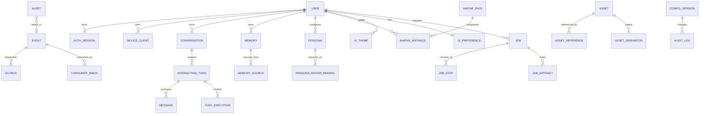
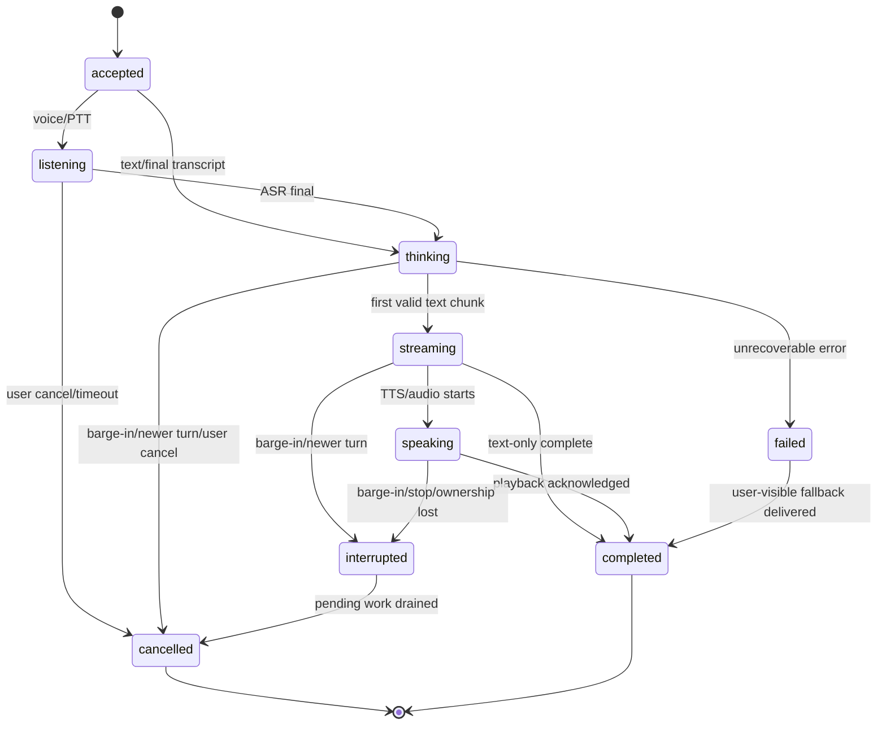
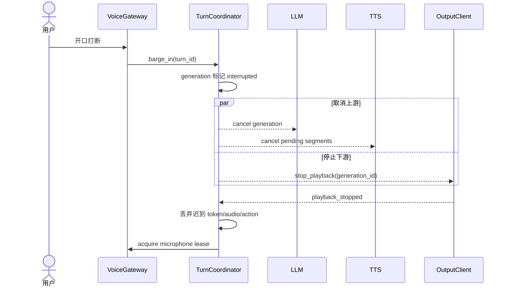
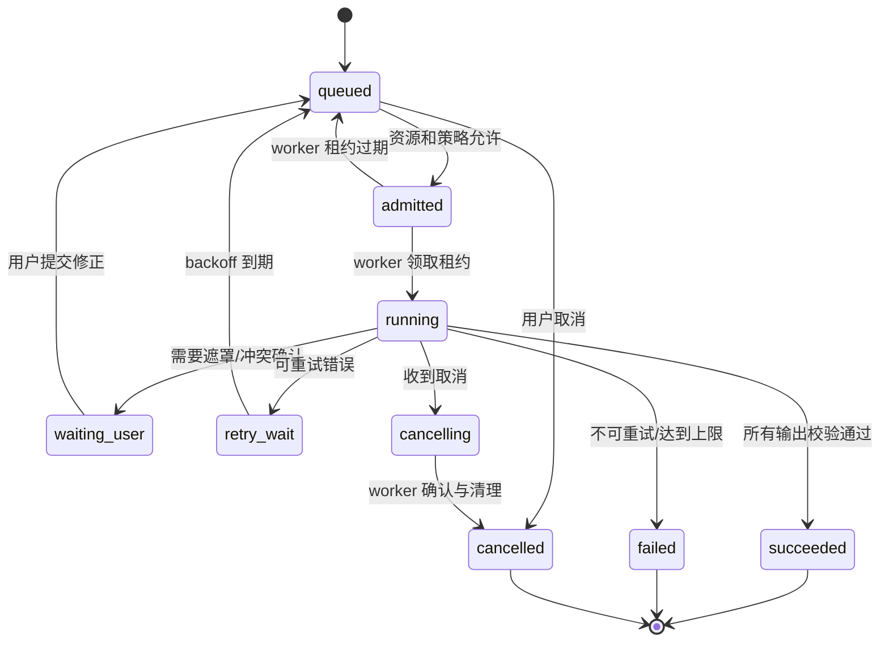
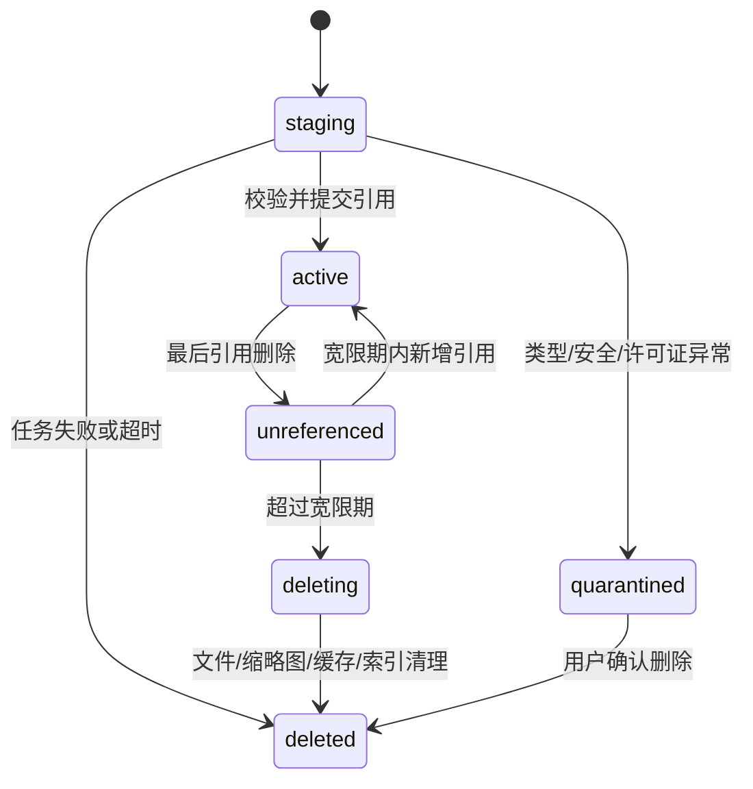
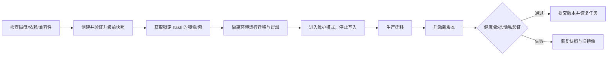

# 01 平台运行时

> 文档类型：Active 真源（按功能合并）｜最后更新：2026-09-15
> 本文档由下列原编号文档于 2026-09-15 合并而成，原文完整保留、标题降一级；历史版本见 git 记录与 `docs/history/历史阶段归档.md`。


---

## 统一数据模型与 API 契约（原编号 11）

> 项目代号：**Aria**（伴侣中枢 / Companion Hub）  
> 文档版本：v1.2（2026-08-17）
> 本文是数据库实体、标识、API 通用行为和版本兼容的唯一权威来源。其他文档中的 SQL 均为局部示意；实现以 Alembic migration 和本文约束为准。

---

### 1. 建模原则

1. 单用户 v1 仍显式保留 `user_id`，不使用散落的 `local-user` 字符串；
2. 对外可见和跨服务标识使用 UUIDv7；数据库内部高频明细可使用 BIGINT；
3. 所有用户可变实体带 `revision` 做乐观锁；
4. 所有领域事件带 event/correlation/causation ID；
5. 大文件进入 Asset Store，数据库只保存元数据和引用；
6. JSONB 只用于有版本 Schema 的扩展字段，不替代核心关系和约束；
7. 时间存 `TIMESTAMPTZ`，计划任务另外保存 IANA timezone；
8. 删除策略按领域显式声明，禁止依赖默认级联；
9. secret 只保存 secret reference，不进入配置、日志或审计 metadata；
10. 所有枚举先使用受控 TEXT + CHECK，升级时经 migration 扩展。

通用输入/输出 envelope、ContentPart、adapter manifest、L3 临时信号管道和投递回执以 [01-平台运行时.md](./01-平台运行时.md) 为唯一权威来源。传输层不得另造一套领域标识或载荷模型。

### 2. 标识规范

| 标识 | 格式 | 生命周期 |
|---|---|---|
| `user_id` | UUIDv7 | 用户实体永久 |
| `conversation_id` | UUIDv7 | 一段可持续会话 |
| `turn_id` | UUIDv7 | 一次用户输入及回复 |
| `generation_id` | UUIDv7 | 一次可取消生成尝试 |
| `event_id` | UUIDv7 | 每个持久领域事件 |
| `correlation_id` | UUIDv7 | 一条完整业务链路 |
| `causation_id` | UUIDv7/null | 直接上游 event ID |
| `trace_id` | 16-byte hex/OTel | 一次技术调用链，不作为业务主键 |
| `job_id` | UUIDv7 | 长任务 |
| `asset_id` | UUIDv7 | 逻辑资产；内容 hash 负责物理去重 |
| `device_id` | UUIDv7 | 客户端或 IoT 设备 |

客户端不能自行决定 `user_id`、权限、隐私等级或数据库主键；离线创建草稿可使用 `client_object_id`，同步时由服务端映射。

### 3. 领域关系总览



### 4. 领域表目录

本目录同时包含已落库的当前表和后续里程碑的目标实体。**是否已经真实存在，以 Alembic migration 为准**；专项设计可以先定义未来字段/表，但在 migration 落地前不得把它描述为当前运行时能力。

| 领域 | 权威表 | 主删除策略 |
|---|---|---|
| 身份 | `app_user`, `auth_credential`, `auth_session`, `recovery_key`, `device_client` | 撤销会话；用户删除走专用 Job |
| 会话 | `conversation`, `interaction_turn`, `message` | 会话删除同时删除消息并触发衍生记忆检查 |
| 事件 | `event`, `outbox`, `consumer_inbox`, `dead_letter` | 按保留策略清理，不级联删除领域事实 |
| 记忆 | `memory`, `memory_source`, `deletion_ledger` | 专用删除任务，不允许通用 ORM delete；多主体字段演进见 docs/03 |
| 历史时间线（规划） | `timeline_event` | 跟随 Source 删除/保留策略；不得成为删除后的数据旁路，见 docs/03 |
| 人格 | `persona_version`, `persona_pointer`；`agent_state` 为后续状态模型 | 版本化；当前发布指针不可直接悬空 |
| 形象 | `avatar_pack`, `avatar_instance`, `persona_avatar_binding` | 删除实例后释放资产引用 |
| 主题 | `ui_theme`, `ui_preference` | 已发布主题归档，草稿可删除 |
| 设备 | `iot_device`, `device_channel`, `user_mode`, `runtime_lease` | IoT 注销保留非敏感审计 |
| 长任务 | `job`, `job_step`, `job_artifact`, `schedule` | 任务清理前先释放临时资产 |
| 资产 | `asset`, `asset_reference`, `asset_derivation` | 最后引用删除后进入宽限 GC |
| 配置运维 | 当前：`config_version`, `config_pointer`；后续：`audit_log`, `alert`, `migration_run` | revision 追加/归档，当前指针原子切换，受保留策略约束 |
| 工具 | `tool_definition`, `tool_grant`, `tool_execution` | 执行记录按审计策略保留 |

### 5. 核心表约束

以下为约束摘要，完整列由 Alembic migration 管理。

#### 5.1 用户、会话与消息

```sql
CREATE TABLE app_user (
  id UUID PRIMARY KEY,
  display_name TEXT NOT NULL,
  locale TEXT NOT NULL DEFAULT 'zh-CN',
  timezone TEXT NOT NULL DEFAULT 'Asia/Shanghai',
  status TEXT NOT NULL DEFAULT 'active',
  created_at TIMESTAMPTZ NOT NULL DEFAULT now()
);

CREATE TABLE conversation (
  id UUID PRIMARY KEY,
  user_id UUID NOT NULL REFERENCES app_user(id),
  title TEXT,
  status TEXT NOT NULL DEFAULT 'active',
  revision BIGINT NOT NULL DEFAULT 1,
  last_seq BIGINT NOT NULL DEFAULT 0,
  created_at TIMESTAMPTZ NOT NULL DEFAULT now(),
  last_active_at TIMESTAMPTZ NOT NULL DEFAULT now()
);

CREATE TABLE message (
  id UUID PRIMARY KEY,
  conversation_id UUID NOT NULL REFERENCES conversation(id),
  turn_id UUID NOT NULL,
  seq BIGINT NOT NULL,
  role TEXT NOT NULL CHECK (role IN ('user','assistant','system','tool')),
  content TEXT,
  privacy_level TEXT NOT NULL CHECK (privacy_level IN ('L0','L1','L2')),
  generation_id UUID,
  decision_meta JSONB,
  created_at TIMESTAMPTZ NOT NULL DEFAULT now(),
  UNIQUE (conversation_id, seq)
);
```

`decision_meta` 使用版本化白名单 Schema，仅允许 reason codes、memory IDs、tool execution IDs、policy/prompt version，不允许自由文本推理。

#### 5.2 身份

```sql
CREATE TABLE auth_credential (
  id UUID PRIMARY KEY,
  user_id UUID NOT NULL REFERENCES app_user(id),
  kind TEXT NOT NULL CHECK (kind IN ('password','passkey')),
  credential_id BYTEA,
  public_data JSONB,
  secret_hash TEXT,
  params_version INT NOT NULL,
  created_at TIMESTAMPTZ DEFAULT now(),
  revoked_at TIMESTAMPTZ
);

CREATE TABLE auth_session (
  id UUID PRIMARY KEY,
  user_id UUID NOT NULL REFERENCES app_user(id),
  device_id UUID,
  refresh_family_id UUID NOT NULL,
  refresh_hash TEXT NOT NULL,
  issued_at TIMESTAMPTZ NOT NULL,
  expires_at TIMESTAMPTZ NOT NULL,
  rotated_at TIMESTAMPTZ,
  revoked_at TIMESTAMPTZ,
  last_seen_at TIMESTAMPTZ
);
```

Refresh token 每次使用都轮换；同一 family 的旧 token 再次出现视为重放并撤销整个 family。登录与 setup code 有 IP/设备维度限流。

#### 5.3 工具执行

```sql
CREATE TABLE tool_execution (
  id UUID PRIMARY KEY,
  turn_id UUID NOT NULL,
  generation_id UUID NOT NULL,
  tool_name TEXT NOT NULL,
  risk TEXT NOT NULL,
  status TEXT NOT NULL,
  idempotency_key TEXT UNIQUE,
  args_redacted JSONB,
  result_redacted JSONB,
  confirmation_id UUID,
  external_operation_id TEXT,
  created_at TIMESTAMPTZ DEFAULT now(),
  completed_at TIMESTAMPTZ
);
```

状态包括 `proposed/awaiting_confirmation/executing/succeeded/failed/unknown_outcome/reconciled/cancelled`。`unknown_outcome` 不自动重试，先查询外部状态或请求用户决定。

### 6. 外键与删除规则

- `message → conversation`：业务删除通过 deletion job；数据库 FK 默认 RESTRICT；
- `interaction_turn → conversation`：RESTRICT；
- `memory_source → memory`：删除记忆时 CASCADE 删除来源链接，但不反删来源消息；
- `asset_reference → asset`：RESTRICT，必须先释放引用；
- `job_artifact → asset`：任务删除前释放临时引用；
- `persona_avatar_binding → avatar_instance`：RESTRICT，切换当前形象后才能删除；
- `ui_preference → ui_theme`：删除主题前回退默认主题；
- 审计和删除台账不对业务正文设置反向 FK，避免删除内容被审计表阻塞。

### 7. API 通用约定

#### 7.1 基础

- 前缀 `/api/v1`；JSON 使用 UTF-8；时间为 RFC 3339；
- JSON 字段 `snake_case`；URL 资源使用复数名词；
- 所有响应返回 `X-Trace-Id`；写操作记录 audit correlation；
- 客户端发送 `X-Client-Version` 和 `X-Protocol-Version`；
- 不支持的旧版本返回 `426 upgrade_required`，并提供最低版本；
- 请求体默认上限 1MB；上传接口单独声明并使用流式解码。

#### 7.2 成功与错误

普通成功直接返回资源；创建返回 201；异步任务返回 202：

```json
{
  "job_id": "019...",
  "status": "queued",
  "status_url": "/api/v1/jobs/019..."
}
```

统一错误：

```json
{
  "error": {
    "code": "revision_conflict",
    "message": "资源已被其他终端修改",
    "trace_id": "4fd0...",
    "retryable": false,
    "details": { "current_revision": 43 }
  }
}
```

`message` 可本地化，但客户端逻辑只能依赖稳定 `code`。

#### 7.3 状态码

| 状态 | 用途 |
|---|---|
| 400 | 语法或基础请求错误 |
| 401 | 未认证/会话过期 |
| 403 | 已认证但权限或策略拒绝 |
| 404 | 资源不存在或无权知晓 |
| 409 | revision、状态机、幂等键冲突 |
| 413 | 请求/解码后资源过大 |
| 422 | Schema 正确但业务校验失败 |
| 423 | 资源被 Job/维护/租约锁定 |
| 429 | 限流或资源配额不足 |
| 503 | 能力不可用，可查看 retryable/reason code |

### 8. 分页、过滤和游标

列表默认游标分页：

```http
GET /api/v1/messages?conversation_id=...&limit=50&after=opaque_cursor
```

```json
{
  "items": [],
  "page": { "next_cursor": "...", "has_more": true }
}
```

Cursor 是签名的 opaque value，包含稳定排序键，不接受客户端反序列化。`limit` 默认 50、最大 200。时间范围最大跨度按接口限制；高成本统计必须走预聚合。

### 9. 乐观锁与幂等

- 可变资源返回 `ETag: "43"`；更新要求 `If-Match`；
- 缺少 If-Match 的管理写操作返回 428；
- 创建消息、Job、工具副作用和导出接受 `Idempotency-Key`；
- 同一 key + 相同请求返回原结果；同一 key + 不同请求 hash 返回 409；
- 幂等记录保留时间不得短于客户端最大安全重试窗口；
- 外部工具不支持幂等时，进入 `unknown_outcome` 和 reconciliation，不承诺 exactly-once。

### 10. 文件上传与下载

上传采用 `multipart/form-data` 或分块 session：

```text
POST /assets/uploads → upload_id + limits
PUT /assets/uploads/{id}/parts/{n}
POST /assets/uploads/{id}/complete
```

服务端边接收边计算 hash，完成后解码重编码、MIME/像素/压缩比/路径安全检查，再转为 Asset。上传未完成 24 小时自动清理。

下载通过受鉴权的短期 URL 或流式端点，支持 `Range`、ETag 和完整性 hash；L2 资产不进入公共缓存。

### 11. WebSocket 契约

连接顺序：authenticate → `client_hello` → capability/snapshot → cursor catch-up → realtime。

```jsonc
{
  "proto_version": 1,
  "stream": "conversation:019...",
  "seq": 184,
  "event_id": "019...",
  "type": "reply.delta",
  "generation_id": "019...",
  "sent_at": "2026-08-16T21:30:00.123+08:00",
  "payload": {}
}
```

- 客户端按 event ID 幂等并检查 seq；
- seq 缺口通过 REST/WS `sync.request` 补拉；
- ping 20s、pong timeout 10s，可根据网络 profile 调整；
- 会话过期前服务端发 `auth.expiring`；
- 未知 critical event 关闭连接并要求升级；未知 optional event 可忽略；
- 流式 delta 不作为持久事实，最终 `reply.committed` 才进入历史同步。

### 12. 权限与重新验证

| 能力 | viewer | operator | admin | reauth |
|---|---:|---:|---:|---:|
| 查看健康/聚合指标 | ✓ | ✓ | ✓ | — |
| 日常聊天/形象主题 | ✓ | ✓ | ✓ | — |
| 设备启停/主动规则草稿 | — | ✓ | ✓ | — |
| 查看消息/记忆正文 | — | — | ✓ | 可配置 |
| 修改隐私等级/模型出口 | — | — | ✓ | 必须 |
| 导出、批量删除、恢复 | — | — | ✓ | 必须 |
| 配对新管理员设备 | — | — | ✓ | 必须 |

单用户 v1 的角色主要用于会话降权和公共展示模式，不代表支持多租户。

### 13. Schema 与兼容性

- OpenAPI 和 JSON Schema 从 Pydantic 单一真源生成并纳入版本控制；
- CI 检查 breaking change：删除字段、收紧枚举、改变含义必须升级版本；
- 新字段默认 optional，服务端至少兼容 N/N-1；
- DB migration、OpenAPI snapshot 和前端生成类型在同一变更提交；
- 形象、主题、配置和 Job artifact 分别携带 schema version；
- InputEnvelope/OutputIntent 同时携带 `proto_version` 与 `schema_ref`；adapter manifest 声明 Hub 兼容范围和 optional/critical capabilities；
- API 废弃至少跨一个小版本发 warning，安全紧急变更除外。

### 14. 实施与验收

- M0 建立 canonical Alembic 初始 schema，不复制文档 SQL 执行；
- CI 生成 OpenAPI、JSON Schema、TS 类型并检测未提交差异；
- 对每个写接口测试 revision、幂等、权限、审计和错误 envelope；
- 对所有 JSONB 字段运行 unknown-field 和敏感 canary 测试；
- 构造重复/乱序/分页边界/游标篡改/会话轮换重放测试；
- 从 N-1 OpenAPI 客户端运行 N 服务兼容测试；
- 数据模型变更必须更新本文、migration、ADR 和需求追踪矩阵。

---

## 运行状态机与多端同步（原编号 09）

> 项目代号：**Aria**（伴侣中枢 / Companion Hub）
> 文档版本：v1.2（2026-08-26）
> 目标：统一文字、语音、主动互动、形象动作和多终端行为，保证取消及时、状态可恢复、同一回复不会在多个终端失控播放。

> **实现状态**：TurnCoordinator 核心已落地（`app/runtime/turn_coordinator.py` + `lease.py`），9 状态 CAS 转移、generation 活性检查、音频/麦克风租约仲裁、用户模式优先级、重启恢复均已实现；Chat/Voice WebSocket 全链路已接入状态机与租约管理。多端同步（跨设备状态广播、麦克风所有权仲裁）待下一批次推进。

---

### 1. 状态分层

系统不使用一个巨大的全局状态枚举，而分为四个正交状态域：

| 状态域 | 示例 | 持久化 | 作用域 |
|---|---|---|---|
| 交互状态 | idle/listening/thinking/speaking/interrupted | 事件持久化；当前快照可重建 | 每个 conversation turn |
| 可用性状态 | online/degraded/offline/error | 记录变更事件 | 每服务、每终端 |
| 用户模式 | available/focus/dnd/asleep/away | 持久化 | 全局，可有设备观测来源 |
| 展现状态 | avatar emotion/gesture/theme/audio playback | 仅保存最终偏好；瞬时状态不持久化 | 每终端 |

这样可以表达“用户处于 DND，但聊天终端在线、系统降级到文字、本轮正在 thinking”，而不产生组合爆炸。

### 2. 交互回合状态机



#### 2.1 状态定义

| 状态 | 含义 | 允许副作用 |
|---|---|---|
| `accepted` | 根输入已持久化并分配 turn ID | 仅确认接收 |
| `listening` | 正在收音/VAD/ASR | ASR partial，不写长期记忆 |
| `thinking` | 检索、工具、LLM 正在执行 | 可写 Trace，不可对用户产生最终输出 |
| `streaming` | 已有可验证文字块 | 推送文字；可启动句级 TTS |
| `speaking` | 某终端拥有音频播放租约 | 音频、口型和可中断动作 |
| `interrupted` | 用户打断或更新输入使当前输出失效 | 立即停播；禁止再发送陈旧输出 |
| `cancelled` | 所有待执行步骤已确认取消/丢弃 | 仅取消审计 |
| `failed` | 关键步骤失败且需要降级 | 发送明确的系统状态或降级结果 |
| `completed` | 文本完成且所需终端确认播放/丢弃 | 可异步提交记忆候选 |

### 3. 标识与新旧回合判定

每个交互至少包含：

```jsonc
{
  "conversation_id": "uuidv7",
  "turn_id": "uuidv7",
  "turn_seq": 42,
  "correlation_id": "uuidv7",
  "root_event_id": "uuidv7",
  "generation_id": "uuidv7",
  "cancel_token_id": "uuidv7"
}
```

- `turn_seq` 在单个会话内单调递增；
- 新用户输入默认使同会话中更旧且可中断的 generation 失效；
- 所有流式块、TTS 段、动作和记忆候选携带 `generation_id`；
- 输出网关只接受当前 active generation；迟到块直接丢弃并记录 `stale_generation`；
- 重试保持同一 `generation_id`，用户重新提问产生新 generation。

### 4. 取消与打断语义

取消采用协作式传播：



取消完成条件：终端确认停止播放、待发送队列清空、旧 generation 不再允许副作用。无法真正终止的外部 API 请求可以继续消耗资源，但其结果必须被隔离丢弃并计入“取消浪费成本”。

指标目标：本地播放停止 P90 ≤ 200ms；旧 generation 最后一个可见文字块 P90 ≤ 300ms。

### 5. TurnCoordinator

新增 `TurnCoordinator` 作为交互编排边界：

- 创建 turn/generation/cancel token；
- 维护状态转移并验证合法性；
- 选择音频输入和输出终端；
- 向检索、工具、LLM、TTS 传播取消；
- 拒绝迟到的流式块和动作；
- 记录降级原因与最终完成状态；
- 重启后从事件重建未完成回合，并将不安全续跑的回合标记为 cancelled。

状态转移使用 compare-and-set：

```sql
UPDATE interaction_turn
SET state = 'interrupted', state_version = state_version + 1
WHERE id = :turn_id
  AND state_version = :expected
  AND state IN ('thinking','streaming','speaking');
```

### 6. 输出所有权和播放租约

“多端同时在线”不等于“所有端一起说话”。每类输出使用策略：

| 输出 | 默认策略 |
|---|---|
| 文字 | 所有订阅同一会话的终端同步显示 |
| TTS 音频 | 仅一个 `audio_owner` 播放 |
| Live2D/VRM 口型 | 音频所有者同步；其他端只显示文字和低幅情绪 |
| 主动通知 | 根据 presence、设备能力、通知偏好选择一个首选端 |
| P0 系统告警 | 管理端和本地系统通知，可多端但去重 |

音频租约：

```jsonc
{
  "lease_type": "audio_output",
  "holder_device_id": "desktop-main",
  "generation_id": "gen_xxx",
  "expires_at": "...",
  "epoch": 17
}
```

租约短期有效并续约。设备断线、用户手动接管或更高 epoch 出现时，旧设备立即停止。服务端以 epoch 防止网络分区导致双播。

### 7. 麦克风和唤醒所有权

- 同一用户同一时刻只允许一个 `microphone_owner` 进入 listening；
- PTT 具有最高优先级，可从唤醒词终端接管；
- 新终端请求时，旧终端显示“麦克风已在另一设备使用”；
- 服务端不转发原始麦克风流给其他终端；
- 唤醒词默认本机检测，只有唤醒后的音频片段进入中枢；
- DND 不禁止用户主动 PTT，只禁止主动播报和非紧急通知。

### 8. 状态归属

| 状态 | 归属 | 同步策略 |
|---|---|---|
| Persona、关系、记忆 | 全局 | 服务端事实源 |
| 当前形象实例 | 全局默认 | 服务端；设备可临时覆盖 |
| 账户主题 | 全局 | 服务端版本化 |
| 窗口位置、音量、渲染质量 | 设备本地 | 不跨端 |
| 本机主题覆盖 | 设备本地 | 不覆盖账户主题 |
| DND/睡眠/离家 | 全局用户模式 | 服务端规则合并 |
| 当前会话消息 | 会话级 | 按 seq 同步 |
| 正在播放/动画帧/麦克风 | 瞬时设备级 | 租约和心跳 |
| 配置草稿 | 服务端用户级 | 乐观锁和版本冲突 |

### 9. 多端消息同步

客户端保存每个 stream 的 `last_seq`：

```text
连接 → authenticate → client_hello(device_id, structured_capabilities, cursors)
→ 服务端补发 last_seq 之后的持久事件
→ 发送 snapshot_revision
→ 进入实时流
```

消息只按 `conversation_id` 保序，不承诺跨会话全局顺序。客户端收到重复 event ID 必须幂等；发现 seq 缺口时暂停应用后续增量并请求补拉。

WebSocket 事件 envelope：

```jsonc
{
  "proto_version": 1,
  "stream": "conversation:uuidv7",
  "seq": 184,
  "event_id": "uuidv7",
  "type": "reply.delta",
  "generation_id": "uuidv7",
  "payload": {}
}
```

### 10. 并发编辑与冲突

配置、主题、形象和记忆编辑使用 ETag/revision：

```http
PATCH /api/v1/ui/preferences
If-Match: "revision-42"
```

版本不匹配返回 `409 conflict` 和服务器 diff，不使用最后写入者静默覆盖。简单设备偏好可以 last-write-wins，但审计中记录设备和旧/新版本。

记忆冲突不能自动覆盖：多个终端同时编辑同一记忆时创建候选版本，要求用户合并或选择。

### 11. 用户模式合并

优先级：

```text
用户手动设置 DND
  > 用户手动设置 focus/available
  > 明确日程规则
  > 高置信睡眠/离家感知
  > 低置信环境推断
```

所有自动模式都有 `reason/source/confidence/expires_at`。低置信推断不能覆盖用户手动选择；手动模式可设置“直到某时间”或“直到我关闭”。

### 12. 降级状态和用户提示

故障不得伪装成人格情绪。统一 `ServiceCapabilitySnapshot`：

```jsonc
{
  "chat": "available",
  "memory": "degraded",
  "voice_input": "available",
  "voice_output": "unavailable",
  "avatar": "fallback_static",
  "reason_codes": ["tts_provider_down", "vector_index_rebuilding"]
}
```

| 故障 | 用户可见行为 |
|---|---|
| 云模型不可达 | 明确提示切到本地模型及能力变化 |
| 所有模型不可用 | 保存消息并显示“暂时无法生成回复”，不伪造台词 |
| 记忆服务不可用 | 本轮继续普通对话，明确不使用长期记忆 |
| TTS 失败 | 保留文字，停止口型，显示“语音暂不可用” |
| ASR 失败 | 保留录音重试选项或切换文字；默认不永久保存音频 |
| 形象加载失败 | 回退静态头像，不影响对话 |
| MQTT 离线 | 禁止传感器主动推断，显示设备数据已过期 |
| 数据库只读 | 禁止声称“已记住”；允许只读浏览并提示 |

### 13. 首次安装与本地身份

单用户不等于无身份系统：

1. 首次启动生成一次性 setup code，仅在本机控制台显示，15 分钟过期；
2. 用户创建管理员密码或 Passkey；密码使用内存困难哈希；
3. 浏览器使用 Secure/HttpOnly/SameSite Cookie，写操作校验 CSRF；
4. 新设备通过已登录管理端显示的短期配对码加入；
5. access session 短期有效，refresh session 可撤销并绑定设备；
6. 管理高风险操作要求密码/Passkey 重新验证；
7. 恢复方式为本机 recovery key，展示一次，保存其哈希；
8. 所有 session、配对和撤销写入审计。

Tauri 凭据存系统安全存储；PWA 不把长期 token 放入 localStorage。WebSocket 使用已有会话升级并在过期前重新认证。

### 14. 数据模型

```sql
CREATE TABLE interaction_turn (
  id UUID PRIMARY KEY,
  conversation_id TEXT NOT NULL,
  turn_seq BIGINT NOT NULL,
  correlation_id UUID NOT NULL,
  generation_id UUID NOT NULL UNIQUE,
  state TEXT NOT NULL,
  state_version INT NOT NULL DEFAULT 1,
  input_event_id UUID NOT NULL,
  cancel_reason TEXT,
  degradation JSONB,
  created_at TIMESTAMPTZ DEFAULT now(),
  completed_at TIMESTAMPTZ,
  UNIQUE (conversation_id, turn_seq)
);

CREATE TABLE device_client (
  id TEXT PRIMARY KEY,
  name TEXT, client_type TEXT NOT NULL,
  capabilities JSONB NOT NULL,
  revoked_at TIMESTAMPTZ,
  last_seen_at TIMESTAMPTZ
);

CREATE TABLE runtime_lease (
  lease_type TEXT NOT NULL,
  holder_device_id TEXT NOT NULL REFERENCES device_client(id),
  generation_id UUID,
  epoch BIGINT NOT NULL,
  expires_at TIMESTAMPTZ NOT NULL,
  PRIMARY KEY (lease_type)
);

CREATE TABLE user_mode (
  id BIGSERIAL PRIMARY KEY,
  mode TEXT NOT NULL,
  source TEXT NOT NULL,
  reason TEXT,
  confidence REAL,
  priority INT NOT NULL,
  starts_at TIMESTAMPTZ DEFAULT now(),
  expires_at TIMESTAMPTZ,
  superseded_at TIMESTAMPTZ
);
```

### 15. 验收标准

- 同一 generation 迟到 100 个流式块，用户端显示和 TTS 均为 0 个；
- 三个终端同时在线时，文字全部同步，TTS 只在租约持有端播放；
- 音频所有者网络断开后 2 秒内停止旧租约并允许新端接管；
- seq 缺口、重复和乱序测试后，各端最终消息一致；
- 打断后旧 generation 不写记忆、不更新关系状态、不执行工具副作用；
- 配置 revision 冲突返回 409，不静默覆盖；
- DND 下主动消息零播报，用户 PTT 仍可使用；
- 任一依赖故障都有明确、非人格化的降级提示；
- 首次安装、配对、撤销、恢复和重新验证均有自动化安全测试。

---

## 输入输出扩展契约（原编号 14）

> 项目代号：**Aria**（伴侣中枢 / Companion Hub）  
> 文档版本：v1.0（2026-08-17）  
> 状态：M0 协议冻结基线  
> 上游文档：[00-产品与架构.md](./00-产品与架构.md) | [01-平台运行时.md](./01-平台运行时.md)

---

### 1. 目标与边界

本契约保证新增输入源或输出端时，只需增加 adapter、配置和契约测试，不修改认知核心、记忆系统或主动引擎。

本契约只定义中枢内部的领域协议和 adapter 端口；MQTT、HTTP、WebSocket、WebRTC、串口等属于传输绑定，不进入核心业务模型。v1 不承诺运行任意第三方代码，adapter 与 Hub 同仓、受信任部署；独立进程和第三方插件沙箱属于后续能力。

设计约束：

1. 输入统一为 `InputEnvelope`，输出统一为 `OutputIntent`；
2. 文本、音频、图片、视频、文件、遥测和交互使用统一 `ContentPart` 表达；
3. 大型或二进制内容使用 `asset_ref`，不得直接写入通用事件表；
4. L3 原始信号只走 `EphemeralSignal` 内存管道，禁止进入持久 EventBus；
5. adapter 声明能力，核心按语义产生意图，OutputGateway 负责选择、降级、投递和取消；
6. 协议以 Pydantic v2 为单一真源，生成 JSON Schema、OpenAPI 和 TypeScript 类型；
7. 所有扩展字段必须有命名空间和版本，禁止依赖无 Schema 的任意 JSON。

### 2. 权威标识

跨模块和对外可见标识统一使用 UUIDv7，具体定义以 11 文档 §2 为准：

| 标识 | 要求 |
|---|---|
| `user_id` | 所有已认证输入必填；由服务端身份上下文注入 |
| `conversation_id` | 对话类输入必填；非对话事件可空 |
| `turn_id` | 会产生交互回合的输入必填 |
| `generation_id` | 进入生成、流式输出或工具调用后必填，是取消边界 |
| `event_id` | 每个持久事件唯一 |
| `correlation_id` | 一次完整业务链路共享 |
| `causation_id` | 指向直接上游持久事件；根事件为空 |
| `adapter_id` | adapter 类型的稳定命名空间，例如 `builtin.chat_ws` |
| `adapter_instance_id` | 一份已配置 adapter 实例的 UUIDv7 |

历史文档中的 `session_id` 一律解释为 `conversation_id`，新实现和新文档禁止继续使用 `session_id`。

### 3. 输入模型

#### 3.1 InputEnvelope（持久输入）

可审计、需要崩溃恢复或会产生业务副作用的输入，转换为 `InputEnvelope` 后进入持久 EventBus。

```jsonc
{
  "proto_version": 1,
  "schema_ref": "aria.input-envelope/1",
  "event_id": "uuidv7",
  "correlation_id": "uuidv7",
  "causation_id": null,
  "user_id": "uuidv7",
  "conversation_id": "uuidv7|null",
  "turn_id": "uuidv7|null",
  "source": {
    "adapter_id": "builtin.chat_ws",
    "adapter_instance_id": "uuidv7",
    "endpoint_id": "browser-main"
  },
  "kind": "message.received",
  "occurred_at": "2026-08-17T10:00:00+08:00",
  "received_at": "2026-08-17T10:00:00.050+08:00",
  "priority": "normal",
  "privacy_level": "L1",
  "content": [
    { "type": "text", "text": "今天好累啊", "language": "zh-CN" }
  ],
  "extensions": {}
}
```

约束：

- `privacy_level` 是 adapter 的声明值，服务端必须根据身份、设备、通道和内容重新定级；
- 持久 `InputEnvelope` 最终等级只允许 L0~L2；任何被重定级为 L3 的内容必须拒绝持久化并转入或留在 EphemeralSignal 管道；
- `kind` 使用命名空间形式，如 `message.received`、`speech.transcribed`、`presence.changed`、`timer.fired`、`avatar.touched`；
- `occurred_at` 表示源端发生时间，`received_at` 由 Hub 写入；
- 对话入口由 InputGateway 创建 `conversation_id/turn_id`，客户端不得自行决定 `user_id`；
- `extensions` 的键必须为反向域名或项目命名空间，例如 `com.example.camera`，且每项都必须能解析到已登记 Schema；
- `generation_id` 不放在根输入中；TurnCoordinator 接受输入后创建 generation，并将其附加到后续执行上下文和输出意图。

#### 3.2 EphemeralSignal

L3 原始遥测、尚未获得持久化同意的原始音视频帧，以及仅用于实时推断的高频信号，使用进程内 `EphemeralSignal`：

```jsonc
{
  "signal_id": "uuidv7",
  "source": {
    "adapter_id": "builtin.device_mqtt",
    "adapter_instance_id": "uuidv7",
    "endpoint_id": "bedroom-pressure"
  },
  "channel": "pressure",
  "occurred_at": "2026-08-17T22:00:00+08:00",
  "privacy_level": "L3",
  "content": { "type": "telemetry", "value": 0.73, "unit": "ratio" },
  "expires_at": "2026-08-17T22:02:00+08:00"
}
```

强制规则：

- 只能进入有界内存队列和有过期时间的滚动窗口；
- 禁止写入 `event/outbox/dead_letter`、日志、Trace payload、备份和导出；
- 只能输出经过白名单规则聚合的 L0~L2 `InputEnvelope`/`SemanticEvent`；
- 队列溢出时按通道策略丢弃、采样或聚合，不允许回退到数据库；
- 排障只允许使用合成信号、计数、延迟和不可逆摘要。

#### 3.3 ContentPart

`content` 是有序数组，允许一条输入同时包含文字和附件。

| `type` | 核心字段 | 持久化规则 |
|---|---|---|
| `text` | `text`, `language`, `format=plain|markdown` | L1/L2 可按策略持久化 |
| `audio` | `asset_ref` 或受控流 ID、`codec`, `sample_rate` | 原始音频默认不进入事件 JSON |
| `image` | `asset_ref`, `media_type`, `width`, `height` | 进入 Asset Store 后引用 |
| `video` | `asset_ref`, `media_type`, `duration_ms` | 进入 Asset Store 后引用 |
| `file` | `asset_ref`, `media_type`, `display_name` | 进入 Asset Store 后引用 |
| `telemetry` | `channel`, `value`, `unit`, `quality` | L3 仅允许出现在 EphemeralSignal |
| `interaction` | `name`, `target`, `value` | 点击、触摸、按键等离散交互 |
| `control` | `name`, `args` | 取消、接管、确认等受控控制输入 |
| `asset_ref` | `asset_id`, `media_type`, `content_hash` | 引用已有 Asset |

新增 ContentPart 类型属于协议变更：先注册 Schema，默认作为 optional capability 发布；不得让未知可选类型阻塞同一 envelope 中可识别的内容。

输出侧额外允许：

| `type` | 核心字段 | 约束 |
|---|---|---|
| `speech` | `text`, `voice_profile`, `language` | 表达待合成语音，不携带 provider 参数 |
| `notification` | `title`, `body`, `category` | 仍受 DND、隐私和主动触达策略约束 |
| `device_command` | `tool_execution_id`, `command`, `args_redacted` | 必须引用已获准的工具执行，不允许由输出端自行授权 |

### 4. 输出模型

#### 4.1 OutputIntent

认知核心和系统模块只产生语义意图，不直接选择 WebSocket、扬声器或具体渲染引擎。

```jsonc
{
  "proto_version": 1,
  "schema_ref": "aria.output-intent/1",
  "intent_id": "uuidv7",
  "correlation_id": "uuidv7",
  "causation_id": "uuidv7|null",
  "user_id": "uuidv7",
  "conversation_id": "uuidv7|null",
  "turn_id": "uuidv7|null",
  "generation_id": "uuidv7|null",
  "kind": "reply",
  "content": [
    { "type": "text", "text": "辛苦了，先喘口气吧。", "language": "zh-CN" },
    { "type": "speech", "text": "辛苦了，先喘口气吧。", "voice_profile": "default" }
  ],
  "presentation": {
    "emotion": "tender",
    "intensity": 0.7,
    "gesture": "comfort"
  },
  "audience": { "mode": "user" },
  "target_selector": { "mode": "best_available", "prefer": ["desktop", "mobile"] },
  "delivery": {
    "priority": "normal",
    "ttl_ms": 8000,
    "interruptible": true,
    "ack_policy": "accepted",
    "fallback": ["speech_to_text", "gesture_to_idle"]
  },
  "created_at": "2026-08-17T10:00:01+08:00"
}
```

`kind` 初始受控值为 `reply/proactive/system/alert`。`content` 可包含 `text/speech/audio/image/video/file/notification/device_command`；其中 `device_command` 必须先经过 Tool Policy Engine，不能由 OutputGateway 绕过授权执行。

#### 4.2 DeliveryPlan 与 DeliveryReceipt

OutputGateway 根据终端能力、用户偏好、租约、隐私、在线状态和降级规则，把一个 `OutputIntent` 展开为一个或多个内部 `DeliveryPlan`：

```jsonc
{
  "delivery_id": "uuidv7",
  "intent_id": "uuidv7",
  "adapter_instance_id": "uuidv7",
  "endpoint_id": "desktop-main",
  "generation_id": "uuidv7|null",
  "privacy_level": "L1",
  "selected_content": [{ "type": "text", "text": "辛苦了，先喘口气吧。" }],
  "presentation": { "emotion": "tender", "gesture": "comfort" },
  "deadline_at": "2026-08-17T10:00:09+08:00",
  "attempt": 1,
  "idempotency_key": "intent:endpoint:content-hash"
}
```

每次实际投递和状态变化产生回执：

```jsonc
{
  "delivery_id": "uuidv7",
  "intent_id": "uuidv7",
  "adapter_instance_id": "uuidv7",
  "endpoint_id": "desktop-main",
  "status": "accepted",
  "attempt": 1,
  "generation_id": "uuidv7|null",
  "occurred_at": "2026-08-17T10:00:01.100+08:00",
  "reason_code": null,
  "external_operation_id": null
}
```

状态为 `planned/sending/accepted/playing/delivered/dropped/failed/cancelled/unknown_outcome`。内部可控端使用 `(intent_id, adapter_instance_id, endpoint_id)` 幂等；不支持幂等的外部输出进入 `unknown_outcome`，先对账，不自动重复发送。

流式文本、音频段和口型块必须携带 `generation_id`；OutputGateway 在每次发送前验证 generation 仍有效。取消时调用 adapter 的 `cancel`，并等待或超时记录最终回执。

### 5. Adapter 端口

#### 5.1 通用生命周期

```python
class Adapter(Protocol):
    manifest: AdapterManifest

    async def configure(self, config: dict) -> None: ...
    async def start(self) -> None: ...
    async def health(self) -> AdapterHealth: ...
    async def reload(self, config: dict) -> None: ...
    async def stop(self) -> None: ...
```

状态为 `installed/configured/starting/ready/degraded/stopping/stopped/failed`。只有 `ready/degraded` adapter 可以参与路由；配置发布失败必须保留上一可用版本。

#### 5.2 InputAdapter

```python
class InputAdapter(Adapter, Protocol):
    async def run(self, sink: InputSink) -> None: ...
    async def pause(self, reason: str) -> None: ...
    async def resume(self) -> None: ...
```

`InputSink` 只提供两个显式入口：`emit_durable(InputEnvelope)` 和 `emit_ephemeral(EphemeralSignal)`。adapter 不得直接获得 EventBus、数据库或 LLM 引用，从类型和依赖边界上避免 L3 误入持久管道。

背压规则由 manifest 声明：离散输入默认阻塞或返回上游重试；高频信号允许 `drop_oldest/sample/aggregate`；任何丢弃都只记录计数和 reason code。

#### 5.3 OutputAdapter

```python
class OutputAdapter(Adapter, Protocol):
    async def probe(self, endpoint_id: str) -> EndpointCapabilities: ...
    async def deliver(self, plan: DeliveryPlan) -> DeliveryReceipt: ...
    async def cancel(self, generation_id: str, endpoint_id: str) -> DeliveryReceipt: ...
```

adapter 不负责人格、记忆、模型决策或跨端仲裁。它只能执行已授权的 DeliveryPlan，并返回稳定 reason code。

### 6. AdapterManifest 与能力协商

```jsonc
{
  "schema_version": 1,
  "adapter_id": "builtin.desktop_renderer",
  "adapter_version": "1.0.0",
  "min_hub_version": "0.1.0",
  "max_tested_hub_version": "0.1.x",
  "direction": ["input", "output"],
  "transport_bindings": ["websocket"],
  "config_schema_ref": "aria.adapter.desktop-renderer-config/1",
  "capabilities": {
    "input_parts": ["interaction", "audio"],
    "output_parts": ["text", "speech"],
    "streaming": ["text", "audio", "viseme"],
    "presentation": {
      "emotions": ["neutral", "happy", "tender", "sad"],
      "gestures": ["idle", "nod", "wave", "comfort"]
    },
    "delivery": {
      "supports_ack": true,
      "supports_cancel": true,
      "supports_replace": true,
      "proactive_reachable": true
    }
  },
  "privacy": {
    "runs_local": true,
    "max_input_level": "L3",
    "max_output_level": "L2"
  },
  "permissions": ["microphone", "local_audio", "avatar_render"],
  "input_policy": { "backpressure": "block", "queue_limit": 100 },
  "resource_profile": "realtime-small"
}
```

连接时 endpoint 上报实际能力，服务端取“manifest 声明、管理员授权、运行时探测”的交集。未知 optional capability 可以忽略；未知 critical capability 拒绝启用并返回 `upgrade_required`。

v1 registry 只登记随 Hub 发布、由代码显式注册的 adapter factory；配置只能引用已登记的 `adapter_id`，禁止通过模块名、文件路径或 URL 动态导入代码。以后若开放第三方 adapter，必须先新增独立进程、签名、权限和资源隔离 ADR。

### 7. 路由与降级

输出选择顺序：

1. 过滤未授权、隐私等级不允许和不可用 adapter；
2. 过滤不支持所需 ContentPart 的 endpoint；
3. 应用用户的设备偏好、presence 和当前租约；
4. 选择最小损失降级，例如 `speech → text`、`gesture → fallback gesture → idle`；
5. 生成 DeliveryPlan，投递并记录回执；
6. 所有候选均不可用时产生可审计的 `no_compatible_output`，不得静默丢失 reply。

主动触达必须额外检查 DND、访客模式、每日上限和 `proactive_reachable`。L2 内容禁止投递到公共屏幕、外部通知或能力不明的 endpoint。

### 8. 传输绑定

| Binding | 典型用途 | 领域边界 |
|---|---|---|
| HTTP/SSE | 文字发送、管理、服务端流 | 转换为 envelope/intent 后不保留 HTTP 语义 |
| WebSocket | 聊天、语音、渲染、控制 | 使用统一 WS envelope、seq 和 generation |
| MQTT | IoT 遥测和受控命令 | topic/retain/QoS 只属于 adapter |
| WebRTC | 低延迟音视频 | track/session 只属于 adapter，业务只接收内容和转写 |
| Local IPC | Tauri、GPU worker、本机音频 | 不因本地通信绕过鉴权和隐私策略 |
| Serial/BLE | 传感器和实体终端 | 断线、重连和帧格式由 adapter 处理 |

核心模块禁止根据 MQTT topic、WS path 或 HTTP header 分支业务逻辑。

### 9. Schema 与兼容性

- `proto_version` 管 envelope 兼容性，`schema_ref` 管具体载荷 Schema；
- 新增 optional 字段和 optional capability 不升级主版本；删除字段、改变语义、收紧必填项必须升级；
- 服务端至少支持 N/N-1，adapter manifest 明确 `min_hub_version/max_tested_hub_version`；
- Schema 快照和生成类型纳入版本控制，CI 检查未提交差异与 breaking change；
- `extensions` 不得覆盖核心字段，不得携带 secret、可执行代码或未声明的远程资源；
- adapter 配置只保存 secret reference，密钥由受控 secret provider 注入。

### 10. M0 契约测试

M0 至少提供 `mock_text_input`、`mock_ephemeral_sensor`、`mock_text_output`、`mock_streaming_output` 四个参考 adapter，并通过：

1. 新增参考输入/输出 adapter 时不修改 core、memory、proactive；
2. Pydantic → JSON Schema → TypeScript 类型生成结果稳定；
3. unknown optional 字段/能力可忽略，unknown critical 能力被拒绝；
4. L3 canary 在 DB、outbox、dead letter、日志、Trace、备份和 mock 云请求中命中数为 0；
5. 高压输入下背压策略符合 manifest，离散用户输入不被静默丢弃；
6. 同一 intent 重投三次，内部输出副作用只发生一次；
7. cancel 后旧 generation 的文字、音频、动作、记忆和工具副作用均为 0；
8. endpoint 缺语音或动作能力时按声明降级，回复仍能送达；
9. adapter start/reload/stop 失败不会拖垮 Hub，上一可用配置可以恢复；
10. 外部非幂等输出超时进入 `unknown_outcome`，不会自动重复触达。

### 11. 冻结规则

M0.3 完成时冻结：标识、两个输入入口、ContentPart、OutputIntent、DeliveryReceipt、adapter 生命周期和 manifest 基础字段。后续允许增加 optional ContentPart、capability 和 transport binding，但修改取消、隐私、幂等或标识语义必须新增 ADR，并通过 N/N-1 契约测试。

---

## 任务资产与升级运维（原编号 10）

> 项目代号：**Aria**（伴侣中枢 / Companion Hub）
> 文档版本：v1.1（2026-08-26）
> 目标：让反思、embedding、备份、模型/形象导入、单图动态化等长任务可恢复、可取消、可限流；让大型资产可追踪、可删除；让版本升级可验证、可回滚。
> **实现状态**：Job Engine v1 与 Asset Store v1 已落地（`app/jobs/engine.py`、`app/jobs/asset_store.py`），Admin Jobs API 已接入；Worker 分布式心跳、GPU 资源准入控制、Scheduler、升级流程仍为设计/预留。

---

### 1. 事件、定时器和长任务的边界

| 机制 | 适用 | 不适用 |
|---|---|---|
| Event/outbox/inbox | 短小业务事件、至少一次通知、幂等副作用 | 分钟级 GPU 制作、进度和人工校正 |
| Scheduler | 在某时间创建事件或 Job | 承担实际长时间计算 |
| Job System | 多步骤、可取消、可重试、需资源配额的工作 | 实时聊天流 |
| Runtime Queue | TTS/动画等低延迟临时帧 | 可靠事实和恢复依据 |

事件触发 Job 时，在同一事务写 `job` 和 outbox；Job 完成后再产生领域事件，例如 `avatar.preview_ready`。

### 2. Job 状态机



#### 2.1 状态规则

- worker 使用租约领取任务，进程崩溃后租约过期可重领；
- step 输出先写临时资产，校验后原子提交引用；
- 重试必须声明 `idempotency_key`，避免重复生成资产或重复扣费；
- `waiting_user` 不占 GPU/worker，并设置提醒和清理期限；
- `cancelling` 后不得开始新 step；不可中断的外部调用结果到达后丢弃；
- succeeded 只表示产物通过机器校验，不等于用户已发布。

### 3. Job 数据模型

```sql
CREATE TABLE job (
  id UUID PRIMARY KEY,
  kind TEXT NOT NULL,
  owner TEXT NOT NULL DEFAULT 'local-user',
  status TEXT NOT NULL,
  priority INT NOT NULL DEFAULT 50,
  idempotency_key TEXT UNIQUE,
  input JSONB NOT NULL,
  progress REAL NOT NULL DEFAULT 0,
  current_step TEXT,
  resource_class TEXT NOT NULL DEFAULT 'cpu-small',
  attempts INT NOT NULL DEFAULT 0,
  max_attempts INT NOT NULL DEFAULT 3,
  available_at TIMESTAMPTZ DEFAULT now(),
  lease_owner TEXT, lease_expires_at TIMESTAMPTZ,
  cancel_requested_at TIMESTAMPTZ,
  error_code TEXT, error_detail_safe JSONB,
  created_at TIMESTAMPTZ DEFAULT now(),
  started_at TIMESTAMPTZ, completed_at TIMESTAMPTZ
);

CREATE TABLE job_step (
  id BIGSERIAL PRIMARY KEY,
  job_id UUID NOT NULL REFERENCES job(id) ON DELETE CASCADE,
  name TEXT NOT NULL,
  attempt INT NOT NULL,
  status TEXT NOT NULL,
  progress REAL DEFAULT 0,
  checkpoint JSONB,
  started_at TIMESTAMPTZ,
  completed_at TIMESTAMPTZ,
  UNIQUE (job_id, name, attempt)
);

CREATE TABLE job_artifact (
  job_id UUID NOT NULL REFERENCES job(id) ON DELETE CASCADE,
  step_name TEXT NOT NULL,
  asset_id UUID NOT NULL,
  role TEXT NOT NULL,
  committed BOOLEAN DEFAULT false,
  PRIMARY KEY (job_id, step_name, asset_id, role)
);
```

### 4. 调度与资源准入

资源等级：

| 资源类 | 示例 | 默认并发 |
|---|---|---:|
| `io-small` | 导出、校验和、provider 请求 | 8 |
| `cpu-small` | 摘要、规则回放、图片解码 | 2～4 |
| `cpu-large` | ASR 批处理、视频编码 | 1 |
| `gpu-interactive` | 实时 ASR/2.5D 帧 | 保留容量，优先级最高 |
| `gpu-batch` | 单图预处理、模型转换 | 1，空闲时运行 |
| `maintenance` | 备份、索引重建、GC | 非活跃时段 |

准入控制考虑 CPU、内存、显存、磁盘余量、温度、用户模式和交互负载。实时语音永远优先于批量动态化；GPU batch 在语音开始时可暂停到 checkpoint 或延迟下一 step。

优先级不能无限饿死低级任务：使用 aging 提升等待任务优先级。每个 Job 有最大运行时间、最大输出大小和费用预算。

### 5. Scheduler

Scheduler 只负责可靠地产生到期事件/Job：

- 数据库使用 `TIMESTAMPTZ`，展示时按 IANA 时区；
- 重复计划保存 rule、timezone、next_fire_at 和 misfire policy；
- DST、系统休眠和停机恢复必须有确定行为；
- misfire 策略：`skip`、`fire_once`、`catch_up_limited`；主动问候默认 skip，备份默认 fire_once；
- 每次执行有唯一 occurrence key，防止重启重复触发；
- 用户修改时区后重新计算未来 occurrence，不重写历史。

### 6. Asset Store

大型资源不直接塞入 PostgreSQL。v1 使用本地内容寻址文件库：

```text
data/assets/
└─ sha256/
   └─ ab/
      └─ cd/
         └─ abcdef...        # 原始字节
```

数据库保存元数据、引用和派生关系。文件写入流程：临时目录写入 → fsync → 校验大小/hash/MIME → 原子移动到内容地址 → 事务提交 asset/reference。

#### 6.1 数据模型

```sql
CREATE TABLE asset (
  id UUID PRIMARY KEY,
  content_hash TEXT UNIQUE NOT NULL,
  byte_size BIGINT NOT NULL,
  media_type TEXT NOT NULL,
  privacy_level TEXT NOT NULL,
  storage_key TEXT NOT NULL,
  state TEXT NOT NULL DEFAULT 'active',
  encryption_key_ref TEXT,
  created_at TIMESTAMPTZ DEFAULT now(),
  verified_at TIMESTAMPTZ
);

CREATE TABLE asset_reference (
  asset_id UUID NOT NULL REFERENCES asset(id),
  owner_kind TEXT NOT NULL,
  owner_id TEXT NOT NULL,
  role TEXT NOT NULL,
  created_at TIMESTAMPTZ DEFAULT now(),
  PRIMARY KEY (asset_id, owner_kind, owner_id, role)
);

CREATE TABLE asset_derivation (
  parent_asset_id UUID NOT NULL REFERENCES asset(id),
  child_asset_id UUID NOT NULL REFERENCES asset(id),
  operation TEXT NOT NULL,
  model_version TEXT,
  params_hash TEXT,
  PRIMARY KEY (parent_asset_id, child_asset_id, operation)
);
```

### 7. 资产生命周期与垃圾回收



- staging 默认 24 小时清理；
- 未引用资产宽限 7 天，避免事务/恢复竞态；
- GC 只处理 DB 明确标记的精确 storage key，不通过目录扫描拼接删除命令；
- 删除前重新验证 resolved path 位于 asset root；
- 每周执行 DB→文件和文件→DB 双向审计；
- 内容相同可物理去重，但不同隐私等级不得因此扩大访问范围。

### 8. 默认数据保留策略

| 数据 | 默认保留 | 用户可调 | 删除说明 |
|---|---:|---|---|
| 普通消息 L1 | 永久，直到用户删除 | 是 | 可按会话/时间批量删除 |
| L2 事件标签 | 90 天 | 0/30/90/永久 | 不含原始遥测 |
| L3 原始遥测 | 仅内存窗口 ≤ 10 分钟 | 只允许更短 | 永不落库 |
| ASR partial | 当前回合 | 否 | final 后清理 |
| 原始语音缓存 | 默认不保存 | 可选 1/24 小时 | 不进入备份 |
| TTS 音频缓存 | 24 小时 | 0～7 天 | 可按文本/音色 hash 复用 |
| 普通事件 | 90 天 | 30～365 天 | 聚合指标可更久 |
| Timeline 索引 | 跟随 Source 或最长 365 天的可配置窗口 | 是 | Source 被删除时同步失效/删除，不能成为删除旁路 |
| 设备聚合数据 | 按通道策略，默认 90 天 | 是 | 高频原始遥测先聚合，再决定是否生成 Timeline 事件 |
| Trace | 14 天 | 7～30 天 | 无正文 |
| 指标聚合 | 180 天 | 30～365 天 | 不含业务正文 |
| 安全审计 | 365 天 | 最短 90 天 | 不含敏感正文 |
| 上传原图/当前形象 | 使用期间 | 是 | 删除实例后进入清理任务 |
| 生成中间产物 | 成功后 7 天 | 1～30 天 | 发布资产单独保留 |
| 失败 Job 输入 | 24 小时 | 0～7 天 | 隐私失败立即清理 |
| 备份 | 14 天＋每周 8 份 | 是 | 加密；恢复后重放删除台账 |

保留策略修改只影响未来清理计划；用户执行“立即删除”时不等待正常到期。

Timeline 只负责历史索引和有限摘要，不能用来绕过 Source 的 retention。具体的历史回溯和 Memory Promotion 语义见 [03-记忆与时间线.md](./03-记忆与时间线.md)。

### 9. 配额与磁盘保护

v1 默认软配额：形象与主题资产 10GB、任务临时空间 5GB、日志 2GB、备份单独配置。阈值：

- 70%：后台提示趋势；
- 85%：暂停非必要预生成和延长缓存；
- 95%：拒绝大型上传/GPU batch，只允许聊天和删除；
- 磁盘剩余低于数据库安全线时进入只读保护，明确提示用户。

上传前按解码后像素和预估派生空间做 reservation，避免“原图很小但生成临时文件耗尽磁盘”。

### 10. 备份边界

备份 manifest 明确包含：

- PostgreSQL 一致性快照；
- 配置版本和 secret 引用，不包含 secret 明文；
- 被引用的资产清单与 hash；
- 人格、主题、形象和设备配置；
- deletion ledger；
- schema/app/asset format 版本。

默认不备份：L3、临时预览帧、ASR partial、可重建缓存、隔离区恶意资源、模型权重（保存下载来源与 hash）。

恢复在隔离目录进行，校验所有 hash 和兼容性、重放删除台账后才能原子切换。

### 11. 版本体系

| 版本 | 示例 | 规则 |
|---|---|---|
| App version | `1.2.0` | SemVer |
| DB schema | Alembic revision | 只前进；回滚依赖备份/蓝绿，不假设 down migration 安全 |
| Protocol | `proto_version: 1` | 兼容窗口至少 N 和 N-1 |
| Config schema | domain + version | 迁移后保留旧版本以便应用回滚 |
| Asset schema | avatar/theme/job artifact version | 读取旧版或显式转换 |
| Model/Prompt | immutable ID + hash | 结果可追溯 |
| Embedding | model + dimension + version | 双写/回填/切读 |

应用启动前执行 compatibility check；不兼容时拒绝半启动，并保留管理恢复页。

### 12. 升级流程



升级时：

- 正在 speaking 的回合先完成或取消；不跨升级继续流式 generation；
- queued Job 保留，running Job 回到 queued 或从 checkpoint 恢复；
- 配置发布冻结；
- MQTT 可继续由 broker 缓冲有限消息，过期遥测不补触发主动行为；
- 数据迁移必须可重复运行，并记录 migration run；
- destructive migration 采用 expand→migrate→contract，至少跨一个版本删除旧字段。

### 13. 回滚策略

代码回滚和数据回滚分开：

- 如果新代码兼容新 schema，优先只回滚应用镜像；
- 如果 schema 不兼容，通过升级前快照整体恢复，不执行未经验证的 down migration；
- 资产格式转换保留原资产，直到新版本观察期结束；
- embedding 切换保留旧索引，确认质量后再 GC；
- 回滚后客户端收到 capability snapshot，避免新版 UI 使用旧服务能力。

恢复目标：核心文字服务 RTO ≤ 30 分钟；可接受数据损失 RPO ≤ 24 小时仅适用于灾难恢复，正常崩溃 RPO=0。

### 14. 依赖、模型和素材清单

维护机器可读 `third_party_inventory`：

```yaml
- id: liveportrait-model-vx
  kind: model_weight
  version: "..."
  source: "..."
  sha256: "..."
  code_license: "..."
  weight_license: "..."
  commercial_use: unknown
  redistribution: false
  output_restrictions: "reviewed"
  approved_for: [local_experiment]
```

分类包括：代码包、SDK、模型权重、数据集、字体、Live2D/VRM/语音/主题资产。分别审查代码、权重、数据和产物条款；许可证不明时不得进入默认安装或公开分发。

构建生成 SBOM，镜像和下载权重使用 hash 固定；发现高危漏洞或许可证变化时在管理后台告警。

### 15. 工具与模型安全

工具定义：

```jsonc
{
  "name": "device.set_light",
  "risk": "write-reversible",
  "allowed_privacy": ["L0", "L1"],
  "requires_confirmation": true,
  "timeout_ms": 3000,
  "max_calls_per_turn": 1,
  "schema_version": 1
}
```

风险等级：

| 等级 | 示例 | 策略 |
|---|---|---|
| `read-local` | 查询设备状态、查记忆 | 自动，结果仍视为不可信数据 |
| `write-reversible` | 调灯、创建提醒 | 默认确认，可为明确规则授权 |
| `write-external` | 发消息、创建外部日程 | 每次确认并预览目标/内容 |
| `destructive` | 删除记忆、删除资产 | 不允许模型直接执行，跳转受控 UI |
| `safety-critical` | 门锁、加热、医疗设备 | v1 禁止 |

工具调用由服务端 policy engine 决定，模型只能提出候选。所有参数重新校验；工具输出、网页、记忆、设备名称和上传文件均标记为不可信内容，不允许其中的文本改变系统指令或权限。

每轮限制工具次数、递归深度、费用和总时间；检测重复调用与循环。副作用工具使用 idempotency key，取消后的迟到工具结果不得触发后续动作。

### 16. 依赖服务降级与容量

维护容量表并在启动时探测：CPU 核数、内存、GPU/显存、磁盘、硬件编码能力。根据能力选择 profile：

```text
minimal: cloud LLM + text + static avatar
standard: local ASR + Live2D + cloud/local utility
gpu: local models + 2.5D + custom TTS
```

配置不能启用超过硬件能力的组合；用户强制启用时显示具体资源预测。OOM 后隔离失败 worker、释放模型并降级，不重启整个 Hub。

### 17. 运维验收

- worker 在每个 Job step 中间被终止后，任务可从 checkpoint 重跑且不重复提交资产；
- GPU batch 运行时开始语音对话，交互任务在 1 秒内取得资源或 batch 明确暂停；
- 制造 DB/文件不一致后，审计能发现且修复不误删有效资产；
- 上传压缩炸弹、路径穿越、伪 MIME、超大像素图均被拒绝；
- 磁盘达到 95% 后仍可聊天、浏览和删除，禁止大型写入；
- 从 N-1 升级 N 后主题、形象、配置和 queued Jobs 保持；失败可恢复旧版本；
- 恢复备份后已删除内容不会复活；
- 未知许可证模型不能进入默认路由；
- Prompt Injection 测试不能绕过工具风险等级、确认或隐私出口；
- SBOM、镜像 hash、模型 hash 和 migration run 均可审计。

---

## 模型路由与配置中心（原编号 16）

> 状态：已实现并纳入 CI。配置基线日期：2026-08-20。

### 1. 决策摘要

Companion Hub 不把业务逻辑绑定到某家模型。认知层只依赖 `CompletionRequest / CompletionResult`，供应商由 OpenAI-compatible 适配器封装，模型选择由数据库中的已发布配置决定。

当前采用“商汤承担常规文本主链、智谱免费模型补齐文本与多模态能力、私密数据只走本地”的组合。文本路由与视觉/生成能力分离，避免把生图或视频模型误接到聊天 fallback。**具体文本 fallback 顺序属于数据库运行配置，可由后台保存即生效；下面先给出能力基线，再单独记录本机当前运行快照。**

| 场景 | 默认模型 | 备用模型 | 原因 |
|---|---|---|---|
| 日常陪伴对话、短问答、情绪化表达 | 商汤 `deepseek-v4-flash` | 由当前数据库 dialogue fallbacks 决定 | 保留既有稳定主链，GLM 等文本模型作为额外容灾 |
| 分类、摘要、记忆提取、标签生成、意图判断 | 商汤 `sensenova-6.8-flash-lite` | 由当前数据库 utility fallbacks 决定 | 高频后台任务优先速度，故障时按配置降级 |
| 较难规划、长链推理、复杂工具编排 | 由当前文本路由选择 | 可配置 GLM 等额外文本端点 | 不再在文档里硬编码一个固定“推理专线” |
| 图片/视频/文件理解 | 智谱 `glm-4v-flash` | 无自动降级 | 当前免费视觉能力的统一入口 |
| 图片生成 | 智谱 `cogview-3-flash` | 无自动降级 | 免费文生图能力 |
| 视频生成 | 智谱 `cogvideox-flash` | 无自动降级 |免费视频生成能力，任务异步查询 |
| L2 亲密语境 | 本地 LM Studio `qwen3.6-35b-a3b-uncensored` | 无云端备用 | 隐私优先；即使用户请求云模型也会被改路由 |
| L3 原始传感器/连续音视频 | 不调用 LLM | 无 | 在模型调用前阻断，不落日志正文 |

商汤实际可用模型会随账户和平台调整。2026-08-17 使用该账户的模型列表接口观察到 `deepseek-v4-flash`、`glm-5.2`、`sensenova-6.8-flash-lite` 等模型；上线前应重新探测，平台能力以[商汤日日新官方文档](https://platform.sensenova.cn/docs)为准。

#### 1.1 历史运行数据库快照（2026-08-20，config v32）

本机 `GET /api/v1/admin/config/current` 的非敏感摘要显示：

- `dialogue`: `sensenova_deepseek-v4-flash` → `sensenova_6.8-flash-lite` → `glm-4.7-flash` → `glm-5.3`，全链均为云端，route timeout 为 20s；
- `utility`: `sensenova_6.8-flash-lite` → `glm-5.3` → `glm-4.7-flash` → `local_private`，route timeout 为 16s；
- `private`: `local_private`（LM Studio `qwen3.6-35b-a3b-uncensored`），无云端 fallback；
- 智谱能力槽位：`glm-4v-flash` / `cogview-3-flash` / `cogvideox-flash`；
- 当前 v32 运行路由不再引用旧的 `sensenova_reasoning_fallback=glm-5.2` 端点；
- `glm-5.3` 是当前数据库额外启用的文本端点，不属于 `config/hub.example.yaml` 的免费能力基线。
- 语音：ASR 已启用 MiMo `mimo-v2.5-asr`；TTS 链为 MiMo `mimo-v2.5-tts` → `edge-tts`。真实合成探针返回 200 并产出 PCM 分片；把该 PCM 包成 WAV 再送入 MiMo ASR 同样返回 200、非空转写，说明当前语音 provider 凭据与接口可用。
- LLM Router 的 429 / route timeout 采用快速故障转移：不在同一 endpoint 上重复消耗一次完整重试预算，直接进入下一个 fallback。L0/L1 `dialogue` 明确保持纯云链；`local_private` 只服务 private/L2。2026-08-20 实测三条原云路由同时受限时，`sensenova_6.8-flash-lite` 单独连接探针成功，因此被提升为首个 dialogue fallback；随后 v32 真 L1 请求由 `sensenova_deepseek-v4-flash` 成功返回。
- 2026-08-21 流式超时改为看门狗语义：`timeout_ms` 对流式调用只约束「首个 chunk 到达前」的等待，出字后由 `RoutePolicy.stream_idle_timeout_ms`（缺省 10s，example 配置 dialogue 显式设 8s）看护相邻 chunk 间隔，不再限制整段生成的总时长。起因是一次语音回合：flash-lite 带 20 条历史 14s 才出首句、随后每 1.5s 持续出字，却在整 20s 处被旧的总时长上限掐断，已播出的 4 句音频无法收回、回复也未落库（`stream_interrupted`）。配套地，语音回合上下文窗口收窄到最近 8 条消息（`VOICE_CONTEXT_MESSAGES`），更早的上下文由记忆检索与历史召回补齐，直接压低首 token 延迟。

`config/hub.example.yaml` 只作为首次引导/可复现样例，不要求和用户后来在后台保存的运行配置逐项相同；运行时事实以数据库 current pointer 为准。

### 2. 智谱免费模型能力映射

2026-08-19 按免费模型文档把能力收敛为四个当前入口：

- 文本：`glm-4.7-flash`，`kind=text`；
- 视觉理解：`glm-4v-flash`，`kind=vision`；
- 图片生成：`cogview-3-flash`，`kind=image_generation`；
- 视频生成：`cogvideox-flash`，`kind=video_generation`。

旧的 `GLM-4-Flash-250414`、`GLM-4V-Flash`、`GLM-4.1V-Thinking-Flash` 不再作为当前默认入口。`glm-4.7-flash` 继续走 OpenAI-compatible 文本 Provider；视觉/生图/视频由 `CapabilityModelService` 使用对应原生 API 请求体，避免把完全不同的模型协议硬塞进文本 `LLMRouter`。

配置新增 `kind`、`thinking_mode` 与 `capability_models`。`dialogue / utility / private` 只允许引用 `kind=text`；视觉、图片生成、视频生成分别由 `capability_models.vision / image_generation / video_generation` 指定。

### 3. 隐私与出站规则

```text
L0/L1 ── dialogue ──> 当前 database dialogue 路由（v32: deepseek → utility → glm-4.7 → glm-5.3，纯云）
      └─ utility  ──> 当前 database utility 路由（v32: utility → glm-5.3 → glm-4.7 → local_private）
L2    ──强制改路由──> local_private
L3    ──立即阻断（零 provider 调用）
```

路由器在 provider 之前执行 `EgressGuard`。端点同时声明 `runs_local` 和 `max_privacy_level`，形成双重校验。异常只暴露稳定原因码，不把 prompt、回复或供应商错误正文写进追踪记录。

### 4. 配置持久化与生效模型

连接数据库时，`config/hub.example.yaml` 只负责首次启动引导；引导完成后，模型端点、三条路由和观测参数保存在数据库配置存储中，单行 `config_pointer` 指向当前生效 revision。没有数据库时仍可使用文件配置模式。主要约束：

- 禁止未知字段，因此 `api_key` 等非契约字段无法混入配置；正式字段为 `secret_ref` / `secret_value`。
- 推荐部署使用 `secret_ref: env:NAME`；管理后台也支持直接录入 `secret_value`，API 和日志不得回显密钥。本地无鉴权 OpenAI-compatible 服务允许不配置密钥。
- `dialogue`、`utility`、`private` 三条路由缺一不可。
- 禁用或不存在的端点不能被路由/能力槽位引用；三条文本路由只能引用 `kind=text`，`private` 不得引用云端端点。
- `capability_models` 将视觉、图片生成和视频生成与文本路由分开，且模型 `kind` 必须与能力槽位一致。
- 管理后台不再暴露“草稿 / 发布 / 回滚 / 版本历史”概念，用户点击“保存并生效”即完成本次配置切换。
- `PUT /api/v1/admin/config/current` 在服务端执行强校验，随后持久化并原子切换当前指针；失败时保留 last-known-good。
- 数据库底层仍可以使用不可变 revision 保存审计历史，这是实现细节，不构成后台交互概念。
- YAML 文件模式继续支持原子热更新，watcher 遇到临时删除、非完整写入或校验错误不会退出。

可视化后台位于 `/admin/models`，单模型区域包含模型类型、思考模式、连接配置和运行参数；全局区域分别配置文本路由、视觉/生图/视频能力模型和日志。连接测试不会为了探针触发生图或视频任务：本地 LM Studio 读取 `/api/v1/models`，智谱原生能力复用同一账户的 `glm-4.7-flash` 做最小文本探针。保存按钮统一为“保存并生效”。`/api/v1/admin/config/*` 必须通过 `ARIA_ADMIN_TOKEN` Bearer 鉴权，未配置 token 时整个管理 API 返回 503。

运行时通过 `/api/v1/meta/config` 返回版本、内容哈希和安全模型摘要，不返回 `secret_ref`。`/healthz` 返回当前配置版本；最近一次发布校验失败时服务保持可用，但状态标为 `degraded`。

### 5. 可观测性和验收

最小观测记录 `trace_id`、路由、端点、尝试次数、耗时、成功状态和异常类型。`prompt`、`content`、`message`、`token` 等字段递归脱敏。

CI 覆盖以下安全断言：

- L2 请求从不进入云 provider，L3 对所有 provider 都是零调用。
- 主端点按有限次数重试后才降级，不会无限循环。
- trace 和结构化日志不包含测试正文或异常详情。
- 坏配置、validator 失败和错误私密路由都不能替换当前生效快照。
- 合法配置通过保存接口后原子切换当前指针，数据库始终只有一个当前目标。
- 后台 API 的未授权、禁用状态、直接保存与当前配置读取均应有自动化覆盖。
- OpenAI-compatible 参数、用量和成本估算通过 mock provider 验证。
- 多模态能力模型的请求体、异步视频任务查询以及 L2 云端阻断通过 mock requester 验证。

真实供应商连通性不放进公共 CI，避免泄露密钥或受免费服务容量波动影响。开发机可加载 `.env.local` 后运行 `make llm-check`；脚本失败时只输出异常类型。
