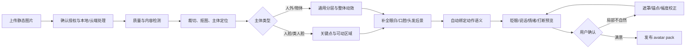
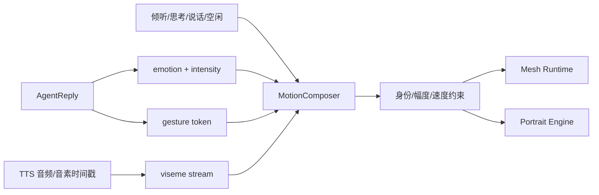
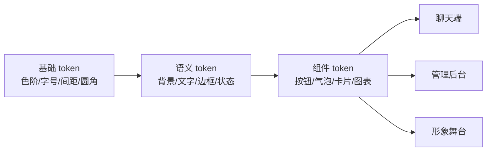

# 02 形象与人设

> 文档类型：Active 真源（按功能合并）｜最后更新：2026-09-15
> 本文档由下列原编号文档于 2026-09-15 合并而成，原文完整保留、标题降一级；历史版本见 git 记录与 `docs/history/历史阶段归档.md`。


---

## 伴侣形象与角色系统（原编号 07（含 08 静态图动态化、Live2D 接入））

> 项目代号：**Aria**（伴侣中枢 / Companion Hub）
> 文档版本：v1.2（2026-08-27）
> 目标：建立一个能长期相处、跨 Live2D/VRM 保持一致、并与人格和情绪系统自然联动的伴侣形象。
> **实现状态**：AvatarStore v1、内置种子包、形象实例、Persona 默认绑定、Admin/Chat 选择和自定义静态立绘导入已落地；Live2D ZIP 安全导入、受许可 Cubism Web Runtime 动态加载、真实模型预览以及 viseme/说话/情绪/表情/动作控制已接通。VRM、参数化定制、服装系统、AI 概念图生成和 Tauri 透明桌宠仍为后续。

---

### 1. 形象中心：典型形象与自定义


系统不预设伴侣必须是某一种性别、画风或人类外形。用户首先选择典型形象，也可以创建自己的专属形象；更换形象时人格、关系状态、对话历史和记忆全部保持不变。

#### 1.1 首批典型形象

| ID | 名称 | 形象方向 | 适配重点 |
|---|---|---|---|
| `warm-daily` | 温柔日常 | 成年女性、温暖生活感 | 共情、日常陪伴、柔和动作 |
| `wise-partner` | 知性伙伴 | 成熟专业的成年女性/男性变体 | 工作陪伴、清晰表达、克制动作 |
| `sunny-youth` | 阳光青年 | 成年青年、轻松有活力 | 鼓励、运动提醒、明快动作 |
| `future-neutral` | 中性未来 | 成年、中性化、轻科技感 | 科技桌面、抽象身份偏好 |
| `healing-spirit` | 治愈精灵 | 明确非人形的治愈生物 | 低压力陪伴、无恋爱外观预设 |
| `light-core` | 光核助手 | 抽象光球/机器人 | 极简、低资源、隐私状态可视化 |

“典型”只描述视觉和动作倾向，不自动改变人格。用户可以把温柔日常外观与理性人格组合，也可以让光核助手使用亲密陪伴语气。

#### 1.2 自定义入口

1. **参数化创建**：从典型模板复制，调整发型、肤色、眼睛、服装、配件、体型、色板和舞台；
2. **上传 Live2D**：导入 `.model3.json` 及本地资源，由向导映射表情、参数、动作和触摸区域；
3. **导入 VRM**：读取 VRM 元数据、BlendShape/Expression、骨骼和许可证；
4. **从立绘创建**：上传用户拥有权利的静态图片，自动生成可眨眼、呼吸、说话的 L1 动态伴侣，并可升级到神经 2.5D 或导出 Live2D 精修包；详见本文档「静态图片动态化（暂缓）」章节；
5. **AI 辅助设计**：用文字描述、色板和可选参考图生成多版概念图；生成前明确本地/云端路径和参考图授权，选中后仍进入静态形象或人工分层/建模流程；
6. **静态/轻量形象**：PNG/WebP 立绘加呼吸、眨眼和简单口型，作为低成本入口；
7. **形象包导入**：安装经过 Schema、资源、许可证和安全检查的本地形象包。

### 2. 默认示例形象：Aria 日常


下列设定仅作为内置 `warm-daily` 示例包和建模参考，不是系统固定外观：

- **年龄感**：明确成年，视觉年龄约 24～28 岁；
- **第一印象**：温柔、可靠、安静，有生活感但不过度居家化；
- **识别点**：桃粉色短发、琥珀棕眼睛、不对称花形发夹、小型星芒吊坠；
- **主服装**：奶油色针织开衫、灰粉色高领上衣、浅米色长裤；
- **科技感**：只藏在发夹的微弱紫青光效和交互反馈里，不采用机械耳、全息装甲等强符号；
- **轮廓原则**：短发、开衫和发夹在小尺寸桌面宠物中仍能快速辨认。

人格与记忆属于 `persona_id`，实际形象实例属于 `avatar_instance_id`，其来源模板/导入包为 `avatar_pack_id`；三者可独立替换。

### 3. 角色核心与模板约束

默认 Aria 示例形象服务以下五个特质；其他典型形象可拥有不同视觉语言，但都必须提供完整的中性、积极、关切与拒绝表达：

| 特质 | 视觉表达 | 行为表达 |
|---|---|---|
| 温柔 | 暖眼色、柔和曲线、低饱和服装 | 眼神停留、轻微点头、动作不过快 |
| 聪慧 | 简洁整齐、不过度装饰 | 思考时视线轻移，不用夸张问号动画 |
| 可靠 | 稳定站姿、成年服装语言 | 回应前有自然听取姿态，承诺类表达更克制 |
| 亲近 | 针织材质、暖色小配件 | 熟悉后增加微笑、靠近和专属动作，而非暴露度变化 |
| 自主 | 不始终迎合、不永远微笑 | 有平静、担心、疲惫、认真等中性情绪 |

应避免“幼态外观＋亲密伴侣语境”的冲突，因此不使用校服、儿童比例、过度稚嫩声线或含混年龄设定。

### 4. 视觉 DNA

#### 4.1 固定识别元素

视觉 DNA 属于**具体形象实例**，不是全系统强制。某个实例跨服装、主题和 2D/3D 版本时应保留：

1. 桃粉短发的长度与侧分轮廓；
2. 左右不对称的花形发夹；
3. 琥珀棕虹膜和柔和上挑高光；
4. 星芒/水滴形小吊坠；
5. 奶油、灰粉为人物基础色，紫青只作为“中枢连接”点缀。

#### 4.2 色板

```text
Hair Light   #F2B6AA    Hair Shadow #C9827D
Eye Amber    #9C653F    Skin         #F7D8CA
Cream        #F3EEE5    Dusty Rose   #B97679
Violet Link  #9A86D2    Cyan Link    #75D8D7
Line Warm    #5F4642
```

人物色板不随 UI 主题整体换色。主题只影响舞台背景、轮廓光和少量发夹光效，保证角色身份稳定。

### 5. 参数化定制与服装系统

#### 5.1 参数化定制

典型人形模板建议开放以下受控槽位：

| 分类 | 可选项 | 规则 |
|---|---|---|
| 身份呈现 | 女性、男性、中性、自定义称谓 | 与人格称谓分开配置 |
| 肤色/面部 | 预设肤色、脸型、眉眼、年龄感 | 人形模板只提供明确成年选项 |
| 发型 | 长度、轮廓、刘海、主辅色 | 避免穿模组合，模板声明兼容矩阵 |
| 体型 | 身高感、肩宽、整体比例 | 不使用精确身体评分或亲密度解锁 |
| 服装 | 上装、下装、外套、鞋、配件 | 许可证和遮挡层兼容检查 |
| 识别物 | 发饰、眼镜、吊坠、科技灯效 | 至少保留一个稳定识别点 |
| 舞台 | 背景、环境光、粒子 | 与主题系统联动 |

参数化编辑只组合已审核资产，不允许注入 CSS/JS 或远程资源。

#### 5.2 服装系统

v1 控制在三套，避免原画和建模范围膨胀：

| 服装 | 场景 | 设计 |
|---|---|---|
| `daily` 日常 | 默认、聊天、工作陪伴 | 奶油针织开衫 + 灰粉上衣 + 浅色长裤 |
| `relaxed` 放松 | 夜间、故事、音乐 | 柔软宽松家居针织，但保持得体和成年感 |
| `outing` 外出 | 节日、纪念日、天气话题 | 简洁长外套/连衣裙，保留发夹和吊坠 |

服装变化由用户选择、日程或明确的节日规则触发，不允许模型自行购买/生成未审核服装。亲密度变化主要通过动作、语气和互动距离表达，不通过服装暴露程度表达。

### 6. 跨形象表情语义

采用“通用语义 + 形象实现 + 强度”，避免核心逻辑依赖某张人脸。人形可以通过眉眼嘴表达；精灵可通过耳朵、尾巴和光效；光核可通过形变、颜色和运动表达。

| 基础情绪 | 眉 | 眼 | 嘴 | 推荐强度 |
|---|---|---|---|---|
| `neutral` 平静 | 自然 | 正常睁眼 | 微闭/轻笑 | 0～0.5 |
| `happy` 开心 | 稍抬 | 弯眼/明亮 | 开口笑 | 0.3～1 |
| `tender` 温柔 | 内侧微抬 | 半弯、柔和 | 小幅微笑 | 0.2～0.8 |
| `shy` 害羞 | 轻收 | 视线侧移 | 小口/抿嘴 | 0.2～0.7 |
| `concerned` 担心 | 内侧上抬 | 轻垂 | 微张/下压 | 0.2～0.8 |
| `sad` 难过 | 内侧上抬 | 垂眼 | 下压 | 0.2～0.8 |
| `angry` 不悦 | 内侧下压 | 聚焦 | 轻抿 | 0.2～0.6 |
| `surprised` 惊讶 | 上抬 | 睁大 | O 形 | 0.3～0.9 |
| `sleepy` 困倦 | 放松 | 半闭 | 松弛 | 0.2～0.8 |

修饰层包括：脸红、泪光、呼吸、发夹光效、眼神目标。`angry` 默认上限 0.6，避免小事件触发夸张愤怒。

### 7. 跨形象动作语义

#### 7.1 常驻微动作

- 呼吸：4～6 秒一周期，幅度非常小；
- 眨眼：随机 3～7 秒，避免机械固定间隔；
- 视线：优先看向消息区域/用户指针，不持续正视用户；
- 重心：20～40 秒轻微调整一次；
- 头发和衣摆：跟随头部的低幅物理摆动。

#### 7.2 受控动作词表

| token | 动作 | 使用场景 | 冷却 |
|---|---|---|---|
| `nod` | 轻点头 | 理解、确认 | 3s |
| `wave` | 小幅挥手 | 回家、开始会话 | 30s |
| `lean_in` | 轻微靠近 | 认真倾听、温柔回应 | 10s |
| `look_aside` | 视线侧移 | 思考、害羞 | 5s |
| `hand_heart` | 手放胸前 | 感谢、纪念日 | 60s |
| `stretch` | 轻伸展 | 久坐提醒、早晨 | 10min |
| `comfort` | 双手轻合/向前 | 安慰 | 30s |
| `small_clap` | 轻拍手 | 祝贺 | 30s |

避免高频摇晃、持续跳跃、突然贴脸和每句话都触发动作。对话中动作占用率建议低于 30%。

### 8. 关系变化如何体现在形象中

关系成长应细微且可逆：

```text
陌生/初识：标准距离、动作克制、较少主动注视
熟悉：微笑概率上升、记住用户习惯、偶尔挥手/轻靠近
亲密：专属问候动作、纪念物配件、更多自然安静共处
用户不适或连续忽略：恢复距离、降低动作和主动注视
```

不得使用“亲密度不足就冷漠”“付费/互动解锁身体部位”等操纵性设计。用户可关闭关系驱动的视觉变化。

### 9. Live2D 分层与参数

#### 9.1 原画建议分层

```text
Head
├─ Face base / ears / nose shadow
├─ Brows L/R
├─ Eyes L/R: white, iris, pupil, highlight, upper/lower lid
├─ Mouth: upper/lower lip, oral cavity, teeth, tongue
├─ Hair: back, side L/R, front groups, loose strands
└─ Accessories: flower clip base, petals, light core
Body
├─ Neck / torso / shoulders / arms / hands
├─ Inner blouse: collar, body, sleeves
├─ Cardigan: body, sleeves, pockets, buttons
├─ Necklace: chain L/R, pendant
└─ Lower body / shoes（全身模式需要）
Effects
├─ Blush / tears / face shadow
├─ Accent glow
└─ Optional particles
```

最低建议 120～180 个绘制图层；脸、头发、上半身优先，v1 可先制作胸像减少成本。

#### 9.2 参数建议

| 参数 | 范围/说明 |
|---|---|
| `ParamAngleX/Y/Z` | 头部三轴；X ±30，Y ±20，Z ±15 |
| `ParamBodyAngleX/Y/Z` | 身体低幅跟随 |
| `ParamEyeBallX/Y` | 眼球追踪，限制边缘停留 |
| `ParamEyeLOpen/ROpen` | 独立眨眼和笑眼 |
| `ParamMouthOpenY/Form` | TTS 音量 + 嘴形分类 |
| `ParamBrowLY/RY/Angle` | 情绪混合 |
| `ParamBreath` | 空闲呼吸 |
| `ParamCheek` | 脸红强度 |
| `ParamAccentGlow` | 连接、思考、隐私路由提示 |

发夹光效可以承载系统语义：青色表示本地处理，紫色表示普通思考，琥珀表示等待/降级，红色只用于明确系统故障且不应频繁闪烁。

### 10. 口型和语音同步

v1 使用音量包络驱动 `MouthOpenY`，并平滑处理攻击/释放；不要直接逐帧映射，否则嘴部会抖动。后续升级为 5～8 类中文 viseme：

```text
A/啊  I/衣  U/乌  E/诶  O/哦  closed  breath  smile
```

表情和口型叠加时，嘴形负责发音，`MouthForm` 只提供情绪倾向。打断发生后 100～200ms 内停止口型，先回到倾听表情，再开始识别。

### 11. 触摸与交互边界

| 区域 | 默认反馈 |
|---|---|
| 头部/发夹 | 轻微惊讶→温柔或害羞；有冷却 |
| 手部 | 挥手/轻点头 |
| 服装配件 | 简短介绍主题或纪念物 |
| 背景 | 切换专注/互动模式，不触发身体反馈 |

身体敏感区域不设计点击热区。触摸反馈可关闭，且不会影响关系状态或核心功能。

### 12. 形象能力契约与降级

核心只发送通用语义，不假设所有形象都有手、脸或嘴：

```text
emotion:tender + intensity:0.6
gesture:comfort
speech:viseme-stream
```

运行时读取能力并降级：`comfort → nod → idle`；无嘴形的光核助手把 viseme 映射为低幅脉冲；静态立绘把动作映射为轻微位移或完全忽略。缺失能力不得导致回复失败。

### 13. 形象包格式

```jsonc
{
  "schema_version": 1,
  "avatar_pack_id": "aria-live2d-default",
  "archetype": "warm-daily",
  "name": "Aria 日常",
  "engine": "live2d",
  "model": "model3.json",
  "manifest": {
    "emotions": ["neutral", "happy", "tender", "shy", "concerned", "sad", "angry", "surprised", "sleepy"],
    "gestures": ["nod", "wave", "lean_in", "look_aside", "hand_heart", "stretch", "comfort", "small_clap"],
    "outfits": ["daily", "relaxed", "outing"],
    "touch_regions": ["head", "hand", "accessory"],
    "supports_viseme": true,
    "fallbacks": { "comfort": "nod", "hand_heart": "tender" },
    "customizable_slots": ["hair", "eyes", "outfit", "accessory", "palette"]
  },
  "license": {
    "author": "...",
    "usage": "personal",
    "attribution": "...",
    "source_hash": "sha256:..."
  }
}
```

形象包安装时校验 manifest、资源路径、大小和许可证；禁止执行脚本或从远程 URL 加载未知资源。

### 14. 数据模型

```sql
CREATE TABLE avatar_pack (
  id TEXT PRIMARY KEY,
  name TEXT NOT NULL,
  archetype TEXT NOT NULL,
  engine TEXT NOT NULL CHECK (engine IN ('static','live2d','vrm','abstract')),
  manifest JSONB NOT NULL,
  content_hash TEXT NOT NULL,
  license JSONB NOT NULL,
  built_in BOOLEAN DEFAULT false,
  installed_at TIMESTAMPTZ DEFAULT now()
);

CREATE TABLE avatar_instance (
  id UUID PRIMARY KEY,
  owner TEXT NOT NULL DEFAULT 'local-user',
  name TEXT NOT NULL,
  pack_id TEXT NOT NULL REFERENCES avatar_pack(id),
  customization JSONB NOT NULL DEFAULT '{}',
  voice_profile_id TEXT,
  theme_id UUID,
  version INT NOT NULL DEFAULT 1,
  status TEXT NOT NULL DEFAULT 'active',
  created_at TIMESTAMPTZ DEFAULT now()
);

CREATE TABLE persona_avatar_binding (
  persona_id TEXT NOT NULL,
  avatar_instance_id UUID NOT NULL REFERENCES avatar_instance(id),
  is_default BOOLEAN DEFAULT false,
  PRIMARY KEY (persona_id, avatar_instance_id)
);
```

形象实例只保存外观和呈现配置，不复制人格或记忆。切换形象是一次绑定更新，并广播 `avatar.changed`。

### 15. 形象中心 API

| 方法 | 路径 | 说明 |
|---|---|---|
| GET | `/api/v1/avatars/archetypes` | 典型形象和筛选项 |
| GET | `/api/v1/avatars/packs` | 已安装及可用形象包 |
| POST | `/api/v1/avatars/packs/import` | 本地导入并执行安全/许可证校验 |
| POST | `/api/v1/avatars/instances` | 从模板或包创建用户实例 |
| POST | `/api/v1/avatars/concepts/generate` | 可选 AI 概念图生成；明确隐私路由，不直接发布为运行时模型 |
| PATCH | `/api/v1/avatars/instances/{id}` | 保存参数化外观、服装、语音和主题绑定 |
| POST | `/api/v1/avatars/instances/{id}/validate` | 能力、资源、性能和许可证检查 |
| POST | `/api/v1/avatars/instances/{id}/preview` | 在隔离预览端加载，不改变当前形象 |
| POST | `/api/v1/avatars/instances/{id}/apply` | 应用形象，保留人格和记忆 |
| DELETE | `/api/v1/avatars/instances/{id}` | 删除自定义实例；当前实例不可直接删除 |

### 16. 自定义资源安全与授权

- 只接受白名单扩展名和声明内文件，拒绝路径穿越、符号链接、可执行文件和脚本；
- 解压前检查文件数、单文件大小、总大小和压缩比，防止压缩炸弹；
- Live2D/VRM 在隔离预览上下文加载，限制网络、CPU、GPU 和内存；
- 自动读取 VRM/模型许可证，要求用户确认拥有使用权；许可证不明时仅允许本机私用且明确警告；
- 上传图片移除 EXIF/定位信息；不自动上传云端处理；
- 删除自定义实例时清理缩略图、缓存、派生资源和备份索引。

### 17. 制作路径与成本控制

推荐分三步：

1. **验证期**：内置 2 个轻量典型包（静态/抽象）和导入现有 Live2D，先验证形象切换与能力降级；
2. **模板期**：提供温柔日常、阳光青年、治愈精灵、光核助手 4 类，覆盖人形/非人形与轻重运行时；
3. **自定义期**：参数化槽位、Live2D/VRM 导入向导、隔离预览、授权和性能检查；
4. **完整期**：增加更多模板、服装组件、从立绘创建辅助和跨 2D/3D 对应资产。

不要在文字/记忆核心尚未通过 M1.5 闸门前投入高成本定制。先用静态立绘验证一周，再定稿分层原画，可显著降低返工。

### 18. 验收标准

- 缩小到 160px 高仍能凭发型、发夹和配色识别；
- 连续待机 30 分钟不出现高频重复动作或明显机械循环；
- 9 种基础表情盲测识别率 ≥ 85%，相邻的 tender/happy 可允许部分混淆；
- 情绪切换 200～400ms，避免瞬间换脸；
- 口型与首音频同步偏差 < 100ms，打断后 < 200ms 停止；
- Live2D 胸像端稳定 60fps，低性能模式 ≥ 30fps；
- 形象、服装、触摸反馈不含幼态化、过度性化或操纵性解锁；
- Live2D 与 VRM 版本保持视觉 DNA、情绪词表和动作语义一致。
- 至少覆盖 4 种显著不同的典型形象，其中包含不同成年性别呈现、人外和抽象形象；
- 切换形象后 persona、关系状态、会话和记忆 ID 均不改变；
- 缺少某动作/表情/viseme 能力时正确降级，核心对话成功率不受影响；
- 导入恶意路径、脚本、超大资源、压缩炸弹或许可证缺失包时安全拒绝；
- 自定义形象从选择模板到预览不超过 5 个主要步骤。

---

### 08 静态图片动态化（暂缓）

> 原文：`08-静态图片动态化`（08 静态图片动态化）。2026-09-15 按功能并入本文档，内容完整保留、标题降一级。

> 项目代号：**Aria**（伴侣中枢 / Companion Hub）  
> 文档版本：v1.0（2026-08-16）  
> 目标：用户上传一张拥有使用权的静态图片，系统在本地优先完成检测、修复、动作适配和预览，生成可实时眨眼、呼吸、说话和轻微转头的动态伴侣。

---

#### 1. 能做到什么

单张图片缺少被遮挡区域、侧脸、口腔、后脑和身体背面的真实信息，因此需要按质量分层，不承诺“一键得到专业 Live2D”。

| 等级 | 产物 | 自动化程度 | 典型能力 | 适用 |
|---|---|---:|---|---|
| L0 静态增强 | 分离背景的立绘 | 全自动 | 呼吸缩放、整体漂浮、光效 | 任意人物/人外/物体 |
| L1 轻量 2D | 浏览器网格变形角色 | 高 | 眨眼、眼神、口型、轻微点头、呼吸 | 插画、人脸清晰的半身图 |
| L2 神经 2.5D | 单图肖像驱动运行时 | 高，需 GPU | 连续表情、说话、较自然小幅转头 | 写实或主流插画肖像 |
| L3 半自动 Live2D | 分层 PSD + 建模工程 | 中 | 稳定大角度、独立头发/服装物理、精细动作 | 用户愿意校正或交给建模师 |

默认先生成 L1；检测到兼容 GPU 时可提供 L2 预览。L3 是精修升级路线，不应伪装成全自动能力。

#### 2. 用户流程



首个可用结果目标控制在 1～3 分钟；GPU 神经预处理可以后台继续优化，不能阻塞先使用 L0/L1。

#### 3. 输入要求与质量评分

推荐输入：

- 正面或轻微 3/4 角度，脸部无遮挡；
- 至少 1024px，人物占画面 40% 以上；
- 眼睛和嘴巴边界清晰；
- 背景与人物有足够区分；
- 半身图优于只包含头部的极近特写；
- 用户确认拥有图片和角色的使用权。

系统输出 `animation_readiness_score`，由分辨率、清晰度、脸角度、遮挡、主体完整度、背景复杂度和风格兼容度组成。低分时指出可行动原因，例如“左眼被头发完全遮挡”，而不是只报失败。

#### 4. 离线制作流水线

##### 4.1 安全接收

1. 解码后重新编码 PNG/WebP，移除 EXIF、ICC 异常块和隐写型附加数据；
2. 限制像素、文件大小和解压比，拒绝畸形图片；
3. 计算内容哈希，原图与派生资源使用同一 asset lineage；
4. 默认本地处理；若使用云端补画/生成，必须单独展示将发送的图片和 provider。

##### 4.2 主体检测与分割

- 检测人脸、身体框、面部关键点和主体类型；
- 使用图像分割得到人物/头发/面部/服装/背景候选遮罩；
- 人脸失败时退化为通用主体，不阻止非人形角色制作；
- 允许用户用“点击主体、涂抹保留/删除”修正遮罩。

##### 4.3 可动区域

人形/类人形最低区域：左右眼、左右眉、嘴、脸、前发、后发、颈部、上身和背景。L1 不要求真实 PSD 分层，而是建立局部 mesh、控制点、遮罩和绘制顺序。

```jsonc
{
  "regions": {
    "face": { "mesh": "face.bin", "z": 40 },
    "eye_l": { "mask": "eye_l.png", "z": 50 },
    "eye_r": { "mask": "eye_r.png", "z": 50 },
    "mouth": { "mask": "mouth.png", "z": 55 },
    "hair_front": { "mask": "hair_front.png", "z": 60 },
    "body": { "mesh": "body.bin", "z": 20 }
  }
}
```

##### 4.4 遮挡补全

眼睛闭合、嘴巴张开或头部轻转时会暴露原图没有的像素。系统生成最小必要补丁：眼白/虹膜、闭眼线、口腔、牙齿、脸部边缘、头发后方和透明背景。

补全必须保守：只用于被遮挡的小区域，禁止偷偷重画整张脸。所有补丁均可开关和重生成；用户能对比原图。

#### 5. L1：浏览器轻量 2D 运行时

L1 是推荐 MVP，因为稳定、可控、能在普通设备运行：

- Canvas/WebGL 渲染原图纹理；
- 基于 landmark 和局部三角网格做形变；
- 眼睛使用遮罩压缩/眼睑曲线实现眨眼；
- 嘴部使用 5～8 个预生成形态或局部 warp；
- 身体做 4～6 秒低幅呼吸；
- 前发、饰品和衣摆使用少量弹簧骨；
- 头转限制在约 ±8～12°，超过即钳制，避免露出不存在的侧脸。

L1 不生成逐帧视频，因此可以接受实时 `emotion/gesture/viseme` 控制，并能在语音打断时立即停口型。

#### 6. L2：神经 2.5D 肖像驱动

对兼容人脸，可使用“源图 + 动作模板/驱动参数”生成连续肖像帧。推荐把动作模板预先制作成本地、无身份信息的眨眼、点头、说话和情绪模板；用户图片只作为 source。

```text
emotion + gesture + viseme
  → MotionComposer 合成标准驱动参数/短模板
  → PortraitAnimationEngine(source, driving)
  → 连续 RGBA 帧
  → WebRTC/本地纹理流
```

工程候选为 LivePortrait 一类的肖像 animation/retargeting 引擎；音频直驱视频可参考 SadTalker 类路线。但这类模型更适合 GPU 服务，必须验证插画风格、长时间一致性、延迟和许可证后再选型。

为了实时交互，不能每句话生成完整 MP4 再播放。应当：

- 初始化时缓存 source appearance 特征；
- 空闲/眨眼/倾听使用短循环或参数模板；
- TTS 到来后按 100～200ms 小段生成；
- 维护 300～600ms 播放缓冲；
- 打断时丢弃未播放帧并切回倾听模板；
- GPU 不足或延迟升高时无缝退回 L1。

#### 7. 音频、情绪和动作驱动



动作合成器负责冲突：说话口型优先于微笑嘴形；打断优先于所有手势；眨眼与大幅惊讶眼睛不能同时发生；头部和身体动作有速度/加速度上限。

#### 8. L3：升级为 Live2D

Live2D Cubism 的生产流程需要分层素材和人工建立 deformers/parameters。系统可以自动生成“建模准备包”，但不能保证直接得到 `.moc3`：

1. 输出建议分层 PSD：眼睛、眉、嘴、脸、头发、身体、服装、配件；
2. 标记需要人工补画的区域和置信度；
3. 生成参数映射建议及表情/动作清单；
4. 在向导中让用户或建模师校正绘制顺序、锚点和遮挡；
5. 经 Cubism Editor 建模和导出后，再作为标准 Live2D 包导回系统。

官方 Cubism 工作流本身要求为建模准备分层 PSD，因此“单张合并 PNG 一键变专业 Live2D”不能作为 v1 验收承诺。

#### 9. 运行时接口

统一输出一个 `generated-portrait` 形象包：

```jsonc
{
  "engine": "portrait2d",
  "tier": "L1",
  "source_asset_id": "asset_xxx",
  "capabilities": {
    "emotions": ["neutral", "happy", "tender", "concerned", "surprised"],
    "gestures": ["nod", "look_aside", "lean_in"],
    "visemes": ["A", "I", "U", "E", "O", "closed"],
    "head_yaw_max": 10,
    "supports_interrupt": true
  },
  "fallback": "static-breathe"
}
```

核心认知层不关心 L1/L2/L3，只发通用动作；运行时根据能力表映射或降级。

#### 10. 任务状态与 API

```text
uploaded → inspecting → segmenting → repairing → rigging → preview_ready
  → needs_user_fix / published / failed / cancelled
```

| 方法 | 路径 | 说明 |
|---|---|---|
| POST | `/api/v1/avatars/from-image` | 上传并创建动态化任务 |
| GET | `/api/v1/avatars/jobs/{id}` | 阶段、进度、质量分和可行动问题 |
| GET | `/api/v1/avatars/jobs/{id}/preview` | 隔离预览会话 |
| PATCH | `/api/v1/avatars/jobs/{id}/masks` | 用户修正主体/区域遮罩 |
| PATCH | `/api/v1/avatars/jobs/{id}/rig` | 校正锚点、幅度和映射 |
| POST | `/api/v1/avatars/jobs/{id}/regenerate` | 仅重做指定补丁/阶段 |
| POST | `/api/v1/avatars/jobs/{id}/publish` | 生成用户 avatar instance |
| POST | `/api/v1/avatars/jobs/{id}/export-live2d-kit` | 导出分层和人工建模任务包 |

任务可取消、可重入；每阶段产物按内容哈希缓存。失败不得留下半发布的形象实例。

#### 11. 隐私、授权与滥用边界

- 上传时确认图片来源和授权；真人照片需声明本人或获得当事人许可；
- 默认本地处理，云端模型按阶段逐项授权；
- 原图、补丁、特征和预览帧属于 L2 视觉资产，不进入对话记忆或日志；
- 禁止将该能力用于冒充真人、规避同意或制作欺骗性身份；真人形象显示“用户自定义”来源标识；
- 日志只记录 asset/job ID、模型版本、耗时和错误码；
- 删除任务时清除原图、特征缓存、补丁、预览和派生形象；备份恢复重放删除台账；
- 第三方模型权重、代码和生成产物的许可证必须单独审查，不能只看仓库代码许可证。

#### 12. 验收标准

| 指标 | L1 目标 | L2 目标 |
|---|---:|---:|
| 首次预览时间 | P90 ≤ 3 分钟 | P90 ≤ 8 分钟（含模型预热除外） |
| 交互帧率 | 桌面 ≥ 60fps，低性能 ≥ 30fps | GPU 桌面 ≥ 24fps |
| 动作到画面延迟 | P90 ≤ 100ms | P90 ≤ 400ms |
| 口型停下 | 打断后 ≤ 200ms | 打断后 ≤ 500ms |
| 身份稳定性 | 关键帧无明显五官漂移 | 连续 10 分钟无渐进漂移 |
| 故障降级 | 任意阶段可回退静态呼吸 | 自动退回 L1，不中断对话 |

人工验收另检查：闭眼是否穿帮、张嘴是否露洞、发丝是否撕裂、背景边缘是否闪烁、头转是否暴露缺失区域、情绪是否改变身份。

#### 13. 分阶段实现

| 阶段 | 内容 |
|---|---|
| M4A.1 | L0/L1：安全上传、抠图、质量评分、面部关键点、呼吸/眨眼/5 类口型、预览校正 |
| M4A.2 | 分区遮罩、补丁生成、头部轻转、头发/饰品物理、非人形整体动效 |
| M5 | L2 GPU 引擎、动作模板流式生成、自动降级和多终端纹理流 |
| M5+ | 分层 PSD/建模准备包、半自动 Live2D 工作台和更多风格适配 |

---

### Live2D 运行时接入契约

> 原文：`Live2D运行时接入`（Live2D 运行时接入）。2026-09-15 按功能并入本文档，内容完整保留、标题降一级。

> 文档类型：Active 专项设计
> 最后更新：2026-08-27
> 当前状态：Web 最小壳与 Tauri 透明桌宠代码已落地，包含签名情绪/动作/口型联动、设备身份下的迷你输入与可选 TTS 播报、多屏恢复和隐藏资源释放；M2 延迟与桌宠真机性能仍是发布门槛。

形象中心可以安全导入 Live2D ZIP 模型包，也支持同时包含 FREE/PRO、`.cmo3`、`.can3` 和说明文件的官方发行包。检测到多个 `.model3.json` 时优先选择 PRO runtime；只提取选中 runtime 下的白名单资源，工程源文件不会落盘。模型包不允许符号链接、路径穿越或外部网络引用。

Live2D Cubism Core 受官方许可约束，本仓库不直接分发。macOS 本机安装器默认把已获许可的运行时放到 `~/Library/Application Support/AriaCompanionHub/live2d-runtime/current`；也可以通过 `ARIA_LIVE2D_RUNTIME_DIR` 指向其他目录。服务启动后，聊天端和 Admin 预览会自动从 `/api/v1/avatar-live2d-runtime/runtime.js` 加载它，无需重新构建前端。

`runtime.js` 必须注册以下全局适配器：

```js
window.AriaLive2DRuntime = {
  async mount(canvas, { modelUrl, transparent }) {
    // 使用已获许可的 Cubism Web Core + Framework 加载 modelUrl 并绘制到 canvas。
    // 禁止模型包发起外部网络请求。
    return {
      setLipSync(value) {
        // 接收 0..1 的 TTS viseme / 音量值，驱动模型 LipSync 参数。
      },
      setSpeaking(active) {
        // 进入或退出说话状态，可触发模型自带的说话动作。
      },
      setEmotion(emotion) {
        // 将 neutral / happy / sad / angry / surprised / thinking / concerned
        // 映射到模型已有的表情和动作；不存在时安全忽略。
      },
      setExpression(name) {
        // 播放回复控制块显式指定的表情。
      },
      playMotion(group, index) {
        // 播放模型包已有的动作组，不执行模型包中的脚本。
      },
      destroy() {
        // 释放 WebGL、纹理、监听器和模型资源。
      },
    };
  },
};
```

仓库中的 `integrations/live2d_web_runtime` 是基于官方 R5 Sample 改造的适配层。构建时需设置 `ARIA_CUBISM_SDK_ROOT`，其产物不会把 Core 提交到仓库。适配器负责画布缩放、模型加载完成检查、资源销毁和模型 URL 同源限制。聊天端会把 TTS viseme、说话状态、回复情绪、显式表情和 `animation` 动作指令转发给这些控制方法；模型没有对应能力时安全忽略。未配置运行时时，界面会显示“模型包校验通过，需安装官方 Cubism Web Core”，不会用 CSS 或假动画冒充 Live2D 渲染。

---

## 主题与视觉系统（原编号 06）

> 项目代号：**Aria**（伴侣中枢 / Companion Hub）  
> 文档版本：v1.1（2026-08-27）  
> 目标：让聊天端、管理后台、Live2D/VRM 场景保持一致又可个性化，并保证可读性、性能与升级兼容。

---

### 1. 主题选择与定制原型


首批内置主题：

| ID | 名称 | 定位 | 默认模式 |
|---|---|---|---|
| `midnight-violet` | 静夜紫 | 深色、安静、轻未来感，作为默认主题 | 深色 |
| `dawn-warm` | 晨曦暖 | 米白与暖桃色，适合白天陪伴 | 浅色 |
| `forest-mint` | 森林薄荷 | 深绿与薄荷色，降低视觉刺激 | 深色 |
| `pure-light` | 纯净明亮 | 高可读性的中性办公风格 | 浅色 |
| `system` | 跟随系统 | 根据操作系统浅色/深色偏好切换 | 自动 |

### 2. 功能范围

- 内置主题选择、浅色/深色/跟随系统；
- 按固定时间或日出日落定时切换；
- 实时预览，取消时完整恢复原主题；
- 自定义主色、中性色、背景、字体缩放、圆角、阴影、模糊和动效强度；
- 聊天端、管理后台、Tauri、PWA、Live2D 舞台背景同步；
- 每台终端可选择“跟随账户”或“仅本机覆盖”；
- 主题导出/导入、复制、重命名、删除和恢复默认；
- WCAG 对比度、色盲可辨识和减少动态效果检查；
- 升级时自动迁移旧 token，无法迁移则回退到安全默认主题。

主题只改变表现层，不能修改人格、模型、隐私策略、记忆内容或业务权限。

### 3. 主题优先级

```text
临时实时预览
  > 当前设备覆盖
  > 账户已发布主题
  > 跟随系统/定时规则
  > 产品默认主题
```

服务端保存账户主题和版本；本机覆盖保存于终端安全存储。首屏在加载应用脚本前读取极小的 bootstrap 值，避免浅深色闪烁。

### 4. Design Token 分层

主题禁止直接覆盖任意 CSS。采用三层 token：



示例：

```jsonc
{
  "schema_version": 1,
  "id": "midnight-violet",
  "name": "静夜紫",
  "mode": "dark",
  "tokens": {
    "color.bg.canvas": "#0B1020",
    "color.bg.surface": "#131A2B",
    "color.bg.elevated": "#1A2238",
    "color.text.primary": "#F5F7FF",
    "color.text.secondary": "#AEB8D0",
    "color.border.default": "#2A3551",
    "color.brand.primary": "#8B7CFF",
    "color.status.success": "#49C98B",
    "color.status.warning": "#F2B65B",
    "color.status.danger": "#F06A78",
    "radius.card": "16px",
    "radius.control": "10px",
    "effect.blur.panel": "12px",
    "motion.scale": 1,
    "font.scale": 1
  },
  "avatar_stage": {
    "background": "gradient-night",
    "ambient_tint": "#8B7CFF",
    "particle_intensity": 0.15
  }
}
```

代码只消费语义/组件 token，例如 `--color-text-primary`，不直接使用 `purple-500`，避免更换主题后语义错乱。

### 5. 可定制边界

| 能力 | 用户可调 | 限制 |
|---|---|---|
| 主色 | 是 | 自动生成 hover/active/focus，并检查对比度 |
| 页面/卡片背景 | 是 | 文字对比度不达标不得发布 |
| 字体 | 字号/字重/系统字体栈 | v1 不允许远程字体 URL，避免隐私和供应链风险 |
| 圆角/阴影/模糊 | 是 | 移动端根据性能自动限制模糊 |
| 动效 | 正常/减少/关闭 | `prefers-reduced-motion` 优先级最高 |
| 背景图片 | M4B 后 | 只允许本地上传，大小/格式限制并移除元数据 |
| 自定义 CSS/JS | 否 | 防止 XSS、布局破坏和升级不兼容 |

### 6. 主题编辑流程

```text
选择预设或复制主题
  → 实时预览草稿
  → Token Schema 校验
  → 对比度/色盲/动效/性能检查
  → 查看聊天、后台、告警、图表多场景预览
  → 保存草稿或发布版本
  → 终端收到 theme.updated
  → 加载失败自动回滚
```

预览至少覆盖：普通对话、代码块、记忆引用、表单、表格、折线图、成功/警告/错误、Focus、Disabled、空状态和 Live2D 舞台。

### 7. 自动切换

支持三种互斥模式：

1. `system`：跟随操作系统 `prefers-color-scheme`；
2. `schedule`：用户配置浅色/深色主题及切换时间；
3. `sun`：根据用户城市的日出日落切换，只保存粗粒度城市/时区，不要求精确定位。

免打扰时段不影响主题切换。切换采用 150～250ms 的颜色过渡；用户开启减少动态效果时立即切换。

### 8. 形象场景联动

主题可以提供舞台背景、环境光色、粒子强度和字幕样式，但不能覆盖模型核心材质或动作映射。主题切换时：

- Live2D/VRM 模型保持加载，避免重新初始化和闪烁；
- 仅更新舞台层和 UI overlay；
- 情绪色是短时状态覆盖，结束后返回主题基础色；
- 低性能设备自动关闭粒子、动态模糊和复杂背景。

### 9. 图表主题

管理后台图表不得只用红绿区分。每套主题必须提供至少 8 个可区分数据色，并结合线型、点型、纹理或标签。

```jsonc
{
  "chart.series": ["#8B7CFF", "#47B7F5", "#49C98B", "#F2B65B", "#F06A78", "#C98BEF", "#64D6C7", "#AAB4CC"],
  "chart.grid": "#2A3551",
  "chart.axis": "#AEB8D0",
  "chart.tooltip.bg": "#1A2238"
}
```

成功、警告、危险颜色是固定语义，不得因为主题审美互换含义。

### 10. 无障碍与验收

| 项目 | 标准 |
|---|---|
| 普通文字对比度 | WCAG AA ≥ 4.5:1 |
| 大号文字/图标 | ≥ 3:1 |
| Focus 指示器 | 与相邻颜色 ≥ 3:1，键盘操作始终可见 |
| 状态表达 | 不只依赖颜色，必须有图标或文字 |
| 字体缩放 | 80%～150%，120% 下核心页面不溢出 |
| 减少动态效果 | 系统偏好可覆盖主题设置 |
| 切换性能 | 已加载主题切换 P95 < 100ms；无明显闪白 |
| 故障恢复 | 非法/缺失 token 自动回退，页面仍可操作 |

CI 对所有内置主题运行关键组件截图测试、token 完整性检查和对比度检查。

### 11. 数据模型与 API

```sql
CREATE TABLE ui_theme (
  id UUID PRIMARY KEY,
  owner TEXT NOT NULL DEFAULT 'local-user',
  name TEXT NOT NULL,
  schema_version INT NOT NULL,
  version INT NOT NULL,
  status TEXT NOT NULL CHECK (status IN ('draft','published','archived')),
  definition JSONB NOT NULL,
  content_hash TEXT NOT NULL,
  built_in BOOLEAN DEFAULT false,
  created_at TIMESTAMPTZ DEFAULT now(),
  updated_at TIMESTAMPTZ DEFAULT now(),
  UNIQUE (owner, name, version)
);

CREATE TABLE ui_preference (
  owner TEXT PRIMARY KEY,
  theme_id UUID REFERENCES ui_theme(id),
  appearance_mode TEXT NOT NULL DEFAULT 'system',
  schedule JSONB,
  updated_at TIMESTAMPTZ DEFAULT now()
);
```

| 方法 | 路径 | 说明 |
|---|---|---|
| GET | `/api/v1/ui/themes` | 内置及用户主题列表 |
| POST | `/api/v1/ui/themes` | 创建主题草稿 |
| PUT | `/api/v1/ui/themes/{id}` | 更新草稿；已发布版本不可原地修改 |
| POST | `/api/v1/ui/themes/{id}/validate` | Token、对比度、资源和兼容性校验 |
| POST | `/api/v1/ui/themes/{id}/publish` | 发布新版本 |
| DELETE | `/api/v1/ui/themes/{id}` | 删除自定义草稿/归档版本 |
| GET/PUT | `/api/v1/ui/preferences` | 账户主题、模式和计划 |
| POST | `/api/v1/ui/themes/import` | 导入 JSON；严格 Schema 和大小限制 |
| GET | `/api/v1/ui/themes/{id}/export` | 导出不含本地资源正文的主题 JSON |

### 12. 实施安排

| 阶段 | 主题能力 |
|---|---|
| M1 | CSS 语义 token、静夜紫/纯净明亮、跟随系统、无闪烁启动 |
| M1.5 | 对比度与截图回归、字体缩放、减少动态效果 |
| M3B | 主题选择页、自定义、账户同步、Live2D 舞台联动（v1 已提前落地：内置三主题 + Admin「外观与主题」工作区 + Chat 实时同步） |
| M4B | 本机覆盖、多终端同步、本地背景资源、VRM 场景联动、导入导出 |

---

## 结构化回复与 Persona（原编号 20）

### 结论

P1 将模型的自然语言回复与机器控制信息拆开，同时保持现有文字客户端兼容。Persona 不再是
代码里的固定提示词，而是数据库中的不可变版本；草稿只有发布后才影响新回合，历史消息会记录
当时使用的 Persona 版本。

### AgentReply v1

模型先输出正常回复，末尾追加一个 `<aria_control>...</aria_control>` 控制块。服务端的流式过滤器
会跨 WebSocket chunk 识别标记，只广播可见文本。最终控制内容经过严格校验后写入
`message.decision_meta.agent_reply`，并通过 `reply.control` 单独广播。

契约标识为 `aria.agent-reply/1`，主要字段：

- `text`：字幕和持久化正文。
- `tts_text`：TTS 朗读文本，默认等于 `text`。
- `emotion`：受控情绪枚举。
- `expressions`：输出端可识别的表情名称。
- `actions`：`expression / animation / sound / picture` 扩展动作。
- `parse_status`：`structured` 或 `fallback`，便于观测模型协议遵循率。

若模型没有控制块、JSON 无效或字段越界，服务端保留标记前的正常文本并生成 neutral/default
降级结果。控制块不会进入字幕、TTS 或消息正文。

### Persona 版本

`persona_version` 保存不可变内容，`persona_pointer` 原子指向当前发布版本。首次连接数据库会建立
默认 Aria Persona。管理 API：

- `GET /api/v1/admin/personas/current`
- `GET /api/v1/admin/personas/versions`
- `POST /api/v1/admin/personas/validate`
- `POST /api/v1/admin/personas/versions`
- `POST /api/v1/admin/personas/versions/{version}/publish`
- `POST /api/v1/admin/personas/versions/{version}/rollback`

这些 API 与模型配置后台共用 `ARIA_ADMIN_TOKEN`。可视化入口是 `/admin/personas`。

#### Persona 与长期记忆的边界

P5 真实对话发现，同一 Persona 在不同会话可能对“自己”的稳定信息给出不同答案。这里不把身高、生日、过去明确说过的自我信息等运行时事实写死进 Persona：Persona 只负责身份、风格、关系和边界；会随对话形成、需要跨会话保持一致的信息应进入长期持久化记忆。

现有记忆模型主要面向“关于用户”的长期记忆，后续 P5 收口需要扩展记忆主体/归属，使记忆可以明确区分“用户”“助手自身”“共同关系/事件”等主体，再让聊天检索按主体注入。这样角色自身曾明确给出的稳定信息也能像用户偏好一样被持久化、纠错、冲突裁决和删除，而不是塞进 Persona 配置。

#### 现实能力边界

Persona 的角色设定也不能被当成现实可执行能力。ChatService 会额外注入运行时现实能力约束：

- 默认没有接入设备/工具动作时，只允许纯对话层面的转移话题；
- 不得建议“我们去训练场 / 后院 / 厨房”等系统无法实际参与的活动，也不得声称能触碰、移动现实物体；
- 只有运行时能力提供器明确返回“当前在线且已授权”的设备动作后，模型才可以据此提出现实行动建议；
- 例如客厅电视控制能力真实存在时，可以说“我们看会儿电视吧，我可以帮你打开电视”；设备未接入时不能这样承诺；
- 每轮实际暴露给模型的能力 ID 会进入 `decision_meta.runtime_capabilities`，便于 P5 排查越界建议。

#### 运行时一致性

Persona 发布后不仅要更新处理该管理请求的进程内快照，还必须让其他聊天 worker 在下一回合看到新版本。当前实现中：

- `PersonaStore.refresh()` 从数据库 `persona_pointer` 重新读取当前发布 Persona；
- ChatService 在每个新回合组装 system prompt 前刷新 Persona，因此长连接 WebSocket 不需要重连即可在下一轮使用新版本；
- `/api/v1/admin/personas/current` 与运行时元信息读取也刷新数据库指针，避免管理端与聊天端观察到不同版本；
- 每条助手消息继续在 `decision_meta.persona_version` 中记录生成时实际使用的版本，历史消息不会因新 Persona 发布而被改写。

公开运行时元信息接口 `GET /api/v1/meta/runtime` 返回当前 Persona 的版本、内容哈希和名称，聊天前端用它展示当前角色，而不是硬编码 `Aria`。

### Open-LLM-VTuber 映射

桥接默认启用 `structured_reply: true`，收齐 `reply.delta` 和 `reply.control` 后创建原生
`SentenceOutput`：`DisplayText` 使用字幕，`tts_text` 独立传给 TTS，表情、图片和音效写入
`Actions`。这保证输出语义正确，但首段语音需等待整轮完成。要求最低首字延迟时可关闭结构化模式，
退回 P0 的 token 流式管线。

### 扩展边界

新增输入方式仍进入 `InputEnvelope`；新增输出端消费 `AgentReply → OutputIntent`，不应直接解析
模型原文。动作类型新增时应升级 schema version，旧消费者继续忽略未知 WebSocket 事件。
