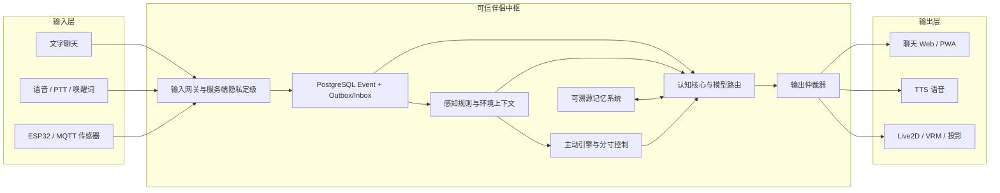
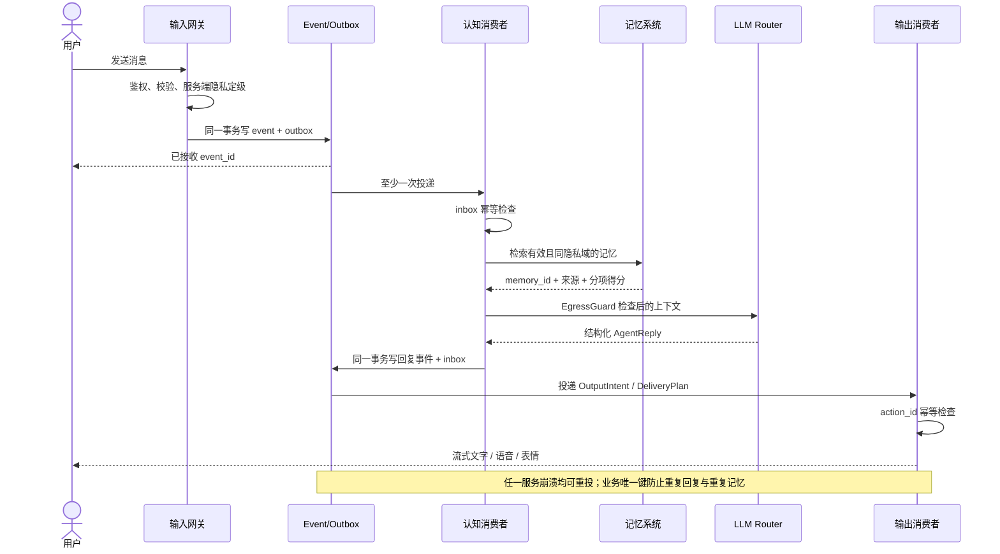
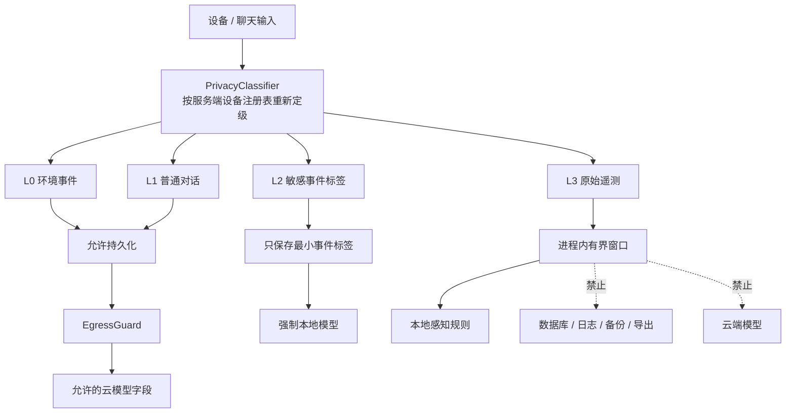
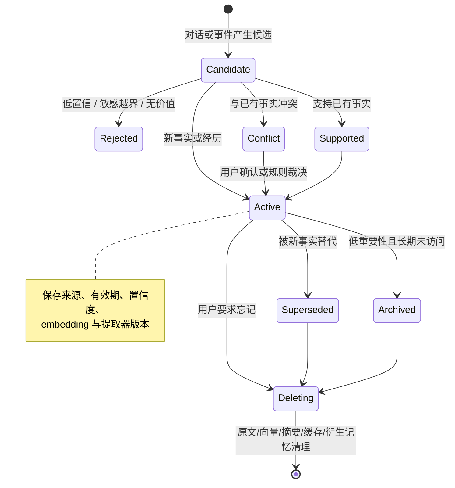
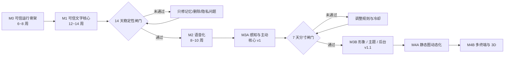

# 04 视觉示意与原型

> 文档类型：Prototype / 视觉参考
> 说明：用于表达信息层级、用户流程和视觉方向；协议、数据库和当前运行时行为以对应 Active 文档为准。
> 项目代号：**Aria**（伴侣中枢 / Companion Hub）  
> 文档版本：v1.0（2026-08-16）  
> 关联文档：[01-需求分析.md](./01-需求分析.md) | [02-功能设计.md](./02-功能设计.md) | [03-开发规划.md](./03-开发规划.md)

---

## 1. 产品界面概念图


这张图用于表达产品气质和信息层级，不是最终 UI 定稿。核心结构为：

- 左侧：会话、连接状态、模型/记忆/设备健康度；
- 中间：伴侣形象、主对话、快捷动作；
- 右侧：当前状态、相关记忆、隐私路由和主动互动；
- 关键原则：用户能看见“为什么这样回应、用了什么记忆、数据去了哪里”。

## 2. 系统总体架构



## 3. 一次对话如何可靠完成



## 4. 隐私分流



## 5. 记忆生命周期



## 6. 桌面端信息架构线框

```text
┌────────────────────────────────────────────────────────────────────────────┐
│ Aria 伴侣中枢                     本地连接 ●        隐私模式 ●        设置 │
├──────────────┬─────────────────────────────────────┬───────────────────────┤
│ 会话         │                                     │ 当前状态              │
│              │    Live2D / 陪伴视觉区              │ 平静 · 安静陪伴中     │
│ · 今天       │                                     │ 能量 72%              │
│ · 周末计划   ├─────────────────────────────────────┤                       │
│ · 工作复盘   │    用户：今天有点累                 │ 本轮相关记忆          │
│              │    Aria：那我们放慢一点……          │ · 最近工作压力较大    │
│ 系统状态     │                                     │ · 喜欢安静的故事      │
│ 模型  正常   │    [ 输入消息……                  ] │                       │
│ 记忆  正常   │    [音乐] [总结] [情绪记录]         │ 隐私路由：本地        │
│ 设备  5 台   │                                     │ 决策原因：用户主动对话│
├──────────────┴─────────────────────────────────────┴───────────────────────┤
│ 最近事件：21:30 对话开始 · 使用记忆 2 条 · 未调用云端 · 首包 620ms       │
└────────────────────────────────────────────────────────────────────────────┘
```

## 7. 分阶段交付路线


