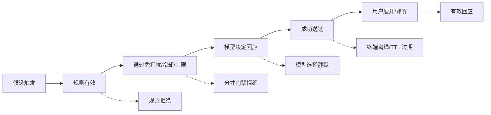
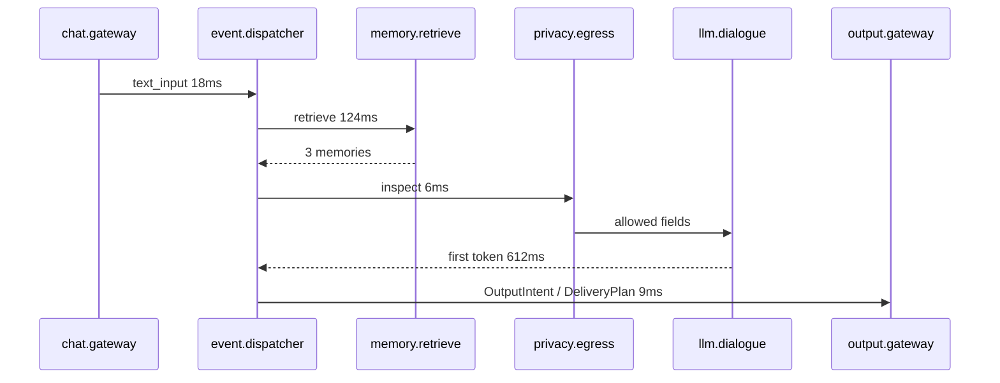

# 05 管理后台与可观测性

> 项目代号：**Aria**（伴侣中枢 / Companion Hub）  
> 文档版本：v1.2（2026-08-25）
> 目标：让单人维护者能在 5 分钟内回答“系统是否正常、为什么这样回应、钱花在哪里、记忆是否可靠、隐私是否守住”。

---

## 1. 管理后台概念图


概念图展示信息密度和视觉优先级，不代表最终图表库或精确文案。后台默认首页只展示可行动信息：异常、趋势、质量退化和可追踪链路。

## 2. 导航与权限

后台导航按稳定的业务领域组织，二级 Tab 负责具体工作流；Tab 写入 URL query，刷新和直链都必须恢复到相同工作区。尚无真实查询接口的页面必须明确显示“待接入真实数据”，不得用演示指标伪装完成度。

| 分组 | 一级模块 | 二级工作区 | 最低权限 |
|---|---|---|---|
| 概览 | 总览 | 运行概览、健康与告警、使用与成本、最近活动 | `viewer` |
| 伴侣核心 | 人格与表达 | 基本设定、表达风格、边界规则、动作映射、版本历史 | `viewer`；修改需 `admin` |
| 伴侣核心 | 记忆与历史 | 记忆库、质量分析、冲突处理、历史时间线、删除验证 | `admin` |
| 能力接入 | 模型与路由 | 模型服务、路由与能力、工具服务、语音服务 | `viewer`；修改需 `admin` |
| 能力接入 | 设备与授权 | 设备列表、配对授权、能力与通道、命令记录、健康诊断 | `operator`；授权变更需 `admin` |
| 运维治理 | 日志追踪 | 实时日志、Trace 查询、事件日志、性能分析、错误分析、告警记录 | `operator` |
| 运维治理 | 隐私与安全 | 隐私概览、数据流向、外发审计、操作审计、策略与验证 | `admin` |
| 运维治理 | 系统与维护 | 基础设置、身份与会话（含安全设置）、可观测性、存储与备份、升级与信息 | `admin`；高风险操作需 `reauth` |

“主动互动”在 ProactiveEngine 有可用数据和操作闭环前不单列一级模块，相关状态先进入总览，规则配置后续进入能力或系统工作区。“外观与主题”同样在 06 文档定义的主题中心交付前不占用当前一级导航。

角色采用最小权限：`viewer < operator < admin`。查看消息正文、记忆内容、执行导出/删除/恢复、修改隐私级别均需管理权限；高风险操作要求重新验证。

## 3. 总览页

### 3.1 首屏结构

```text
┌ 今日调用 ─┬ 本月成本 ─┬ 记忆准确率 ─┬ 主动回应率 ─┐
├ Token/成本趋势 ───────┬ 延迟 P50/P90 ─┬ 记忆质量 ───┤
├ 主动互动漏斗 ─────────┬ 服务健康 ──────┬ 隐私审计摘要 ┤
└ 最近告警 / 最近链路（支持点击进入 Trace 详情） ───────┘
```

### 3.2 状态规则

| 状态 | 判定 |
|---|---|
| 正常 | 所有关键 SLO 达标且无未确认高危告警 |
| 注意 | 任一 P90 延迟、费用、错误率或记忆误引用超过预警线 |
| 异常 | 核心服务不可用、L3 进入持久化/外发、备份连续失败或删除任务失败 |

首页不展示无基线的同比箭头。只有在比较窗口、样本量和口径一致时才显示趋势。

## 4. 指标与统计分析

### 4.1 核心指标字典

| 指标 | 定义 | 默认维度 | 告警建议 |
|---|---|---|---|
| 请求成功率 | 成功完成的根交互 / 已接收根交互；用户取消单列 | 模型、通道、场景 | 15 分钟 < 98% |
| 首字延迟 | 输入提交/ASR 结束到首个可展示字符 | 模型、文字/语音 | 文字 P90 > 1.5s |
| 首音频延迟 | ASR 最终结果到首段可播放音频 | ASR、LLM、TTS | P90 > 1.8s |
| 单次成本 | 一条根交互产生的全部模型/语音费用 | 模型、任务类型 | 日预算 80%/100% |
| 记忆命中率 | 实际注入至少一条记忆的回答 / 可检索回答 | 记忆类型 | 只看趋势，不单独告警 |
| 记忆准确率 | 人工/回归集中正确引用数 / 应引用数 | 类型、提取器版本 | 滚动样本 < 80% |
| 错误引用率 | 无关、失效、冲突或删除记忆引用数 / 所有引用数 | 类型、Prompt 版本 | > 5% |
| 删除残留率 | 删除验证中仍可检索目标数 / 已验证删除数 | 存储层 | 必须为 0 |
| 主动触达率 | 实际发出的主动消息 / 通过硬门禁的触发 | 触发器 | 用于解释漏斗 |
| 主动回应率 | 用户在窗口内有效回应 / 已触达 | 触发器、时段 | 连续 7 天下降告警 |
| 打扰率 | 用户明确关闭/负反馈/连续忽略 / 已触达 | 触发器、时段 | > 20% 自动降频 |
| L3 外泄数 | 在 DB、日志、备份、导出或外发体发现的 L3 记录 | 发现位置 | > 0 立即 P0 |

### 4.2 主动互动漏斗



漏斗必须展示绝对数量和转化率，且允许按触发器、时段、工作日/周末筛选；不能只展示总回应率。

### 4.3 成本归因

一次对话成本按 `correlation_id` 汇总：主对话、记忆提取、摘要、反思、embedding、ASR、TTS 分开列示。后台提供：

- 今日/本周/本月预算及预测；
- 按模型、任务类型、场景分组；
- 单次最贵链路 Top 20；
- 缓存命中与被取消后浪费的 token；
- 超预算动作：通知、降级 utility 模型、暂停非必要反思；不自动切换 private 路由到云端。

## 5. 模型与成本页

每个模型配置包括：模型类型（文本/视觉/生图/视频）、provider、model、base URL、思考模式、超时、重试、上下文上限、输入/输出单价和隐私允许等级。文本模型进入 `dialogue / utility / private`；视觉、生图、视频通过独立能力槽位选择，不进入文本降级链。

```yaml
routes:
  dialogue:
    primary: cloud_dialogue
    fallbacks: [local_dialogue]
    timeout_ms: 12000
  utility:
    primary: local_utility
    fallbacks: [cloud_utility]
  private:
    primary: local_private
    fallbacks: []        # 隐私路由禁止降级到云端
```

“连通性测试”不发送真实记忆。云端/OpenAI-compatible 模型使用最小合成 probe；本地 LM Studio 优先使用只读 `GET /api/v1/models` 检查服务、模型是否存在以及是否已加载，不自动调用 load/download；智谱视觉/生图/视频能力使用同账户的免费文本模型做账号级最小探针，不因测试按钮触发真实媒体生成。当前免费能力映射为 `glm-4.7-flash`（文本）、`glm-4v-flash`（视觉）、`cogview-3-flash`（生图）和 `cogvideox-flash`（视频）。

## 6. 记忆质量页

页面分为四个工作区：

1. **质量趋势**：准确率、错误引用率、无依据回答率，标注 Prompt/embedding/提取器版本变更点；
2. **待处理冲突**：旧事实、新候选、来源、置信度，支持确认替代/并存/拒绝；
3. **引用检查**：按回答查看注入的 `memory_id`、来源、有效期、各项检索得分和最终是否被回答采用；
4. **删除验证**：展示删除任务在 message、memory、embedding、summary、cache、backup ledger 各层的状态。

任何人工修改都生成新版本，不直接覆盖历史；内容删除例外，删除后只保留不含正文的删除台账。

## 7. 主动互动页

每个触发器展示启用状态、条件、冷却、每日上限、近 7/30 天漏斗和负反馈。调参采用草稿发布：

```text
编辑草稿 → Schema 校验 → 规则模拟 → 显示影响范围 → 发布新版本 → 自动观察 → 可一键回滚
```

规则模拟至少回放最近 7 天事件，报告“原配置会发送多少次、新配置会发送多少次、哪些时段发生变化”。

## 8. 设备页

设备列表字段：在线状态、最后心跳、固件、IP/网络质量、通道、服务端隐私等级、消息速率、异常率和当前规则引用数。

设备详情仅显示允许的聚合指标。L3 原始值不进入历史图；排障图使用实时内存窗口，关闭页面后立即丢弃，并明确标注“未持久化”。

异常规则：心跳丢失、时间漂移、消息突增、非法通道、单位变化、长期不变值、频繁状态抖动。

## 9. 实时日志

管理后台提供终端风格的实时日志面板（`logs` → `实时日志` Tab），通过 SSE 流持续接收后端 `app.*` 结构化日志：

- **连接方式**：`fetch` + `ReadableStream` 消费 `GET /api/v1/admin/logs/stream`，支持 Bearer Token 鉴权；
- **历史预加载**：连接前先拉取 `GET /api/v1/admin/logs/history?limit=200`，确保进入页面即有上下文；
- **级别过滤**：支持全部 / DEBUG / INFO / WARNING / ERROR 五级过滤，按日志级别着色（绿/黄/红/灰）；
- **控制操作**：暂停/继续、清空、重连；自动滚动到底部，暂停时停止滚动；
- **缓冲区**：后端 `LogBroadcastHandler` 维护 2000 行环形历史，每个客户端队列上限 500 行；线程安全，emit 可在任意线程被调用。

## 9. 日志与全链路追踪

### 9.1 统一事件字段

```jsonc
{
  "timestamp": "2026-08-16T21:30:01.123+08:00",
  "level": "INFO",
  "service": "cognition",
  "event_name": "llm.completed",
  "trace_id": "tr_xxx",
  "correlation_id": "corr_xxx",
  "causation_id": "evt_xxx",
  "event_id": "evt_yyy",
  "session_hash": "sha256:...",
  "privacy_level": "L1",
  "model": "dialogue-primary",
  "latency_ms": 612,
  "tokens_in": 820,
  "tokens_out": 74,
  "status": "ok",
  "error_code": null
}
```

禁止字段：消息正文、prompt、L3 原始值、API Key、Authorization、Cookie、完整设备凭据、模型自由文本推理。错误堆栈在写入前经过 secret 与内容脱敏。

### 9.2 Trace 详情



Trace 页面显示 span 时间轴、输入输出 schema 摘要、重试、降级、使用的记忆 ID 和隐私决策。正文默认隐藏且不从日志系统读取；需要正文时跳转到受权限保护的业务数据页。

### 9.3 日志保留

| 类型 | 默认保留 | 备注 |
|---|---:|---|
| 普通结构化日志 | 14 天 | 滚动压缩，无正文 |
| 性能聚合 | 180 天 | 分钟/小时级聚合 |
| 安全审计 | 365 天 | 不含敏感正文，追加写 |
| 调试日志 | 最长 2 小时 | 显式开启、自动关闭，仍禁止 L3/密钥 |
| 实时日志流 | 内存环形 2000 行 | 仅供 Admin SSE 消费，不持久化 |

## 10. 隐私审计页

审计页按数据生命周期展示：采集 → 定级 → 持久化 → 检索 → 外发 → 导出 → 删除。关键组件：

- L0/L1/L2 数据量分布；L3 只显示处理计数，不显示内容；
- 云端调用按 provider、等级和字段类型汇总；
- EgressGuard 拒绝事件及原因；
- 高风险操作：查看正文、导出、删除、配置修改、恢复；
- L3 Canary 测试结果；任何命中立即进入 P0 处置流程。

审计完整率定义为：实际关键操作中，具有操作者、目标、时间、结果和关联 ID 的比例，目标 100%。

## 11. 系统配置中心

### 11.1 配置域

| 配置域 | 示例 | 热更新 |
|---|---|---|
| Persona | 称呼、语气、边界、基线状态 | 是 |
| Models | 路由、超时、重试、预算 | 是，发布前探测 |
| Memory | Top-K、类型配额、阈值、衰减 | 是，需跑回归集 |
| Proactive | 触发器、冷却、免打扰、上限 | 是，需规则回放 |
| Devices | 通道、单位、服务端隐私等级 | 部分；隐私降级需重认证 |
| Privacy | egress 白名单、存储和导出规则 | 双人审批预留；v1 需重认证 |
| Observability | 采样率、保留期、告警阈值 | 是 |
| Appearance | 主题、模式、定时切换、字号、动效 | 是；详见 06 文档 |

### 11.2 配置生命周期

配置域不再强制共用一套“草稿→发布”心智模型。当前规则：

| 配置域 | 用户可见生命周期 | 服务端要求 |
|---|---|---|
| Models / Routing / Observability 运行配置 | **保存并生效** | 保存前校验；失败保留 last-known-good；内部 revision 仅用于审计 |
| Persona | **草稿 → 发布 → 回滚** | 发布指针原子切换；历史消息保留生成时 Persona 版本 |
| Memory 策略 | 设计阶段先按高风险配置处理 | 变更前跑回归集，需可恢复到上一套策略 |
| Proactive 规则 | **草稿 → 模拟 → 发布 → 回滚** | 发布前回放历史事件，防止主动消息突增 |
| Devices / Privacy | 直接修改或版本化取决于风险 | 隐私降级、高风险权限变更需重新验证和审计 |
| Appearance / Theme | 可版本化发布 | 加载失败自动回滚到 last-known-good |

数据库可以保存配置内容哈希、操作者和不可变 revision，但“数据库有 revision”不等于所有后台页面都必须向用户展示版本工作流。API Key 等秘密只保存引用，不进入 diff 或审计正文。

## 12. 告警与处置

| 级别 | 示例 | 动作 |
|---|---|---|
| P0 | L3 外泄、删除内容复活、备份泄密 | 立即阻断相关出口；保留非敏感证据；管理页红色常驻告警 |
| P1 | 核心对话不可用、事件持续积压、备份连续失败 | 本地通知；自动降级；要求确认 |
| P2 | P90 延迟退化、费用接近预算、设备频繁离线 | 后台通知，汇总到每日健康报告 |
| P3 | 单次重试、短暂抖动 | 仅记录趋势，不主动打扰用户 |

告警必须具备去重、冷却、恢复通知和关联 Trace；禁止把同一根因按每条请求重复报警。

## 13. 备份与恢复页

显示最近备份、大小、耗时、校验和、加密状态、保留到期日和最近一次恢复演练。恢复流程：

1. 在隔离临时实例验证备份完整性；
2. 重放 `deletion_ledger`；
3. 执行 schema 与隐私扫描；
4. 生成差异和影响报告；
5. 管理员重新验证后切换；
6. 保留回退点并记录审计事件。

“备份成功”不等于“可恢复”。至少每月执行一次自动隔离恢复演练。

## 14. 后台 API 增量

| 方法 | 路径 | 说明 |
|---|---|---|
| GET | `/api/v1/admin/overview` | 总览 KPI、服务健康与未确认告警 |
| GET | `/api/v1/admin/metrics` | 按时间、模型、场景查询指标序列 |
| GET | `/api/v1/admin/traces` | Trace 列表；不返回业务正文 |
| GET | `/api/v1/admin/traces/{trace_id}` | Span、重试、降级、记忆 ID、隐私决策 |
| GET | `/api/v1/admin/audit` | 安全与高风险操作审计 |
| GET | `/api/v1/admin/config/current` | 当前生效模型/路由配置 |
| PUT | `/api/v1/admin/config/current` | 校验、持久化并立即切换当前模型/路由配置 |
| POST | `/api/v1/admin/config/models/test` | 使用当前页面填写的模型配置做连通性测试；本地 LM Studio 返回模型存在/加载状态 |
| GET | `/api/v1/admin/config/versions*` | 内部审计/兼容用历史 revision；当前模型 UI 不暴露版本工作流 |
| GET/POST | `/api/v1/admin/personas/versions` | Persona 历史与创建草稿 |
| POST | `/api/v1/admin/personas/versions/{version}/publish` | 发布 Persona 草稿 |
| POST | `/api/v1/admin/personas/versions/{version}/rollback` | 从历史 Persona 创建并发布回滚版本 |
| GET | `/api/v1/admin/alerts` | 告警列表与状态 |
| POST | `/api/v1/admin/alerts/{id}/ack` | 确认告警 |
| POST | `/api/v1/admin/backups/verify` | 隔离验证或恢复演练 |
| GET | `/api/v1/admin/logs/stream` | SSE 实时推送 `app.*` 结构化日志 |
| GET | `/api/v1/admin/logs/history` | 拉取最近 N 行日志历史 |
| POST | `/api/v1/admin/system/admin-token` | 修改管理后台访问令牌，即时生效 |
| POST | `/api/v1/admin/system/chat-password` | 重置聊天密码并撤销所有活跃会话 |

## 15. 实施顺序

| 阶段 | 后台能力 |
|---|---|
| M0 | Trace ID、结构化日志、服务健康、隐私测试结果；模型配置数据库版本与可视化管理页 |
| M1 | 对话与记忆管理、删除验证、模型成本与配置影响分析 |
| M1.5 | 记忆质量趋势、回归结果、错误引用人工复核 |
| M2 | ASR/LLM/TTS 延迟瀑布、取消与管线积压 |
| M3A | 基础设备、主动日志、健康、告警和恢复入口 |
| M3B | 完整总览、成本、记忆质量、Trace、隐私审计、配置和备份恢复 |
