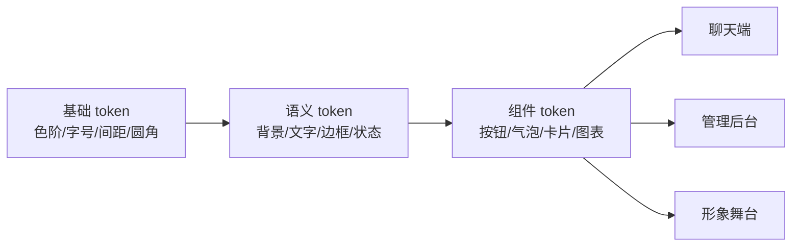

# 06 主题与视觉系统

> 项目代号：**Aria**（伴侣中枢 / Companion Hub）  
> 文档版本：v1.0（2026-08-16）  
> 目标：让聊天端、管理后台、Live2D/VRM 场景保持一致又可个性化，并保证可读性、性能与升级兼容。

---

## 1. 主题选择与定制原型


首批内置主题：

| ID | 名称 | 定位 | 默认模式 |
|---|---|---|---|
| `midnight-violet` | 静夜紫 | 深色、安静、轻未来感，作为默认主题 | 深色 |
| `dawn-warm` | 晨曦暖 | 米白与暖桃色，适合白天陪伴 | 浅色 |
| `forest-mint` | 森林薄荷 | 深绿与薄荷色，降低视觉刺激 | 深色 |
| `pure-light` | 纯净明亮 | 高可读性的中性办公风格 | 浅色 |
| `system` | 跟随系统 | 根据操作系统浅色/深色偏好切换 | 自动 |

## 2. 功能范围

- 内置主题选择、浅色/深色/跟随系统；
- 按固定时间或日出日落定时切换；
- 实时预览，取消时完整恢复原主题；
- 自定义主色、中性色、背景、字体缩放、圆角、阴影、模糊和动效强度；
- 聊天端、管理后台、Tauri、PWA、Live2D 舞台背景同步；
- 每台终端可选择“跟随账户”或“仅本机覆盖”；
- 主题导出/导入、复制、重命名、删除和恢复默认；
- WCAG 对比度、色盲可辨识和减少动态效果检查；
- 升级时自动迁移旧 token，无法迁移则回退到安全默认主题。

主题只改变表现层，不能修改人格、模型、隐私策略、记忆内容或业务权限。

## 3. 主题优先级

```text
临时实时预览
  > 当前设备覆盖
  > 账户已发布主题
  > 跟随系统/定时规则
  > 产品默认主题
```

服务端保存账户主题和版本；本机覆盖保存于终端安全存储。首屏在加载应用脚本前读取极小的 bootstrap 值，避免浅深色闪烁。

## 4. Design Token 分层

主题禁止直接覆盖任意 CSS。采用三层 token：



示例：

```jsonc
{
  "schema_version": 1,
  "id": "midnight-violet",
  "name": "静夜紫",
  "mode": "dark",
  "tokens": {
    "color.bg.canvas": "#0B1020",
    "color.bg.surface": "#131A2B",
    "color.bg.elevated": "#1A2238",
    "color.text.primary": "#F5F7FF",
    "color.text.secondary": "#AEB8D0",
    "color.border.default": "#2A3551",
    "color.brand.primary": "#8B7CFF",
    "color.status.success": "#49C98B",
    "color.status.warning": "#F2B65B",
    "color.status.danger": "#F06A78",
    "radius.card": "16px",
    "radius.control": "10px",
    "effect.blur.panel": "12px",
    "motion.scale": 1,
    "font.scale": 1
  },
  "avatar_stage": {
    "background": "gradient-night",
    "ambient_tint": "#8B7CFF",
    "particle_intensity": 0.15
  }
}
```

代码只消费语义/组件 token，例如 `--color-text-primary`，不直接使用 `purple-500`，避免更换主题后语义错乱。

## 5. 可定制边界

| 能力 | 用户可调 | 限制 |
|---|---|---|
| 主色 | 是 | 自动生成 hover/active/focus，并检查对比度 |
| 页面/卡片背景 | 是 | 文字对比度不达标不得发布 |
| 字体 | 字号/字重/系统字体栈 | v1 不允许远程字体 URL，避免隐私和供应链风险 |
| 圆角/阴影/模糊 | 是 | 移动端根据性能自动限制模糊 |
| 动效 | 正常/减少/关闭 | `prefers-reduced-motion` 优先级最高 |
| 背景图片 | M4B 后 | 只允许本地上传，大小/格式限制并移除元数据 |
| 自定义 CSS/JS | 否 | 防止 XSS、布局破坏和升级不兼容 |

## 6. 主题编辑流程

```text
选择预设或复制主题
  → 实时预览草稿
  → Token Schema 校验
  → 对比度/色盲/动效/性能检查
  → 查看聊天、后台、告警、图表多场景预览
  → 保存草稿或发布版本
  → 终端收到 theme.updated
  → 加载失败自动回滚
```

预览至少覆盖：普通对话、代码块、记忆引用、表单、表格、折线图、成功/警告/错误、Focus、Disabled、空状态和 Live2D 舞台。

## 7. 自动切换

支持三种互斥模式：

1. `system`：跟随操作系统 `prefers-color-scheme`；
2. `schedule`：用户配置浅色/深色主题及切换时间；
3. `sun`：根据用户城市的日出日落切换，只保存粗粒度城市/时区，不要求精确定位。

免打扰时段不影响主题切换。切换采用 150～250ms 的颜色过渡；用户开启减少动态效果时立即切换。

## 8. 形象场景联动

主题可以提供舞台背景、环境光色、粒子强度和字幕样式，但不能覆盖模型核心材质或动作映射。主题切换时：

- Live2D/VRM 模型保持加载，避免重新初始化和闪烁；
- 仅更新舞台层和 UI overlay；
- 情绪色是短时状态覆盖，结束后返回主题基础色；
- 低性能设备自动关闭粒子、动态模糊和复杂背景。

## 9. 图表主题

管理后台图表不得只用红绿区分。每套主题必须提供至少 8 个可区分数据色，并结合线型、点型、纹理或标签。

```jsonc
{
  "chart.series": ["#8B7CFF", "#47B7F5", "#49C98B", "#F2B65B", "#F06A78", "#C98BEF", "#64D6C7", "#AAB4CC"],
  "chart.grid": "#2A3551",
  "chart.axis": "#AEB8D0",
  "chart.tooltip.bg": "#1A2238"
}
```

成功、警告、危险颜色是固定语义，不得因为主题审美互换含义。

## 10. 无障碍与验收

| 项目 | 标准 |
|---|---|
| 普通文字对比度 | WCAG AA ≥ 4.5:1 |
| 大号文字/图标 | ≥ 3:1 |
| Focus 指示器 | 与相邻颜色 ≥ 3:1，键盘操作始终可见 |
| 状态表达 | 不只依赖颜色，必须有图标或文字 |
| 字体缩放 | 80%～150%，120% 下核心页面不溢出 |
| 减少动态效果 | 系统偏好可覆盖主题设置 |
| 切换性能 | 已加载主题切换 P95 < 100ms；无明显闪白 |
| 故障恢复 | 非法/缺失 token 自动回退，页面仍可操作 |

CI 对所有内置主题运行关键组件截图测试、token 完整性检查和对比度检查。

## 11. 数据模型与 API

```sql
CREATE TABLE ui_theme (
  id UUID PRIMARY KEY,
  owner TEXT NOT NULL DEFAULT 'local-user',
  name TEXT NOT NULL,
  schema_version INT NOT NULL,
  version INT NOT NULL,
  status TEXT NOT NULL CHECK (status IN ('draft','published','archived')),
  definition JSONB NOT NULL,
  content_hash TEXT NOT NULL,
  built_in BOOLEAN DEFAULT false,
  created_at TIMESTAMPTZ DEFAULT now(),
  updated_at TIMESTAMPTZ DEFAULT now(),
  UNIQUE (owner, name, version)
);

CREATE TABLE ui_preference (
  owner TEXT PRIMARY KEY,
  theme_id UUID REFERENCES ui_theme(id),
  appearance_mode TEXT NOT NULL DEFAULT 'system',
  schedule JSONB,
  updated_at TIMESTAMPTZ DEFAULT now()
);
```

| 方法 | 路径 | 说明 |
|---|---|---|
| GET | `/api/v1/ui/themes` | 内置及用户主题列表 |
| POST | `/api/v1/ui/themes` | 创建主题草稿 |
| PUT | `/api/v1/ui/themes/{id}` | 更新草稿；已发布版本不可原地修改 |
| POST | `/api/v1/ui/themes/{id}/validate` | Token、对比度、资源和兼容性校验 |
| POST | `/api/v1/ui/themes/{id}/publish` | 发布新版本 |
| DELETE | `/api/v1/ui/themes/{id}` | 删除自定义草稿/归档版本 |
| GET/PUT | `/api/v1/ui/preferences` | 账户主题、模式和计划 |
| POST | `/api/v1/ui/themes/import` | 导入 JSON；严格 Schema 和大小限制 |
| GET | `/api/v1/ui/themes/{id}/export` | 导出不含本地资源正文的主题 JSON |

## 12. 实施安排

| 阶段 | 主题能力 |
|---|---|
| M1 | CSS 语义 token、静夜紫/纯净明亮、跟随系统、无闪烁启动 |
| M1.5 | 对比度与截图回归、字体缩放、减少动态效果 |
| M3B | 主题选择页、自定义、账户同步、定时切换、Live2D 舞台联动 |
| M4B | 本机覆盖、多终端同步、本地背景资源、VRM 场景联动、导入导出 |
