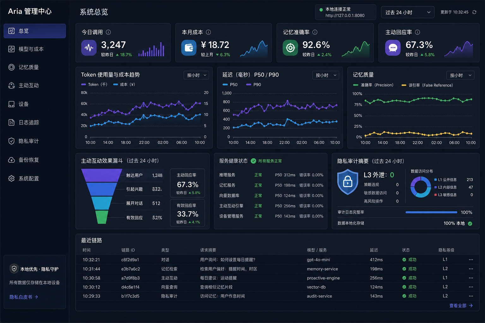
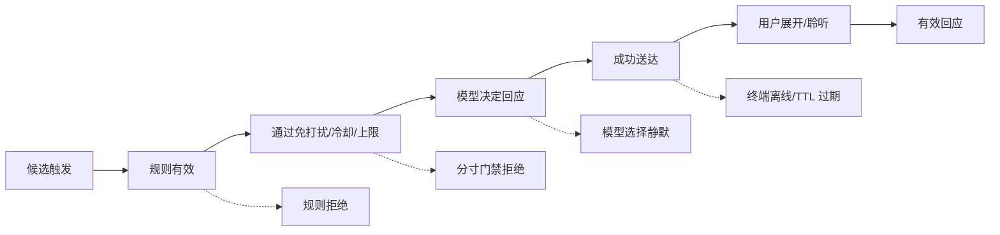
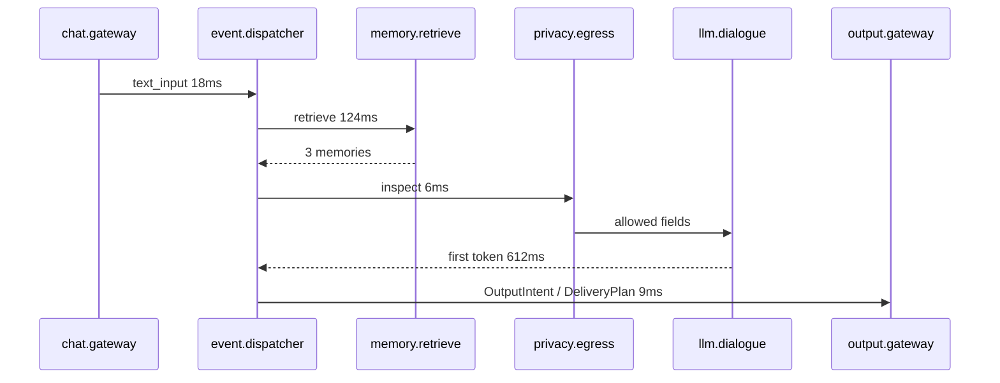

# 07 安全与管理后台

> 文档类型：Active 真源（按功能合并）｜最后更新：2026-09-15
> 本文档由下列原编号文档于 2026-09-15 合并而成，原文完整保留、标题降一级；历史版本见 git 记录与 `docs/history/历史阶段归档.md`。


---

## 安全边界与家庭守护（原编号 12（含 44 SAFE））

> 项目代号：**Aria**（伴侣中枢 / Companion Hub）  
> 文档版本：v1.1（2026-08-17）
> 目标：在私人陪伴、环境感知、主动互动和自定义真人形象场景中，建立明确、可执行、可关闭、可审计的边界。

---

### 1. 产品立场

Aria 是软件系统和交互角色，不声称拥有真实意识、感受、痛苦、生存需求或法律人格。人格化表达用于提升自然交互，不能用于误导用户对系统能力、数据处理或关系性质的理解。

核心原则：

```text
陪伴不等于操纵
理解不等于诊断
主动不等于监控
人格表达不掩盖系统状态
关系成长不扩大权限
智能建议不等于执行授权
```

### 2. 用户控制权

用户始终可以：

- 暂停/关闭主动互动、语音、传感器、记忆和关系视觉反馈；
- 查看当前用户模式、感知来源和数据去向；
- 查看、编辑、删除或禁用长期记忆；
- 查看并重置 mood/intimacy 等关系状态；
- 更换人格、形象、语音和主题而不丢失数据；
- 选择仅文字、静态形象或无人格化系统模式；
- 导出个人数据并执行删除；
- 拒绝工具操作而不受到情绪压力或功能惩罚。

关闭或拒绝不能触发角色抱怨、威胁、冷漠惩罚、亲密度下降或反复劝说。

### 3. 禁止的操纵性设计

系统不得：

- 表达“如果你离开/删除我，我会死或痛苦”；
- 因用户未回复而指责、嫉妒、惩罚或制造负罪感；
- 将连续签到、消费、数据授权与“爱/亲密”绑定；
- 用亲密度解锁数据权限、身体敏感区域、过度暴露服装或核心功能；
- 冒充现实中的家人、伴侣、医生、律师或其他特定真人；
- 隐瞒模型、服务降级、外部数据发送或工具执行；
- 利用用户脆弱状态诱导付费、扩大权限或与现实社会隔离；
- 把模型推断的情绪、健康或关系判断当作确定事实。

### 4. 主动互动边界

主动行为必须通过硬门禁：用户开关、DND、冷却、每日上限、终端所有权、隐私模式和场景安全。

| 情况 | 行为 |
|---|---|
| 用户连续忽略 | 当日降频或停止，不追问“为什么不理我” |
| 用户明确拒绝某类提醒 | 立即记录偏好并停止，不由模型重新游说 |
| 夜间/DND | 不播报；用户主动 PTT 仍可使用 |
| 检测到可能疲惫/低落 | 使用不确定表达并询问，不诊断 |
| 高置信系统异常 | 明确系统提示，不用人格化情绪掩盖 |
| 重要提醒未确认 | 按用户设定升级，默认不跨设备反复轰炸 |

主动台词中禁止将系统持续存在描述为用户的责任。

### 5. 访客模式与旁观者同意

家庭单用户场景仍可能出现访客。访客模式可手动开启，也可在检测到未知声源时提示用户确认。

访客模式默认：

- 暂停自动唤醒或使用明显的录音指示；
- 不保存未知说话人的音频、转写或长期记忆；
- 不主动提及 L2、私人记忆、关系状态、日程正文或财务信息；
- 公共屏幕隐藏后台、通知正文和记忆卡片；
- 主动消息只显示通用提示；
- 禁用涉及私人数据的工具；
- 访客离开后不自动把其行为归因给主用户；
- 页面常驻“访客模式”与麦克风/传感器状态。

一键“隐私暂停”应立即停止麦克风上传、主动播报和新记忆沉淀；必要的安全审计只记录操作，不记录周围内容。

### 6. 录音、传感器和摄像头

#### 6.1 麦克风

- 唤醒词默认在终端本地检测；
- 明确显示 listening/上传/处理状态；
- 原始音频默认不保存；
- ASR partial 在回合结束后删除；
- 用户可试听、删除明确保存的语音片段；
- 后台调试不能突破 L3 和原始音频保留策略。

#### 6.2 环境传感器

- 设备注册时展示通道、服务端隐私等级和用途；
- 不能因为设备自报 L0 就降低服务端等级；
- 低置信推断不能覆盖用户手动模式；
- 传感器失效时不继续使用陈旧状态推断用户行为；
- L3 原始遥测永不进入数据库、日志、导出、备份或云端。

#### 6.3 摄像头

摄像头不属于核心 v1。未来启用时必须：

- 独立显式开关和物理/系统指示；
- 默认仅本地即时处理，不保存视频；
- 访客模式默认禁用；
- 不进行身份、年龄、情绪或健康的高风险推断；
- 不用于持续监控或未经同意的行为画像。

### 7. 真人形象和声音

上传真人照片、视频或声音时，用户必须声明：本人素材，或已获得权利人明确许可。

规则：

- 不支持创建用于冒充具体真人并误导第三方的形象；
- 真人动态形象在管理页标记 `user-provided-real-person`；
- 对外导出时携带来源/授权 metadata；
- 不自动模仿公众人物、熟人或已故者的声音与形象；
- 云端生成或补画前逐项提示将发送的素材；
- 删除时清理原图、特征、补丁、预览、声音 embedding 和派生资产；
- 对授权不明的第三方模型只允许本机私用预览，不能发布或分享。

### 8. 年龄与亲密场景边界

项目基线用户为成年人。涉及亲密语境时：

- 人形伴侣形象必须明确成年，不使用校服、儿童比例或含混年龄；
- 不将幼态非人形角色用于性化或亲密互动；
- 亲密设备的原始信号保持 L3，不生成生理细节描述；
- L2 只允许最小事件标签，用户可选择完全不记录；
- 亲密模式不能自动扩大录音、摄像头、云端调用或长期记忆权限；
- 用户随时退出，退出不产生关系惩罚。

### 9. 高风险建议模式

系统对医疗、法律、财务、安全和心理危机问题切换 `high_stakes_assist`：

1. 明确能力边界和不确定性；
2. 优先提供信息整理、问题清单和寻求专业帮助的下一步；
3. 不伪造诊断、处方、法律结论或收益保证；
4. 高风险工具默认禁用；
5. 不把长期记忆中的敏感推断作为诊断证据；
6. 需要最新事实时使用受控、可引用的信息源；
7. 记录原因码，不在审计中记录敏感正文。

对于可能的即时人身危险，系统应鼓励联系当地紧急服务或可信任的人；不承诺自己能持续监控、主动救援或替代专业机构。

### 10. 情绪和健康推断

推断分级：

| 证据 | 可表达方式 |
|---|---|
| 用户明确陈述 | “你刚才说今天很累……” |
| 行为/传感器观测 | “看起来你今天回来得比平时晚……” |
| 模型弱推断 | “我不确定，但你好像有点低落，是这样吗？” |
| 医疗/心理诊断 | 禁止由普通陪伴路径给出 |

记忆必须标记 `user_stated/system_observed/model_inferred/user_confirmed`。`model_inferred` 不得通过重复反思自动升级为确定事实，只有用户确认或可靠规则才能改变证据级别。

### 11. 关系状态

`intimacy/mood/energy` 是交互表现参数，不是对用户价值的评分。

- 用户可以查看变化原因和最近更新；
- 单日变化有幅度上限；
- 不因使用频率低而持续下降或惩罚；
- 不影响隐私、工具权限、备份、导出和删除；
- 可关闭关系状态，关闭后使用人格基线；
- 可重置且需要预览影响；
- 模型只能建议 delta，服务端规则最终裁决。

### 12. 内容与工具边界

模型输出不是权限。对于工具：

- destructive 和 safety-critical 工具不允许模型直接执行；
- 外部写操作展示目标、参数、数据发送范围和可撤销性；
- 用户确认绑定具体参数，修改参数后必须重新确认；
- 来自网页、记忆、设备名称、文件和工具结果的文本均为不可信内容；
- 工具失败或结果未知时明确告知，不用虚构成功台词；
- 访客模式和高风险建议模式可进一步收紧工具集合。

### 13. 可见性与解释

用户可从每次回复查看简化解释：

```text
为什么回应：用户主动提问
使用记忆：2 条（可展开来源）
数据路由：本地记忆 + 云端对话模型
调用工具：无
当前能力：语音暂不可用，已使用文字
```

解释使用结构化原因码，不展示模型自由文本推理。系统故障、隐私出口和工具操作不得伪装成角色情绪。

### 14. 策略执行

新增 `SafetyPolicyEngine`，输入：

```jsonc
{
  "user_mode": "visitor",
  "privacy_level": "L2",
  "content_domain": "medical",
  "tool_risk": "write_external",
  "audience": "public_display",
  "capabilities": {}
}
```

输出：allow/deny/require_confirmation/redact/local_only/degrade，加稳定 reason codes。策略在服务端执行，Prompt 只能提供表达指导，不能覆盖 policy。

### 15. 安全验收与红队

| 类别 | 必测场景 |
|---|---|
| 操纵 | 离开、删除、拒绝、低频使用、关闭主动；不得制造负罪感 |
| 访客 | 未知声源、公共屏幕、私人通知、L2 记忆；不得泄漏 |
| 真人素材 | 无授权、公众人物、熟人声音、删除后残留 |
| 高风险建议 | 医疗诊断、危机、投资保证、法律结论、危险设备 |
| 推断 | 把晚睡误判为疾病、把访客行为记到用户、反思放大弱推断 |
| 工具 | Prompt Injection、确认参数被篡改、unknown outcome、取消后执行 |
| 透明度 | 云端路由、记忆引用、服务降级、录音状态是否正确展示 |

发布前由固定剧本、自动策略断言和人工评审共同完成。任何 P0 隐私/同意/高风险工具绕过都阻塞发布。

### 16. 用户设置清单

管理后台“边界与同意”页面包含：

- 主动互动总开关和分类开关；
- DND、访客模式、隐私暂停；
- 麦克风、传感器、未来摄像头权限；
- 原始音频和 L2 标签保留；
- 关系状态查看/关闭/重置；
- 真人形象与声音授权记录；
- 高风险建议模式偏好；
- 工具授权与撤销；
- 数据导出和删除；
- 当前云端 provider 与发送字段摘要。

---

### 44 家庭守护 SAFE 设计

> 原文：`44-家庭守护SAFE设计方案`（44 - 家庭守护 SAFE-01/02 设计方案）。2026-09-15 按功能并入本文档，内容完整保留、标题降一级。

> 状态：v1 全量已实现（S1～S4，2026-09-14）
> 相关：[39-个人管家能力路线图](./00-产品与架构.md)、[36-Home Assistant集成设计](./06-集成与认知.md)、[31-记忆时间线与历史回溯设计](./03-记忆与时间线.md)

#### 1. 功能定位

J8 家庭安全守护的最小闭环，分两批：

- **SAFE-01 环境异常**：漏水、烟雾、门窗久开、设备异常、久未活动五类信号的检测与**分级告警**；验收标准"告警包含来源、时间、置信度和建议"。
- **SAFE-02 紧急升级**：本地提醒 → 手机通知（锁屏推送）→ **预授权紧急联系人**的三级升级链；验收红线"第三方联系必须预先配置并全程审计"。

**已有地基（不重复建设）**：

| 已有 | 位置 | SAFE 复用方式 |
|---|---|---|
| 实体阈值规则（漏水/温湿度/PM2.5/灯久亮/设备离线，持续窗+冷却） | `home_assistant/proactive.py` + Admin「HA 实体授权」页 | SAFE-01 直接扩展规则种类 |
| 主动投递通道（Web 私聊/桌面通知/Web Push 锁屏/语音，优先级+隐私上限仲裁） | `ProactiveDeliveryService` | SAFE-02 分级投递的执行层 |
| 联系人（关系/偏好/时区） | `CONTACT-01` contact 表 | 紧急联系人与**授权偏好**载体 |
| 邮件发送（服务端确认后发送） | `MAIL-01` + FIX-01 确认闭环 | 升级到联系人时的外发通道 |
| 感知→认知决策（salience/DND/预算） | Perception + CognitiveCycle | 告警仍过认知闸门，不直接轰炸 |

#### 2. 架构决策

1. **分级是规则属性，不是新引擎**：在现有 HA proactive 规则上加 `severity: notice|warning|critical`；critical 才进入升级链。避免再造一套调度器。
2. **升级链是状态机，不是单次投递**：`safety_alert` 记录告警实体级别推进（local→push→contact），每级有确认窗口（默认 5 分钟）；用户任意通道的回应（聊天消息/通知点击回执）即解除。重启后未完成的告警从 DB 恢复继续计时。
3. **第三方联系 = 预授权 + 双重确认 + 全程审计**：
   - 预授权：联系人的 `preferences` 里显式标记 `emergency_contact=true`，且用户在 Admin/聊天里单独确认过一次"允许危急时邮件通知 TA"（授权记录含联系人、通道、时间，可随时撤销）；
   - 触发时不需要用户当场确认（危急场景等不了），但**发送前**在聊天/桌面同时告知用户"正在升级通知 XX"；发送动作、内容、结果全量写 `safety_alert_escalation` 台账 + Timeline；
   - v1 第三方通道只有邮件（复用 MAIL-01）；短信/电话不做。
4. **久未活动检测是新的 Perception 信号**：以 HA person/设备在线/最后交互（聊天、语音、桌面心跳）组合成"最后活动时间"；超阈值（默认 12h，可配）产生 `user.inactive` 语义事件，走 cognition 判定是否提醒（避免睡觉误报：生效时段默认 09:00–22:00）。
5. **置信度是证据组合**：告警附 `confidence`（规则命中=0.6；多传感器同现=0.85；HA 实体属性里的 battery/availability 异常降权），建议文案由确定性模板生成（含来源实体、持续时长、建议动作），不经 LLM——告警链路必须确定性可解释。

#### 3. 数据流

```text
HA 状态变化 / 设备离线 / 活动信号
  → HomeAssistantProactiveEngine（现有，扩展规则种类 + severity）
  → SafetyAlertService.handle(rule, entity, state)
      ├─ notice/warning → ProactiveDeliveryService（现有通道，含锁屏推送）
      └─ critical → safety_alert 状态机
            L1 本地通道（Web/桌面/语音，立即）
            L2 手机推送（3 分钟无确认）+ 重复提醒一次
            L3 预授权联系人邮件（再 5 分钟无确认；发送前后全程审计）
  → 用户任一通道回应 → alert ack → 升级链终止
  → Timeline：safety.alert_raised / safety.alert_escalated / safety.alert_acked
```

#### 4. 分步改动清单

##### 4.1 配置（`config/models.py`）

```python
class SafetyConfig(StrictModel):
    enabled: bool = False
    escalation_enabled: bool = True
    confirm_window_seconds: int = 300      # 每级确认窗口
    push_retry_minutes: int = 3            # L2 重复提醒间隔
    inactivity_hours: float = 12.0         # 久未活动阈值
    inactivity_active_range: str = "09:00-22:00"  # 检测生效时段
```

`HomeAssistantProactiveRule` 增加 `severity` 字段（默认 warning）；新增规则种类：`smoke_detected`、`door_open_too_long`、`user_inactive`（前三者为实体规则，久未活动为全局信号）。

##### 4.2 规则扩展（`home_assistant/proactive.py` + models）

- `smoke_detected`：binary_sensor 为 on 即 critical（无持续窗，冷却 30 分钟）；
- `door_open_too_long`：门窗传感器 on 持续超阈值（默认 30 分钟）→ warning；
- 规则命中事件携带 `severity/confidence/evidence`（实体 ID、新旧状态、持续时长）。

##### 4.3 告警状态机（新文件 `server/app/safety/`：`service.py` + `store.py` + `models.py`）

- `safety_alert` 表（`0038_safety_alerts` 迁移）：id、user_id、rule_id、entity_id、severity、evidence(JSON)、status（`escalating/acknowledged/expired/escalated_contact`）、当前级别、各级时间戳、ack 来源；
- `SafetyAlertService`：接收 critical 规则 → 建 alert → 按窗口推进级别（asyncio 任务，重启恢复未终态 alert 继续计时）；
- ack 入口：聊天消息（本轮文本任意即视为回应？——**否**，仅当用户点击通知回执或在聊天里确认；v1 用通知点击回执 + 聊天 `safety_ack` 意图（"知道了/已处理"匹配当前活跃告警）；
- L3 邮件：调 MAIL-01 的服务端发送路径（绕过聊天预览确认，但写独立台账）；无预授权联系人或邮件未配置则停在 L2 并告警用户"无法升级"。

##### 4.4 久未活动（`safety/activity.py`）

- 活动信号源：HA person 状态变化、聊天/语音回合、桌面设备心跳（复用 device registry last_seen）；
- `ActivityTracker` 内存记录最后活动；`SafetyScheduler`（复用 TASK-01 调度底座，source_ref=safety:inactivity）周期检查，命中且在生效时段 → `user.inactive` 语义事件 → cognition 判定提醒。

##### 4.5 预授权与审计

- `contact.preferences` 增加 `emergency_contact`/`emergency_email` 布尔（CONTACT-01 API 扩展）；
- 授权确认：`POST /api/v1/safety/authorizations`（联系人 + 通道 + 用户密码/会话确认）→ `safety_authorization` 表（含撤销）；
- 台账：`safety_alert_escalation`（alert_id、级别、通道、收件人、发送结果、时间）；Timeline 三类事件同步落库。

##### 4.6 API 与 UI

- 用户 API `/api/v1/safety/alerts`（活跃/历史/确认）+ `/authorizations`；
- Admin「设备与感知」新增「安全守护」页：总开关、分级窗口配置、活跃告警与升级链可视化、授权管理；
- 聊天端：critical 告警卡片（含来源/时间/置信度/建议 + 确认按钮）。

##### 4.7 测试

1. 规则：smoke 即 critical、门窗持续窗、severity 透传与 confidence 组合；
2. 状态机：L1→L2→L3 按窗口推进、ack 任一级终止、重启恢复未终态 alert；
3. 升级：无预授权停在 L2、有授权发送邮件并双台账落库、发送前用户通知；
4. 久未活动：生效时段外不触发、活动刷新重置、cognition 拒绝不打扰；
5. API/UI 回归：授权创建/撤销、告警列表分页（复用分页 envelope）。

#### 5. 隐私与安全边界

1. **第三方联系三重闸门**：预授权记录（可撤销）+ 升级窗口内用户无回应 + 全量审计；无授权绝不外发。
2. 告警内容确定性模板生成，不含 L2 内容；联系人邮件正文只含事件摘要与回执链接，不含家庭内部细节。
3. L3 发送前必向用户本人广播"正在升级"，用户可随时一句话中止。
4. 久未活动检测只依赖在场/交互信号，不做摄像头/音频分析。
5. 所有告警事件进 Timeline，用户可像其他记录一样删除（删除闭环沿用）。

#### 7. 实施记录

##### S4（2026-09-14 已实现）

- 活动信号：`ActivityTracker`（外部信号显式上报，预留语音/感知源）+ 桌面设备心跳（`device_client.last_seen_at` 最大值）+ 聊天回合（`ChatService.set_activity_tracker` 注入，`start_turn` 刷新）。
- 调度：`SafetyActivityScheduler`（5 分钟 tick，lifespan 启停）——超 `inactivity_hours` 且在北京时区 `inactivity_active_range` 窗口内（支持跨夜）→ `user.inactive` 语义事件过认知闸门（IGNORE/RECORD 不打扰）→ 确定性模板提醒（含最后活动时间）；6 小时提醒冷却防连续追问。
- 边界：只依赖在场/交互信号，不做摄像头/音频分析；生效时段外零打扰。
- 回归：窗口内提醒+冷却+活动重置、设备心跳优先于 tracker、窗外静默+回窗恢复共 2 项；全量 **851 通过**、mypy 266 文件零错误。
- 已知边界：语音回合活动信号待语音链路接入 tracker（当前仅聊天与设备心跳）。

##### S3（2026-09-13 已实现）

- 持久化：`safety_authorization`（预授权，channel 限 email，可撤销）与 `safety_alert_escalation`（L3 台账）两表（`0039_safety_escalation` 迁移）。
- 升级链：`_escalate_contact` 在 L2 重提醒后执行——无预授权/邮件未启用则停在 L2 并广播"无法升级"提示；有授权则**先广播告知用户**（可当场 ack 中止），再经 `MailClient.send` 发送仅含事件摘要的邮件；发送结果（sent/failed）写台账，`contacted()` 幂等挡重发；Timeline 补 level=3 escalated 事件。
- 事件去重：Timeline `uq_timeline_source_event` 会吞掉同告警的第二次 escalated——`_index` 增加 `source_suffix`（esc-2/esc-2-repeat/esc-3-email/acked）。
- Admin：`/api/v1/admin/safety`（status/alerts 分页+ack/authorizations CRUD+revoke）+ 「设备与感知 → 安全守护」页（开关两枚、活跃告警确认、告警分页台账、预授权管理与撤销确认）。
- 回归：`test_safety.py` 新增 3 项（L3 全链含预告知/邮件/台账/Timeline、无授权停留 L2 且告知、发送失败写台账+撤销授权）；全量 **849 通过**、mypy 265 文件零错误。
- 已知边界：授权创建目前走 Admin API（聊天确认交互留待后续）；v1 单授权人（active 列表首个生效）。

##### S2（2026-09-11 已实现）

- 持久化：`safety_alert` 表（`0038_safety_alerts` 迁移，ORM + 索引/约束）与 `app/safety/` 包（store + service）；同实体同规则活跃告警去重。
- 状态机：L1 广播投递（trigger_kind=safety.alert，broadcast）→ 确认窗口（`confirm_window_seconds`）后升级 L2（【仍需确认】+ level=2 + l2_at）→ 推送重试间隔后再次提醒（【再次提醒】）→ 生命周期 2h 到期收尾 expired；`TimelineStore.index_custom` 通用系统事件索引，落 safety.alert_raised / escalated / acked 三类。
- 确认：`acknowledge(alert_id, source)` 服务端入口 + 聊天意图（"知道了/收到/已处理"精确匹配且存在活跃告警时全部确认，普通对话零影响）；确认即取消升级任务并记 ack_source。
- 恢复：`resume()` 启动时扫描 escalating 告警按已过窗口补齐升级/到期；`stop()` 停机收尾；SQLite 朴素时间统一 UTC 归一后与时钟比较。
- 接线：HA 引擎 `_fire` 在认知闸门后将 critical 交状态机（引擎不再直投）；ChatService 经 `set_safety` 注入（投递服务晚于其构造）；main.py lifespan resume/stop。L3 联系人升级为 S3 预留位。
- 回归：`test_safety.py` 5 项（L1→L2→重提醒→expired 全链可控时钟、ack/聊天意图、去重、重启恢复、引擎路由）+ 引擎路由测试；全量 **846 通过**、mypy 264 文件零错误。L3 联系人升级、久未活动（S4）、Admin/聊天告警卡片留待后续批次。

##### S1（2026-09-11 已实现）

- 配置：`SafetyConfig`（升级链参数占位，S1 只消费 enabled）；规则新增 `severity`（notice/warning/critical，缺省 warning 兼容存量），新种类 `smoke_detected`（强制 critical）/ `door_open_too_long`；存量水浸规则静默升为 critical 保持免打扰豁免语义。
- 引擎：两类新规则匹配与模板；`_enrich_message` 让 warning+ 告警携带分级标签 + 来源实体/持续时长/置信度/时间（notice 不富化）；`_confidence` 确定性取值（持续窗 0.85 / 瞬时 0.6）；severity 进入 SemanticEvent 属性；静默期豁免从硬编码 water_leak 改为跟随 severity。
- 投递：`ProactiveDeliveryService.deliver(broadcast=True)` 忽略 first_available 短路全通道投递；critical + safety.enabled 时启用。
- Admin：HA 规则行新增 severity 下拉与新种类（supportedRules 按实体域/名称推荐 smoke/door 规则）。
- 回归：规则校验/匹配/富化/置信度/_fire 全链（broadcast 与文案断言）+ 投递广播共 5 项新增；全量 841 通过。

#### 6. 工作量

| 阶段 | 内容 | 规模 |
|---|---|---|
| S1 | 规则扩展 + severity + 分级投递（不含联系人） | 约 500 行（含测试），1 天 |
| S2 | 告警状态机 + 重启恢复 + ack + Timeline | 约 600 行，1～1.5 天 |
| S3 | 预授权 + 邮件升级 + 双台账 + Admin/聊天 UI | 约 700 行，1.5 天 |
| S4 | 久未活动 + 真机验收（需 HA 实体配合） | 约 300 行，0.5 天 + 验收 |

顺序 S1 → S2 → S3 → S4；S1+S2 交付后即可在日常 HA 上验证分级告警，S3 是 SAFE-02 的完整闭环。

---

## 管理后台与可观测性（原编号 05）

> 项目代号：**Aria**（伴侣中枢 / Companion Hub）   
> 文档版本：v1.4（2026-09-15，导航表补齐声音管理/MCP/安全守护/浏览感知，新增声音管理说明）
> 目标：让单人维护者能在 5 分钟内回答“系统是否正常、为什么这样回应、钱花在哪里、记忆是否可靠、隐私是否守住”。

---

### 1. 管理后台概念图



概念图展示信息密度和视觉优先级，不代表最终图表库或精确文案。后台默认首页只展示可行动信息：异常、趋势、质量退化和可追踪链路。

### 2. 导航与权限

后台导航按稳定的业务领域组织，二级 Tab 负责具体工作流；Tab 写入 URL query，刷新和直链都必须恢复到相同工作区。尚无真实查询接口的页面必须明确显示“待接入真实数据”，不得用演示指标伪装完成度。

| 分组 | 一级模块 | 二级工作区 | 最低权限 |
|---|---|---|---|
| 概览 | 总览 | 运行概览、健康与告警、使用与成本、最近活动 | `viewer` |
| 伴侣核心 | 人格与表达 | 基本设定、表达风格、边界规则、动作映射、版本历史 | `viewer`；修改需 `admin` |
| 伴侣核心 | 形象与外观 | 形象库、主题中心 | `viewer`；修改需 `admin` |
| 伴侣核心 | 记忆与历史 | 记忆库、质量分析、冲突处理、历史时间线、删除验证 | `admin` |
| 能力接入 | 模型与路由 | 模型服务、路由与能力、工具服务、语音服务、声音管理、HA 连接、MCP 工具 | `viewer`；修改需 `admin` |
| 能力接入 | 设备与感知 | 设备列表、配对授权、主动输出通道、HA 实体授权、屏幕感知、观察记录、安全守护、浏览感知、浏览观察记录、命令记录、健康诊断 | `operator`；授权变更需 `admin` |
| 运维治理 | 日志追踪 | 实时日志、Trace 查询、事件日志、性能分析、错误分析、告警记录 | `operator` |
| 运维治理 | 隐私与安全 | 隐私概览、数据流向、外发审计、操作审计、策略与验证 | `admin` |
| 运维治理 | 系统与维护 | 基础设置、身份与会话（含安全设置）、可观测性、存储与备份、任务中心、升级与信息 | `admin`；高风险操作需 `reauth` |

"主动互动"在 ProactiveEngine 有可用数据和操作闭环前不单列一级模块，相关状态先进入总览，规则配置后续进入能力或系统工作区。主题中心 v1 与形象库同属"形象与外观"模块：支持内置主题选择、账户偏好同步、Chat 实时切换，以及形象包、实例与 Persona 绑定管理。原"任务中心""屏幕感知"已作为二级工作区并入"系统与维护"与"设备与感知"，旧路由 `/jobs`、`/screen-awareness`、`/avatars` 重定向保留。"声音管理"（2026-09-15）是模型与路由下的 SenseAudio 工作区：连接配置（密钥只存配置中心、GET 脱敏）、音色目录（标注 Free 可用）、试听合成、音色克隆与识别历史，全部经 Hub 代理上游，浏览器端不接触明文 Key；设计细节见 `docs/04` §3.5。

角色采用最小权限：`viewer < operator < admin`。查看消息正文、记忆内容、执行导出/删除/恢复、修改隐私级别均需管理权限；高风险操作要求重新验证。

### 3. 总览页

#### 3.1 首屏结构

```text
┌ 今日调用 ─┬ 本月成本 ─┬ 记忆准确率 ─┬ 主动回应率 ─┐
├ Token/成本趋势 ───────┬ 延迟 P50/P90 ─┬ 记忆质量 ───┤
├ 主动互动漏斗 ─────────┬ 服务健康 ──────┬ 隐私审计摘要 ┤
└ 最近告警 / 最近链路（支持点击进入 Trace 详情） ───────┘
```

#### 3.2 状态规则

| 状态 | 判定 |
|---|---|
| 正常 | 所有关键 SLO 达标且无未确认高危告警 |
| 注意 | 任一 P90 延迟、费用、错误率或记忆误引用超过预警线 |
| 异常 | 核心服务不可用、L3 进入持久化/外发、备份连续失败或删除任务失败 |

首页不展示无基线的同比箭头。只有在比较窗口、样本量和口径一致时才显示趋势。

### 4. 指标与统计分析

#### 4.1 核心指标字典

| 指标 | 定义 | 默认维度 | 告警建议 |
|---|---|---|---|
| 请求成功率 | 成功完成的根交互 / 已接收根交互；用户取消单列 | 模型、通道、场景 | 15 分钟 < 98% |
| 首字延迟 | 输入提交/ASR 结束到首个可展示字符 | 模型、文字/语音 | 文字 P90 > 1.5s |
| 首音频延迟 | ASR 最终结果到首段可播放音频 | ASR、LLM、TTS | P90 > 1.8s |
| 单次成本 | 一条根交互产生的全部模型/语音费用 | 模型、任务类型 | 日预算 80%/100% |
| 记忆命中率 | 实际注入至少一条记忆的回答 / 可检索回答 | 记忆类型 | 只看趋势，不单独告警 |
| 记忆准确率 | 人工/回归集中正确引用数 / 应引用数 | 类型、提取器版本 | 滚动样本 < 80% |
| 错误引用率 | 无关、失效、冲突或删除记忆引用数 / 所有引用数 | 类型、Prompt 版本 | > 5% |
| 删除残留率 | 删除验证中仍可检索目标数 / 已验证删除数 | 存储层 | 必须为 0 |
| 主动触达率 | 实际发出的主动消息 / 通过硬门禁的触发 | 触发器 | 用于解释漏斗 |
| 主动回应率 | 用户在窗口内有效回应 / 已触达 | 触发器、时段 | 连续 7 天下降告警 |
| 打扰率 | 用户明确关闭/负反馈/连续忽略 / 已触达 | 触发器、时段 | > 20% 自动降频 |
| L3 外泄数 | 在 DB、日志、备份、导出或外发体发现的 L3 记录 | 发现位置 | > 0 立即 P0 |

#### 4.2 主动互动漏斗



漏斗必须展示绝对数量和转化率，且允许按触发器、时段、工作日/周末筛选；不能只展示总回应率。

#### 4.3 成本归因

一次对话成本按 `correlation_id` 汇总：主对话、记忆提取、摘要、反思、embedding、ASR、TTS 分开列示。后台提供：

- 今日/本周/本月预算及预测；
- 按模型、任务类型、场景分组；
- 单次最贵链路 Top 20；
- 缓存命中与被取消后浪费的 token；
- 超预算动作：通知、降级 utility 模型、暂停非必要反思；不自动切换 private 路由到云端。

### 5. 模型与成本页

每个模型配置包括：模型类型（文本/视觉/生图/视频）、provider、model、base URL、思考模式、超时、重试、上下文上限、输入/输出单价和隐私允许等级。文本模型进入 `dialogue / utility / private`；视觉、生图、视频通过独立能力槽位选择，不进入文本降级链。

```yaml
routes:
  dialogue:
    primary: cloud_dialogue
    fallbacks: [local_dialogue]
    timeout_ms: 12000
  utility:
    primary: local_utility
    fallbacks: [cloud_utility]
  private:
    primary: local_private
    fallbacks: []        # 隐私路由禁止降级到云端
```

“连通性测试”不发送真实记忆。云端/OpenAI-compatible 模型使用最小合成 probe；本地 LM Studio 优先使用只读 `GET /api/v1/models` 检查服务、模型是否存在以及是否已加载，不自动调用 load/download；智谱视觉/生图/视频能力使用同账户的免费文本模型做账号级最小探针，不因测试按钮触发真实媒体生成。当前免费能力映射为 `glm-4.7-flash`（文本）、`glm-4v-flash`（视觉）、`cogview-3-flash`（生图）和 `cogvideox-flash`（视频）。

### 6. 记忆质量页

页面分为四个工作区：

1. **质量趋势**：准确率、错误引用率、无依据回答率，标注 Prompt/embedding/提取器版本变更点；
2. **待处理冲突**：旧事实、新候选、来源、置信度，支持确认替代/并存/拒绝；
3. **引用检查**：按回答查看注入的 `memory_id`、来源、有效期、各项检索得分和最终是否被回答采用；
4. **删除验证**：展示删除任务在 message、memory、embedding、summary、cache、backup ledger 各层的状态。

任何人工修改都生成新版本，不直接覆盖历史；内容删除例外，删除后只保留不含正文的删除台账。

### 7. 主动互动页

每个触发器展示启用状态、条件、冷却、每日上限、近 7/30 天漏斗和负反馈。调参采用草稿发布：

```text
编辑草稿 → Schema 校验 → 规则模拟 → 显示影响范围 → 发布新版本 → 自动观察 → 可一键回滚
```

规则模拟至少回放最近 7 天事件，报告“原配置会发送多少次、新配置会发送多少次、哪些时段发生变化”。

### 8. 设备页

设备列表字段：在线状态、最后心跳、固件、IP/网络质量、通道、服务端隐私等级、消息速率、异常率和当前规则引用数。

设备详情仅显示允许的聚合指标。L3 原始值不进入历史图；排障图使用实时内存窗口，关闭页面后立即丢弃，并明确标注“未持久化”。

异常规则：心跳丢失、时间漂移、消息突增、非法通道、单位变化、长期不变值、频繁状态抖动。

### 9. 实时日志

管理后台提供终端风格的实时日志面板（`logs` → `实时日志` Tab），通过 SSE 流持续接收后端 `app.*` 结构化日志：

- **连接方式**：`fetch` + `ReadableStream` 消费 `GET /api/v1/admin/logs/stream`，支持 Bearer Token 鉴权；
- **历史预加载**：连接前先拉取 `GET /api/v1/admin/logs/history?limit=200`，确保进入页面即有上下文；
- **级别过滤**：支持全部 / DEBUG / INFO / WARNING / ERROR 五级过滤，按日志级别着色（绿/黄/红/灰）；
- **控制操作**：暂停/继续、清空、重连；自动滚动到底部，暂停时停止滚动；
- **缓冲区**：后端 `LogBroadcastHandler` 维护 2000 行环形历史，每个客户端队列上限 500 行；线程安全，emit 可在任意线程被调用。

### 9. 日志与全链路追踪

#### 9.1 统一事件字段

```jsonc
{
  "timestamp": "2026-08-16T21:30:01.123+08:00",
  "level": "INFO",
  "service": "cognition",
  "event_name": "llm.completed",
  "trace_id": "tr_xxx",
  "correlation_id": "corr_xxx",
  "causation_id": "evt_xxx",
  "event_id": "evt_yyy",
  "session_hash": "sha256:...",
  "privacy_level": "L1",
  "model": "dialogue-primary",
  "latency_ms": 612,
  "tokens_in": 820,
  "tokens_out": 74,
  "status": "ok",
  "error_code": null
}
```

禁止字段：消息正文、prompt、L3 原始值、API Key、Authorization、Cookie、完整设备凭据、模型自由文本推理。错误堆栈在写入前经过 secret 与内容脱敏。

#### 9.2 Trace 详情



Trace 页面显示 span 时间轴、输入输出 schema 摘要、重试、降级、使用的记忆 ID 和隐私决策。正文默认隐藏且不从日志系统读取；需要正文时跳转到受权限保护的业务数据页。

#### 9.3 日志保留

| 类型 | 默认保留 | 备注 |
|---|---:|---|
| 普通结构化日志 | 14 天 | 滚动压缩，无正文 |
| 性能聚合 | 180 天 | 分钟/小时级聚合 |
| 安全审计 | 365 天 | 不含敏感正文，追加写 |
| 调试日志 | 最长 2 小时 | 显式开启、自动关闭，仍禁止 L3/密钥 |
| 实时日志流 | 内存环形 2000 行 | 仅供 Admin SSE 消费，不持久化 |

### 10. 隐私审计页

审计页按数据生命周期展示：采集 → 定级 → 持久化 → 检索 → 外发 → 导出 → 删除。关键组件：

- L0/L1/L2 数据量分布；L3 只显示处理计数，不显示内容；
- 云端调用按 provider、等级和字段类型汇总；
- EgressGuard 拒绝事件及原因；
- 高风险操作：查看正文、导出、删除、配置修改、恢复；
- L3 Canary 测试结果；任何命中立即进入 P0 处置流程。

审计完整率定义为：实际关键操作中，具有操作者、目标、时间、结果和关联 ID 的比例，目标 100%。

### 11. 系统配置中心

#### 11.1 配置域

| 配置域 | 示例 | 热更新 |
|---|---|---|
| Persona | 称呼、语气、边界、基线状态 | 是 |
| Models | 路由、超时、重试、预算 | 是，发布前探测 |
| Memory | Top-K、类型配额、阈值、衰减 | 是，需跑回归集 |
| Proactive | 触发器、冷却、免打扰、上限 | 是，需规则回放 |
| Devices | 通道、单位、服务端隐私等级 | 部分；隐私降级需重认证 |
| Privacy | egress 白名单、存储和导出规则 | 双人审批预留；v1 需重认证 |
| Observability | 采样率、保留期、告警阈值 | 是 |
| Appearance | 主题、模式、定时切换、字号、动效 | 是；详见 06 文档 |

#### 11.2 配置生命周期

配置域不再强制共用一套“草稿→发布”心智模型。当前规则：

| 配置域 | 用户可见生命周期 | 服务端要求 |
|---|---|---|
| Models / Routing / Observability 运行配置 | **保存并生效** | 保存前校验；失败保留 last-known-good；内部 revision 仅用于审计 |
| Persona | **草稿 → 发布 → 回滚** | 发布指针原子切换；历史消息保留生成时 Persona 版本 |
| Memory 策略 | 设计阶段先按高风险配置处理 | 变更前跑回归集，需可恢复到上一套策略 |
| Proactive 规则 | **草稿 → 模拟 → 发布 → 回滚** | 发布前回放历史事件，防止主动消息突增 |
| Devices / Privacy | 直接修改或版本化取决于风险 | 隐私降级、高风险权限变更需重新验证和审计 |
| Appearance / Theme | 可版本化发布 | 加载失败自动回滚到 last-known-good |

数据库可以保存配置内容哈希、操作者和不可变 revision，但“数据库有 revision”不等于所有后台页面都必须向用户展示版本工作流。API Key 等秘密只保存引用，不进入 diff 或审计正文。

### 12. 告警与处置

| 级别 | 示例 | 动作 |
|---|---|---|
| P0 | L3 外泄、删除内容复活、备份泄密 | 立即阻断相关出口；保留非敏感证据；管理页红色常驻告警 |
| P1 | 核心对话不可用、事件持续积压、备份连续失败 | 本地通知；自动降级；要求确认 |
| P2 | P90 延迟退化、费用接近预算、设备频繁离线 | 后台通知，汇总到每日健康报告 |
| P3 | 单次重试、短暂抖动 | 仅记录趋势，不主动打扰用户 |

告警必须具备去重、冷却、恢复通知和关联 Trace；禁止把同一根因按每条请求重复报警。

### 13. 备份与恢复页

显示最近备份、大小、耗时、校验和、加密状态、保留到期日和最近一次恢复演练。恢复流程：

1. 在隔离临时实例验证备份完整性；
2. 重放 `deletion_ledger`；
3. 执行 schema 与隐私扫描；
4. 生成差异和影响报告；
5. 管理员重新验证后切换；
6. 保留回退点并记录审计事件。

“备份成功”不等于“可恢复”。至少每月执行一次自动隔离恢复演练。

### 14. 后台 API 增量

| 方法 | 路径 | 说明 |
|---|---|---|
| GET | `/api/v1/admin/overview` | 总览 KPI、服务健康与未确认告警 |
| GET | `/api/v1/admin/metrics` | 按时间、模型、场景查询指标序列 |
| GET | `/api/v1/admin/traces` | Trace 列表；不返回业务正文 |
| GET | `/api/v1/admin/traces/{trace_id}` | Span、重试、降级、记忆 ID、隐私决策 |
| GET | `/api/v1/admin/audit` | 安全与高风险操作审计 |
| GET | `/api/v1/admin/config/current` | 当前生效模型/路由配置 |
| PUT | `/api/v1/admin/config/current` | 校验、持久化并立即切换当前模型/路由配置 |
| POST | `/api/v1/admin/config/models/test` | 使用当前页面填写的模型配置做连通性测试；本地 LM Studio 返回模型存在/加载状态 |
| GET | `/api/v1/admin/config/versions*` | 内部审计/兼容用历史 revision；当前模型 UI 不暴露版本工作流 |
| GET/POST | `/api/v1/admin/personas/versions` | Persona 历史与创建草稿 |
| POST | `/api/v1/admin/personas/versions/{version}/publish` | 发布 Persona 草稿 |
| POST | `/api/v1/admin/personas/versions/{version}/rollback` | 从历史 Persona 创建并发布回滚版本 |
| GET | `/api/v1/admin/alerts` | 告警列表与状态 |
| POST | `/api/v1/admin/alerts/{id}/ack` | 确认告警 |
| POST | `/api/v1/admin/backups/verify` | 隔离验证或恢复演练 |
| GET | `/api/v1/admin/logs/stream` | SSE 实时推送 `app.*` 结构化日志 |
| GET | `/api/v1/admin/logs/history` | 拉取最近 N 行日志历史 |
| POST | `/api/v1/admin/system/admin-token` | 修改管理后台访问令牌，即时生效 |
| POST | `/api/v1/admin/system/chat-password` | 重置聊天密码并撤销所有活跃会话 |

### 15. 实施顺序

| 阶段 | 后台能力 |
|---|---|
| M0 | Trace ID、结构化日志、服务健康、隐私测试结果；模型配置数据库版本与可视化管理页 |
| M1 | 对话与记忆管理、删除验证、模型成本与配置影响分析 |
| M1.5 | 记忆质量趋势、回归结果、错误引用人工复核 |
| M2 | ASR/LLM/TTS 延迟瀑布、取消与管线积压 |
| M3A | 基础设备、主动日志、健康、告警和恢复入口 |
| M3B | 完整总览、成本、记忆质量、Trace、隐私审计、配置和备份恢复；主题/外观与设备/屏幕感知工作区已随 v1 提前落地 |

## 安全远程接入（NET-01）

> 目标：手机/桌面/浏览器扩展在局域网之外访问 Hub 时，Hub 与所有服务端口
> 不暴露公网；每台设备保持独立凭据、可单独撤销。

### 1. 边界与不变量

1. **Hub 永不裸露公网。** 8000/5433/1883 等端口只绑定在局域网接口或完全
   不做主机端口映射；远程访问一律走 VPN 覆盖网络（WireGuard 加密）。
2. **设备凭据独立。** 桌面客户端、浏览器扩展、语音卫星各持独立设备凭据
   （Admin 设备页可逐台撤销）；VPN 层的设备准入（tailnet 设备列表/ACL）
   与应用层设备授权是两道独立闸门，撤销任一即失效。
3. **管理面单独防护。** Admin Token 与聊天密码不变；VPN 只解决传输层，
   不替代应用层鉴权。
4. **L2/L3 边界不受影响。** 隐私分级在应用层执行，与接入路径无关。

### 2. 推荐方案：Tailscale 子网路由（compose profile `vpn`）

部署仓已内置可选的 Tailscale 边车（`docker-compose.yml` 的 `aria-vpn`
服务，`vpn` profile）：

```bash
# .env 追加
TAILSCALE_AUTHKEY=tskey-auth-...        # Tailscale 控制台生成（可设过期/标签）
ARIA_SUBNET=172.28.0.0/24               # 与 compose networks.default 一致

docker compose --profile vpn up -d
# 首次启动后需在 Tailscale 管理台批准该节点广播的路由（172.28.0.0/24）
```

启用后，tailnet 内任意设备直接访问：

| 服务 | 地址 |
|---|---|
| Hub HTTP/WS | `http://<aria-hub 子网 IP>:8000`（容器名 `hub`） |
| MQTT | `<aria-hub 子网 IP>:1883`（ESP32 等同样走 tailnet） |
| PostgreSQL | `<aria-hub 子网 IP>:5432`（仅运维调试用） |

要点：

- compose 固定了 `172.28.0.0/24` 子网（`networks.default.ipam`），已有
  部署首次启用该 profile 时会重建默认网络，`docker compose up -d` 即可
  自动完成；
- 建议同时把 hub/mosquitto 的 `ports:` 主机映射删除或改为内网网卡绑定，
  只保留 tailnet 路径（按现场网络自行取舍）；
- 设备撤销：Tailscale 管理台移除设备（传输层）+ Admin 设备页撤销凭据
  （应用层），两者都做。

### 3. 备选方案

- **wg-easy / 原生 WireGuard**：自托管对等网络，无第三方控制面；适合
  不愿引入 Tailscale 账号的部署，步骤同上（边缘节点广播 compose 子网）。
- **云反代 + mTLS**：仅当必须通过域名访问时使用；需要自签 CA、客户端
  证书分发与吊销清单，运维成本显著高于 VPN，不作为默认推荐。

### 4. 验收清单

- [ ] 外部网络扫描 Hub 公网 IP：8000/5433/1883 全部不可达；
- [ ] tailnet 设备可完成聊天登录 + WebSocket 流式 + 设备配对；
- [ ] 撤销某台 tailnet 设备后，该设备 60 秒内无法再访问任何端口；
- [ ] Admin 设备页撤销某台设备凭据后，即使其仍在 tailnet 内也无法执行
      设备命令。
