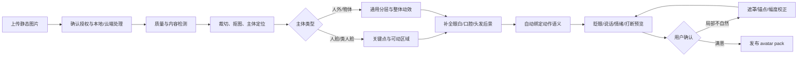
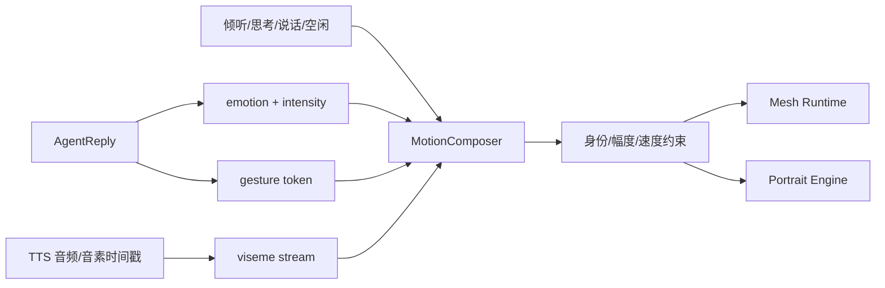

# 08 静态图片动态化

> 项目代号：**Aria**（伴侣中枢 / Companion Hub）  
> 文档版本：v1.0（2026-08-16）  
> 目标：用户上传一张拥有使用权的静态图片，系统在本地优先完成检测、修复、动作适配和预览，生成可实时眨眼、呼吸、说话和轻微转头的动态伴侣。

---

## 1. 能做到什么

单张图片缺少被遮挡区域、侧脸、口腔、后脑和身体背面的真实信息，因此需要按质量分层，不承诺“一键得到专业 Live2D”。

| 等级 | 产物 | 自动化程度 | 典型能力 | 适用 |
|---|---|---:|---|---|
| L0 静态增强 | 分离背景的立绘 | 全自动 | 呼吸缩放、整体漂浮、光效 | 任意人物/人外/物体 |
| L1 轻量 2D | 浏览器网格变形角色 | 高 | 眨眼、眼神、口型、轻微点头、呼吸 | 插画、人脸清晰的半身图 |
| L2 神经 2.5D | 单图肖像驱动运行时 | 高，需 GPU | 连续表情、说话、较自然小幅转头 | 写实或主流插画肖像 |
| L3 半自动 Live2D | 分层 PSD + 建模工程 | 中 | 稳定大角度、独立头发/服装物理、精细动作 | 用户愿意校正或交给建模师 |

默认先生成 L1；检测到兼容 GPU 时可提供 L2 预览。L3 是精修升级路线，不应伪装成全自动能力。

## 2. 用户流程



首个可用结果目标控制在 1～3 分钟；GPU 神经预处理可以后台继续优化，不能阻塞先使用 L0/L1。

## 3. 输入要求与质量评分

推荐输入：

- 正面或轻微 3/4 角度，脸部无遮挡；
- 至少 1024px，人物占画面 40% 以上；
- 眼睛和嘴巴边界清晰；
- 背景与人物有足够区分；
- 半身图优于只包含头部的极近特写；
- 用户确认拥有图片和角色的使用权。

系统输出 `animation_readiness_score`，由分辨率、清晰度、脸角度、遮挡、主体完整度、背景复杂度和风格兼容度组成。低分时指出可行动原因，例如“左眼被头发完全遮挡”，而不是只报失败。

## 4. 离线制作流水线

### 4.1 安全接收

1. 解码后重新编码 PNG/WebP，移除 EXIF、ICC 异常块和隐写型附加数据；
2. 限制像素、文件大小和解压比，拒绝畸形图片；
3. 计算内容哈希，原图与派生资源使用同一 asset lineage；
4. 默认本地处理；若使用云端补画/生成，必须单独展示将发送的图片和 provider。

### 4.2 主体检测与分割

- 检测人脸、身体框、面部关键点和主体类型；
- 使用图像分割得到人物/头发/面部/服装/背景候选遮罩；
- 人脸失败时退化为通用主体，不阻止非人形角色制作；
- 允许用户用“点击主体、涂抹保留/删除”修正遮罩。

### 4.3 可动区域

人形/类人形最低区域：左右眼、左右眉、嘴、脸、前发、后发、颈部、上身和背景。L1 不要求真实 PSD 分层，而是建立局部 mesh、控制点、遮罩和绘制顺序。

```jsonc
{
  "regions": {
    "face": { "mesh": "face.bin", "z": 40 },
    "eye_l": { "mask": "eye_l.png", "z": 50 },
    "eye_r": { "mask": "eye_r.png", "z": 50 },
    "mouth": { "mask": "mouth.png", "z": 55 },
    "hair_front": { "mask": "hair_front.png", "z": 60 },
    "body": { "mesh": "body.bin", "z": 20 }
  }
}
```

### 4.4 遮挡补全

眼睛闭合、嘴巴张开或头部轻转时会暴露原图没有的像素。系统生成最小必要补丁：眼白/虹膜、闭眼线、口腔、牙齿、脸部边缘、头发后方和透明背景。

补全必须保守：只用于被遮挡的小区域，禁止偷偷重画整张脸。所有补丁均可开关和重生成；用户能对比原图。

## 5. L1：浏览器轻量 2D 运行时

L1 是推荐 MVP，因为稳定、可控、能在普通设备运行：

- Canvas/WebGL 渲染原图纹理；
- 基于 landmark 和局部三角网格做形变；
- 眼睛使用遮罩压缩/眼睑曲线实现眨眼；
- 嘴部使用 5～8 个预生成形态或局部 warp；
- 身体做 4～6 秒低幅呼吸；
- 前发、饰品和衣摆使用少量弹簧骨；
- 头转限制在约 ±8～12°，超过即钳制，避免露出不存在的侧脸。

L1 不生成逐帧视频，因此可以接受实时 `emotion/gesture/viseme` 控制，并能在语音打断时立即停口型。

## 6. L2：神经 2.5D 肖像驱动

对兼容人脸，可使用“源图 + 动作模板/驱动参数”生成连续肖像帧。推荐把动作模板预先制作成本地、无身份信息的眨眼、点头、说话和情绪模板；用户图片只作为 source。

```text
emotion + gesture + viseme
  → MotionComposer 合成标准驱动参数/短模板
  → PortraitAnimationEngine(source, driving)
  → 连续 RGBA 帧
  → WebRTC/本地纹理流
```

工程候选为 LivePortrait 一类的肖像 animation/retargeting 引擎；音频直驱视频可参考 SadTalker 类路线。但这类模型更适合 GPU 服务，必须验证插画风格、长时间一致性、延迟和许可证后再选型。

为了实时交互，不能每句话生成完整 MP4 再播放。应当：

- 初始化时缓存 source appearance 特征；
- 空闲/眨眼/倾听使用短循环或参数模板；
- TTS 到来后按 100～200ms 小段生成；
- 维护 300～600ms 播放缓冲；
- 打断时丢弃未播放帧并切回倾听模板；
- GPU 不足或延迟升高时无缝退回 L1。

## 7. 音频、情绪和动作驱动



动作合成器负责冲突：说话口型优先于微笑嘴形；打断优先于所有手势；眨眼与大幅惊讶眼睛不能同时发生；头部和身体动作有速度/加速度上限。

## 8. L3：升级为 Live2D

Live2D Cubism 的生产流程需要分层素材和人工建立 deformers/parameters。系统可以自动生成“建模准备包”，但不能保证直接得到 `.moc3`：

1. 输出建议分层 PSD：眼睛、眉、嘴、脸、头发、身体、服装、配件；
2. 标记需要人工补画的区域和置信度；
3. 生成参数映射建议及表情/动作清单；
4. 在向导中让用户或建模师校正绘制顺序、锚点和遮挡；
5. 经 Cubism Editor 建模和导出后，再作为标准 Live2D 包导回系统。

官方 Cubism 工作流本身要求为建模准备分层 PSD，因此“单张合并 PNG 一键变专业 Live2D”不能作为 v1 验收承诺。

## 9. 运行时接口

统一输出一个 `generated-portrait` 形象包：

```jsonc
{
  "engine": "portrait2d",
  "tier": "L1",
  "source_asset_id": "asset_xxx",
  "capabilities": {
    "emotions": ["neutral", "happy", "tender", "concerned", "surprised"],
    "gestures": ["nod", "look_aside", "lean_in"],
    "visemes": ["A", "I", "U", "E", "O", "closed"],
    "head_yaw_max": 10,
    "supports_interrupt": true
  },
  "fallback": "static-breathe"
}
```

核心认知层不关心 L1/L2/L3，只发通用动作；运行时根据能力表映射或降级。

## 10. 任务状态与 API

```text
uploaded → inspecting → segmenting → repairing → rigging → preview_ready
  → needs_user_fix / published / failed / cancelled
```

| 方法 | 路径 | 说明 |
|---|---|---|
| POST | `/api/v1/avatars/from-image` | 上传并创建动态化任务 |
| GET | `/api/v1/avatars/jobs/{id}` | 阶段、进度、质量分和可行动问题 |
| GET | `/api/v1/avatars/jobs/{id}/preview` | 隔离预览会话 |
| PATCH | `/api/v1/avatars/jobs/{id}/masks` | 用户修正主体/区域遮罩 |
| PATCH | `/api/v1/avatars/jobs/{id}/rig` | 校正锚点、幅度和映射 |
| POST | `/api/v1/avatars/jobs/{id}/regenerate` | 仅重做指定补丁/阶段 |
| POST | `/api/v1/avatars/jobs/{id}/publish` | 生成用户 avatar instance |
| POST | `/api/v1/avatars/jobs/{id}/export-live2d-kit` | 导出分层和人工建模任务包 |

任务可取消、可重入；每阶段产物按内容哈希缓存。失败不得留下半发布的形象实例。

## 11. 隐私、授权与滥用边界

- 上传时确认图片来源和授权；真人照片需声明本人或获得当事人许可；
- 默认本地处理，云端模型按阶段逐项授权；
- 原图、补丁、特征和预览帧属于 L2 视觉资产，不进入对话记忆或日志；
- 禁止将该能力用于冒充真人、规避同意或制作欺骗性身份；真人形象显示“用户自定义”来源标识；
- 日志只记录 asset/job ID、模型版本、耗时和错误码；
- 删除任务时清除原图、特征缓存、补丁、预览和派生形象；备份恢复重放删除台账；
- 第三方模型权重、代码和生成产物的许可证必须单独审查，不能只看仓库代码许可证。

## 12. 验收标准

| 指标 | L1 目标 | L2 目标 |
|---|---:|---:|
| 首次预览时间 | P90 ≤ 3 分钟 | P90 ≤ 8 分钟（含模型预热除外） |
| 交互帧率 | 桌面 ≥ 60fps，低性能 ≥ 30fps | GPU 桌面 ≥ 24fps |
| 动作到画面延迟 | P90 ≤ 100ms | P90 ≤ 400ms |
| 口型停下 | 打断后 ≤ 200ms | 打断后 ≤ 500ms |
| 身份稳定性 | 关键帧无明显五官漂移 | 连续 10 分钟无渐进漂移 |
| 故障降级 | 任意阶段可回退静态呼吸 | 自动退回 L1，不中断对话 |

人工验收另检查：闭眼是否穿帮、张嘴是否露洞、发丝是否撕裂、背景边缘是否闪烁、头转是否暴露缺失区域、情绪是否改变身份。

## 13. 分阶段实现

| 阶段 | 内容 |
|---|---|
| M4A.1 | L0/L1：安全上传、抠图、质量评分、面部关键点、呼吸/眨眼/5 类口型、预览校正 |
| M4A.2 | 分区遮罩、补丁生成、头部轻转、头发/饰品物理、非人形整体动效 |
| M5 | L2 GPU 引擎、动作模板流式生成、自动降级和多终端纹理流 |
| M5+ | 分层 PSD/建模准备包、半自动 Live2D 工作台和更多风格适配 |
