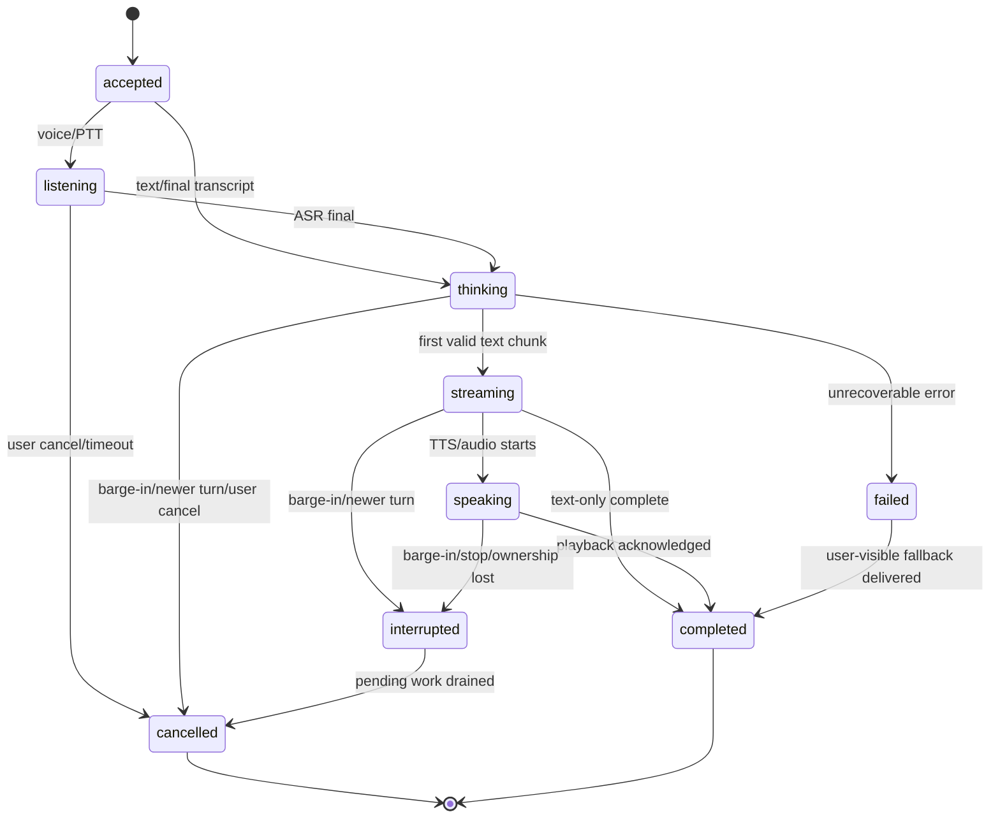
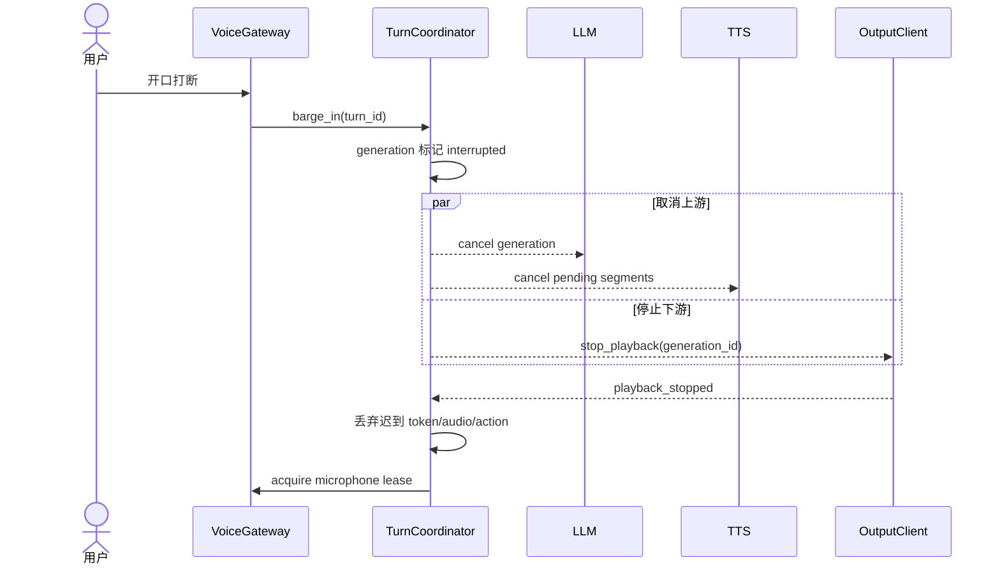

# 09 运行状态机与多端同步

> 项目代号：**Aria**（伴侣中枢 / Companion Hub）
> 文档版本：v1.2（2026-08-26）
> 目标：统一文字、语音、主动互动、形象动作和多终端行为，保证取消及时、状态可恢复、同一回复不会在多个终端失控播放。

> **实现状态**：TurnCoordinator 核心已落地（`app/runtime/turn_coordinator.py` + `lease.py`），9 状态 CAS 转移、generation 活性检查、音频/麦克风租约仲裁、用户模式优先级、重启恢复均已实现；Chat/Voice WebSocket 全链路已接入状态机与租约管理。多端同步（跨设备状态广播、麦克风所有权仲裁）待下一批次推进。

---

## 1. 状态分层

系统不使用一个巨大的全局状态枚举，而分为四个正交状态域：

| 状态域 | 示例 | 持久化 | 作用域 |
|---|---|---|---|
| 交互状态 | idle/listening/thinking/speaking/interrupted | 事件持久化；当前快照可重建 | 每个 conversation turn |
| 可用性状态 | online/degraded/offline/error | 记录变更事件 | 每服务、每终端 |
| 用户模式 | available/focus/dnd/asleep/away | 持久化 | 全局，可有设备观测来源 |
| 展现状态 | avatar emotion/gesture/theme/audio playback | 仅保存最终偏好；瞬时状态不持久化 | 每终端 |

这样可以表达“用户处于 DND，但聊天终端在线、系统降级到文字、本轮正在 thinking”，而不产生组合爆炸。

## 2. 交互回合状态机



### 2.1 状态定义

| 状态 | 含义 | 允许副作用 |
|---|---|---|
| `accepted` | 根输入已持久化并分配 turn ID | 仅确认接收 |
| `listening` | 正在收音/VAD/ASR | ASR partial，不写长期记忆 |
| `thinking` | 检索、工具、LLM 正在执行 | 可写 Trace，不可对用户产生最终输出 |
| `streaming` | 已有可验证文字块 | 推送文字；可启动句级 TTS |
| `speaking` | 某终端拥有音频播放租约 | 音频、口型和可中断动作 |
| `interrupted` | 用户打断或更新输入使当前输出失效 | 立即停播；禁止再发送陈旧输出 |
| `cancelled` | 所有待执行步骤已确认取消/丢弃 | 仅取消审计 |
| `failed` | 关键步骤失败且需要降级 | 发送明确的系统状态或降级结果 |
| `completed` | 文本完成且所需终端确认播放/丢弃 | 可异步提交记忆候选 |

## 3. 标识与新旧回合判定

每个交互至少包含：

```jsonc
{
  "conversation_id": "uuidv7",
  "turn_id": "uuidv7",
  "turn_seq": 42,
  "correlation_id": "uuidv7",
  "root_event_id": "uuidv7",
  "generation_id": "uuidv7",
  "cancel_token_id": "uuidv7"
}
```

- `turn_seq` 在单个会话内单调递增；
- 新用户输入默认使同会话中更旧且可中断的 generation 失效；
- 所有流式块、TTS 段、动作和记忆候选携带 `generation_id`；
- 输出网关只接受当前 active generation；迟到块直接丢弃并记录 `stale_generation`；
- 重试保持同一 `generation_id`，用户重新提问产生新 generation。

## 4. 取消与打断语义

取消采用协作式传播：



取消完成条件：终端确认停止播放、待发送队列清空、旧 generation 不再允许副作用。无法真正终止的外部 API 请求可以继续消耗资源，但其结果必须被隔离丢弃并计入“取消浪费成本”。

指标目标：本地播放停止 P90 ≤ 200ms；旧 generation 最后一个可见文字块 P90 ≤ 300ms。

## 5. TurnCoordinator

新增 `TurnCoordinator` 作为交互编排边界：

- 创建 turn/generation/cancel token；
- 维护状态转移并验证合法性；
- 选择音频输入和输出终端；
- 向检索、工具、LLM、TTS 传播取消；
- 拒绝迟到的流式块和动作；
- 记录降级原因与最终完成状态；
- 重启后从事件重建未完成回合，并将不安全续跑的回合标记为 cancelled。

状态转移使用 compare-and-set：

```sql
UPDATE interaction_turn
SET state = 'interrupted', state_version = state_version + 1
WHERE id = :turn_id
  AND state_version = :expected
  AND state IN ('thinking','streaming','speaking');
```

## 6. 输出所有权和播放租约

“多端同时在线”不等于“所有端一起说话”。每类输出使用策略：

| 输出 | 默认策略 |
|---|---|
| 文字 | 所有订阅同一会话的终端同步显示 |
| TTS 音频 | 仅一个 `audio_owner` 播放 |
| Live2D/VRM 口型 | 音频所有者同步；其他端只显示文字和低幅情绪 |
| 主动通知 | 根据 presence、设备能力、通知偏好选择一个首选端 |
| P0 系统告警 | 管理端和本地系统通知，可多端但去重 |

音频租约：

```jsonc
{
  "lease_type": "audio_output",
  "holder_device_id": "desktop-main",
  "generation_id": "gen_xxx",
  "expires_at": "...",
  "epoch": 17
}
```

租约短期有效并续约。设备断线、用户手动接管或更高 epoch 出现时，旧设备立即停止。服务端以 epoch 防止网络分区导致双播。

## 7. 麦克风和唤醒所有权

- 同一用户同一时刻只允许一个 `microphone_owner` 进入 listening；
- PTT 具有最高优先级，可从唤醒词终端接管；
- 新终端请求时，旧终端显示“麦克风已在另一设备使用”；
- 服务端不转发原始麦克风流给其他终端；
- 唤醒词默认本机检测，只有唤醒后的音频片段进入中枢；
- DND 不禁止用户主动 PTT，只禁止主动播报和非紧急通知。

## 8. 状态归属

| 状态 | 归属 | 同步策略 |
|---|---|---|
| Persona、关系、记忆 | 全局 | 服务端事实源 |
| 当前形象实例 | 全局默认 | 服务端；设备可临时覆盖 |
| 账户主题 | 全局 | 服务端版本化 |
| 窗口位置、音量、渲染质量 | 设备本地 | 不跨端 |
| 本机主题覆盖 | 设备本地 | 不覆盖账户主题 |
| DND/睡眠/离家 | 全局用户模式 | 服务端规则合并 |
| 当前会话消息 | 会话级 | 按 seq 同步 |
| 正在播放/动画帧/麦克风 | 瞬时设备级 | 租约和心跳 |
| 配置草稿 | 服务端用户级 | 乐观锁和版本冲突 |

## 9. 多端消息同步

客户端保存每个 stream 的 `last_seq`：

```text
连接 → authenticate → client_hello(device_id, structured_capabilities, cursors)
→ 服务端补发 last_seq 之后的持久事件
→ 发送 snapshot_revision
→ 进入实时流
```

消息只按 `conversation_id` 保序，不承诺跨会话全局顺序。客户端收到重复 event ID 必须幂等；发现 seq 缺口时暂停应用后续增量并请求补拉。

WebSocket 事件 envelope：

```jsonc
{
  "proto_version": 1,
  "stream": "conversation:uuidv7",
  "seq": 184,
  "event_id": "uuidv7",
  "type": "reply.delta",
  "generation_id": "uuidv7",
  "payload": {}
}
```

## 10. 并发编辑与冲突

配置、主题、形象和记忆编辑使用 ETag/revision：

```http
PATCH /api/v1/ui/preferences
If-Match: "revision-42"
```

版本不匹配返回 `409 conflict` 和服务器 diff，不使用最后写入者静默覆盖。简单设备偏好可以 last-write-wins，但审计中记录设备和旧/新版本。

记忆冲突不能自动覆盖：多个终端同时编辑同一记忆时创建候选版本，要求用户合并或选择。

## 11. 用户模式合并

优先级：

```text
用户手动设置 DND
  > 用户手动设置 focus/available
  > 明确日程规则
  > 高置信睡眠/离家感知
  > 低置信环境推断
```

所有自动模式都有 `reason/source/confidence/expires_at`。低置信推断不能覆盖用户手动选择；手动模式可设置“直到某时间”或“直到我关闭”。

## 12. 降级状态和用户提示

故障不得伪装成人格情绪。统一 `ServiceCapabilitySnapshot`：

```jsonc
{
  "chat": "available",
  "memory": "degraded",
  "voice_input": "available",
  "voice_output": "unavailable",
  "avatar": "fallback_static",
  "reason_codes": ["tts_provider_down", "vector_index_rebuilding"]
}
```

| 故障 | 用户可见行为 |
|---|---|
| 云模型不可达 | 明确提示切到本地模型及能力变化 |
| 所有模型不可用 | 保存消息并显示“暂时无法生成回复”，不伪造台词 |
| 记忆服务不可用 | 本轮继续普通对话，明确不使用长期记忆 |
| TTS 失败 | 保留文字，停止口型，显示“语音暂不可用” |
| ASR 失败 | 保留录音重试选项或切换文字；默认不永久保存音频 |
| 形象加载失败 | 回退静态头像，不影响对话 |
| MQTT 离线 | 禁止传感器主动推断，显示设备数据已过期 |
| 数据库只读 | 禁止声称“已记住”；允许只读浏览并提示 |

## 13. 首次安装与本地身份

单用户不等于无身份系统：

1. 首次启动生成一次性 setup code，仅在本机控制台显示，15 分钟过期；
2. 用户创建管理员密码或 Passkey；密码使用内存困难哈希；
3. 浏览器使用 Secure/HttpOnly/SameSite Cookie，写操作校验 CSRF；
4. 新设备通过已登录管理端显示的短期配对码加入；
5. access session 短期有效，refresh session 可撤销并绑定设备；
6. 管理高风险操作要求密码/Passkey 重新验证；
7. 恢复方式为本机 recovery key，展示一次，保存其哈希；
8. 所有 session、配对和撤销写入审计。

Tauri 凭据存系统安全存储；PWA 不把长期 token 放入 localStorage。WebSocket 使用已有会话升级并在过期前重新认证。

## 14. 数据模型

```sql
CREATE TABLE interaction_turn (
  id UUID PRIMARY KEY,
  conversation_id TEXT NOT NULL,
  turn_seq BIGINT NOT NULL,
  correlation_id UUID NOT NULL,
  generation_id UUID NOT NULL UNIQUE,
  state TEXT NOT NULL,
  state_version INT NOT NULL DEFAULT 1,
  input_event_id UUID NOT NULL,
  cancel_reason TEXT,
  degradation JSONB,
  created_at TIMESTAMPTZ DEFAULT now(),
  completed_at TIMESTAMPTZ,
  UNIQUE (conversation_id, turn_seq)
);

CREATE TABLE device_client (
  id TEXT PRIMARY KEY,
  name TEXT, client_type TEXT NOT NULL,
  capabilities JSONB NOT NULL,
  revoked_at TIMESTAMPTZ,
  last_seen_at TIMESTAMPTZ
);

CREATE TABLE runtime_lease (
  lease_type TEXT NOT NULL,
  holder_device_id TEXT NOT NULL REFERENCES device_client(id),
  generation_id UUID,
  epoch BIGINT NOT NULL,
  expires_at TIMESTAMPTZ NOT NULL,
  PRIMARY KEY (lease_type)
);

CREATE TABLE user_mode (
  id BIGSERIAL PRIMARY KEY,
  mode TEXT NOT NULL,
  source TEXT NOT NULL,
  reason TEXT,
  confidence REAL,
  priority INT NOT NULL,
  starts_at TIMESTAMPTZ DEFAULT now(),
  expires_at TIMESTAMPTZ,
  superseded_at TIMESTAMPTZ
);
```

## 15. 验收标准

- 同一 generation 迟到 100 个流式块，用户端显示和 TTS 均为 0 个；
- 三个终端同时在线时，文字全部同步，TTS 只在租约持有端播放；
- 音频所有者网络断开后 2 秒内停止旧租约并允许新端接管；
- seq 缺口、重复和乱序测试后，各端最终消息一致；
- 打断后旧 generation 不写记忆、不更新关系状态、不执行工具副作用；
- 配置 revision 冲突返回 409，不静默覆盖；
- DND 下主动消息零播报，用户 PTT 仍可使用；
- 任一依赖故障都有明确、非人格化的降级提示；
- 首次安装、配对、撤销、恢复和重新验证均有自动化安全测试。
