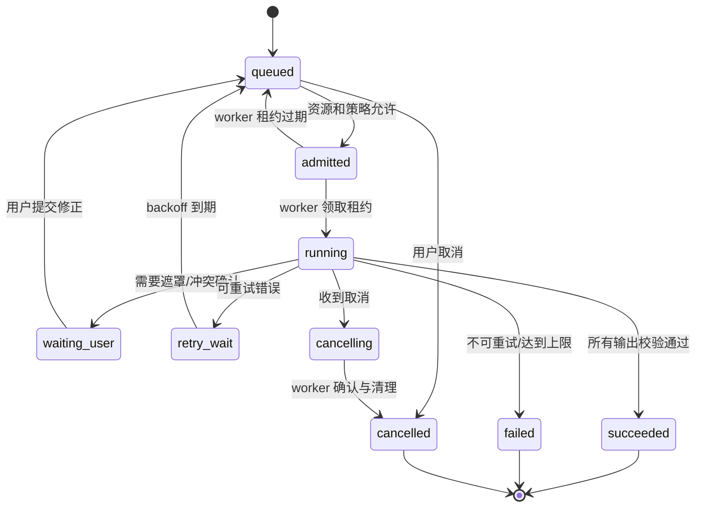
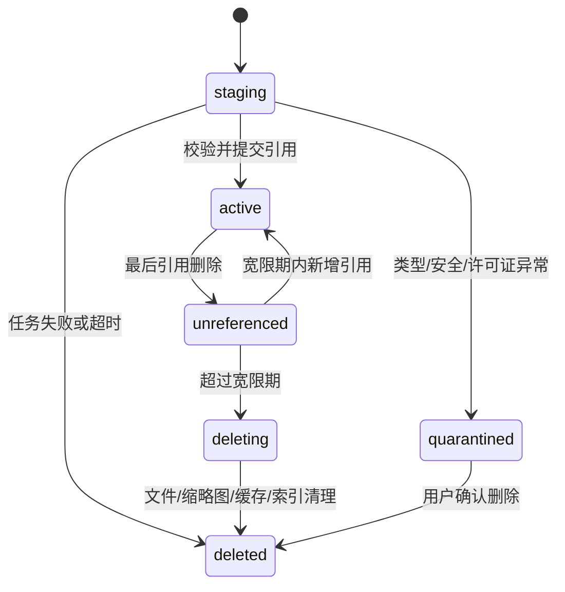
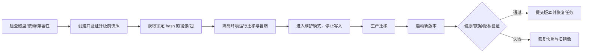

# 10 任务、资产与升级运维

> 项目代号：**Aria**（伴侣中枢 / Companion Hub）
> 文档版本：v1.1（2026-08-26）
> 目标：让反思、embedding、备份、模型/形象导入、单图动态化等长任务可恢复、可取消、可限流；让大型资产可追踪、可删除；让版本升级可验证、可回滚。
> **实现状态**：Job Engine v1 与 Asset Store v1 已落地（`app/jobs/engine.py`、`app/jobs/asset_store.py`），Admin Jobs API 已接入；Worker 分布式心跳、GPU 资源准入控制、Scheduler、升级流程仍为设计/预留。

---

## 1. 事件、定时器和长任务的边界

| 机制 | 适用 | 不适用 |
|---|---|---|
| Event/outbox/inbox | 短小业务事件、至少一次通知、幂等副作用 | 分钟级 GPU 制作、进度和人工校正 |
| Scheduler | 在某时间创建事件或 Job | 承担实际长时间计算 |
| Job System | 多步骤、可取消、可重试、需资源配额的工作 | 实时聊天流 |
| Runtime Queue | TTS/动画等低延迟临时帧 | 可靠事实和恢复依据 |

事件触发 Job 时，在同一事务写 `job` 和 outbox；Job 完成后再产生领域事件，例如 `avatar.preview_ready`。

## 2. Job 状态机



### 2.1 状态规则

- worker 使用租约领取任务，进程崩溃后租约过期可重领；
- step 输出先写临时资产，校验后原子提交引用；
- 重试必须声明 `idempotency_key`，避免重复生成资产或重复扣费；
- `waiting_user` 不占 GPU/worker，并设置提醒和清理期限；
- `cancelling` 后不得开始新 step；不可中断的外部调用结果到达后丢弃；
- succeeded 只表示产物通过机器校验，不等于用户已发布。

## 3. Job 数据模型

```sql
CREATE TABLE job (
  id UUID PRIMARY KEY,
  kind TEXT NOT NULL,
  owner TEXT NOT NULL DEFAULT 'local-user',
  status TEXT NOT NULL,
  priority INT NOT NULL DEFAULT 50,
  idempotency_key TEXT UNIQUE,
  input JSONB NOT NULL,
  progress REAL NOT NULL DEFAULT 0,
  current_step TEXT,
  resource_class TEXT NOT NULL DEFAULT 'cpu-small',
  attempts INT NOT NULL DEFAULT 0,
  max_attempts INT NOT NULL DEFAULT 3,
  available_at TIMESTAMPTZ DEFAULT now(),
  lease_owner TEXT, lease_expires_at TIMESTAMPTZ,
  cancel_requested_at TIMESTAMPTZ,
  error_code TEXT, error_detail_safe JSONB,
  created_at TIMESTAMPTZ DEFAULT now(),
  started_at TIMESTAMPTZ, completed_at TIMESTAMPTZ
);

CREATE TABLE job_step (
  id BIGSERIAL PRIMARY KEY,
  job_id UUID NOT NULL REFERENCES job(id) ON DELETE CASCADE,
  name TEXT NOT NULL,
  attempt INT NOT NULL,
  status TEXT NOT NULL,
  progress REAL DEFAULT 0,
  checkpoint JSONB,
  started_at TIMESTAMPTZ,
  completed_at TIMESTAMPTZ,
  UNIQUE (job_id, name, attempt)
);

CREATE TABLE job_artifact (
  job_id UUID NOT NULL REFERENCES job(id) ON DELETE CASCADE,
  step_name TEXT NOT NULL,
  asset_id UUID NOT NULL,
  role TEXT NOT NULL,
  committed BOOLEAN DEFAULT false,
  PRIMARY KEY (job_id, step_name, asset_id, role)
);
```

## 4. 调度与资源准入

资源等级：

| 资源类 | 示例 | 默认并发 |
|---|---|---:|
| `io-small` | 导出、校验和、provider 请求 | 8 |
| `cpu-small` | 摘要、规则回放、图片解码 | 2～4 |
| `cpu-large` | ASR 批处理、视频编码 | 1 |
| `gpu-interactive` | 实时 ASR/2.5D 帧 | 保留容量，优先级最高 |
| `gpu-batch` | 单图预处理、模型转换 | 1，空闲时运行 |
| `maintenance` | 备份、索引重建、GC | 非活跃时段 |

准入控制考虑 CPU、内存、显存、磁盘余量、温度、用户模式和交互负载。实时语音永远优先于批量动态化；GPU batch 在语音开始时可暂停到 checkpoint 或延迟下一 step。

优先级不能无限饿死低级任务：使用 aging 提升等待任务优先级。每个 Job 有最大运行时间、最大输出大小和费用预算。

## 5. Scheduler

Scheduler 只负责可靠地产生到期事件/Job：

- 数据库使用 `TIMESTAMPTZ`，展示时按 IANA 时区；
- 重复计划保存 rule、timezone、next_fire_at 和 misfire policy；
- DST、系统休眠和停机恢复必须有确定行为；
- misfire 策略：`skip`、`fire_once`、`catch_up_limited`；主动问候默认 skip，备份默认 fire_once；
- 每次执行有唯一 occurrence key，防止重启重复触发；
- 用户修改时区后重新计算未来 occurrence，不重写历史。

## 6. Asset Store

大型资源不直接塞入 PostgreSQL。v1 使用本地内容寻址文件库：

```text
data/assets/
└─ sha256/
   └─ ab/
      └─ cd/
         └─ abcdef...        # 原始字节
```

数据库保存元数据、引用和派生关系。文件写入流程：临时目录写入 → fsync → 校验大小/hash/MIME → 原子移动到内容地址 → 事务提交 asset/reference。

### 6.1 数据模型

```sql
CREATE TABLE asset (
  id UUID PRIMARY KEY,
  content_hash TEXT UNIQUE NOT NULL,
  byte_size BIGINT NOT NULL,
  media_type TEXT NOT NULL,
  privacy_level TEXT NOT NULL,
  storage_key TEXT NOT NULL,
  state TEXT NOT NULL DEFAULT 'active',
  encryption_key_ref TEXT,
  created_at TIMESTAMPTZ DEFAULT now(),
  verified_at TIMESTAMPTZ
);

CREATE TABLE asset_reference (
  asset_id UUID NOT NULL REFERENCES asset(id),
  owner_kind TEXT NOT NULL,
  owner_id TEXT NOT NULL,
  role TEXT NOT NULL,
  created_at TIMESTAMPTZ DEFAULT now(),
  PRIMARY KEY (asset_id, owner_kind, owner_id, role)
);

CREATE TABLE asset_derivation (
  parent_asset_id UUID NOT NULL REFERENCES asset(id),
  child_asset_id UUID NOT NULL REFERENCES asset(id),
  operation TEXT NOT NULL,
  model_version TEXT,
  params_hash TEXT,
  PRIMARY KEY (parent_asset_id, child_asset_id, operation)
);
```

## 7. 资产生命周期与垃圾回收



- staging 默认 24 小时清理；
- 未引用资产宽限 7 天，避免事务/恢复竞态；
- GC 只处理 DB 明确标记的精确 storage key，不通过目录扫描拼接删除命令；
- 删除前重新验证 resolved path 位于 asset root；
- 每周执行 DB→文件和文件→DB 双向审计；
- 内容相同可物理去重，但不同隐私等级不得因此扩大访问范围。

## 8. 默认数据保留策略

| 数据 | 默认保留 | 用户可调 | 删除说明 |
|---|---:|---|---|
| 普通消息 L1 | 永久，直到用户删除 | 是 | 可按会话/时间批量删除 |
| L2 事件标签 | 90 天 | 0/30/90/永久 | 不含原始遥测 |
| L3 原始遥测 | 仅内存窗口 ≤ 10 分钟 | 只允许更短 | 永不落库 |
| ASR partial | 当前回合 | 否 | final 后清理 |
| 原始语音缓存 | 默认不保存 | 可选 1/24 小时 | 不进入备份 |
| TTS 音频缓存 | 24 小时 | 0～7 天 | 可按文本/音色 hash 复用 |
| 普通事件 | 90 天 | 30～365 天 | 聚合指标可更久 |
| Timeline 索引 | 跟随 Source 或最长 365 天的可配置窗口 | 是 | Source 被删除时同步失效/删除，不能成为删除旁路 |
| 设备聚合数据 | 按通道策略，默认 90 天 | 是 | 高频原始遥测先聚合，再决定是否生成 Timeline 事件 |
| Trace | 14 天 | 7～30 天 | 无正文 |
| 指标聚合 | 180 天 | 30～365 天 | 不含业务正文 |
| 安全审计 | 365 天 | 最短 90 天 | 不含敏感正文 |
| 上传原图/当前形象 | 使用期间 | 是 | 删除实例后进入清理任务 |
| 生成中间产物 | 成功后 7 天 | 1～30 天 | 发布资产单独保留 |
| 失败 Job 输入 | 24 小时 | 0～7 天 | 隐私失败立即清理 |
| 备份 | 14 天＋每周 8 份 | 是 | 加密；恢复后重放删除台账 |

保留策略修改只影响未来清理计划；用户执行“立即删除”时不等待正常到期。

Timeline 只负责历史索引和有限摘要，不能用来绕过 Source 的 retention。具体的历史回溯和 Memory Promotion 语义见 [31-记忆时间线与历史回溯设计.md](./31-记忆时间线与历史回溯设计.md)。

## 9. 配额与磁盘保护

v1 默认软配额：形象与主题资产 10GB、任务临时空间 5GB、日志 2GB、备份单独配置。阈值：

- 70%：后台提示趋势；
- 85%：暂停非必要预生成和延长缓存；
- 95%：拒绝大型上传/GPU batch，只允许聊天和删除；
- 磁盘剩余低于数据库安全线时进入只读保护，明确提示用户。

上传前按解码后像素和预估派生空间做 reservation，避免“原图很小但生成临时文件耗尽磁盘”。

## 10. 备份边界

备份 manifest 明确包含：

- PostgreSQL 一致性快照；
- 配置版本和 secret 引用，不包含 secret 明文；
- 被引用的资产清单与 hash；
- 人格、主题、形象和设备配置；
- deletion ledger；
- schema/app/asset format 版本。

默认不备份：L3、临时预览帧、ASR partial、可重建缓存、隔离区恶意资源、模型权重（保存下载来源与 hash）。

恢复在隔离目录进行，校验所有 hash 和兼容性、重放删除台账后才能原子切换。

## 11. 版本体系

| 版本 | 示例 | 规则 |
|---|---|---|
| App version | `1.2.0` | SemVer |
| DB schema | Alembic revision | 只前进；回滚依赖备份/蓝绿，不假设 down migration 安全 |
| Protocol | `proto_version: 1` | 兼容窗口至少 N 和 N-1 |
| Config schema | domain + version | 迁移后保留旧版本以便应用回滚 |
| Asset schema | avatar/theme/job artifact version | 读取旧版或显式转换 |
| Model/Prompt | immutable ID + hash | 结果可追溯 |
| Embedding | model + dimension + version | 双写/回填/切读 |

应用启动前执行 compatibility check；不兼容时拒绝半启动，并保留管理恢复页。

## 12. 升级流程



升级时：

- 正在 speaking 的回合先完成或取消；不跨升级继续流式 generation；
- queued Job 保留，running Job 回到 queued 或从 checkpoint 恢复；
- 配置发布冻结；
- MQTT 可继续由 broker 缓冲有限消息，过期遥测不补触发主动行为；
- 数据迁移必须可重复运行，并记录 migration run；
- destructive migration 采用 expand→migrate→contract，至少跨一个版本删除旧字段。

## 13. 回滚策略

代码回滚和数据回滚分开：

- 如果新代码兼容新 schema，优先只回滚应用镜像；
- 如果 schema 不兼容，通过升级前快照整体恢复，不执行未经验证的 down migration；
- 资产格式转换保留原资产，直到新版本观察期结束；
- embedding 切换保留旧索引，确认质量后再 GC；
- 回滚后客户端收到 capability snapshot，避免新版 UI 使用旧服务能力。

恢复目标：核心文字服务 RTO ≤ 30 分钟；可接受数据损失 RPO ≤ 24 小时仅适用于灾难恢复，正常崩溃 RPO=0。

## 14. 依赖、模型和素材清单

维护机器可读 `third_party_inventory`：

```yaml
- id: liveportrait-model-vx
  kind: model_weight
  version: "..."
  source: "..."
  sha256: "..."
  code_license: "..."
  weight_license: "..."
  commercial_use: unknown
  redistribution: false
  output_restrictions: "reviewed"
  approved_for: [local_experiment]
```

分类包括：代码包、SDK、模型权重、数据集、字体、Live2D/VRM/语音/主题资产。分别审查代码、权重、数据和产物条款；许可证不明时不得进入默认安装或公开分发。

构建生成 SBOM，镜像和下载权重使用 hash 固定；发现高危漏洞或许可证变化时在管理后台告警。

## 15. 工具与模型安全

工具定义：

```jsonc
{
  "name": "device.set_light",
  "risk": "write-reversible",
  "allowed_privacy": ["L0", "L1"],
  "requires_confirmation": true,
  "timeout_ms": 3000,
  "max_calls_per_turn": 1,
  "schema_version": 1
}
```

风险等级：

| 等级 | 示例 | 策略 |
|---|---|---|
| `read-local` | 查询设备状态、查记忆 | 自动，结果仍视为不可信数据 |
| `write-reversible` | 调灯、创建提醒 | 默认确认，可为明确规则授权 |
| `write-external` | 发消息、创建外部日程 | 每次确认并预览目标/内容 |
| `destructive` | 删除记忆、删除资产 | 不允许模型直接执行，跳转受控 UI |
| `safety-critical` | 门锁、加热、医疗设备 | v1 禁止 |

工具调用由服务端 policy engine 决定，模型只能提出候选。所有参数重新校验；工具输出、网页、记忆、设备名称和上传文件均标记为不可信内容，不允许其中的文本改变系统指令或权限。

每轮限制工具次数、递归深度、费用和总时间；检测重复调用与循环。副作用工具使用 idempotency key，取消后的迟到工具结果不得触发后续动作。

## 16. 依赖服务降级与容量

维护容量表并在启动时探测：CPU 核数、内存、GPU/显存、磁盘、硬件编码能力。根据能力选择 profile：

```text
minimal: cloud LLM + text + static avatar
standard: local ASR + Live2D + cloud/local utility
gpu: local models + 2.5D + custom TTS
```

配置不能启用超过硬件能力的组合；用户强制启用时显示具体资源预测。OOM 后隔离失败 worker、释放模型并降级，不重启整个 Hub。

## 17. 运维验收

- worker 在每个 Job step 中间被终止后，任务可从 checkpoint 重跑且不重复提交资产；
- GPU batch 运行时开始语音对话，交互任务在 1 秒内取得资源或 batch 明确暂停；
- 制造 DB/文件不一致后，审计能发现且修复不误删有效资产；
- 上传压缩炸弹、路径穿越、伪 MIME、超大像素图均被拒绝；
- 磁盘达到 95% 后仍可聊天、浏览和删除，禁止大型写入；
- 从 N-1 升级 N 后主题、形象、配置和 queued Jobs 保持；失败可恢复旧版本；
- 恢复备份后已删除内容不会复活；
- 未知许可证模型不能进入默认路由；
- Prompt Injection 测试不能绕过工具风险等级、确认或隐私出口；
- SBOM、镜像 hash、模型 hash 和 migration run 均可审计。
