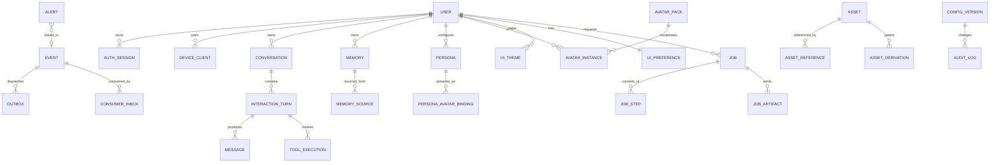

# 11 统一数据模型与 API 契约

> 项目代号：**Aria**（伴侣中枢 / Companion Hub）  
> 文档版本：v1.2（2026-08-17）
> 本文是数据库实体、标识、API 通用行为和版本兼容的唯一权威来源。其他文档中的 SQL 均为局部示意；实现以 Alembic migration 和本文约束为准。

---

## 1. 建模原则

1. 单用户 v1 仍显式保留 `user_id`，不使用散落的 `local-user` 字符串；
2. 对外可见和跨服务标识使用 UUIDv7；数据库内部高频明细可使用 BIGINT；
3. 所有用户可变实体带 `revision` 做乐观锁；
4. 所有领域事件带 event/correlation/causation ID；
5. 大文件进入 Asset Store，数据库只保存元数据和引用；
6. JSONB 只用于有版本 Schema 的扩展字段，不替代核心关系和约束；
7. 时间存 `TIMESTAMPTZ`，计划任务另外保存 IANA timezone；
8. 删除策略按领域显式声明，禁止依赖默认级联；
9. secret 只保存 secret reference，不进入配置、日志或审计 metadata；
10. 所有枚举先使用受控 TEXT + CHECK，升级时经 migration 扩展。

通用输入/输出 envelope、ContentPart、adapter manifest、L3 临时信号管道和投递回执以 [14-输入输出扩展契约.md](./14-输入输出扩展契约.md) 为唯一权威来源。传输层不得另造一套领域标识或载荷模型。

## 2. 标识规范

| 标识 | 格式 | 生命周期 |
|---|---|---|
| `user_id` | UUIDv7 | 用户实体永久 |
| `conversation_id` | UUIDv7 | 一段可持续会话 |
| `turn_id` | UUIDv7 | 一次用户输入及回复 |
| `generation_id` | UUIDv7 | 一次可取消生成尝试 |
| `event_id` | UUIDv7 | 每个持久领域事件 |
| `correlation_id` | UUIDv7 | 一条完整业务链路 |
| `causation_id` | UUIDv7/null | 直接上游 event ID |
| `trace_id` | 16-byte hex/OTel | 一次技术调用链，不作为业务主键 |
| `job_id` | UUIDv7 | 长任务 |
| `asset_id` | UUIDv7 | 逻辑资产；内容 hash 负责物理去重 |
| `device_id` | UUIDv7 | 客户端或 IoT 设备 |

客户端不能自行决定 `user_id`、权限、隐私等级或数据库主键；离线创建草稿可使用 `client_object_id`，同步时由服务端映射。

## 3. 领域关系总览



## 4. 领域表目录

| 领域 | 权威表 | 主删除策略 |
|---|---|---|
| 身份 | `app_user`, `auth_credential`, `auth_session`, `recovery_key`, `device_client` | 撤销会话；用户删除走专用 Job |
| 会话 | `conversation`, `interaction_turn`, `message` | 会话删除同时删除消息并触发衍生记忆检查 |
| 事件 | `event`, `outbox`, `consumer_inbox`, `dead_letter` | 按保留策略清理，不级联删除领域事实 |
| 记忆 | `memory`, `memory_version`, `memory_source`, `deletion_ledger` | 专用删除任务，不允许通用 ORM delete |
| 人格 | `persona`, `persona_version`, `agent_state` | 版本化；当前人格不可直接删除 |
| 形象 | `avatar_pack`, `avatar_instance`, `persona_avatar_binding` | 删除实例后释放资产引用 |
| 主题 | `ui_theme`, `ui_preference` | 已发布主题归档，草稿可删除 |
| 设备 | `iot_device`, `device_channel`, `user_mode`, `runtime_lease` | IoT 注销保留非敏感审计 |
| 长任务 | `job`, `job_step`, `job_artifact`, `schedule` | 任务清理前先释放临时资产 |
| 资产 | `asset`, `asset_reference`, `asset_derivation` | 最后引用删除后进入宽限 GC |
| 配置运维 | `config_version`, `audit_log`, `alert`, `migration_run` | 追加/归档，受保留策略约束 |
| 工具 | `tool_definition`, `tool_grant`, `tool_execution` | 执行记录按审计策略保留 |

## 5. 核心表约束

以下为约束摘要，完整列由 Alembic migration 管理。

### 5.1 用户、会话与消息

```sql
CREATE TABLE app_user (
  id UUID PRIMARY KEY,
  display_name TEXT NOT NULL,
  locale TEXT NOT NULL DEFAULT 'zh-CN',
  timezone TEXT NOT NULL DEFAULT 'Asia/Shanghai',
  status TEXT NOT NULL DEFAULT 'active',
  created_at TIMESTAMPTZ NOT NULL DEFAULT now()
);

CREATE TABLE conversation (
  id UUID PRIMARY KEY,
  user_id UUID NOT NULL REFERENCES app_user(id),
  title TEXT,
  status TEXT NOT NULL DEFAULT 'active',
  revision BIGINT NOT NULL DEFAULT 1,
  last_seq BIGINT NOT NULL DEFAULT 0,
  created_at TIMESTAMPTZ NOT NULL DEFAULT now(),
  last_active_at TIMESTAMPTZ NOT NULL DEFAULT now()
);

CREATE TABLE message (
  id UUID PRIMARY KEY,
  conversation_id UUID NOT NULL REFERENCES conversation(id),
  turn_id UUID NOT NULL,
  seq BIGINT NOT NULL,
  role TEXT NOT NULL CHECK (role IN ('user','assistant','system','tool')),
  content TEXT,
  privacy_level TEXT NOT NULL CHECK (privacy_level IN ('L0','L1','L2')),
  generation_id UUID,
  decision_meta JSONB,
  created_at TIMESTAMPTZ NOT NULL DEFAULT now(),
  UNIQUE (conversation_id, seq)
);
```

`decision_meta` 使用版本化白名单 Schema，仅允许 reason codes、memory IDs、tool execution IDs、policy/prompt version，不允许自由文本推理。

### 5.2 身份

```sql
CREATE TABLE auth_credential (
  id UUID PRIMARY KEY,
  user_id UUID NOT NULL REFERENCES app_user(id),
  kind TEXT NOT NULL CHECK (kind IN ('password','passkey')),
  credential_id BYTEA,
  public_data JSONB,
  secret_hash TEXT,
  params_version INT NOT NULL,
  created_at TIMESTAMPTZ DEFAULT now(),
  revoked_at TIMESTAMPTZ
);

CREATE TABLE auth_session (
  id UUID PRIMARY KEY,
  user_id UUID NOT NULL REFERENCES app_user(id),
  device_id UUID,
  refresh_family_id UUID NOT NULL,
  refresh_hash TEXT NOT NULL,
  issued_at TIMESTAMPTZ NOT NULL,
  expires_at TIMESTAMPTZ NOT NULL,
  rotated_at TIMESTAMPTZ,
  revoked_at TIMESTAMPTZ,
  last_seen_at TIMESTAMPTZ
);
```

Refresh token 每次使用都轮换；同一 family 的旧 token 再次出现视为重放并撤销整个 family。登录与 setup code 有 IP/设备维度限流。

### 5.3 工具执行

```sql
CREATE TABLE tool_execution (
  id UUID PRIMARY KEY,
  turn_id UUID NOT NULL,
  generation_id UUID NOT NULL,
  tool_name TEXT NOT NULL,
  risk TEXT NOT NULL,
  status TEXT NOT NULL,
  idempotency_key TEXT UNIQUE,
  args_redacted JSONB,
  result_redacted JSONB,
  confirmation_id UUID,
  external_operation_id TEXT,
  created_at TIMESTAMPTZ DEFAULT now(),
  completed_at TIMESTAMPTZ
);
```

状态包括 `proposed/awaiting_confirmation/executing/succeeded/failed/unknown_outcome/reconciled/cancelled`。`unknown_outcome` 不自动重试，先查询外部状态或请求用户决定。

## 6. 外键与删除规则

- `message → conversation`：业务删除通过 deletion job；数据库 FK 默认 RESTRICT；
- `interaction_turn → conversation`：RESTRICT；
- `memory_source → memory`：删除记忆时 CASCADE 删除来源链接，但不反删来源消息；
- `asset_reference → asset`：RESTRICT，必须先释放引用；
- `job_artifact → asset`：任务删除前释放临时引用；
- `persona_avatar_binding → avatar_instance`：RESTRICT，切换当前形象后才能删除；
- `ui_preference → ui_theme`：删除主题前回退默认主题；
- 审计和删除台账不对业务正文设置反向 FK，避免删除内容被审计表阻塞。

## 7. API 通用约定

### 7.1 基础

- 前缀 `/api/v1`；JSON 使用 UTF-8；时间为 RFC 3339；
- JSON 字段 `snake_case`；URL 资源使用复数名词；
- 所有响应返回 `X-Trace-Id`；写操作记录 audit correlation；
- 客户端发送 `X-Client-Version` 和 `X-Protocol-Version`；
- 不支持的旧版本返回 `426 upgrade_required`，并提供最低版本；
- 请求体默认上限 1MB；上传接口单独声明并使用流式解码。

### 7.2 成功与错误

普通成功直接返回资源；创建返回 201；异步任务返回 202：

```json
{
  "job_id": "019...",
  "status": "queued",
  "status_url": "/api/v1/jobs/019..."
}
```

统一错误：

```json
{
  "error": {
    "code": "revision_conflict",
    "message": "资源已被其他终端修改",
    "trace_id": "4fd0...",
    "retryable": false,
    "details": { "current_revision": 43 }
  }
}
```

`message` 可本地化，但客户端逻辑只能依赖稳定 `code`。

### 7.3 状态码

| 状态 | 用途 |
|---|---|
| 400 | 语法或基础请求错误 |
| 401 | 未认证/会话过期 |
| 403 | 已认证但权限或策略拒绝 |
| 404 | 资源不存在或无权知晓 |
| 409 | revision、状态机、幂等键冲突 |
| 413 | 请求/解码后资源过大 |
| 422 | Schema 正确但业务校验失败 |
| 423 | 资源被 Job/维护/租约锁定 |
| 429 | 限流或资源配额不足 |
| 503 | 能力不可用，可查看 retryable/reason code |

## 8. 分页、过滤和游标

列表默认游标分页：

```http
GET /api/v1/messages?conversation_id=...&limit=50&after=opaque_cursor
```

```json
{
  "items": [],
  "page": { "next_cursor": "...", "has_more": true }
}
```

Cursor 是签名的 opaque value，包含稳定排序键，不接受客户端反序列化。`limit` 默认 50、最大 200。时间范围最大跨度按接口限制；高成本统计必须走预聚合。

## 9. 乐观锁与幂等

- 可变资源返回 `ETag: "43"`；更新要求 `If-Match`；
- 缺少 If-Match 的管理写操作返回 428；
- 创建消息、Job、工具副作用和导出接受 `Idempotency-Key`；
- 同一 key + 相同请求返回原结果；同一 key + 不同请求 hash 返回 409；
- 幂等记录保留时间不得短于客户端最大安全重试窗口；
- 外部工具不支持幂等时，进入 `unknown_outcome` 和 reconciliation，不承诺 exactly-once。

## 10. 文件上传与下载

上传采用 `multipart/form-data` 或分块 session：

```text
POST /assets/uploads → upload_id + limits
PUT /assets/uploads/{id}/parts/{n}
POST /assets/uploads/{id}/complete
```

服务端边接收边计算 hash，完成后解码重编码、MIME/像素/压缩比/路径安全检查，再转为 Asset。上传未完成 24 小时自动清理。

下载通过受鉴权的短期 URL 或流式端点，支持 `Range`、ETag 和完整性 hash；L2 资产不进入公共缓存。

## 11. WebSocket 契约

连接顺序：authenticate → `client_hello` → capability/snapshot → cursor catch-up → realtime。

```jsonc
{
  "proto_version": 1,
  "stream": "conversation:019...",
  "seq": 184,
  "event_id": "019...",
  "type": "reply.delta",
  "generation_id": "019...",
  "sent_at": "2026-08-16T21:30:00.123+08:00",
  "payload": {}
}
```

- 客户端按 event ID 幂等并检查 seq；
- seq 缺口通过 REST/WS `sync.request` 补拉；
- ping 20s、pong timeout 10s，可根据网络 profile 调整；
- 会话过期前服务端发 `auth.expiring`；
- 未知 critical event 关闭连接并要求升级；未知 optional event 可忽略；
- 流式 delta 不作为持久事实，最终 `reply.committed` 才进入历史同步。

## 12. 权限与重新验证

| 能力 | viewer | operator | admin | reauth |
|---|---:|---:|---:|---:|
| 查看健康/聚合指标 | ✓ | ✓ | ✓ | — |
| 日常聊天/形象主题 | ✓ | ✓ | ✓ | — |
| 设备启停/主动规则草稿 | — | ✓ | ✓ | — |
| 查看消息/记忆正文 | — | — | ✓ | 可配置 |
| 修改隐私等级/模型出口 | — | — | ✓ | 必须 |
| 导出、批量删除、恢复 | — | — | ✓ | 必须 |
| 配对新管理员设备 | — | — | ✓ | 必须 |

单用户 v1 的角色主要用于会话降权和公共展示模式，不代表支持多租户。

## 13. Schema 与兼容性

- OpenAPI 和 JSON Schema 从 Pydantic 单一真源生成并纳入版本控制；
- CI 检查 breaking change：删除字段、收紧枚举、改变含义必须升级版本；
- 新字段默认 optional，服务端至少兼容 N/N-1；
- DB migration、OpenAPI snapshot 和前端生成类型在同一变更提交；
- 形象、主题、配置和 Job artifact 分别携带 schema version；
- InputEnvelope/OutputIntent 同时携带 `proto_version` 与 `schema_ref`；adapter manifest 声明 Hub 兼容范围和 optional/critical capabilities；
- API 废弃至少跨一个小版本发 warning，安全紧急变更除外。

## 14. 实施与验收

- M0 建立 canonical Alembic 初始 schema，不复制文档 SQL 执行；
- CI 生成 OpenAPI、JSON Schema、TS 类型并检测未提交差异；
- 对每个写接口测试 revision、幂等、权限、审计和错误 envelope；
- 对所有 JSONB 字段运行 unknown-field 和敏感 canary 测试；
- 构造重复/乱序/分页边界/游标篡改/会话轮换重放测试；
- 从 N-1 OpenAPI 客户端运行 N 服务兼容测试；
- 数据模型变更必须更新本文、migration、ADR 和需求追踪矩阵。
