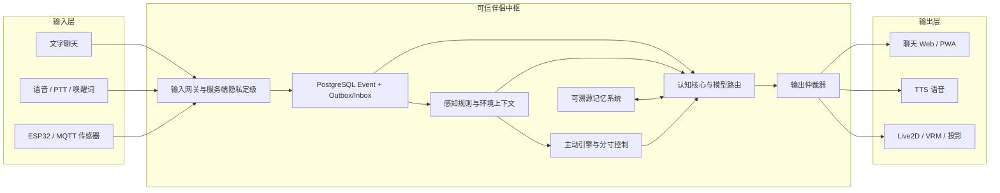
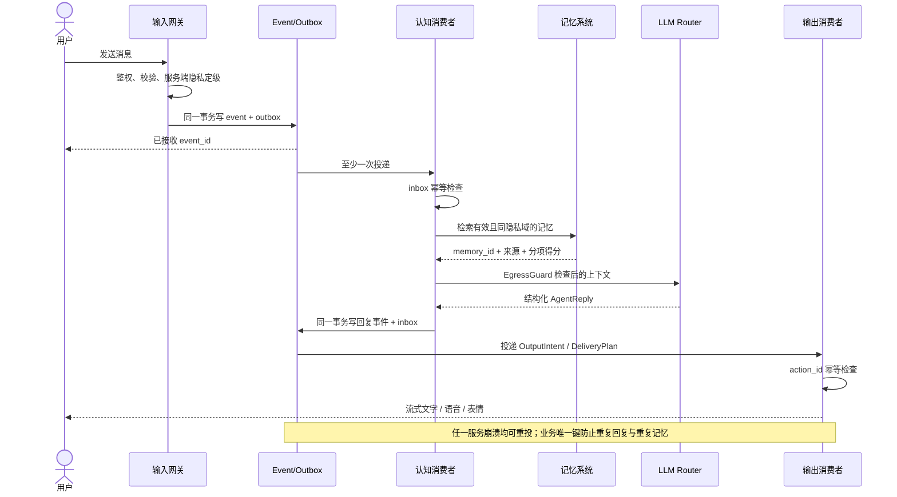
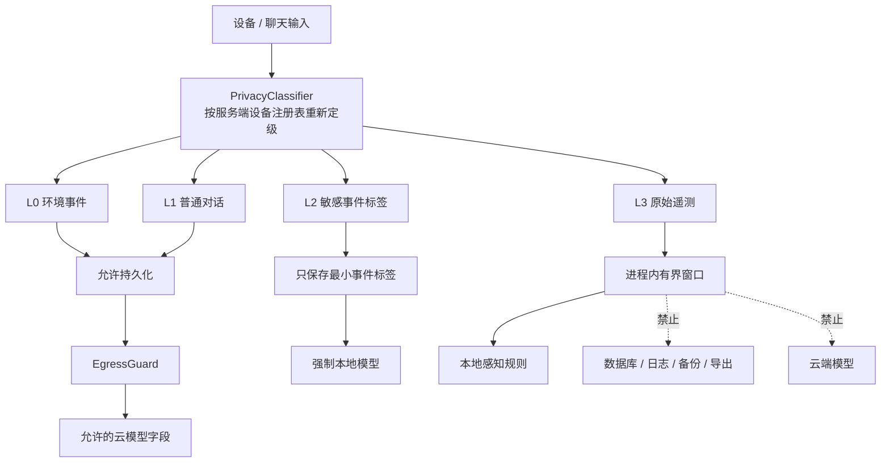
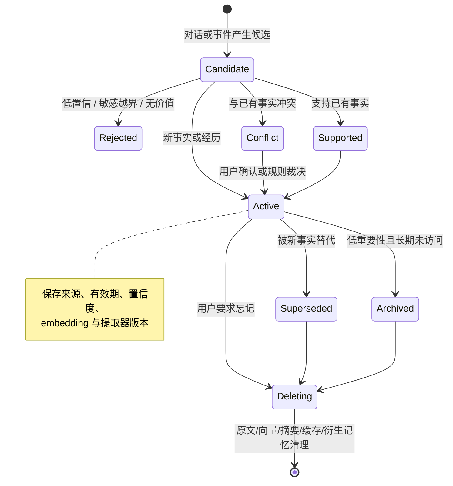
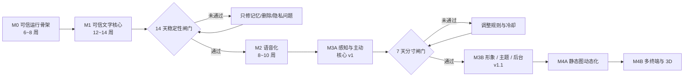

# 历史阶段归档（Phase Records / Prototype）

> 文档类型：Historical（2026-09-15 合并为单一归档）
> 已冻结，仅保留审计价值；当前规则与状态只看 `docs/00`～`docs/07` 与 `docs/TASKS.md`。

---

## M0～M1 文字核心（原编号 15、17、18、19）

> 文档类型：Phase Record / Historical（2026-09-15 合并归档）
> 四份阶段记录已冻结，仅保留审计价值；当前聊天/状态机/数据契约真源见 [00-文档索引](../00-产品与架构.md)，进度只看 [TASKS.md](../TASKS.md)。

---

### 15 M0 输入输出骨架验收报告

> 原文：`15-M0输入输出骨架验收报告.md`（M0 输入输出可信骨架验收报告）。2026-09-15 按功能并入本历史归档，内容完整保留、标题降一级。

> 文档类型：Phase Record / Historical
> 当前设计真源：`00-产品与架构.md`、`01-平台运行时.md`

> 验收日期：2026-08-17
> 范围：`03-开发规划` 的 M0.1~M0.4、M0.7~M0.8 中与统一 I/O、隐私分流和可靠事件链路直接相关的部分，以及 `14-输入输出扩展契约` §10。

#### 1. 结论

当前代码已经具备继续开发文字、语音、传感器、形象渲染和实体设备 adapter 的稳定扩展边界。新增输入或输出方式只需要实现版本化 Adapter 端口、声明 manifest 并在代码 allow-list 中登记 factory，不需要修改认知、记忆或主动行为模块。

本报告不把 LLM、身份、Job/Asset、升级恢复等其余 M0 子系统标记为完成；它们属于后续独立里程碑，不影响本次 I/O 骨架验收结论。

#### 2. 验收矩阵

| 能力 | 实现 | 自动验证 | 结果 |
|---|---|---|---|
| 统一 durable/ephemeral 输入 | `schemas/input.py`、`adapters/contracts.py` | Schema、adapter、privacy tests | 通过 |
| 服务端隐私重分类 | `privacy/policy.py`、`ingress/sink.py` | 设备声明 L0、服务端判定 L3 时数据库计数为 0 | 通过 |
| L3 非持久化管道 | `ingress/buffer.py` | TTL、block/drop-oldest/sample/aggregate | 通过 |
| Egress 隔离 | `privacy/egress.py` | L3 全拒绝、L2 云端拒绝、错误不含载荷 | 通过 |
| 日志 canary | `observability/redaction.py` | 嵌套 payload、prompt、text 全部脱敏 | 通过 |
| 显式 Adapter registry | `adapters/registry.py` | 未登记 ID 拒绝、重复登记拒绝、禁止配置动态导入 | 通过 |
| 兼容性协商 | `adapters/registry.py` | optional capability 忽略；unknown critical 返回 `upgrade_required` | 通过 |
| 生命周期隔离 | `AdapterLifecycleManager` | reload 失败恢复上一可用配置 | 通过 |
| 四个参考 adapter | `adapters/builtin/mock.py` | text input、ephemeral sensor、text output、streaming output | 通过 |
| 能力交集 | `output/routing.py` | manifest ∩ 管理员授权 ∩ endpoint probe | 通过 |
| 输出隐私和降级 | `output/routing.py` | L2 公共端拒绝、管理员降级上限、speech→text | 通过 |
| 输出幂等与取消 | `output/routing.py` | 同 intent 三次稳定 delivery；取消中投递零迟到副作用 | 通过 |
| 外部未知结果 | `output/routing.py` | 超时返回 `unknown_outcome` 且不自动重试 | 通过 |
| 事件幂等 | event/outbox/inbox | 重复 event、重复 consumer 均只产生一次副作用 | 通过 |
| 多 worker 竞争 | PostgreSQL integration test | 两个 dispatcher 同时 claim 仅一个发布 | 通过 |
| kill/recover | PostgreSQL integration test | lease 持有者终止后由新 worker 回收 | 通过 |
| MQTT 鉴权 | Compose smoke | 正确凭据发布成功、匿名发布失败 | 通过 |
| 部署可用性 | Docker healthchecks | Hub/PostgreSQL/Mosquitto 均 healthy | 通过 |

#### 3. 扩展规则

1. 新 adapter 必须实现 `InputAdapter` 或 `OutputAdapter`，并提供 `AdapterManifest`。
2. factory 必须由 Hub 代码显式登记；配置文件只能引用 `adapter_id`。
3. 输入 adapter 只能拿到 `InputSink`，不能直接拿数据库、EventBus 或 LLM。
4. endpoint 的有效能力永远是 manifest、管理员授权和运行时探测的交集。
5. 设备上报的隐私等级只是下限；服务端只能上调，不能下调。
6. L3 只允许进入有界内存通道；任何 durable、日志和外部 egress 路径都必须拒绝。
7. 外部非幂等输出超时后只能标记 `unknown_outcome`，不得自动重试。

#### 4. 后续开发入口

- 输入扩展：实现 adapter → 注册 factory → 选择 manifest 背压策略 → 只调用 GuardedInputSink。
- 输出扩展：实现 probe/deliver/cancel → 注册 endpoint → 由 OutputRouter 做能力、隐私和降级选择。
- 新 capability：默认 optional；若 adapter 将其列为 critical，旧 Hub 必须拒绝启用。
- 第三方代码：v1 不支持进程内动态加载；开放前需要独立进程、签名、权限和资源隔离 ADR。

---

### 17 M1 文字聊天闭环

> 原文：`17-M1文字聊天闭环.md`（M1 文字聊天闭环（第一阶段））。2026-09-15 按功能并入本历史归档，内容完整保留、标题降一级。

> 文档类型：Phase Record / Historical
> 当前设计真源：`01-平台运行时.md`、`01-平台运行时.md`、`02-形象与人设.md`

#### 1. 已实现范围

本阶段把模型配置中心接入了可实际使用的文字对话链路：

1. `app_user`、`conversation`、`message` 通过 Alembic `0003_text_chat` 持久化；
2. 每轮先提交用户消息，再调用模型，模型失败时用户输入仍可追溯；
3. 最近 20 条用户/助手消息作为工作上下文，不把系统消息、工具结果或自由文本推理写入模型决策元数据；
4. 每次生成前读取配置中心当前发布快照，因此后台发布或回滚后的下一轮立即使用新模型；
5. 助手消息只保存安全决策字段：配置版本、端点、provider、模型、路由、结束原因、token 用量和耗时；
6. L2 由模型路由器强制改走 `private` 本地端点且没有云端 fallback；L3 不属于可持久化聊天请求，在请求校验阶段直接拒绝；
7. `/chat` 提供零构建链的调试页，可创建会话、选择 L0/L1/L2、查看历史与实际路由结果。

#### 2. API

以下接口使用独立的短期聊天会话 Bearer Token，并根据该会话的 `user_id` 强制执行资源归属。`ARIA_ADMIN_TOKEN` 只能授权首次创建聊天身份，不能调用聊天接口：

| 方法 | 路径 | 用途 |
|---|---|---|
| `POST` | `/api/v1/chat/conversations` | 创建本地用户或为已有用户创建会话 |
| `GET` | `/api/v1/chat/conversations` | 查询会话，可按 `user_id` 过滤 |
| `GET` | `/api/v1/chat/conversations/{id}/messages` | 按序返回最近消息 |
| `POST` | `/api/v1/chat/conversations/{id}/messages` | 保存用户消息并同步生成助手回复 |

生成失败返回稳定的 `reason_code`，不会把供应商异常、请求体、密钥或原始响应透出。失败前已提交的用户消息不会被回滚或伪造成助手回复。

#### 3. 验证

```bash
uv run alembic upgrade head
uv run pytest server/tests/test_chat.py -q
uv run pytest -q
uv run ruff check server
uv run mypy server/app
```

真实供应商验证使用合成消息，成功条件包括：HTTP 200、两条消息落库、响应元数据端点为当前已发布的对话端点、模型和配置版本与后台一致。

#### 4. 当前边界与下一阶段

这个阶段是可信同步文字闭环，不等同于完整 M1：

- 已实现 WebSocket 流式 delta、generation 取消和按消息 seq 的断线补拉；持久事件流、背压指标和多进程广播仍待实现；
- 已实现密码登录、短期 token、撤销、基础限流、会话归属校验和聊天/管理分权；refresh 轮换、设备配对、Passkey 与恢复密钥仍待实现；
- 尚未实现结构化 `AgentReply`、人格版本、工具候选及状态机；
- 最近 20 条只是工作上下文，不是四层记忆；记忆提取、溯源、冲突、删除验证和向量检索仍待实现；
- 同一会话的并发发送还需要显式回合状态与 generation 隔离。

下一步优先接入结构化回复和可删除的短期/情景记忆；WebSocket 当前实现及边界见本档「19 WebSocket 流式回合」章节，完整身份闭环按本档「18 本地聊天身份边界」章节 中的演进路线推进。

---

### 18 本地聊天身份边界

> 原文：`18-本地聊天身份边界.md`（本地聊天身份边界（第一阶段））。2026-09-15 按功能并入本历史归档，内容完整保留、标题降一级。

> 文档类型：Phase Record / Baseline
> 说明：记录当前已实现的第一阶段身份边界；未来 Passkey、设备配对和 refresh 轮换应在 Active 身份设计中另行收口。

#### 1. 目标与边界

单用户部署仍必须区分“可以修改系统配置的管理员”和“可以读取私人聊天的用户会话”。本阶段移除聊天 API 对 `ARIA_ADMIN_TOKEN` 的复用，建立可继续演进到设备配对、refresh 轮换和 Passkey 的数据库边界。

已实现：

- `auth_credential` 保存密码凭据，密码通过 `scrypt` 内存困难哈希处理，使用随机 salt，数据库不保存明文；
- `auth_session` 保存 8 小时 access session，客户端只拿到高熵随机 Token，数据库只保存 SHA-256 哈希；
- 首次 `POST /api/v1/auth/setup` 必须携带 `ARIA_ADMIN_TOKEN`，且只能成功一次；
- 登录失败按进程内客户端地址执行 5 次/5 分钟基础限流；
- `me` 验证有效期和用户状态，`logout` 立即写入撤销时间；
- 创建、列举、读取和发送消息全部从认证主体取得 `user_id`，不接受客户端指定用户；
- 访问其他用户的会话统一返回“未找到”，避免资源枚举；
- 浏览器只在 `sessionStorage` 保存短期聊天 Token，密码和管理 Token 不持久化。

#### 2. API

| 方法 | 路径 | 鉴权 | 用途 |
|---|---|---|---|
| `GET` | `/api/v1/auth/status` | 无 | 判断是否需要首次设置 |
| `POST` | `/api/v1/auth/setup` | 管理 Token | 创建唯一密码身份并签发聊天会话 |
| `POST` | `/api/v1/auth/login` | 无 | 校验密码并签发新会话 |
| `GET` | `/api/v1/auth/me` | 聊天 Token | 校验并返回当前主体和到期时间 |
| `POST` | `/api/v1/auth/logout` | 聊天 Token | 撤销当前会话 |

聊天 API 不再接受管理 Token。首次设置会在数据库仅有一个无凭据的历史用户时认领该用户，以保留已有会话；无法无歧义判断时创建新用户，不自动合并私人数据。

#### 3. 安全验证

自动化测试覆盖：

- 未授权首次设置、重复设置、错误密码；
- 密码和原始 Token 不进入数据库；
- 会话退出和过期后不可继续使用；
- 连续登录失败触发 429；
- 未认证请求、管理 Token 调用聊天 API 均返回 401；
- 用户不能列举、读取或写入其他用户的会话；
- L3 阻断和模型失败保留用户消息的原有约束继续成立。

#### 4. 尚未完成

这不是完整身份闭环。共享部署或外网接入前还必须实现：

1. 一次性 setup code，替代首次设置对长期管理 Token 的依赖；
2. Secure/HttpOnly/SameSite Cookie 或系统安全存储，以及配套 CSRF 防护；
3. access/refresh 双会话、refresh family 轮换和重放后整族撤销；
4. `device_client`、短期配对码、设备级撤销和审计事件；
5. Passkey、recovery key 与高风险操作重新验证；
6. 跨进程/重启后仍有效的共享限流存储和可信代理地址策略。

当前实现适合本机源码开发和受控局域网验证，不应直接作为公网身份系统。

---

### 19 WebSocket 流式回合

> 原文：`19-WebSocket流式回合.md`（WebSocket 流式回合（第一阶段））。2026-09-15 按功能并入本历史归档，内容完整保留、标题降一级。

> 文档类型：Phase Record / Historical
> 当前设计真源：`01-平台运行时.md`、`01-平台运行时.md`

#### 1. 已实现能力

`/ws/chat` 建立了文字聊天的实时编排边界：

- WebSocket 接受连接后要求 5 秒内发送 `authenticate`，服务端通过数据库短期聊天会话认证；后续每个客户端帧都会重新检查撤销和到期状态；
- `client_hello` 携带每个会话的消息游标，服务端只补发该用户拥有且 `seq > cursor` 的已提交消息；
- `message.send` 先原子持久化用户消息和 `interaction_turn`，再启动模型生成；
- LiteLLM/OpenAI-compatible 适配器使用供应商真实 streaming 响应，不对一次性结果做假分块；
- `reply.delta` 是带 `delta_index` 的瞬时事件，不落为事实；`reply.committed` 写入完整助手消息后才进入补拉历史；
- 同一进程中订阅相同会话的多个客户端会收到同一 committed/delta 事件；
- `turn.cancel` 持久化 cancelled 状态并取消运行任务，提交事务再次检查状态，因此迟到结果不能写助手消息；
- 进程启动时把遗留的 accepted/thinking/streaming 回合标记为 `process_restarted` cancelled，不续跑不安全副作用；
- 浏览器调试页优先使用 WebSocket，连接失败时保留 REST 降级。

#### 2. 帧协议

客户端帧：

| type | 关键字段 | 说明 |
|---|---|---|
| `authenticate` | `access_token` | 必须是首帧 |
| `client_hello` | `cursors: {conversation_id: seq}` | 订阅并补拉多个会话 |
| `message.send` | `conversation_id`, `text`, `privacy_level` | 创建持久回合并生成 |
| `turn.cancel` | `generation_id` | 取消当前 generation |
| `sync.request` | `conversation_id`, `after_seq` | 单会话主动补拉 |
| `ping` | — | 返回 `pong` |

服务器事件统一携带 `proto_version`、`stream`、`seq`、`event_id`、`type`、`generation_id`、`sent_at` 和 `payload`。当前 `seq` 是持久消息序号：committed 事件有值，瞬时状态/delta 为 `null` 并使用 `delta_index` 保序。

#### 3. 流式失败边界

模型路由允许端点在首个可见 delta 之前失败并切换 fallback。端点已经发送可见内容后若失败，generation 返回 `stream_interrupted`，不会把备用模型的内容拼接到已有半句后面。L2 继续强制本地 private 路由，L3 在创建回合前阻断。

#### 4. 验证覆盖

- 无效/过期会话关闭码 4401；
- 首帧认证、游标补拉、delta 顺序、最终提交；
- 断线重连只补 committed，不重放 delta；
- 取消后用户消息保留、助手消息为零、turn 为 cancelled；
- 模型首块前失败可 fallback，首块后失败禁止拼接；
- LiteLLM streaming 参数、delta 聚合、usage 和 finish reason；
- PostgreSQL `0005_interaction_turn` 迁移和真实 SenseNova WebSocket 流。

#### 5. 尚未完成

- 当前广播器是单进程内存实现；多 worker/多节点需要 PostgreSQL NOTIFY、Redis Streams 或专用消息层；
- 游标只覆盖持久消息，尚未建立包含状态、配置和设备事件的统一持久 stream seq；
- 未实现每会话并发策略（排队、自动打断旧 generation 或明确 409）；
- 未实现客户端 ACK、发送队列上限、慢消费者断开和端到端背压指标；
- 未实现结构化 `AgentReply`、工具调用、TTS 句段和音频租约；
- 尚未完成 30 轮稳定性、首 delta P90 和网络抖动/代理超时测试。

---

## 记忆 v1 与删除闭环（原编号 21、22、23、24、25）

> 文档类型：Phase Record / Historical（2026-09-15 合并归档）
> Memory v1 / P3 阶段记录已冻结；当前记忆真源为 [30-多主体持久化记忆设计](../03-记忆与时间线.md)与 [31-记忆时间线与历史回溯设计](../03-记忆与时间线.md)。

---

### 21 记忆系统 v1

> 原文：`21-记忆系统v1.md`（P2 记忆系统 v1 验收记录）。2026-09-15 按功能并入本历史归档，内容完整保留、标题降一级。

> 文档类型：Phase Record / Historical
> 当前记忆演进设计：`03-记忆与时间线.md`、`03-记忆与时间线.md`

> 日期：2026-08-18
> 范围：可检索、可溯源、可纠错的长期记忆（对应 docs/00 §3.6 与 docs/00 阶段 1.4/1.5 的 v1 子集）
> 关联：TASKS.md P2；删除闭环与记忆可视化管理后台属 P3

#### 交付内容

##### 存储（迁移 0007_memory_v1）

- `memory` 表：五类记忆（episodic / semantic / preference / commitment / emotional）、
  内容与摘要、隐私等级（仅 L0～L2）、嵌入向量与 `embedding_model/dimension/version` 三元组、
  `importance`、`pin`、状态机（active / archived / superseded / conflict）、
  `confidence` 与 `valid_from/valid_to` 有效期、`superseded_by` 版本链、
  `conflict_with` 冲突指向、`extractor_version`、访问统计（`access_count` / `last_accessed_at`）。
- `memory_source` 表：`memory_id + source_kind(message/event/memory/manual) + source_id` 主键，
  只存来源引用与 `excerpt_hash`（sha256），不复制原文，为 P3 删除闭环预留"删除后不复活"的边界。
- 嵌入向量当前以 JSON 列存储，检索在应用层计算余弦；表结构保留版本三元组，
  未来切换 pgvector / utility 嵌入模型时按版本隔离、双写回填，不假设跨模型维度兼容。

##### 检索（`app/memory/retrieval.py`，策略版本 hybrid-quota-v1）

1. 候选召回：哈希嵌入余弦 Top-30 + 字符二元组词汇余弦 Top-30，合并去重；
2. 硬过滤：用户隔离、status=active、`valid_from/valid_to` 有效期、嵌入版本一致；
3. 归一化重排：相关性 0.55 + 重要性 0.25 + 置顶加成 0.2；
   新近度仅对 episodic 生效（时间常数 30 天），不衰减稳定事实；
4. Top-K=8，按类型配额（semantic 3 / preference 2 / commitment 1 / episodic 2 / emotional 2）；
5. 每次命中返回分项得分与命中原因（vector / lexical / pin / recency）并累计访问计数。

##### 沉淀与纠错（`app/memory/consolidation.py`）

- 每轮对话提交后异步运行 `MemoryIngester.ingest_message`，失败只记日志，不影响已提交回合；
- 同类型相似度判定：≥0.85 判定为"支持"（重要性 +0.05、追加来源、计一次访问）；
  0.60～0.85 判定为"冲突"（新记忆以 conflict 状态挂起，等待用户确认，不自动覆盖稳定事实）；
  其余为"新增"；"替代"（supersede）仅由显式编辑或冲突裁决触发；
  **例外：episodic 情景记忆按事件直接追加**——相似文本可以描述不同时间发生的事件，
  不参与相似度冲突裁决；重复事件由上游管线按事件 ID/截图哈希/时间窗口去重；
- `RuleBasedExtractor`（rule-v1）：保守识别第一人称稳定陈述
  （不吃/喜欢类→preference；带时间词的计划→commitment，默认 7 天有效期；是/叫/住在类→semantic），
  指向伴侣的表述（含"你"）跳过；每条候选记录来源消息 ID 与摘录哈希；
- L2/L3 会话内容不进入自动沉淀（L3 在入口已被阻断；L2 等待脱敏 utility 提取器）。

##### 聊天集成（`app/chat/service.py`）

- `start_turn` 检索 Top-K 记忆，以 `【相关记忆】` 块注入系统提示，
  并要求"只依据记忆谈论用户，不确定就问；不要逐条罗列"；
- 回合提交时 `decision_meta.memory` 记录策略版本、候选数量、
  每条命中记忆的 `{id, type, score, reasons}`，满足"使用的记忆 ID 与策略版本可追溯"；
- 记忆隐私分级参与检索闸门：L2 记忆只进入 L2（强制本地路由）上下文，不会随 L0/L1 云调用出站。

##### 管理 API（`/api/v1/admin/memories`，ARIA_ADMIN_TOKEN）

| 方法 | 路径 | 说明 |
|---|---|---|
| GET | `/api/v1/admin/memories` | 过滤查询（user/type/status/重要性/数量） |
| POST | `/api/v1/admin/memories` | 手动添加（manual 来源，L3 拒绝 422） |
| GET | `/api/v1/admin/memories/{id}` | 详情 + 来源列表 + 版本链 lineage |
| PATCH | `/api/v1/admin/memories/{id}` | 纠错编辑：新版本替代旧行，旧行 superseded 并记录原因 |
| POST | `/api/v1/admin/memories/{id}/archive` | 归档退出检索 |
| POST | `/api/v1/admin/memories/{id}/resolve` | 冲突裁决：adopt（新记忆转正、旧记忆 superseded）/ keep（新记忆归档） |
| POST | `/api/v1/admin/memories/query` | 检索调试：返回命中、分项得分与原因 |

编辑产生的替代版本会继承原来源并追加 `memory→旧ID` 链接，`lineage` 返回整条版本链。

#### 验收结论

- [x] 记忆检索进入聊天上下文，且 decision_meta 记录使用的记忆 ID、得分与策略版本。
- [x] 检索硬过滤覆盖用户隔离、状态、有效期与隐私等级（L2 记忆不出现在 L0/L1 上下文）。
- [x] 每条记忆可溯源到消息来源（source_id + excerpt_hash），编辑保留版本链与来源。
- [x] 候选沉淀支持新增/支持/冲突三态，冲突等待显式裁决，不自动修改稳定事实。
- [x] 纠错闭环：编辑产生替代版本、可归档、冲突可 adopt/keep；L3 内容无法入库。
- [x] 记忆子系统故障（如嵌入失败）不影响聊天回合提交。
- [x] 回归测试 12 项（含端到端"记住→检索→注入"闭环）；pytest 99 通过 / ruff / mypy 全绿；
      迁移 0007 升级-回滚-再升级验证通过。

#### 当前边界与后续

- 嵌入为本地确定性哈希（char-ngram-hash/1，256 维），语义泛化能力有限；
  utility 模型嵌入与 pgvector 全文/向量双召回列入 P3/P4 前置评估。
- 提取器为规则版（rule-v1），LLM 结构化提取（utility 路由 + json_mode）待接入。
- L2 亲密会话的脱敏沉淀、每日/每周反思、重要性软衰减与硬删除台账均属后续阶段（P3+）。
- 记忆可视化管理后台页面（/admin/memory 当前为占位页）与导出能力属 P3。

---

### 22 删除闭环与记忆后台

> 原文：`22-删除闭环与记忆后台.md`（P3 删除闭环与记忆后台（第一批）验收记录）。2026-09-15 按功能并入本历史归档，内容完整保留、标题降一级。

> 文档类型：Phase Record / Historical
> 当前记忆演进设计：`03-记忆与时间线.md`、`03-记忆与时间线.md`

> 日期：2026-08-18
> 范围：记忆硬删除台账、删除 API 与 `/admin/memory` 可视化后台
> 关联：docs/00 §3.6 遗忘/硬删除、docs/07 记忆库后台；对应 TASKS.md P3 前两项

#### 交付内容

##### 删除台账（迁移 0008_deletion_ledger）

- `deletion_ledger` 表：`entity_kind`（memory/message 预留）、入口 `entity_id`、
  `deleted_ids`（本次删除的全部版本 ID）、`requested_by`、`reason`、`created_at`。
- **台账只存标识符，不存任何被删内容**：备份恢复后可按台账重放删除，避免已删内容复活。

##### 硬删除（`MemoryStore.hard_delete`）

- 单一事务内完成，删除范围始终是**整条 supersede 版本链**（前驱 + 后继全部收集后再删）：
  1. 删除链上全部 `memory` 行与其 `memory_source` 行（显式删除，不依赖外键级联）；
  2. 清理存活记忆中指向被删版本的衍生来源链接（`source_kind=memory AND source_id IN …`）；
  3. 摘除指向被删版本的 `conflict_with` 指针（冲突行保留、等待重新裁决）；
  4. 写入台账行并返回 `DeletionReceipt`（ledger_id + deleted_ids）。
- 删除后记忆立即退出检索；重复删除入口 ID 返回 404。

##### 管理 API

| 方法 | 路径 | 说明 |
|---|---|---|
| DELETE | `/api/v1/admin/memories/{id}?reason=…` | 硬删除整条版本链，返回删除回执 |
| GET | `/api/v1/admin/deletion-ledger?limit=…` | 台账查询（倒序） |

##### `/admin/memory` 可视化后台

替代原占位页，与其他后台共用 `ARIA_ADMIN_TOKEN`（会话内保存）：

- 统计卡：活跃 / 冲突待裁决 / 已归档 / 台账计数与最近删除时间；
- 记忆列表：类型、状态、重要性、隐私、提取器版本过滤；行内操作：溯源、编辑、归档、
  冲突裁决（采纳 / 保留旧值）、硬删除（需输入原因，二次确认）；
- 溯源详情：全部字段、来源列表（source_kind:source_id + 摘录哈希）与完整版本链；
- 手动添加：类型 / 隐私 / 重要性 / 置顶；
- 检索调试：真实查询验证混合召回，展示分项得分（vec/lex）、命中原因与策略版本；
- 删除台账表：入口实体、被删版本、操作人、原因与时间。

#### 验收结论

- [x] 硬删除覆盖整条版本链与来源行，删除后检索不再命中。
- [x] 台账记录被删 ID 与原因且不含内容；API 可查询。
- [x] 指向被删版本的冲突引用与衍生链接在同一事务内清理。
- [x] `/admin/memory` 提供过滤、溯源、纠错、裁决、删除与检索调试闭环。
- [x] pytest 101 通过（新增硬删除与 API/页面测试）；ruff / mypy 全绿；迁移 0008 升降级验证通过。

#### 当前边界与后续

- 消息删除级联（删除一条聊天消息时联动其沉淀记忆）与备份恢复后的台账重放工具尚未实现。
- 软衰减（importance 30 天 ×0.9、归档不参与检索的自动判定）属记忆 v2（docs/00 3B.4）。
- P3 剩余：L2 脱敏 utility 提取器接入、utility 嵌入 + pgvector 双召回评估。

---

### 23 utility 提取器与 L2 脱敏

> 原文：`23-utility提取器与L2脱敏.md`（P3 utility 提取器与 L2 脱敏验收记录）。2026-09-15 按功能并入本历史归档，内容完整保留、标题降一级。

> 文档类型：Phase Record / Historical
> 当前记忆演进设计：`03-记忆与时间线.md`、`03-记忆与时间线.md`

> 日期：2026-08-18
> 范围：LLM 结构化记忆提取（utility 路由）、L2 亲密对话脱敏沉淀、规则提取器回退
> 关联：docs/00 §3.6 沉淀管线、§3.5 双模型路由；TASKS.md P3 第三项

#### 交付内容

##### 提取器架构（`app/memory/extraction.py`）

- `MemoryExtractor` 协议：`extract(text, message_id, privacy_level, occurred_at, backend)`；
  提取器自行决定能否处理某个隐私等级，沉淀入口（`MemoryIngester.ingest_message`）不再做统一拦截。
- `RuleBasedExtractor`（rule-v1）：保守确定性提取，维持原有行为；
  **L2/L3 一律跳过**——没有脱敏能力的内容不落库。
- `LlmMemoryExtractor`（llm-utility-v1）：utility 路由 + `json_mode` 的结构化提取；
  输入截断 4000 字符，输出经 `ExtractedCandidates` 严格校验（类型枚举、内容 2~200 字），
  最多采纳 4 条候选。

##### L2 脱敏约束

- L2 提取提示词强制：content 只能是事件级概括（发生了什么 / 时长 / 用户情绪倾向），
  严禁生理、身体或露骨细节；沉淀出的记忆 `privacy_level=L2`。
- L2 记忆沿用既有检索闸门：只进入 L2（强制本地路由）上下文，不会随 L0/L1 云调用出站。
- 端到端验证：L2 轮次 → utility 提取（提示词含隐私约束、json_mode）→ L2 记忆落库 →
  L1 检索不可见、L2 检索可见。

##### 韧性与回退

- 模型输出不是合法 JSON、schema 校验失败或任何网络异常 → 自动降级为规则提取器，
  该轮沉淀不丢失（L0/L1 场景）；回退记忆的 `extractor_version` 保持 rule-v1 可追溯。
- 提取完全失败也不影响已提交回合（沿用 P2 的隔离边界）。

##### 接线

- `ChatService` 新增 `memory_extractor` 注入；回复与提取复用同一回合的 router 后端。
- 运行时开关：`ARIA_MEMORY_EXTRACTOR=llm` 启用 LLM 提取，默认 `rule`。
- 提取请求沿用隐私路由强制：utility 请求携带原始隐私等级，L2 由路由器强制转向本地端点，
  云端 utility 模型永远不会收到 L2 内容。

#### 验收结论

- [x] L2 亲密对话可沉淀事件级脱敏记忆，且不出现在 L0/L1 上下文。
- [x] utility 提取走 json_mode + 严格 schema 校验，坏输出自动回退规则提取。
- [x] 空候选输出不产生记忆；L3 仍然全链路阻断。
- [x] 回复后端与提取后端复用同一轮 router，不额外构建客户端。
- [x] pytest 104 通过（新增 L2 脱敏、回退、空候选三组测试）；ruff / mypy 全绿。

#### 当前边界与后续

- 提取提示词为中文单轮版本；每日反思 / 关系回顾（emotional 记忆批量生产）属记忆 v2。
- 嵌入仍为本地哈希；utility 嵌入 + pgvector 双召回评估与消息删除级联、台账重放工具保持待办。

---

### 24 消息删除级联与台账重放

> 原文：`24-消息删除级联与台账重放.md`（P3 消息删除级联与台账重放验收记录）。2026-09-15 按功能并入本历史归档，内容完整保留、标题降一级。

> 文档类型：Phase Record / Historical
> 当前删除/历史演进设计：`01-平台运行时.md`、`03-记忆与时间线.md`、`03-记忆与时间线.md`

> 日期：2026-08-18
> 范围：会话删除级联清理沉淀记忆、删除台账重放（备份恢复后防复活）
> 关联：docs/00 §3.6 遗忘/硬删除与备份策略；TASKS.md P3

#### 交付内容

##### 会话删除级联（`ChatService.delete_conversation`）

- 用户删除会话时按序完成：
  1. 收集该会话全部消息 ID；
  2. 通过 `MemoryStore.hard_delete_by_source("message", …)` 删除所有以这些消息为来源的
     记忆（自动扩展到完整版本链、来源行、衍生链接与冲突指针，单事务完成）；
  3. 删除回合、消息与会话行；
  4. 台账记录 `entity_kind=message`、`entity_id=<会话ID>`、被删记忆 ID 列表
     （即使没有沉淀记忆也记录，保证重放句柄稳定）。
- 归属校验：只能删除自己的会话，他人会话返回 404。
- API：`DELETE /api/v1/chat/conversations/{id}`（聊天会话 Token，返回台账与被删记忆 ID）。
- 聊天调试台会话列表新增删除按钮（确认框提示会连带删除沉淀记忆且不可恢复）。

##### 删除台账重放（`app/memory/replay.py`）

- `replay_deletions(database, dry_run=True)`：按台账时间正序逐条重放——
  - `entity_kind=memory`：按 ID 清除复活记忆（自动含版本链）；
  - `entity_kind=message`：删除复活会话及其消息，并级联清理以这些消息为来源的记忆。
- 全程幂等：已删除的目标直接跳过；重复重放计数归零。
- dry_run 只统计将要删除的对象，不执行任何写操作。
- 两种入口：
  - 管理 API `POST /api/v1/admin/deletion-ledger/replay`（body `{"dry_run": true|false}`）；
  - 运维脚本 `uv run python server/scripts/replay_deletions.py [--apply]`
    （默认 dry run，`--apply` 才真正执行；需要 `ARIA_DATABASE_URL`）。

##### Store 重构

- 删除核心拆为 `_collect_lineage_ids` / `_purge_memory_ids` / `_record_ledger`，
  `hard_delete`、`hard_delete_by_source`、`purge_by_ids`、`purge_by_source` 共用同一套语义，
  重放走无台账变体避免台账自我膨胀。

#### 验收结论

- [x] 删除会话同时清除其消息、回合与沉淀记忆（版本链完整），其他会话记忆不受影响。
- [x] 台账含 message 实体记录；重放可清除"备份恢复复活的会话与记忆"，且重复重放零副作用。
- [x] dry_run 不产生写入；管理 API 需要管理 Token。
- [x] pytest 107 通过（新增级联、归属校验、重放幂等与重放端点测试）；ruff / mypy 全绿。

#### 当前边界

- 删除正在流式输出中的会话不主动取消远端生成（回合状态机会自行按故障恢复路径收尾）。
- 备份本身（加密、轮换）与自动重放编排属于运维阶段（docs/01）。
- P3 仅剩嵌入升级评估：utility 嵌入 + pgvector 全文/向量双召回与版本回填。

---

### 25 嵌入升级评估 pgvector

> 原文：`25-嵌入升级评估pgvector.md`（P3 嵌入升级评估：pgvector 落地验收记录）。2026-09-15 按功能并入本历史归档，内容完整保留、标题降一级。

> 文档类型：Phase Record / Historical
> 说明：记录 pgvector 落地基线；新的 Memory/Timeline 召回策略分别以 `30/31` 为准。

> 日期：2026-08-18
> 范围：pgvector 向量列、双写与 ANN 召回、迁移回填、真实 PostgreSQL 验证
> 关联：docs/00 §3.6 检索策略与向量版本管理；TASKS.md P3 最后一项

#### 评估结论

混合检索的向量通道在 PostgreSQL 上切换为 pgvector ANN 召回，其余方言（含测试用
sqlite）保持进程内余弦 —— 两条路径喂给同一套合并/重排逻辑，行为一致。
docker-compose 自始使用 `pgvector/pgvector:pg16` 镜像，生产环境无需变更。

#### 落地内容

##### 迁移 0009_embedding_vector（仅 PostgreSQL）

- `CREATE EXTENSION IF NOT EXISTS vector`；
- `memory.embedding_vec vector(256)`（当前哈希嵌入维度）+ HNSW 余弦索引；
- 回填：`UPDATE memory SET embedding_vec = (embedding::text)::vector …`
  （jsonb 数组的 text 形式即是合法 vector 字面量，纯 SQL 完成历史数据回填）；
- sqlite 等方言自动跳过，保持 JSON 列与进程内计算。

##### 双写与召回（`app/memory/store.py`）

- 写路径（`add` / `edit`）在 PostgreSQL 上同事务双写 JSON 列与 `embedding_vec`；
- `vector_recall`：按用户/状态/有效期/隐私/嵌入版本过滤后
  `ORDER BY embedding_vec <=> CAST(:qv AS vector) LIMIT k`，返回 (id, 相似度)；
- 检索器在 `vector_sql_enabled` 时用 ANN 替换全量扫描，词法通道与重排不变；
  ANN 结果超出候选窗口（importance Top-500）的记忆会被安全跳过。

##### 真实环境验证

- 临时 `pgvector/pgvector:pg16` 容器上：迁移链 0001→0009 全程通过，
  pgvector 0.8.2、HNSW 索引确认建立；
- 集成测试 `server/tests/integration/test_memory_postgres.py`
  （`ARIA_TEST_DATABASE_URL` 门控）：双写落列、ANN 命中目标记忆、
  编辑替代版本同样落列、硬删除后检索干净 —— 全部通过。

#### 嵌入模型升级路径（后续批次）

1. 选定真实嵌入模型（utility 路由，OpenAI-compatible `/embeddings`）后，
   因维度不同（如 1024），需新增 `embedding_vec_v2` 列并双写新版本；
2. 以新版本嵌入回填历史记忆（`embedding_version` 过滤已就位，新旧向量互不比较）；
3. 回填完成后检索切读新列，观察一个稳定性窗口再删除旧列；
4. 词法通道的 PostgreSQL tsvector 化暂缓：v1 规模下进程内字符二元组余弦
   与向量通道已形成互补召回，等记忆量或延迟指标提出需求再升级。

#### 验收结论

- [x] PostgreSQL 上向量召回走 pgvector ANN + HNSW 索引，其余环境零影响。
- [x] 历史数据迁移内纯 SQL 回填；双写与召回同事务一致。
- [x] 真实 pgvector 环境迁移链与集成测试全部通过（2 passed）。
- [x] sqlite 全量回归 107 通过；ruff / mypy 全绿。

---

## P4 Vue 迁移与 P5 闸门（原编号 26（ADR-018，accepted）、27、28、29、32）

> 文档类型：Phase Record / Historical（2026-09-15 合并归档；ADR-018 保持 accepted 状态）
> 当前 UI 规则回写 [05](../07-安全与管理后台.md)/[06](../02-形象与人设.md)/[20](../02-形象与人设.md)；P5 使用期结论以本文 P5 闸门报告章节与 [TASKS.md](../TASKS.md) 为准（外部每日记录索引仍待回填）。

---

### 26 前端决策 ADR-018

> 原文：`26-前端决策ADR-018.md`（P4 前端决策：Vue 3 正式前端与 Open-LLM-VTuber 边界（ADR-018））。2026-09-15 按功能并入本历史归档，内容完整保留、标题降一级。

> 日期：2026-08-18
> 状态：accepted（P6 入口处设复核点）
> 关联：docs/00 复用策略与里程碑、docs/02 形象系统、docs/01 运行状态机、
> docs/history/历史阶段归档/e1e6f1f Open-LLM-VTuber 验证、`integrations/open_llm_vtuber/`

#### 背景

当前三类前端形态：

1. **聊天调试页**（`/chat`，vanilla JS）：登录、会话、WebSocket 流式、取消、删除；
2. **管理后台**（`/admin/*`，vanilla JS）：模型路由、Persona、记忆库、总览占位页；
3. **Open-LLM-VTuber v1.2.1**（独立进程，经 `aria_olv_bridge` 接入）：麦克风、ASR、
   TTS、Live2D 与其自带 Web 前端，已通过端到端验证（docs/history/历史阶段归档）。

约束：单人业余开发（每周 10~15h）；核心 v1 截止 M3A；P5 需要 14 天真实文字使用验证；
上游 Open-LLM-VTuber 正在规划 v2 全面重写（深 fork 风险高）；`web/` monorepo 骨架
（apps/chat、apps/admin、packages/shared）自 M0.1 已预留。

#### 备选方案

| 方案 | 说明 | 结论 |
|---|---|---|
| A. Open-LLM-VTuber 前端为主 | 直接用其 Web UI 承载主体验 | 否：无法承载 Aria 身份/记忆后台/隐私模型，主 UX 受制于 v2 重写节奏，违背"中枢自建" |
| B. Vue 3 自建正式前端 + OLV 作渲染/语音端 | chat/admin 迁入 Vue；语音与 Live2D 继续走桥接 | **采纳** |
| C. Vue 3 全量含形象渲染 | pixi-live2d-display 自建渲染管线 | 暂缓：在文字稳定性（P5）验证前重造成熟管线成本过高，P6 复核 |

#### 决策（ADR-018）

1. **正式前端 = Vue 3 + Vite + TS monorepo**（`web/apps/chat`、`web/apps/admin`、
   `web/packages/shared`），构建产物由 FastAPI 同源托管（保持现有鉴权与 WebSocket
   模型不变），开发期用 Vite proxy 指向本地 Hub。
2. **chat 应用范围**：登录/登出、会话列表与删除、流式聊天与取消、隐私等级选择、
   结构化回复的情绪标签展示（文字级）；不包含形象渲染。
3. **admin 应用范围**：迁移现有四个后台（模型路由、Persona、记忆库、总览），
   协议即现有管理 API，不加新后端。
4. **Open-LLM-VTuber 边界**：仅作为 P6 的语音/Live2D 渲染端经桥接复用；
   不深度 fork（保持锁定版本 + 最小 patch 策略）；v2 迁移在 P6 入口统一评估。
5. **分阶段迁移**：
   - P4a：脚手架 + chat MVP 上线替换调试页（调试页保留为 `/chat/debug` 回退入口）；
   - P4b：admin 迁移；
   - P5 的 14 天真实使用在 Vue chat 前端上进行（闸门数据以新前端为准）；
   - P6：语音/Live2D 经桥接接入，评估 Tauri 壳与桌宠形态。
6. **复核触发条件**（任一满足则重新评估方案 C）：上游 v2 长期停滞或破坏性重写；
   P6 需要形象与聊天同屏深度耦合（如内嵌渲染、逐帧口型）；桥接层维护成本超过自建。

#### 影响

- 正面：主 UX、身份、隐私与记忆管理收拢进自建栈；P5 闸门有稳定载体；
  admin/chat 共享 `packages/shared` 的 API 客户端与类型。
- 代价：P4a/P4b 两个批次的迁移工作量；vanilla 调试页与 Vue 前端短期并存。
- 风险与对策：WebSocket 鉴权与取消语义在迁移中回归（沿用 test_chat_websocket 用例）；
  构建产物纳入 Docker 镜像（Dockerfile 增加 pnpm build 阶段）。

---

### 27 Vue 聊天前端 P4a

> 原文：`27-Vue聊天前端P4a.md`（P4a Vue 聊天前端验收记录）。2026-09-15 按功能并入本历史归档，内容完整保留、标题降一级。

> 文档类型：Phase Record / Historical
> 当前前端/运行时设计真源：`07-安全与管理后台.md`、`02-形象与人设.md`、ADR-018（docs/history/历史阶段归档）

> 日期：2026-08-18
> 范围：`web/` monorepo 脚手架、`packages/shared` API/WS 客户端、`apps/chat` 正式聊天前端
> 关联：ADR-018（docs/history/历史阶段归档）；TASKS.md P4a

#### 交付内容

##### monorepo 脚手架（`web/`）

- pnpm workspace：`apps/*` + `packages/*`；构建 `pnpm --dir web run build`，
  类型检查 `pnpm --dir web run typecheck`（vue-tsc，当前全绿）。

##### `packages/shared`

- REST 客户端 `ChatApi`：auth status/setup/login/me/logout、会话列表/创建/删除、消息拉取；
- 运行时元信息：`runtimeMeta()` 读取 `/api/v1/meta/runtime`，获取当前 Persona 名称、版本和内容哈希；
- WebSocket 客户端 `ChatSocket`：authenticate 首帧、`message.send`/`turn.cancel`/`sync.request`、
  事件回调（reply.delta / reply.control / committed / cancelled / failed / sync）；
- 协议与领域类型（Conversation/ChatMessage/AgentReplyControl/SocketEvent 等），
  供 chat 与后续 admin 应用共用。

##### `apps/chat`（Vue 3 + Vite + TS）

- 登录/首次设置（`setup_required` 自动切换表单，管理 Token 仅首次使用）；
- 会话侧栏：新建、切换、删除（确认提示含"记忆一并删除"）；`token` 持久化于 localStorage；
- 聊天区：流式 delta 渲染、`reply.control` 情绪标签、已提交消息回放（含历史情绪）；消息气泡经 `markdown-it` 安全渲染 Markdown（`html=false` 转义原始 HTML、链接强制 `target=_blank rel=noopener noreferrer`，见 `MarkdownContent.vue`/`markdown.ts`；流式期间保持 pre-wrap，避免半截标记跳动）；用户消息同样渲染；
- 当前 Persona 展示：侧栏标题读取运行时 Persona 名称并显示 `Persona vN`；历史助手消息可显示其 `decision_meta.persona_version`，便于区分旧消息与新发布人格；
- 发送区：隐私等级选择（L0/L1/L2）、Enter 发送、生成中"停止"（turn.cancel）；
- WS 断线自动重连（最多 3 次），失败时降级提示；`/chat/debug` 入口保留。

##### 托管与构建

- FastAPI：`web/apps/chat/dist` 存在时 `/chat` 服务 Vue 构建产物并挂载 `/chat/assets`；
  未构建的源码环境自动回退旧调试页；旧页固定在 `/chat/debug`（资源路径已迁移）。
- Dockerfile 增加 `node:20` 构建阶段（corepack + pnpm build），dist 拷入最终镜像；
  `.dockerignore` 不再排除 `web/`（仍排除 node_modules/dist）。

#### 验证

- `vue-tsc` 类型检查与 Vite 构建通过（产物 ~77KB JS / gzip 30.5KB）；
- 本地 uvicorn 冒烟：`/chat`（Vue）、`/chat/debug`、`/chat/assets/*`、
  `/chat/debug/assets/*` 全部 200；
- 后端回归 107 通过 / ruff / mypy 全绿；页面测试兼容"有构建产物/纯源码"两种环境。

#### 边界与后续（P4b）

- admin 后台仍为 vanilla 页面，迁移到 `web/apps/admin` 属 P4b；
- 移动端布局为基本响应式，P5 期间按真实使用反馈打磨；
- 桌面壳（Tauri）与形象渲染归 P6（经 Open-LLM-VTuber 桥接）。

#### P5 前置联调补充（2026-08-18）

- 修复聊天页人格名称曾长期显示 `Aria` 的问题：旧实现请求 `/healthz`，但 Vite 开发代理只转发 `/api` 与 `/ws`，请求失败后触发硬编码兜底；现统一改为 `/api/v1/meta/runtime`。
- 后端已直接验证运行时 Persona 可返回 v2 / “雏田”；最终浏览器联调仍需确认 5175 开发服务加载最新前端代码，并检查新助手消息的 `persona_version` 与当前 Persona 一致。

---

### 28 管理后台 Vue 迁移 P4b

> 原文：`28-管理后台Vue迁移P4b.md`（P4b 管理后台 Vue 迁移验收记录）。2026-09-15 按功能并入本历史归档，内容完整保留、标题降一级。

> 文档类型：Phase Record / Historical
> 当前后台设计真源：`07-安全与管理后台.md`；前端技术决策见 ADR-018（docs/history/历史阶段归档）。

> 日期：2026-08-18
> 范围：`web/apps/admin` 管理后台 SPA、FastAPI 双模式托管、迁移修复与浏览器实测
> 关联：ADR-018（docs/history/历史阶段归档）、P4a（docs/history/历史阶段归档）

#### 交付内容

##### `web/apps/admin`（Vue 3 + Vue Router + TS）

- 外壳：管理令牌鉴权（sessionStorage，与其他后台共用令牌）、侧栏导航、状态提示；全后台统一浅色主题并引入 Element Plus 作为交互组件库；
- 总览：当前模型配置摘要、当前 Persona、活跃记忆与台账计数 + 快捷入口；
- 模型与路由：左侧模型列表 + 单模型编辑区；基本信息、连接配置、运行参数属于当前模型；全局路由策略和日志/可观测性独立成块；支持完整 JSON 高级编辑；保存语义已从“草稿/发布/版本历史”收敛为“保存并生效”；
- Persona：人格定义完整表单（含表情映射 JSON）+ 草稿/发布/回滚；
- 记忆库：统计、类型/状态/重要性过滤、溯源详情（来源 + 版本链）、纠错编辑、
  归档、冲突裁决（采纳/保留）、硬删除（强制输入原因）、手动添加、检索调试
  （分项得分与命中原因）、删除台账与重放（试运行/执行）；
- 设备/日志/隐私/设置四个占位页给出明确交付批次说明。

##### 托管与迁移修复

- FastAPI 双模式：`web/apps/admin/dist` 存在时 `/admin/*` 服务 SPA（含深链回退与
  `/admin/assets`）；纯源码环境回退 vanilla 页面（资源迁至 `/admin/legacy`）。
- **迁移修复**：迁移文件中 `BigInteger` 主键在 sqlite 上不自动递增（ORM 有
  with_variant 而迁移没有），导致 sqlite + alembic 启动失败；已为全部 BIGINT
  主键补 sqlite Integer 变体，sqlite 全链启动验证通过。
- Dockerfile web 构建阶段扩展为 `pnpm -r build`（chat + admin）。

##### 浏览器实测（隔离 sqlite 环境）

- `/admin` SPA 加载、令牌连接、总览数据绑定（配置 v1 / Persona Aria / 统计卡）；
- 修复实测发现的两个 bug：路由 base 下的导航链接重复前缀（`/admin/admin/...`）、
  标题判断使用完整路径；
- 深链直达 `/admin/memory` 完整渲染（检索调试、过滤、列表、台账、重放按钮）；
- `/chat` 登录页正确识别 `setup_required` 并切换首次设置表单。

##### 注释与文案规范（本批确立）

- 全部 UI 文案使用中文；
- 代码注释统一使用中文并尽量详尽（模块 docstring 说明设计意图、关键分支
  加行内注释）；ruff 豁免扩展到 RUF002/RUF003 以接受中文全角标点；
- 本次已为 memory 包全部模块、chat service 集成段与 web 前端核心文件补齐中文注释。

#### 验证

- 后端：pytest 107 通过 / ruff / mypy 全绿；sqlite + alembic 全迁移链启动成功；
- 前端：vue-tsc 类型检查与双应用构建通过（admin 主包 gzip ~39KB）；
- 浏览器：DOM 快照验证鉴权流、路由、数据绑定与深链（截图能力在当前 IAB 环境不可用）。

#### P4 收口

P4a + P4b 完成后，P4 全部结束：正式前端（chat + admin）已迁移到 Vue 3，
Open-LLM-VTuber 保持渲染/语音端定位。下一阶段 P5：14 天真实文字使用验证，
验证载体即本次交付的 Vue chat 前端。

#### P5 前置联调增量（2026-08-18）

- 管理后台全部菜单统一 Element Plus 组件与浅色视觉主题，移除原生多选、按钮、表格等控件造成的浏览器差异；
- 模型列表显示各端点在 dialogue / utility / private 路由中的实际角色（主模型、备用模型、未参与路由）；
- 模型配置页删除版本概念，`PUT /api/v1/admin/config/current` 保存后立即生效；数据库 revision 仅保留为内部审计实现；
- Persona 发布后的跨 worker 一致性改为聊天新回合主动刷新数据库当前指针；聊天前端通过 `/api/v1/meta/runtime` 显示当前 Persona；
- 当前代码已通过 `git diff --check`。Coding 执行环境缺少 `uv/python/pytest`，因此本轮新增后端回归测试尚未在该环境执行；浏览器端 Persona v2 最终显示仍列为 P5 前置联调待确认项。

---

### 29 P5 前置联调与配置运行时收口

> 原文：`29-P5前置联调与配置运行时收口.md`（P5 前置联调与配置运行时收口）。2026-09-15 按功能并入本历史归档，内容完整保留、标题降一级。

> 文档类型：Phase Record
> 日期：2026-08-19（2026-08-20 状态封存）
> 状态：Historical。本文保留 P5 前置联调时的发现与过程，部分“待完成”描述已被后续实现关闭；当前 P5 使用期与最终闸门状态以本档「32 P5 闸门报告」章节和 `TASKS.md` 为准。
> 关联：docs/01、docs/02、docs/history/历史阶段归档、docs/history/历史阶段归档、docs/03、docs/03、TASKS.md

#### 1. 本轮目标

进入 14 天文字稳定性观察前，先收敛管理后台的配置心智模型，并确保“后台已经生效的配置”在聊天运行时下一轮就能真实使用，避免 UI 状态与运行时状态分叉。

#### 2. 已完成

##### 管理后台

- 全部后台菜单统一为 Vue 3 + Element Plus 浅色主题；
- 原生 input/select/multiple/table/dialog 等交互逐步替换为 Element Plus；
- 模型页重新划分配置归属：
  - 单模型：基本信息、连接配置、运行参数；
  - 全局：dialogue / utility / private 路由策略；
  - 全局：日志与可观测性；
- 模型列表直接显示当前路由角色，如“对话主模型”“工具备用”“私密主模型”；
- 模型配置取消用户可见的版本概念，保存按钮改为“保存并生效”。

##### 模型配置运行时

- 新增 `PUT /api/v1/admin/config/current`；
- 保存时执行配置校验、数据库持久化与当前指针切换；
- 数据库内部仍允许保留不可变 revision，用于审计和故障分析，但不再作为模型后台的用户交互流程；
- 新聊天回合可刷新数据库当前模型配置，降低多 worker 场景下旧内存快照风险。

##### Persona 运行时

- 保留 Persona 的草稿、发布、回滚语义；
- 新增 `PersonaStore.refresh()`；
- ChatService 每个新回合在生成 system prompt 前刷新当前 Persona；
- 管理端 current 查询和运行时元信息同样读取最新数据库指针；
- 历史助手消息继续保留 `decision_meta.persona_version`，因此旧消息仍可显示 v1，新消息应显示新发布版本。

##### Chat 前端

- 当前人格名称不再硬编码为 `Aria`；
- 新增 `GET /api/v1/meta/runtime`，通过 `/api` 代理获取当前 Persona；
- 侧栏展示当前 Persona 名称及 `Persona vN`；
- 助手消息可展示生成时使用的 Persona 版本；
- 修复先前错误使用 `/healthz` 导致 Vite 5175 开发代理无法转发、最终回退 `Aria` 的问题。

#### 3. 已验证

- 直接请求当前运行中的 `http://127.0.0.1:8000/healthz`，服务端返回 Persona v2、名称“雏田”；
- 直接请求 `http://127.0.0.1:8000/api/v1/meta/runtime` 返回 200，Persona 为 v2 / “雏田”；
- `git diff --check` 通过。

#### 4. 待完成 / 待验证

- 在实际运行的 `http://localhost:5175/chat/` 上确认 Vite 已加载最新代码，页面标题显示“雏田 / Persona v2”；
- 新发一条消息，确认助手消息 `decision_meta.persona_version == 2`；
- 在可用的 Python/uv 环境执行新增与既有后端测试，重点覆盖：
  - Persona 在另一 worker 发布后，聊天 worker 下一轮刷新到新版本；
  - 模型配置保存后新回合读取当前配置；
  - admin current/runtime meta 接口返回与数据库指针一致；
- 浏览器联调通过后，正式进入 P5 的 14 天真实文字使用观察期。

#### 5. P5 真实对话发现：跨会话自我信息漂移

真实对话中，同一 Persona v3 在不同会话回答同一自我属性时给出了不同数值。进一步确认后，产品目标不是把这些事实写死进 Persona，而是让“助手自身曾明确表达并需要长期保持一致的信息”也进入持久化记忆。

因此撤销 `canonical_facts` 方向，后续记忆收口改为扩展“记忆主体/归属”：至少区分用户、助手自身和共同事件。助手自身稳定信息需要走与用户长期记忆相同的持久化、检索、冲突和纠错链路。

完整技术方案已落盘到 [03-记忆与时间线.md](../03-记忆与时间线.md)。方案进一步冻结了 `user_id` 所有权与 subject 主体分离、`fact_key` 精确稳定事实槽位、完整回合提取、助手复述防自我强化、生成后事实一致性检查、管理后台改造和分批迁移验收。当前状态是 **Batch A～D 后端已实现并通过自动化回归，Batch E 管理后台代码已落地，Batch F 的 L1 真实模型矩阵已逐项通过**：Admin API、多主体检索、`fact_key` 精确召回、完整已完成回合沉淀、助手自述、受用户证据约束的 shared 约定、回声抑制、确定性槽位冲突和 `MemoryConsistencyGuard` 均已完成；exact fact 流式回复也会先校验再放行。真实模型回归还促使检索层区分普通 Top-K 候选与 grounded memory evidence，避免弱向量近邻制造“我记得”的假象。机器上存在 nvm Node v22/pnpm，但当前 Coding MCP 禁止执行 workspace 外可执行文件；同时机器上没有 Ollama 程序/模型仓库，因此剩余 Batch F 只包括 L2 本地真实调用和前端/浏览器验收。

#### 6. P5 真实对话发现：现实行动建议越界

真实回复出现“去训练场”“去后院”“去厨房煮汤”等角色化转移话题，但当前 Hub 并没有这些现实行动能力。已加入运行时现实能力边界：

- ChatService 每轮把“当前真实可用、在线、已授权”的现实动作能力注入 system prompt；
- 当前没有能力提供器时按空能力列表处理，禁止模型虚构现实身体、地点移动或设备控制；
- 未来电视、电风扇等设备接入后，由设备/工具注册表实现 `RuntimeCapabilityProvider`，只暴露当下真实可执行动作；
- 本轮暴露的能力 ID 写入 `decision_meta.runtime_capabilities` 便于追踪；
- 新增提示渲染单测，覆盖“无能力时禁止训练场等建议”和“只允许已上报电视/风扇能力”。

#### 7. 当前结论

P5 真实使用进一步确认：并非所有历史都应该晋升为长期 Memory。普通细节允许“忘记”，但用户提供大致时间、主题、人物或设备线索时，应能受控回查历史，而不是重新猜测。因此新增 [03-记忆与时间线.md](../03-记忆与时间线.md)，把系统拆为 Working Context → Long-term Memory → Timeline → Source。

当前主线已经从“补后端基础”切换到“验收与产品收口”：docs/03 Batch A～D 与 docs/03 Phase A/B 后端最小链路均已完成，L1 真实模型多主体记忆与历史回溯矩阵也已逐项通过。模型配置页已新增连通性测试：本地 LM Studio 优先读取 `/api/v1/models` 并显示模型存在/加载状态；当前数据库 `local_private` 已使用本机 `127.0.0.1:1234/v1` 的 Qwen3.6。L2 真实调用已经到达 LM Studio，并验证 private route 不回退云端；当前剩余问题是 Qwen3.6 在 OpenAI-compatible Chat Completions 下默认 reasoning=on，现有输出预算内只有 reasoning、没有稳定可见正文。下一步先收口本地 reasoning 模型适配并完成最终 L2 验收；之后继续记忆/Timeline 管理前端和浏览器 Persona 联调、前端构建闸门与 14 天观察期。P5 期间继续避免无边界扩功能。

智谱免费能力已按功能收敛并写入当前数据库配置：文本使用 `glm-4.7-flash` 作为 dialogue/utility 最末级 fallback；视觉理解使用 `glm-4v-flash`；图片生成使用 `cogview-3-flash`；视频生成使用 `cogvideox-flash`。配置层新增模型 `kind`、文本 `thinking_mode` 和独立 `capability_models`，运行时新增 `CapabilityModelService`，避免视觉/生成协议与文本 LLMRouter 混用。GLM-4.7-Flash 真实探针已到达智谱服务，当前返回免费模型访问量过大的 RateLimitError，因此保留为末级容灾，不替换现有稳定主链。

P5 真实对话还确认了一个陪伴体验原则：**角色自我设定与现实执行能力必须分离，而不是把“没有机器人身体”误写成“角色不能有身体档案”**。运行时提示现允许助手自然建立并长期保持身高、体重、三围、外貌、生日、偏好和习惯等角色自我信息；这些由 assistant memory 提供跨会话连续性。只有涉及现实移动、触碰、做饭或设备控制等实际执行时才受 `RuntimeCapabilityProvider` 限制。隔离真实模型回归已覆盖“初次建立身高/体重/三围 → 三槽位持久化 → 新会话一致召回”，避免普通陪伴对话再次退化为反复的 AI 身份免责声明。

---

### 32 P5 闸门报告

> 原文：`32-P5闸门报告.md`（P5 文字稳定性闸门报告）。2026-09-15 按功能并入本历史归档，内容完整保留、标题降一级。

> 文档类型：Current Record（随 14 天真实使用持续更新，结束后定稿为 Phase Record）
> 起草日期：2026-08-20
> 范围：`docs/00` M1.5 稳定性闸门与 `docs/00` §8 Release Criteria 中文字/记忆/隐私/删除相关的第 2、3、4、7 条；语音与 Live2D 属 P6，不在本报告范围。
> 真源：docs/history/历史阶段归档～31、TASKS.md P5 批次

#### 1. 结论（截至 2026-08-28 更新）

P5 的全部可开发项已完成并通过自动化验收：多主体记忆、Timeline 历史回溯、L2 本地链路（含 reasoning 适配与隐私漏洞修复）、前后端质量闸门、浏览器联调与确定性回归评估集。2026-08-28 用户确认后续连续 14 天真实文字使用已经完成；每日记录保存在仓库外，当前报告仍需回填其证据索引与期末全量闸门结果。在索引回填前，不把缺失的具体数字写成仓库内可复核事实。

> 基线说明：下表数字为 P5 收口时点。2026-08-21 并行 P6/M3A 开发后最新全量基线为 mypy 136 文件、pytest 245 通过 / 2 跳过（247 collected），前端 typecheck/build 也已复验通过。

##### 1.1 闸门总览

| 闸门 | 命令 | 状态 |
|---|---|---|
| 后端静态检查 | `ruff check server` | 通过 |
| 后端严格类型 | `mypy server/app server/tests`（117 source files） | 通过 |
| 后端全量测试 | `pytest`（187 通过 / 2 跳过¹，189 collected） | 通过 |
| 确定性记忆评估 | `pytest server/tests/memory_eval/` | 通过（见 §3） |
| 前端类型与构建 | `pnpm --dir web typecheck && build` | 通过 |
| 真实模型回归 L1 | `make p5-real-l1`（SenseNova 20 用例） | 通过 |
| 真实模型回归 L2 | `make p5-real-l2`（LM Studio Qwen3.6） | 通过 |
| 浏览器联调 | 管理后台 / 记忆后台 / Timeline / 聊天登录页 | 通过（消息级见 §5.3） |
| 14 天真实使用 | 从首条有效日志起计 | 用户确认完成，待回填外部日志索引 |

¹ 跳过项为需要 `ARIA_TEST_DATABASE_URL` 的 pgvector 集成测试。

#### 2. Release Criteria 对照（记忆与隐私部分）

| 标准 | 要求 | 证据 | 结果 |
|---|---|---|---|
| 记忆正例 | 20 条抽测事实正确回忆 ≥ 16（80%） | `memory_eval` 正例 20/20；`p5-real` L1 含跨会话身高/体重/三围三槽位建立与一致召回 | 达标 |
| 记忆负例 | 20 条无关/冲突/过期错误引用 ≤ 1 | `memory_eval` 负例 0/20 错引（无关 8 + 过期 6 + 已替换 6，正例语料作干扰） | 达标 |
| 删除与隔离 | 删除后全通道不可检索；L2 不进 L0/L1 | `memory_eval` 删除 4/4（自然语言 + fact_key 精确通道 + 台账留痕）；`l2-isolation` 真实用例 L1 不泄漏 / L2 本地召回；`_assistant_profile_overrides` 隐私过滤回归 | 达标 |
| L3 零持久化 | L3 不得入库 | `memory_eval` 隔离组 L3 拒绝；既有 privacy tests | 达标 |

注：Release Criteria 第 1、5、6、8、9、10 条（连续使用、主动打扰、延迟、故障恢复、取消、资源）依赖 14 天真实使用或故障注入，归入 §5 使用期检查单。

#### 3. 确定性记忆评估集（docs/00 §1.8 最小版）

`server/tests/memory_eval/`：与模型无关的回归层，守住检索/沉淀/冲突/删除/隔离的确定性语义；端到端真实模型链路由 `make p5-real` 覆盖。2026-08-20 首跑结果：

| 组别 | 用例数 | 通过 | 阈值 |
|---|---|---|---|
| 正例召回（口语化提问 → 证据级命中） | 20 | 20 | ≥ 16 |
| 负例误引（无关/过期/已替换） | 20 | 20 | 错误 ≤ 1 |
| 冲突裁决（挂起 → adopt/keep → 仅胜者可检索） | 4 案 8 断言 | 8 | 全部 |
| 删除不可再现（自然语言 + fact_key + 台账） | 4 | 4 | 全部 |
| 敏感隔离（L1 不泄漏 / L2 可召回 / L3 拒绝 / 跨用户） | 4 | 4 | 全部 |

配套增强：`_infer_fact_keys` 新增 city/job/pet/sport 四个通用槽位推断，使「住在哪 / 做什么工作 / 养的猫 / 运动安排」类口语提问可精确命中 fact_key 槽位。

#### 4. 收口期间发现并修复的缺陷

| 缺陷 | 根因 | 修复 |
|---|---|---|
| L2 助手档案泄漏进 L1 云端上下文（真实回归发现） | `_assistant_profile_overrides` 不过滤隐私等级，secret_code 等随系统提示出站 | 按回合隐私等级过滤 + 回归测试（`ea04b61`） |
| Qwen3.6 L2 回复正文恒为空 | 推理与正文共享 512 token 输出预算，reasoning 耗尽预算 | 端点 `reasoning_overhead_tokens`（+2048）与 120s 超时（`ea04b61`） |
| 记忆检索测试随时间腐烂（5 例失败） | 冻结 `NOW` 落后于真实墙钟，`valid_from <= now` 过滤排除新记忆 | 冻结时钟推至 2099 并注明约束（`b9c811f`） |
| Timeline 真实数据四类检索质量问题 | importance 保底缺失、中文单字假相关、L2 壳被遮挡、弱 Top-K 错抬 recall.mode | 已在前置批次修复（见 docs/03） |

#### 5. 14 天真实使用检查单（已完成，证据索引待回填）

##### 5.1 使用方式

`make run` 启动（或 IDE 运行）后以后端托管的 `http://127.0.0.1:8000/chat` 为稳定观察载体；使用 Vite 开发前端时可改用 `http://localhost:5175/chat/`。L2 话题走本地 Qwen3.6（reasoning 模型首轮可能明显慢于云端文本模型）。

##### 5.2 每日记录格式

> 日期｜会话量｜问题分类（检索质量 / 沉淀误判 / 隐私路由 / 前端体验 / 其他）｜现象与复现｜处置（当轮修复 / 记录待修 / 不修理由）

> 2026-08-21 台账核查：本节仍无每日使用记录，本日仅记为缺口发现，不计入 14 天覆盖。从首条包含会话量、现象和处置结果的有效日志开始重新起算。

> 2026-08-28 状态更新：用户确认之后的 14 天观察已完成。每日记录未复制进仓库；后续只需补充外部记录的位置、日期范围、P0/P1 结论与期末闸门运行结果，不反向编造逐日数据。

##### 5.3 待确认遗留项

- 消息级 `persona_version` / Recall 来源标签的浏览器渲染确认：需用户本人聊天密码登录（`setup_required=false`；同一链路已有自动化合同覆盖）。确认后在此打勾。
- SenseNova 免费配额周期性耗尽（429）导致 L1 偶发路由重试：真实使用期观察，若影响体验考虑补充备用云端 key 或调整 fallback 顺序。

#### 6. 定稿条件

1. §5.2 使用期日志覆盖 ≥ 14 天且无未处置的 P0/P1 问题；
2. §5.3 遗留项全部打勾或显式降级为 P6 前置项；
3. 期满复跑 §1.1 全部自动化闸门保持绿色；
4. 输出结论：达标 → P6 按既定 Batch B～D 继续；未达标 → 暂停 P6 新功能，列出 P0/P1 阻塞项与整改计划，修复并复验后再恢复。

---

## 视觉示意与原型（原编号 04）

> 文档类型：Prototype / 视觉参考
> 说明：用于表达信息层级、用户流程和视觉方向；协议、数据库和当前运行时行为以对应 Active 文档为准。
> 项目代号：**Aria**（伴侣中枢 / Companion Hub）  
> 文档版本：v1.0（2026-08-16）  
> 关联文档：[00-产品与架构.md](../00-产品与架构.md) | [00-产品与架构.md](../00-产品与架构.md) | [00-产品与架构.md](../00-产品与架构.md)

---

### 1. 产品界面概念图


这张图用于表达产品气质和信息层级，不是最终 UI 定稿。核心结构为：

- 左侧：会话、连接状态、模型/记忆/设备健康度；
- 中间：伴侣形象、主对话、快捷动作；
- 右侧：当前状态、相关记忆、隐私路由和主动互动；
- 关键原则：用户能看见“为什么这样回应、用了什么记忆、数据去了哪里”。

### 2. 系统总体架构



### 3. 一次对话如何可靠完成



### 4. 隐私分流



### 5. 记忆生命周期



### 6. 桌面端信息架构线框

```text
┌────────────────────────────────────────────────────────────────────────────┐
│ Aria 伴侣中枢                     本地连接 ●        隐私模式 ●        设置 │
├──────────────┬─────────────────────────────────────┬───────────────────────┤
│ 会话         │                                     │ 当前状态              │
│              │    Live2D / 陪伴视觉区              │ 平静 · 安静陪伴中     │
│ · 今天       │                                     │ 能量 72%              │
│ · 周末计划   ├─────────────────────────────────────┤                       │
│ · 工作复盘   │    用户：今天有点累                 │ 本轮相关记忆          │
│              │    Aria：那我们放慢一点……          │ · 最近工作压力较大    │
│ 系统状态     │                                     │ · 喜欢安静的故事      │
│ 模型  正常   │    [ 输入消息……                  ] │                       │
│ 记忆  正常   │    [音乐] [总结] [情绪记录]         │ 隐私路由：本地        │
│ 设备  5 台   │                                     │ 决策原因：用户主动对话│
├──────────────┴─────────────────────────────────────┴───────────────────────┤
│ 最近事件：21:30 对话开始 · 使用记忆 2 条 · 未调用云端 · 首包 620ms       │
└────────────────────────────────────────────────────────────────────────────┘
```

### 7. 分阶段交付路线


